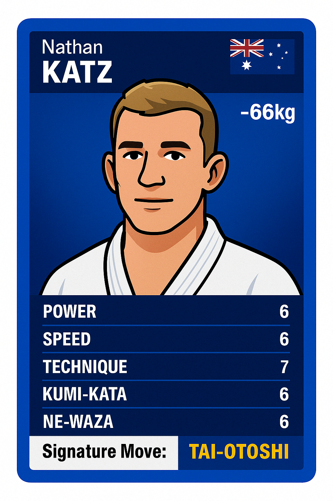

# JU-DO-KON! 🥋

Unit Tests: [](https://github.com/CyanAutomation/judokon/actions/workflows/runUnitTests.yml)

ESLint: [](https://github.com/CyanAutomation/judokon/actions/workflows/eslint.yml)

GitHub Pages Deployment: [](https://github.com/CyanAutomation/judokon/actions/workflows/pages/pages-build-deployment)

[![GitHub Release][releases-shield]][releases]
[![License][license-shield]](LICENSE.md)
[![GitHub Activity][commits-shield]][commits]

**JU-DO-KON!** is a fast-paced, web-based card game, featuring real-life elite judoka. Designed for ages 8–12, the game uses simplified stats, vibrant collectible cards, and a player-vs-computer battle format. First to win 10 rounds takes the match!



## License

This project is licensed under the [GNU General Public License v3.0](LICENSE).

You are free to use, modify, and share this project under the same terms — but any redistributed or modified versions must also be open-source and released under the GPL v3 license.

The visual assets (e.g. card illustrations and logos) are © 2025 Marc Scheimann. They may not be used, copied, or republished for commercial purposes without written permission.

## Table of Contents

1. [About JU-DO-KON!](#about-ju-do-kon)
2. [Features](#features)
3. [🎮 How to Play JU-DO-KON!](#how-to-play-ju-do-kon)
   - [🥋 The Rules](#-the-rules)
5. [Live Demo](#live-demo)
6. [Installation](#installation)
7. [Dependencies](#dependencies)
8. [Project Structure](#project-structure)
9. [Changelog](#changelog)
10. [Future Plans](#future-plans)


## Quick Start

1. Clone the repository:
   ```bash
   git clone https://github.com/cyanautomation/judokon.git
   cd judokon
   npx serve
   # Then visit: http://localhost:5000
   ```

## Dependencies

- **Vite**: For building and bundling the project.
- **Serve**: For serving the project locally.
- **Vitest**: For unit testing.

## Project Structure

- index.html: The main HTML file for the game.
- style.css: The stylesheet for the game's design.
- script.js: The main JavaScript file for game logic.
- utils.js: A utility file containing reusable functions like generating flag URLs and card HTML.
- judoka.json: The JSON file containing judoka card data.

## Features

- 99-card deck featuring elite judoka
- One-on-one stat battles
- Designed for kids and judo fans alike
- Playable directly in the browser
- Loading indicator for better user experience
- Modularized JavaScript for better maintainability

## About JU-DO-KON!

**JU-DO-KON!** is a fast-paced, web-based card game, featuring real-life elite judoka. Designed for ages 8–12, the game uses simplified stats, vibrant collectible cards, and a player-vs-computer battle format. First to win 10 rounds takes the match!

This project is built with HTML, CSS, and JavaScript, and hosted on GitHub Pages.

🥋 99-card deck  
💥 One-on-one stat battles  
🔥 Built for kids and judo fans alike

---

## 🎮 How to Play JUDOKON!

**JUDOKON!** is a fast-paced, Top Trumps-style card game featuring real-life elite judoka. You play against the computer in a battle of stats — first to 10 wins takes the match!

### 🥋 The Rules:

1. **You vs. Computer**

   - Each match starts with both players receiving **25 random cards** from a 99-card deck.

2. **Start the Battle**

   - In each round, you and the computer each draw your top card.

3. **Choose Your Stat**

   - You select one of the stats on your card (e.g. Power, Speed, Technique, etc.)

4. **Compare Stats**

   - The chosen stat is compared with the computer’s card.
   - **Highest value wins the round**.
   - If both stats are equal, it’s a **draw** — no one scores.

5. **Scoring**

   - Each round win gives you **1 point**.
   - The cards used in that round are **discarded** (not reused).

6. **Winning the Match**
   - First player to reach **10 points** wins!
   - If **neither player reaches 10 points after 25 rounds**, the match ends in a **draw**.

## Live Demo

Try the game live in your browser: [JU-DO-KON!](https://cyanautomation.github.io/judokon/)

- No installation required.
- Fully playable with all features.

## Technologies Used

- **HTML5**: For the structure of the game.
- **CSS3**: For styling and layout.
- **JavaScript (ES6)**: For game logic and interactivity.
- **Vite**: For building and bundling the project.
- **GitHub Pages**: For hosting the live demo.

## Known Issues

- The game currently does not support mobile devices.
- Animations for card flips are not yet implemented.
- Difficulty levels for the computer opponent are under development.

## Future Plans

- Get feedback on current cards and stat points
- Take submissions/suggestions on new card designs and stats
- Add animations for card flips and stat comparisons
- Implement difficulty levels for the computer opponent
- Expand the card deck with more judoka and stats

## Intended Structure

+----------------+
| Home |
| [Start Game] |
| [Browse Cards] |
+--------+-------+
|
v
+----------------+
| Loading |
| (Fetching...) |
+--------+-------+
|
v
+----------------+
| Battle |
| (Play Cards) |
+----+-----+-----+
| |
| v
| +----------------+
| | Browse Cards |
| | (View All) |
| +---+--------+----+
| | |
| v v
| Edit Card Back to Battle
| (Admin)  
 |
Back to Home
