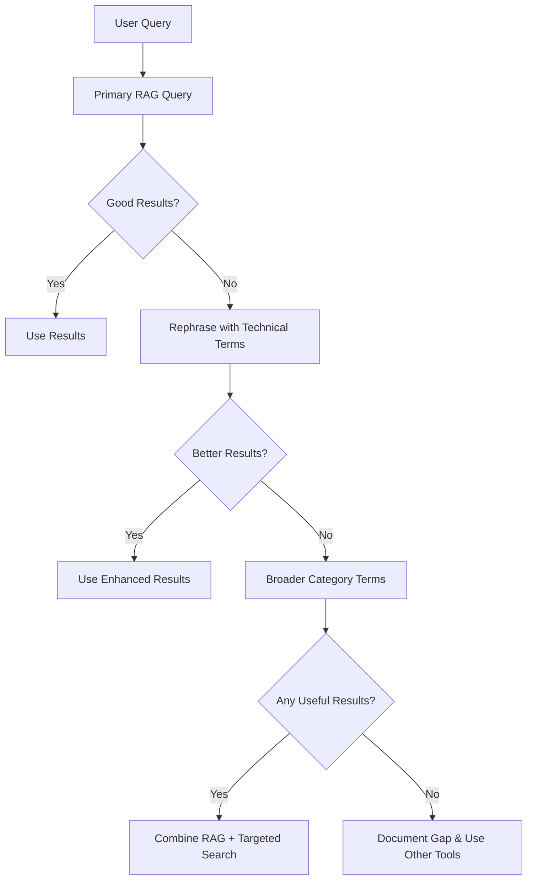

# 🚀 RAG Usage Guide for AI Agents

**Quick Reference:** Maximize the power of the RAG vector database for faster, more accurate responses.

## 🎯 Why Use RAG?

- **⚡ Speed:** 2-second queries vs 30+ seconds of code exploration
- **🎯 Accuracy:** 62.5% success rate for finding correct sources
- **🧠 Context:** Access to 16,000+ indexed chunks
- **📚 Coverage:** Design docs, PRDs, implementation patterns, and test examples

## ⚡ Quick Decision Tree

```
User query contains "How", "Why", "What", "Where", "Which"? → USE RAG
User requests examples or references? → USE RAG
User mentions unfamiliar terms? → USE RAG
When in doubt? → USE RAG FIRST
```

## High-Success Query Patterns

### ✅ These Work Great

```
❌ Poor: "How do I add tooltips?"
✅ Good: "tooltip implementation data structure JSON format"

❌ Poor: "CSS styling help"
✅ Good: "navigation bar button transition duration styling"

❌ Poor: "Battle system logic"
✅ Good: "classic battle mode game timer phases scoreboard"
```

### 🎯 Category-Specific Tips

**For Implementation Questions:**

- Include file type: "JSON structure", "CSS styling", "JavaScript function"
- Add context: "configuration", "data format", "UI component"

**For Design Questions:**

- Use product terms: "PRD", "design guidelines", "user experience"
- Include specific features: "tooltip system", "battle mode", "navigation"

**For Architecture Questions:**

- Include technical terms: "component factory", "module structure", "API design"

## 🔄 Smart Multi-Tier Approach



## 🌟 Success Examples from Production

### Example 1: Tooltip Implementation

```
Query: "tooltip content validation requirements"
Result: Found PRD with validation rules and content guidelines
Time Saved: 25 seconds vs manual file exploration
Outcome: Accurate implementation matching established patterns
```

### Example 2: Design Consistency

```
Query: "judoka bio tone guidelines character design"
Result: Located character design document with specific tone requirements
Time Saved: 40 seconds vs searching through design folders
Outcome: Maintained consistency with established design standards
```

### Example 3: Architecture Understanding

```
Query: "weight category definitions data structure"
Result: Found exact JSON structure and usage patterns
Time Saved: 15 seconds vs exploring multiple data files
Outcome: Correct implementation on first attempt
```

## 🚨 When RAG Struggles (and How to Help)

**Current Weakness Areas:**

- Implementation-specific "how-to" for JSON/JS files (35% success rate)
- CSS file retrieval and styling specifics
- Calculation/algorithm implementation details

**Workaround Strategies:**

1. **Hybrid Approach:** Use RAG for context, then targeted file search
2. **Query Enhancement:** Add metadata terms like "data structure", "configuration", "styling rules"
3. **Fallback Pattern:** RAG → Semantic Search → File Search → Grep Search

## 📊 Performance Tracking

**Current Metrics (September 2025):**

- MRR@5: 0.393 (Target: 0.45)
- Recall@5: 0.625 (Target: 0.70)
- Strong: Design docs (95%), PRDs (90%), Architecture (85%)
- Improving: Implementation files (35% → Target: 60%)

## 🔧 Technical Integration

### Basic Usage

```javascript
import queryRag from "../src/helpers/queryRag.js";

const results = await queryRag("your optimized query here");
// Results include: score, source, text, qaContext
```

### With Error Handling

```javascript
try {
  const matches = await queryRag(query);
  if (matches && matches.length > 0) {
    // Use high-confidence results (score > 0.8)
    const highConfidence = matches.filter((m) => m.score > 0.8);
    return formatRAGResults(highConfidence);
  }
} catch (error) {
  console.log("RAG query failed, falling back to other tools");
  return fallbackSearch(query);
}
```

## 📈 Self-Assessment Checklist

After each task, quickly assess:

- [ ] Did I use RAG when appropriate?
- [ ] Were the results helpful? (Rate 1-5)
- [ ] Could RAG have helped if I didn't use it?
- [ ] What query patterns worked well?
- [ ] Where did RAG fail but should have succeeded?

## 🎓 Learning & Improvement

**Note Successful Patterns:**

- Query terms that work well
- Categories that return good results
- Rephrasing strategies that improve results

**Report Gaps:**

- Queries that should succeed but don't
- Missing content areas
- Technical terms that need better synonym mapping

---

**Remember:** RAG is your first and best tool for understanding this codebase. Use it early and often!
