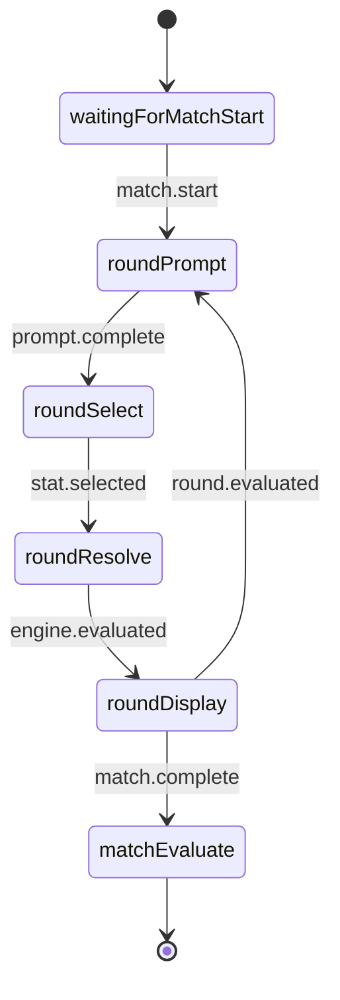
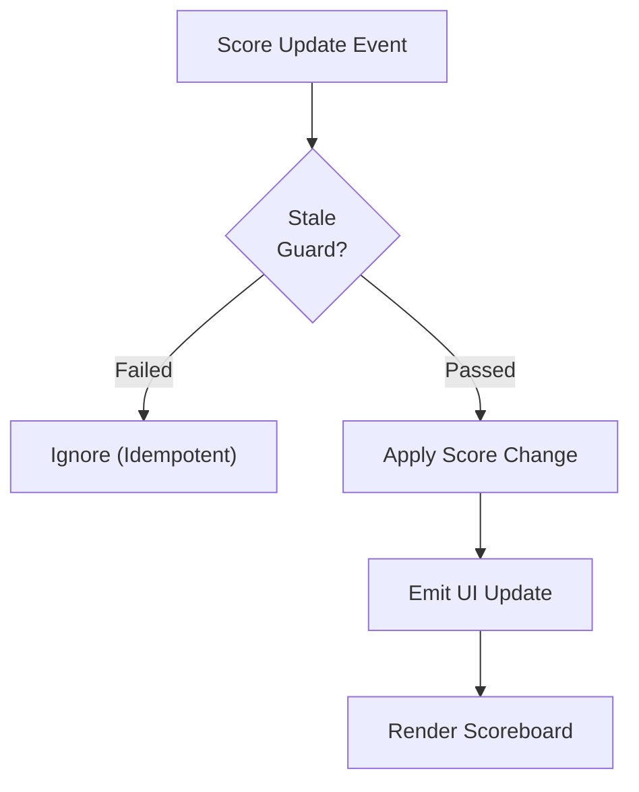
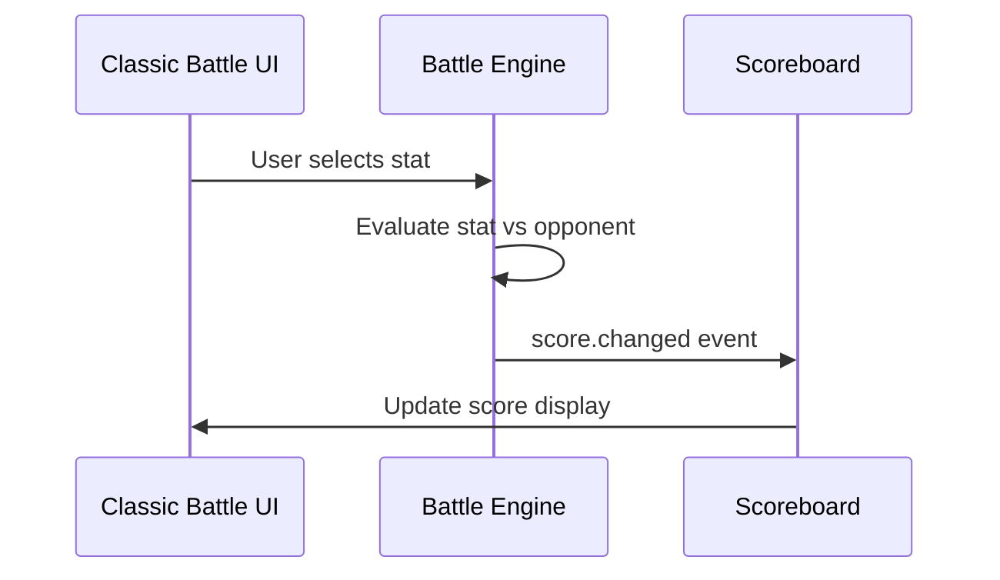

# Missing Mermaid Diagrams Implementation Plan

**Date Started**: February 14, 2026  
**Status**: 🔄 IN PROGRESS  
**Total Diagrams to Implement**: 49  
**Diagrams Completed**: 25 / 49  
**Current Phase**: Phase 4 (Helper Systems) ✅ COMPLETE (5/5) | Next: Phase 5 (Content & Utilities)

---

## Executive Summary

This document tracks the systematic implementation of 49 missing Mermaid diagrams across PRD files. Currently, 8 PRD files contain 16 diagrams; 49 files lack diagrams and are candidates for implementation.

**Approach**:
- **Single-session batch implementation** (6 phases, ~40–60 hours total)
- **Dependency-ordered execution**: Foundational systems (Phase 1) first, then variants and helpers
- **Code + Test validation**: All diagrams verified against implementation files and linked to test coverage
- **Tracked progress**: Status badges, verification checklist, cross-references

**Success Criteria**:
- ✅ All 49 diagrams implemented with valid Mermaid syntax
- ✅ Each diagram verified against implementation code OR PRD requirements
- ✅ Test coverage references added (format: `**Test Coverage**: Verified by: [path.js](path)`)
- ✅ Status badges used consistently (✅ VERIFIED / 🟠 ASPIRATIONAL / ⚠️ PENDING)
- ✅ No syntax errors or render failures
- ✅ Cross-references between related diagrams included
- ✅ Final audit: grep confirms all 57 PRDs contain Mermaid diagrams (8 existing + 49 new)

---

## Master Tracking Table

| Phase | PRD File | System/Feature | Diagram Type | Priority | Effort | Status | Notes |
|-------|----------|---|---|---|---|---|---|
| **Phase 1: Foundational Systems** | | | | | | | |
| 1.1 | prdArchitecture.md | High-level system architecture | System Diagram | CRITICAL | Medium | ✅ Completed | 5-7 components; data flow |
| 1.2 | prdGameModes.md | Game mode selection and entry | State/Flow Diagram | CRITICAL | Medium | ✅ Completed | 7 modes; Entry/exit flows |
| 1.3 | prdBattleEngine.md | Abstract vs Canonical states | Mapping Diagram | CRITICAL | Small | ✅ Completed | Clarification layer |
| 1.4 | prdBattleScoreboard.md | Authority & Idempotency | Metadata Only | CRITICAL | Minimal | ✅ Completed | Add test refs to existing |
| 1.5 | prdBattleClassic.md | Initialization phases | Sequence Diagram | CRITICAL | Small | ✅ Completed | Optional: 5 phases |
| **Phase 2: Battle Variants** | | | | | | | |
| 2.1 | prdBattleCLI.md | CLI vs Classic Battle | Comparative Sequence | HIGH | Medium | ✅ Completed | Same engine, different UI |
| 2.2 | prdBattleBandit.md | One-armed-bandit mode | Round Flowchart | HIGH | Small | ✅ Completed | Simplified game loop |
| 2.3 | prdTeamBattleRules.md | Team battle rules | Bout + Scoring SM | CRITICAL | Small | ✅ Completed | Turn order + win condition |
| **Phase 3: Navigation & UI Systems** | | | | | | | |
| 3.1 | prdHomePageNavigation.md | Homepage 2×2 tile menu | UI Flow Diagram | HIGH | Small | ✅ Completed | Entry point; responsive |
| 3.2 | prdNavigationMap.md | Thematic map UI | State Diagram | HIGH | Small | ✅ Completed | Map state + fallback |
| 3.3 | prdNavigationBar.md | Navigation bar structure | Component Tree | HIGH | Small | ✅ Completed | Hierarchy; responsive |
| 3.4 | prdSettingsMenu.md | Settings & feature flags | Decision Tree | CRITICAL | Large | ✅ Completed | ~30 toggles; flag logic |
| 3.5 | prdTeamBattleSelection.md | Team mode selection | UI Flow Diagram | MEDIUM | Small | ✅ Completed | Gender routing |
| **Phase 4: Helper Systems & Features** | | | | | | | |
| 4.1 | prdBattleActionBar.md | Control bar (7 buttons) | State Machine | HIGH | Medium | ✅ Completed | Engine state → button states |
| 4.2 | prdSnackbar.md | Notification system | Queue & Lifecycle | MEDIUM | Small | ✅ Completed | Stack logic; 3s auto-dismiss |
| 4.3 | prdTooltipSystem.md | In-context help tooltips | Lifecycle Diagram | MEDIUM | Small | ✅ Completed | Trigger + lifecycle |
| 4.4 | prdBattleStateIndicator.md | Debug state badge | State Update Diagram | MEDIUM | Minimal | ✅ Completed | Simple; debug feature |
| 4.5 | prdVectorDatabaseRAG.md | Vector search pipeline | Flowchart | HIGH | Medium | ✅ Completed | Query → Search → Answer |
| **Phase 5: Content & Utilities** | | | | | | | |
| 5.1 | prdDataSchemas.md | Data relationships | ER/Tree Diagram | MEDIUM | Small | ✅ Completed | Judoka → Cards → Stats |
| 5.2 | prdTestingStandards.md | Test workflow | Validation Gates | MEDIUM | Small | ✅ Completed | Lint → Test → Merge |
| 5.3 | prdDevelopmentStandards.md | Development workflow | Process Flowchart | MEDIUM | Small | ✅ Completed | Code → Standards → Merge |
| 5.4 | prdCountryPickerFilter.md | Browse filter | Filter State Machine | MEDIUM | Small | ✅ Completed | Country selection |
| 5.5 | prdCardCarousel.md | Card carousel UI | State Machine | MEDIUM | Small | ✅ Completed | Navigation + boundaries |
| 5.6 | prdCreateJudoka.md | Form workflow | Flowchart | LOW | Minimal | ✅ Completed | Form → Validate → Save |
| 5.7 | prdMeditationScreen.md | Quote display screen | Screen Flow | LOW | Minimal | ✅ Completed | Simple; zen mode |
| 5.8 | prdMysteryCard.md | Card reveal mechanic | State Diagram | MEDIUM | Small | ✅ Completed | Reveal animation + options |
| 5.9 | prdChangeLog.md | Version timeline | Timeline/Release Notes | LOW | Minimal | ✅ Completed | Chronological display |
| 5.10 | prdBrowseJudoka.md | Browse mode workflow | Workflow Diagram | MEDIUM | Small | ◻️ Not Started | Filter → Search → View |
| **Phase 6: Remaining Utilities** | | | | | | | |
| 6.1 | prdBattleDebugPanel.md | Debug panel | State Diagram | LOW | Minimal | ◻️ Not Started | Show/Hide + Content sel |
| 6.2 | prdBattleLayoutEditor.md | Layout editing | Workflow Diagram | LOW | Small | ◻️ Not Started | Edit → Preview → Save |
| 6.3 | prdBattleMarkup.md | HTML structure | Component Tree | LOW | Minimal | ◻️ Not Started | Structure diagram |
| 6.4 | prdBattleQuick.md | Quick battle mode | Flow Diagram | MEDIUM | Small | ◻️ Not Started | If distinct from Classic |
| 6.5 | prdCardCodes.md | Card code entry | Workflow Diagram | LOW | Minimal | ◻️ Not Started | Entry → Lookup |
| 6.6 | prdCardInspector.md | Card inspector UI | Component Diagram | LOW | Minimal | ◻️ Not Started | Inspector layout |
| 6.7 | prdCardOfTheDay.md | COTD feature | Workflow Diagram | LOW | Minimal | ◻️ Not Started | Daily card selection |
| 6.8 | prdCharacterDesign.md | Character design | Visual Hierarchy | LOW | Minimal | ◻️ Not Started | Design reference (optional) |
| 6.9 | prdCodeStandards.md | Code organization | Hierarchy Diagram | LOW | Minimal | ◻️ Not Started | Folder/module structure |
| 6.10 | prdDrawRandomCard.md | Random draw | Workflow Diagram | LOW | Minimal | ◻️ Not Started | Draw → Display |
| 6.11 | prdJudokaCard.md | Card component | Component Structure | LOW | Minimal | ◻️ Not Started | Component tree |
| 6.12 | prdLayoutDebugPanel.md | Layout debug UI | State Diagram | LOW | Minimal | ◻️ Not Started | Debug panel |
| 6.13 | prdMockupViewer.md | Mockup viewer | Workflow Diagram | LOW | Minimal | ◻️ Not Started | View mockups |
| 6.14 | prdPRDViewer.md | PRD document viewer | Workflow Diagram | LOW | Minimal | ◻️ Not Started | View PRDs |
| 6.15 | prdPseudoJapanese.md | Text transformation | Pipeline Diagram | LOW | Minimal | ◻️ Not Started | Transform → Display |
| 6.16 | prdRandomJudoka.md | Random judoka select | Workflow Diagram | LOW | Minimal | ◻️ Not Started | Select → Display |
| 6.17 | prdTooltipViewer.md | Tooltip viewer | Utility Diagram | LOW | Minimal | ◻️ Not Started | View tooltips |
| **Additional PRDs** | | | | | | | |
| - | prdAIAgentWorkflows.md | AI agent orchestration | Workflow Diagram | MEDIUM | Medium | ◻️ Not Started | Phase 5 or later |
| - | prdBattleLayoutEditor.md | Layout editor | Workflow | LOW | Small | ◻️ Not Started | Phase 6 |
| - | prdUpdateJudoka.md | Form workflow (update) | Flowchart | LOW | Minimal | ◻️ Not Started | Phase 6 |
| - | prdResetNavigation.md | Navigation reset | Flowchart | LOW | Minimal | ◻️ Not Started | Phase 6 |
| - | prdTestMode.md | Test mode feature | State Diagram | MEDIUM | Small | ◻️ Not Started | Phase 5 or later |
| - | prdUIDesignSystem.md | Design system | Component Catalog | MEDIUM | Medium | ◻️ Not Started | Phase 5 or later |

**Legend**:
- ◻️ Not Started
- 🔄 In Progress
- ✅ Completed
- ⊘ Skipped (insufficient content or marked optional)

---

## Phase 0: Mermaid Style Guide & Standards

### Diagram Style Conventions

**Color Palette** (matching existing 16 diagrams):
- **Initial states**: `lightblue` (waiting, init, ready)
- **Active states**: `lightgreen` (processing, selection, active)
- **Error states**: `lightsalmon` (error, retry, fallback)
- **Terminal states**: `lightgray` (complete, closed, removed)
- **Complex/mixed**: `lightyellow` (decision, branching)
- **Aspirational/Future**: `lightcyan` (planned, not yet implemented)

**Box/Text Standards**:
- Single-line explicit state names (e.g., `roundSelect` not `Round Selection Step A`)
- CamelCase for state machine node IDs, SCREAM_CASE for constants
- Arrows labeled with triggers or data (e.g., `user tap` → `Modal Open`)
- Subgraph groups for related states (e.g., all "Round" states under one subgraph)

**Test Coverage Reference Format**:
```markdown
**Test Coverage**: Verified by: [path/to/test.js](path/to/test.js) — Brief description of what test validates
```

**Status Note Template** (when applicable):
```markdown
> ✅ **Status: VERIFIED** — This diagram matches implementation as of [date/commit]
```
or
```markdown
> 🟠 **Status: ASPIRATIONAL/PLANNED** — Feature design is complete; implementation pending [specific blockers/timeline]
```
or
```markdown
> ⚠️ **Status: PENDING** — Implementation in progress; diagram reflects proposed design
```

**Cross-Reference Template**:
```markdown
> **Related diagrams**: See also [prdStateHandler.md#canonical-state-graph](prdStateHandler.md#canonical-state-graph) for canonical state definitions; [prdEventContracts.md](prdEventContracts.md) for event architecture
```

### Validation Gates (Per Diagram)

Before a diagram is marked as "COMPLETED", it must pass:

1. **Syntax Validation**
   - ✅ Copy diagram into Mermaid Live Editor (https://mermaid.live) — renders without errors
   - ✅ No unmatched brackets, invalid syntax, or reserved word misuse

2. **Architecture Alignment**
   - ✅ State/component names match implementation (or PRD if code unavailable)
   - ✅ State transitions match code flow or documented requirements
   - ✅ No conflicts with canonical definitions (e.g., state names from [prdStateHandler.md](design/productRequirementsDocuments/prdStateHandler.md#canonical-state-graph-names))

3. **Test Reference Verification**
   - ✅ All referenced test files exist at specified paths
   - ✅ Test descriptions are accurate and match test file content (spot-check 1-2 test names)
   - ✅ Links follow format: `[path.js](path.js)`

4. **Cross-Reference Completeness**
   - ✅ Diagrams with upstream dependencies include "Related diagrams" section
   - ✅ All cross-references use valid markdown links to PRD files

5. **Status Documentation**
   - ✅ Status note present if diagram is aspirational, pending, or incomplete
   - ✅ Emoji badge consistent (✅ / 🟠 / ⚠️) with status accuracy

### Style Examples

**State Machine** (from existing [prdStateHandler.md](design/productRequirementsDocuments/prdStateHandler.md)):


**Flowchart** (from existing [prdBattleScoreboard.md](design/productRequirementsDocuments/prdBattleScoreboard.md)):


**Sequence Diagram** (from existing [prdEventContracts.md](design/productRequirementsDocuments/prdEventContracts.md)):


---

## Verification Checklist (Global)

After each phase completes, verify:

- [ ] All diagrams in phase rendered successfully (copy each into https://mermaid.live)
- [ ] All test coverage links point to valid files (use grep to spot-check paths)
- [ ] No state name conflicts with existing diagrams or canonical definitions
- [ ] All status notes present and accurate per gate checklist
- [ ] All cross-references use correct markdown link format
- [ ] Phase status updated in tracking table (◻️ → 🔄 → ✅)

**Final Verification** (all 49 diagrams complete):
```bash
# Verify all PRD files now have Mermaid diagrams
grep -r "^\`\`\`mermaid" design/productRequirementsDocuments/*.md | wc -l
# Expected output: 65 (16 existing + 49 new = 65 total ```mermaid blocks)

# Verify no PRD with duplicate diagrams
for file in design/productRequirementsDocuments/*.md; do
  count=$(grep -c "^\`\`\`mermaid" "$file")
  if [ $count -gt 1 ]; then echo "$file: $count diagrams"; fi
done
# Expected: No output (all PRDs have ≤1 diagram per file, or intentional multiples documented)

# Verify test links validity (sample random 10)
# Manually check: [tests/path.js](tests/path.js) links resolve
git ls-files tests/ | head -20  # Verify test files exist
```

---

## Phase Dependency Map

```
Phase 1 (Foundational)
├─ prdArchitecture.md ────────┐
├─ prdGameModes.md            │
├─ prdBattleEngine.md         ├─→ Phase 2
├─ prdBattleScoreboard.md     │   (Battle Variants)
└─ prdBattleClassic.md        │
                              ├─→ Phase 3
                              │   (Navigation/UI)
                              │
                              ├─→ Phase 4
                              │   (Helper Systems)
                              │
                              └─→ Phase 5+6
                                  (Utilities)
```

**Rationale**: System architecture and game mode definitions must be established before battle variants can be designed. Similarly, navigation and UI patterns depend on understanding game modes and core battle architecture.

---

## Next Steps

**Phase 0 (Current)**:
1. ✅ Create this tracking document (DONE)
2. Document Mermaid style guide (DONE)
3. Define validation gates (DONE)
4. Ready to begin Phase 1

**Phase 1 (Foundational Systems)** — Ready to start
- Start with [prdArchitecture.md](design/productRequirementsDocuments/prdArchitecture.md)
- Implement system architecture diagram (5–7 components)
- Verify against implementation and cross-reference

---

## References

- **Existing Audit**: [MERMAID_DIAGRAM_AUDIT_SUMMARY.md](MERMAID_DIAGRAM_AUDIT_SUMMARY.md) — Audit of 16 existing diagrams
- **Development Standards**: [AGENTS.md](../../AGENTS.md) — Agent development rules and standards
- **Architecture Guide**: [prdArchitecture.md](design/productRequirementsDocuments/prdArchitecture.md) — System component definitions
- **State Handler**: [prdStateHandler.md](design/productRequirementsDocuments/prdStateHandler.md) — Canonical state definitions
- **Event Contracts**: [prdEventContracts.md](design/productRequirementsDocuments/prdEventContracts.md) — Event architecture

---

**Document Status**: Ready for Phase 1 implementation  
**Last Updated**: February 14, 2026  
**Owner**: AI Implementation Agent
