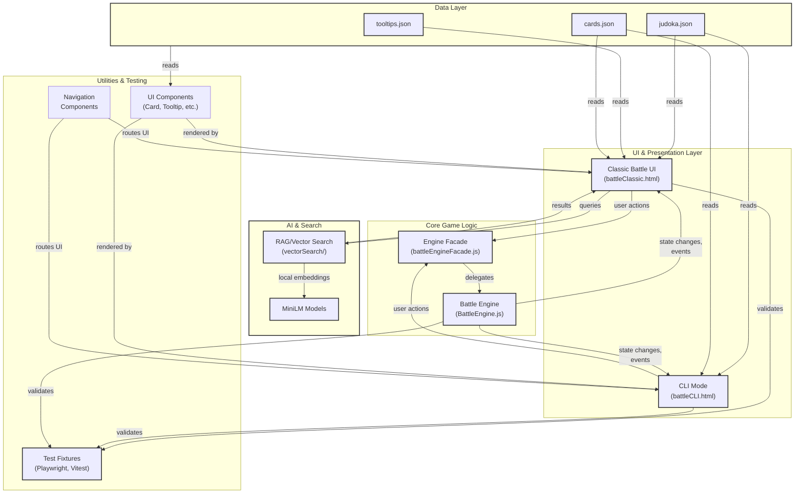

# Architecture PRD

## TL;DR

This PRD captures the authoritative architecture decisions and component contracts for JU-DO-KON!. It defines system boundaries, responsibilities, and stable public contracts used by other PRDs, tests, and integrations.

## Problem Statement / Why it matters

Architecture decisions are cross-cutting and affect multiple teams and features. Without a single source of truth, components drift, tests break, and integrations become brittle. This PRD centralizes those decisions so that changes are deliberate and traceable.

## Goals / Success Metrics

- Provide a concise map of core components and responsibilities.
- Define public contracts (APIs, events, data shapes) that are stable and versioned.
- Reduce integration regressions by 90% (measured by integration test failures tied to interface changes).

## System Architecture Overview

> ✅ **Status: VERIFIED** — Architecture diagram shows core components and event flow matching implementation in `src/helpers/battleEngineFacade.js`, `src/pages/battleClassic.html`, and `src/pages/battleCLI/init.js`
>
> **Key Relationships**:
>
> - Battle Engine is authoritative (center, green) — all logic flows through it
> - Classic Battle UI and CLI both consume events from Engine and delegate actions via Facade
> - Data Layer feeds both UI surfaces independently
> - Components (Card, Tooltip, Navigation) are wired into UI surfaces
> - RAG/Vector Search is auxiliary, integrated into Battle UI for advanced search
> - Test fixtures validate all three layers (Engine, UI, CLI)

> **Related diagrams**: See [prdBattleEngine.md](prdBattleEngine.md) for state machine details; [prdEventContracts.md](prdEventContracts.md) for event naming and payloads; [prdBattleClassic.md](prdBattleClassic.md) for Classic Battle initialization sequence

## Component Responsibilities

- Battle Engine (`src/helpers/BattleEngine.js` and `src/helpers/battleEngineFacade.js`): authoritative game logic (draws, scoring, resolution). Emits canonical events used by UI and tests.
- Classic Battle UI (`src/pages/battleJudoka.html`, `src/helpers/classicBattle.js`): rendering, stat buttons, timers; consumes Battle Engine events and emits UI events.
- CLI (`src/pages/battleCLI.html`): text-mode presentation layered above the same engine and state machine.
- Data Layer (`src/data/*`): static assets (judoka.json, card data) and any canonical schema artifacts.
- RAG/Vector Search (`src/helpers/vectorSearch` / `minilm` models): search and query expansion responsibilities.
- Test Orchestration / Fixtures (`playwright/`, `tests/`): helpers and promises used to detect engine/UI readiness.

## Public Contracts Inventory (starter)

This PRD must be populated and maintained with a canonical inventory. The table below is a starter subset; owners must keep it current.

Events:

- `battle:round-start` — emitter: Battle Engine; payload: `{ roundNumber: number, playerIds: [string, string] }` — consumers: UI, CLI, tests — owner: Battle Engine.
- `battle:stat-selected` — emitter: UI/CLI; payload: `{ playerId: string, statKey: string, timestamp: string }` — consumers: Engine, tests — owner: Classic Battle UI.
- `battle:round-resolved` — emitter: Battle Engine; payload: `{ winnerId?: string, tie: boolean, details: object }` — consumers: UI, scoreboard — owner: Battle Engine.

DOM IDs / Data Attributes (see `prdBattleMarkup.md` for the full list):

- `#round-message`, `#snackbar-container`, `#battle-state-badge`, `data-stat-key`, and recommended `data-test-id` attributes.

Data Schemas:

- `judoka` (see `prdDataSchemas.md`), `card`, `navigationMap`.

## Hot-path Import Policy

Hot-path modules (those executed in timing-sensitive loops, selection handlers, or render hot paths) MUST use static imports. Dynamic imports (`await import(...)`) are allowed only for optional, heavy, or feature-flag guarded modules and must be preloaded during idle time.

Starter hot-path list (owners must keep this list current):

- `src/helpers/classicBattle.js` (selection handling, timers)
- `src/helpers/battleEngineFacade.js`
- `src/helpers/BattleEngine.js`
- `src/helpers/showSnackbar.js` (if used in round flow)

Change to any hot-path module that introduces dynamic imports requires Architecture PRD sign-off and regression tests demonstrating no measurable impact on selection latency.

## Versioning and Change Process

Public contract changes MUST follow this minimal process:

1. Update relevant PRD with rationale and migration plan.

2. Create implementation PR referencing the PRD and include unit + integration tests proving compatibility or demonstrating migration.

3. Allow a one-week deprecation window for non-breaking changes; for breaking changes, publish a migration guide and increment the contract major version.

Versioning recommendation: use `major.minor` for contracts (e.g., event v1 → v2). When publishing an incompatible change, increment major and provide a compatibility bridge when feasible (e.g., emit both v1 and v2 events for a transition period).

## Non-Functional Requirements (NFR) Summary

| Area                   | Target                                                                        |
| ---------------------- | ----------------------------------------------------------------------------- |
| Determinism (testMode) | Engine decisions reproducible with seeded RNG                                 |
| Selection latency      | UI selection handlers respond within 16ms JS main-thread budget (no blocking) |
| Vector search          | Local dev response <250ms; production targets differ by infra                 |
| Accessibility          | Keyboard navigation for primary flows, ARIA labels for key controls           |

## User Stories

- As a developer, I want to know which module owns the battle state so I can make safe changes.
- As a tester, I want stable event names and DOM contracts so Playwright tests are reliable.

## Prioritized Functional Requirements

P1 - Component Boundary Diagram: Provide a high-level diagram listing components and responsibilities (Battle Engine, UI, RAG/VectorSearch, CLI, Data Layer).

Acceptance Criteria:

- A named diagram file exists and is referenced by this PRD.

P1 - Public Contracts Inventory: A list of public APIs, events, DOM IDs, and stable data shapes with owner and versioning policy.

Acceptance Criteria:

- Each entry lists owner module, schema/location, and change process.

P2 - Hot-path Import Policy: Document which modules must use static imports (hot paths) and which may use dynamic imports with preload.

Acceptance Criteria:

- Static/dynamic import guidance is present and references `src/helpers/classicBattle.js` and related hot-path files.

P2 - Non-functional requirements summary: Latency, determinism, and observability constraints for cross-cutting components.

Acceptance Criteria:

- A short NFR table with measurable targets exists.

## Non-Functional Requirements / Design Considerations

- Determinism: Battle engine decisions must be reproducible in test mode.
- Latency: Vector search responses should be < 250ms in local development (where applicable).
- Observability: Key actions should emit events for tracing and testing.

## Telemetry / Monitoring

Sentry is injected as a script include in entry pages (for example `index.html` and the HTML files under `src/pages/*.html`). The script tag is intentionally early in the document head so `window.Sentry` is available to runtime helpers before classic battle modules load. Reference pages include `index.html`, `src/pages/battleClassic.html`, `src/pages/battleCLI.html`, `src/pages/settings.html`, and other `src/pages/*.html` files that share the Sentry CDN include.

Classic battle telemetry uses guarded reporting so game logic continues even if Sentry is absent or fails to initialize:

- `src/helpers/classicBattle/stateHandlers/sentryReporter.js` lazily loads `@sentry/browser` and only calls `captureException` when a global Sentry client is present (or the dynamic import succeeds). It checks for `window.Sentry` and safely bails if unavailable.
- `src/helpers/classicBattle/judokaTelemetry.js` reports repeated judoka load failures. After a threshold within a time window, it samples and sends `Sentry.startSpan` + `Sentry.logger.warn` for the `classicBattle.judokaLoad.retryLoop` retry loop, including attributes like failure count, elapsed time, and sample rate.
- `src/helpers/battle/engineTimer.js` wraps timer lifecycle events (`roundStarted`, `timerPaused`, `timerResumed`, `timerStopped`, `tabInactive`, `tabActive`, `timerDriftDetected`, `timerDriftRecorded`) with `Sentry.startSpan` when available. It also emits drift telemetry when the threshold is exceeded, attaching window/threshold metadata and warning logs for production monitoring.

Events/errors reported and span usage:

- Exceptions: `reportSentryError` captures explicit errors with optional context when Sentry is configured.
- Spans: `Sentry.startSpan` is used for performance/health telemetry on timer state transitions and judoka retry loops, with attributes to aid debugging (event name, drift amounts, retry counts, thresholds).
- Warnings: `Sentry.logger.warn` is used for structured warnings around retry-loop and timer drift thresholds.

Safety/availability checks:

- All telemetry calls are wrapped in `typeof Sentry !== "undefined"` and `typeof Sentry.startSpan === "function"` checks before invoking Sentry APIs.
- The lazy loader in `sentryReporter.js` guards initialization (checks for a configured DSN and existing client) and safely no-ops on failures, ensuring no hard dependency on Sentry.

## Dependencies and Open Questions

- Depends on `prdBattleEngine.md` for engine internals.
- Open question: Versioning scheme for events and DOM contracts (major.minor?), propose v1 semantics.

## Appendix / Next actions

- Action: Owners of Battle Engine, Classic Battle UI, and Vector Search should populate the canonical inventory section in this PRD with full contract entries and reference schemas/diagrams.

### Appendix: Project Architecture Overview (agent quick-reference)

This appendix integrates the implementation and agent-facing callouts that previously lived in `docs/technical/architecture.md` and `design/architecture.md`. Treat it as the canonical quick-reference for module boundaries documented in this PRD.

#### Entry Points

- **`game.js`** — Exports setup helpers and the `initGame` orchestrator. It wires card carousel rendering, JSON data fetches, and feature flag checks, and triggers navigation hooks used across UI surfaces.
- **`gameBootstrap.js`** — Lightweight bootstrap that waits for `DOMContentLoaded` before invoking `initGame` in production builds.

#### helpers/

Reusable utilities are organized by concern (card building, data fetching, random card generation). Prefer small, single-purpose functions such as `generateRandomCard()`, `renderJudokaCard()`, `navigationBar.js`, and `setupBottomNavbar.js`.

##### Engine vs UI layers

Core battle logic lives in `helpers/battleEngine.js` with no DOM access. UI scripts gather values from the page and delegate to this engine via the facade in `helpers/api/battleUI.js`, keeping DOM manipulation localized in files such as `classicBattle.js`.

##### helpers/navigation

Navigation behavior is composed from focused modules such as `helpers/navigationBar.js` and `helpers/setupBottomNavbar.js`, with page-level orchestrators wiring URL state and menu rendering. Prefer these entry points when extending responsive navigation flows.

##### helpers/vector search

Vector-search pages import DOM-free utilities from `helpers/api/vectorSearchPage.js` for match selection, tag formatting, and MiniLM extractor loading so that page scripts stay focused on DOM wiring.

##### helpers/country service

`helpers/api/countryService.js` centralizes country code lookups and flag URL generation. It loads `countryCodeMapping.json` with caching and persists mappings through `storage.js`. UI modules such as `helpers/country/codes.js` and `helpers/country/list.js` call `loadCountryMapping`, `getCountryName`, and `getFlagUrl` to render country selectors consistently.

#### Data (`/src/data/`)

- `judoka.json` — Master list of judoka and their stats.
- `tooltips.json` — Tooltip keys, text, and display logic.
- `cards.json` — Rarity tier rules and UI elements.

#### Components (`/components/`)

Component modules own DOM rendering concerns and expose internal state via `data-*` attributes for observability. Representative modules include `Card.js` (card markup + metadata), `TooltipManager.js` (injects tooltip spans), and `StatsPanel.js` (interactive stat comparisons).

#### AI Agent Design Considerations

- 🏷️ **State exposure** — Internal game state is mirrored via `data-*` attributes such as `data-stat="power"` or `data-feature="debugMode"`.
- 🧪 **Toggleable debug panels** — Battle debug panels and layout overlays can be enabled through feature flags and include copyable state dumps.
- 🔗 **Stable ID/class naming** — Predictable DOM structure enables reliable selectors for tests and automation.
- 🧩 **Modular JS & HTML** — Small modules encourage safe extension and reuse.
- 🧭 **Observable hashes & query params** — URL hashes (e.g., `#mobile`) and query params (e.g., `?debug=true`) activate UI variants.

#### Annotated Key Components for Agents

- **TooltipManager** — Loads `/data/tooltips.json`, injects tooltip spans into `.tooltip[data-tooltip-id]`, and is consumed by card panels, instructions, and stat explanations.
- **CardRenderer** — Reads `/data/judoka.json`, adds `data-stat-*` attributes for each stat category, and enables agents to compare stat values directly in the DOM.
- **FeatureFlagController** — Renders settings from `/src/pages/settings.html`, mirrors active flags to `data-feature-*`, and supports testing of UI variants.
- **LayoutDebugPanel** — Controlled by the `layoutDebug` feature toggle and overlays outlines for visual inspection.

#### Observable Features for Agent Testing

| Feature            | Observable Element    | Description                                             |
| ------------------ | --------------------- | ------------------------------------------------------- |
| Feature Flags      | `data-feature-*`      | Each flag in the Settings panel updates this attribute  |
| Layout Debug Panel | `data-debug="layout"` | Injects red outlines around DOM components              |
| Card Stats         | `data-stat="grip"`    | Embedded in rendered card DOM                           |
| Tooltip Coverage   | `data-tooltip-id`     | Indicates linked tooltip key, used to validate coverage |

#### Files and Interfaces Agents Should Know

| Path                                   | Purpose                                         |
| -------------------------------------- | ----------------------------------------------- |
| `/src/pages/settings.html`             | UI to toggle feature flags and debug tools      |
| `/data/judoka.json`                    | Master stat source for all cards                |
| `/data/tooltips.json`                  | Text keys used in tooltips                      |
| `/components/Card.js`                  | Card rendering logic                            |
| `/components/TooltipManager.js`        | Adds `data-tooltip-id` spans                    |
| `/components/FeatureFlagController.js` | Activates features via the DOM                  |
| `/game.js`                             | Entry point that wires modules together         |
| `/helpers/`                            | Modular logic (e.g., card building, navigation) |

#### Event Bus & State Manager

- The Classic Battle orchestrator emits state transitions on the shared event bus via `emitBattleEvent('battleStateChange', detail)`; listeners consume them with `onBattleEvent('battleStateChange', handler)`.
- `detail` payloads follow `{ from: string|null, to: string, event?: string|null }`. The current state is mirrored on `document.body.dataset.battleState` for compatibility and debugging.
- State progression flows through `waitingForMatchStart` → `matchStart` → `cooldown` → `roundStart` → `waitingForPlayerAction` → `roundDecision` → `roundOver` → `matchDecision` → `matchOver`, with interrupt branches for admin adjustments.
- `roundManager.startRound(store)` draws cards and initializes round UI. After resolution, `roundManager.startCooldown(store)` computes cooldown timing and schedules Next-button enablement before dispatching `ready` for the next round.
- Modules outside the orchestrator interact with the machine only through `dispatchBattleEvent` exported by `orchestrator.js`. The machine instance remains private (tests can access it through dedicated getters when required).
- The internal event bus (`classicBattle/battleEvents.js`) is the single source of truth for battle events; DOM events are not dispatched in hot paths.
