# PRD: Classic Battle

**Game Mode ID:** `1`  
**Entry Point:** `battleClassic.html`  
**Shares Engine With:** Battle Engine Core (see [prdBattleEngine.md](prdBattleEngine.md))

---

## TL;DR

Classic Battle is Ju-Do-Kon!’s **introductory head-to-head mode**. It provides a **fast, simple, and rewarding experience** for new players, teaching them how stats drive outcomes while keeping matches short and replayable.

**Experience snapshot:**

> A new player draws her first card. She chooses _Speed_, wins the round, and sees her score tick up. Within minutes, she has learned how stats matter, feels successful, and wants to play again.

---

## Problem Statement

New players need a **low-stakes, easy-to-grasp battle mode** to understand the game’s core loop (draw → choose stat → compare → score). Without it, early retention suffers: players get overwhelmed in complex modes, feel confused, and abandon the game.

Classic Battle solves this by being:

- **Fast** — match start ≤ 5 s after mode selection.
- **Accessible** — guided UI, clear feedback, and generous timers.
- **Engaging** — short matches (≤ 3 min) with visible progress and a satisfying end condition.

**Player feedback example:**

> “I don’t know which stat to pick. I feel like I’ll lose if I guess wrong.” — Playtest participant, age 9

**Baseline Retention Data (for context):**  
Currently, only ~45% of new players complete their first battle across all modes. The target is to raise this to ≥70% completion via Classic Battle.

---

## Goals

### Player Goals

- Quick, intuitive battles with **clear rules**.
- Learn how judoka stats influence outcomes.
- See immediate, readable **round results** and **score updates**.
- Matches short enough to play in a break (≤ 3 min).
- Ability to **quit early** without penalty or confusion.

### Product Goals

- ≥ 70% of new players complete one Classic Battle in their first session.
- Increase new-user retention by offering a safe practice mode.
- ≥ 40% of players replay Classic Battle within their first session (measurable replayability metric).

---

## Non-Goals

- Online multiplayer.
- Customizable timers or win conditions beyond 3/5/10 points.
- Alternate rulesets, stat weighting, or advanced scoring.

---

## User Stories

- As a **new player**, I want a simple battle mode so I can **learn without pressure**.
- As a **child**, I want colorful, exciting round feedback so I stay engaged.
- As a **player with limited motor control**, I want enough time (30 s) to pick a stat.
- As a **tester**, I want a predictable sequence of states I can hook into.
- As a **player in a hurry**, I want to quit at any point without confusion.

---

## Gameplay Basics

- On first visit to `battleJudoka.html`, a modal prompts the player to select a win target of **3, 5, or 10 points** (default 5). After a choice is made, the modal closes and the match begins.
- The standard deck contains **99 unique cards**.
- Each match begins with both sides receiving **25 random cards**.
- At the start of each round, both players draw their top card.
- The player selects one stat (Power, Speed, Technique, etc.).
- Stat buttons stay disabled until the selection phase and turn off after a choice is made.
- The higher value wins the round and scores **1 point**; used cards are discarded.
- The match ends when a player reaches a **user-selected win target of 3, 5, or 10 points** (default 5) or after **25 rounds** (draw).

## Bootstrap & Initialization

Classic Battle initializes through a deterministic **5-phase bootstrap sequence** defined in `src/pages/battleClassic.init.js`. This sequence ensures that utilities, UI, engine state, and event handlers are wired in the correct order, preventing timing bugs and enabling testable initialization.

### Initialization Phases Sequence

```mermaid
flowchart LR
    subgraph Setup["Setup & Dependencies"]
        P1["Phase 1: Utilities<br/>(Scheduler, Test APIs)"]
        P2["Phase 2: UI<br/>(Scoreboard, Flags)"]
        Store["Create Battle Store<br/>(Shared State)"]
    end

    subgraph Engine["Engine & Events"]
        P3["Phase 3: Engine<br/>(BattleEngine, Orch)"]
        P4["Phase 4: Event Handlers<br/>(Listeners, Buttons)"]
    end

    subgraph Match["Match Initialization"]
        WireStats["Wire Stat Buttons<br/>(BEFORE match start)"]
        P5["Phase 5: Match Start<br/>(Round Selection Modal)"]
        WireControl["Wire Control Buttons<br/>(AFTER match start)"]
    end

    P1 --> P2
    P2 --> Store
    Store --> P3
    P3 --> P4
    P4 --> WireStats
    WireStats --> P5
    P5 --> WireControl
    WireControl --> Ready["✅ ready<br/>(window.__battleInitComplete)"]

    Ready --> GameReady["🎮 Game Ready<br/>Player can play"]

    %% Styling
    classDef phase fill:#lightblue,stroke:#333,stroke-width:2px
    classDef critical fill:#lightsalmon,stroke:#333,stroke-width:2px
    classDef success fill:#lightgreen,stroke:#333,stroke-width:2px

    class P1,P2,P3,P4,P5 phase
    class WireStats,WireControl critical
    class Ready,GameReady success
```



**Critical Timing Rules** (from [AGENTS.md](../../AGENTS.md)):

- ✅ **Wire stat buttons BEFORE match start** — needed for gameplay from round 1
- ❌ **DO NOT wire control buttons before match start** — buttons are replaced during Phase 5, losing handlers
- ✅ **Wire control buttons AFTER match start** — prevents DOM replacement issues

> **Why this order matters**: During Phase 5 (`initializeMatchStart`), the round selection modal is shown. If the Quit or Next buttons are wired before this phase, their event handlers will be lost when the DOM elements are replaced by the modal. Therefore, these buttons must be wired AFTER Phase 5.

**Test Coverage**: Verified by: [../../tests/classicBattle/quit-flow.test.js](../../tests/classicBattle/quit-flow.test.js) — validates quit button handler persistence; [../../tests/classicBattle/element-identity.test.js](../../tests/classicBattle/element-identity.test.js) — ensures buttons maintain identity across DOM replacements

### Round UI Flow

This section outlines how each round broadcasts state changes to keep the UI, Scoreboard, and automation hooks aligned.

Classic Battle emits three deterministic UI events per round that coordinate the stat buttons, Scoreboard, and cooldown timers:

1. **`round.started`** — resets button states, preps the countdown timers, and synchronises the Scoreboard (see [Functional Requirements](#functional-requirements)).
2. **`round.selection.locked`** — highlights the chosen stat button, locks out further picks, and optionally surfaces the "You picked" snackbar referenced in [Technical Considerations](#technical-considerations).
3. **`round.evaluated`** — pushes the outcome to the Scoreboard, updates scores, schedules the inter-round countdown, and clears any stat highlight before the next `round.started` event.

> Legacy compatibility: the UI input event `statSelected` and compatibility alias `roundResolved` may still appear in existing listeners; diagrams below prioritize canonical dotted event names.

Round resolution is implemented as a helper chain for clarity and testing hooks. `evaluateOutcome` compares the selected stats, `dispatchOutcomeEvents` moves the battle state forward, `updateScoreboard` keeps UI counters aligned with engine data, and `emitRoundResolved` broadcasts the final result for downstream listeners (e.g., [Feature Flags](#feature-flags)).

To avoid repeated DOM queries inside timers and handlers, the shared round store caches references to the player card, opponent card, stat buttons, and scoreboard containers.

#### Round UI Sequence Diagram

The sequence below visualizes the event flow, actor interactions, and snackbar message transitions across a complete round, including conditional branches for stat selection timing and opponent delay messaging.

```mermaid
sequenceDiagram
  actor Player
  participant UI as UI (Stat Buttons)
  participant Orch as Orchestrator
  participant Engine
  participant Scoreboard
  participant Snackbar
  participant Timer as Cooldown Timer

  Note over Player,Timer: Round Initialization
  Engine->>Scoreboard: emit round.started (value update)
  Engine->>UI: emit control.state.changed(to="selection")
  Orch->>UI: enable stat buttons for selection
  Orch->>Snackbar: show "Choose a stat"
  Engine->>Engine: start selection timer (30s)
  Engine->>UI: emit round.timer.tick(remainingMs)

  alt Selection source: manual input
    Note over Player,Timer: Player Action (Manual Selection)
    Player->>UI: click stat button
    UI->>Orch: emit round.selection.locked(statKey)
    Orch->>Engine: relay round.selection.locked(statKey)
  else Selection source: autoSelect flag enabled + timer expiry
    Note over Engine,Orch: Selection timer expires while autoSelect=true
    Engine->>Orch: emit round.selection.locked(randomStat)
  end
  Orch->>UI: emit control.state.changed(to="evaluation")
  Orch->>UI: disable all stat buttons
  Orch->>Snackbar: show "You picked: [Stat]"

  alt Opponent reveal path: opponentDelayMessage enabled
    Note over Engine,Snackbar: Opponent Delay Window (300–700ms)
    Engine->>Engine: schedule opponent delay timer
    Snackbar->>Snackbar: suppress cooldown counter
    Engine->>Engine: after delay, show "Opponent is choosing…"
  else Opponent reveal path: opponentDelayMessage disabled
    Snackbar->>Snackbar: "Opponent is choosing…" shows immediately
  end

  Note over Player,Timer: Opponent Reveal & Round Resolution
  Engine->>Engine: evaluate outcome (compare stats)
  Engine->>Scoreboard: emit round.evaluated (value update)
  Orch->>Snackbar: clear "Opponent is choosing…"
  Orch->>Snackbar: show result ("You Won!", "You Lost", or "Draw")
  Scoreboard->>Scoreboard: update score display from round.evaluated

  Note over Player,Timer: Inter-Round Cooldown (3s default)
  Engine->>Timer: emit control.countdown.started(duration)
  Timer->>Snackbar: show "Next round in: 3"
  loop Every 1 second
    Timer->>Snackbar: update "Next round in: [X]"
    Timer->>Engine: emit cooldown.timer.tick(remainingMs)
  end
  Timer->>Engine: emit cooldown.timer.expired
  alt Player skips cooldown
    Player->>UI: click Next button
    Snackbar->>Snackbar: clear countdown
    UI->>Orch: trigger next round
    Orch->>Engine: advance state
  else Cooldown expires naturally
    Snackbar->>Snackbar: clear countdown
    Engine->>Engine: auto-advance to next round.started
  end

  Note over Player,Timer: Next Round Begins
  Engine->>Scoreboard: emit round.started (value update)
  Engine->>UI: emit control.state.changed(to="selection")
  Orch->>UI: enable stat buttons for selection
  Orch->>Snackbar: show "Choose a stat"

  Note over UI,Scoreboard: State transitions are driven by control.state.changed<br/>domain events are value updates.
```



#### Event naming legend

- **Authoritative UI transition event:** `control.state.changed`
- **Canonical round lifecycle events:** `round.started`, `round.selection.locked`, `round.evaluated`
- **Canonical timer/control namespace events:** `round.timer.tick`, `cooldown.timer.tick`, `cooldown.timer.expired`, `control.countdown.started`
- **Legacy compatibility aliases (implementation note only):** `statSelected`, `roundResolved`

> **Note**: The Orchestrator acts as the authority broker between the UI and Engine. All stat selection events and control commands flow through the Orchestrator to maintain separation of concerns. See [Event Authority Sequence Diagram](prdBattleEngine.md#event-authority-sequence-diagram) for more details on the 3-hop event propagation pattern.

**Key branches:**

- **Stat selection:** Manual click (instant) or timer expiry (auto-select if `autoSelect = true`)
- **Opponent delay:** Controlled by `opponentDelayMessage` feature flag; suppresses cooldown countdown display during opponent reveal window
- **Cooldown termination:** Player clicks Next button (instant) or timer expires (auto-advance)

**Timing constraints:**

- Selection timer: 30s
- Opponent reveal delay: 300–700ms (randomized, applied only if `opponentDelayMessage` enabled)
- Cooldown countdown: 3s (configurable)
- Cooldown tick update: every 1s

### Headless Fast-Forward Mode

Automated simulations can enable headless mode to bypass reveal delays and cooldown waits:

```js
import { setHeadlessMode } from "../helpers/headlessMode.js";

setHeadlessMode(true); // skip cooldown and reveal delays
```

When headless mode is active, rounds resolve back-to-back, dramatically increasing throughput for QA suites and feature-flagged diagnostics (see [Functional Requirements](#functional-requirements)).

---

## Technical Considerations

- Classic Battle logic must reuse shared random card draw module (`generateRandomCard`).
- Orchestrator initialization preloads timer utilities and UI services, builds the state handler map, then attaches listeners before exposing the machine.
- Round selection modal must use shared `Modal` and `Button` components for consistent accessibility.
- Card reveal and result animations should use hardware-accelerated CSS for smooth performance on low-end devices.
- Stat selection timer (30s) must be displayed in `#next-round-timer`; if the timer expires, round flow still transitions into core resolution and a deterministic stat fallback is applied when needed. The `autoSelect` feature flag may influence optional UX intents (e.g., delay/telemetry messaging) but must not alter core state transitions. The timer must pause if the game tab is inactive or device goes to sleep, and resume on focus (see prdBattleScoreboard.md).
- Stat selection timer halts immediately once the player picks a stat.
- Detect timer drift by comparing engine state with real time; if drift exceeds 2s, display "Waiting…" and restart the countdown.
- Opponent stat selection runs entirely on the client. After the player picks a stat (or the timer auto-chooses), the opponent's choice is revealed after a short artificial delay to mimic turn-taking.
- When `opponentDelayMessage` is enabled, the "Opponent is choosing..." prompt is delayed to pace the reveal and avoid immediately showing the opponent phase. This delay is a UI-only pacing policy applied after stat selection and before the opponent stat is surfaced (see `src/helpers/classicBattle/uiEventHandlers.js`).
- The selection flow may propagate delay intent metadata through stat selection handlers so `opponentDelayMessage` timing is consistent across manual picks and auto-selection, but reducers/state tables remain flag-agnostic for core states (see `src/helpers/classicBattle/uiHelpers.js` and `src/helpers/classicBattle/uiEventHandlers.js`).
- During this delay, the Scoreboard displays "Opponent is choosing..." in `#round-message` to reinforce turn flow.
- The cooldown timer between rounds begins only after round results are shown in the Scoreboard and is displayed using one persistent snackbar that updates its text each second.
- The debug panel is available when the `enableTestMode` feature flag is enabled, appears above the player and opponent cards, and includes a copy button for exporting its text.
- A battle state progress list can be enabled via the `battleStateProgress` feature flag to show the sequence of match states beneath the battle area. The list pre-populates from `data-battle-state` and remaps interrupt states to their nearest core state. Disabled by default.

### Round Data Fallback

- Round options are sourced from `battleRounds.js` and bundled with the app.
- **QA:** Validate that options from `battleRounds.js` render correctly.

---

## Functional Requirements

| Priority | Feature                | Requirement                                                                                                                                                                                |
| -------- | ---------------------- | ------------------------------------------------------------------------------------------------------------------------------------------------------------------------------------------ |
| **P1**   | Random Card Draw       | Each player draws one unique card per round. No duplicates within a round.                                                                                                                 |
| **P1**   | Stat Selection         | Player chooses from visible stats; buttons disabled after selection.                                                                                                                       |
| **P1**   | Stat Selection Timer   | 30 s countdown; timeout always proceeds to core round resolution with deterministic selection fallback. Feature flags may only affect optional UX intents. Pauses on tab sleep/inactivity. |
| **P1**   | Scoring & Results      | +1 point for win, 0 for tie/loss; update `#score-display`. Show “You picked: X” + outcome.                                                                                                 |
| **P1**   | End Conditions         | End when player reaches target (3/5/10) or after 25 rounds.                                                                                                                                |
| **P1**   | Scoreboard Integration | Use shared Scoreboard component for all messages, counters, timers, and accessibility.                                                                                                     |
| **P2**   | Opponent AI            | Difficulty settings: Easy = random; Medium = ≥ average stat; Hard = highest stat. Default: Easy.                                                                                           |
| **P2**   | Quit Flow              | Quit button and header logo prompt confirmation; if confirmed, end match and return home.                                                                                                  |
| **P2**   | Next Button            | Skips cooldown/timer when pressed; otherwise auto-progress after timer ends.                                                                                                               |
| **P3**   | Debug/Testing Mode     | With `enableTestMode`, expose debug panel, seed injection, and state progress list.                                                                                                        |

**Quit confirmation flow behavior:** The header logo/home link (`data-testid="home-link"`) is intercepted during Classic Battle to open the quit confirmation modal instead of navigating away immediately. Implementation anchors: `src/helpers/classicBattle/quitModal.js` (modal flow) and `src/helpers/setupClassicBattleHomeLink.js` (home navigation handling).

User behavior linkage: when a player intentionally clicks a Next/Skip control during the cooldown countdown, the UI must stop the countdown snackbar and unlock stat buttons immediately to respect their choice to move on without waiting.

---

## Feature Flags

- `autoSelect` (default **true**) — auto-pick stat on timeout. (Player-facing default)
- `battleStateProgress` (default **false**) — show state progress list. (Developer/testing only)
- `enableTestMode` (default **false**) — enable debug panel, seed control. (Developer/testing only)
- `statHotkeys` (default **true**) — allow keyboard 1–5 for stat buttons. (Optional player-facing)
- `skipRoundCooldown` (default **false**) — bypass inter-round cooldown. (Developer/testing only)

---

## UX & Design

- **Layout:** Player card left, opponent card right, stat buttons central (stacked on narrow screens).
- **Color coding:** Player (blue), Opponent (red).
- **Feedback:** Snackbars for prompts (“Choose a stat”), selections (“You picked: Power”), and countdowns.
- **Accessibility:**
  - WCAG ≥ 4.5:1 contrast.
  - Touch targets ≥ 44px.
  - Keyboard-navigable controls and quit confirmation.
  - Stat buttons include `aria-describedby` with short descriptions.
  - Scoreboard regions use `role="status"` and `aria-live="polite"`.
- **Audio Feedback (Optional, TBD):** Short sound cues for score updates and round outcomes to reinforce feedback.
- **Wireframes:**
  - Card layout with scoreboard at top.
  - Player card (left) and Opponent card (right).
  - Stat buttons centered below player card.
  - Snackbars appear at bottom of screen for prompts and results.

---

## Acceptance Criteria

- Player can start and finish a match with default settings in ≤ 3 min.
- Stat selection timer behaves correctly: counts down, pauses/resumes, auto-selects if expired.
- Opponent’s stat selection shows after delay with message “Opponent is choosing…”.
- When `opponentDelayMessage` is enabled, the "Opponent is choosing..." prompt appears only after the configured delay; when the delay is `0` or `opponentDelayMessage` is disabled, the prompt appears immediately with no pause.
- Round outcomes update Scoreboard immediately (Win/Loss/Draw, compared values, updated score).
- Quit flow always confirms before exiting.
- End modal always appears at win target or after 25 rounds, displaying correct results.
- If 25 rounds are reached without a winner, modal must still display correctly.
- All interactive elements meet accessibility standards (labels, focus, ARIA roles).
- Debug/test mode exposes deterministic hooks without affecting normal play.
- **Accessibility-specific:**
  - Given a player uses a screen reader, when a stat button receives focus, then its name and description are read aloud.
  - Given a player uses keyboard only, when tabbing through buttons, then all stat buttons and quit flows are reachable.
  - Given a visually impaired player, when viewing player/opponent cards, then contrast ratio ≥ 4.5:1 is maintained.

---

## Edge Cases

- **Dataset load failure:** Error shown with Retry option.
- **Timer drift (> 2 s):** Show “Waiting…” and reset countdown.
- **Simultaneous inputs:** First valid stat input wins; subsequent ignored.
- **AI failure:** Falls back to random stat.
- **Unexpected error:** Roll back to last completed round and show error message.

---

## Constants

- `ROUND_SELECTION_MS = 30_000`
- `MAX_ROUNDS = 25`
- `POINTS_TO_WIN_OPTIONS = [3, 5, 10]`
- `DEFAULT_POINTS_TO_WIN = 5`
- `COOLDOWN_MS = 3_000`

---

## Dependencies

- **Judoka dataset:** `judoka.json` (excluding hidden cards).
- **Shared modules:** Random card draw (`generateRandomCard`), Scoreboard, Snackbar, Modal.
- **Mystery Card:** see [prdMysteryCard.md](prdMysteryCard.md).

---

## Open Questions

1. Should win target choice persist across sessions, or reset each time?
2. Should difficulty setting for AI be exposed to players or reserved for debug/testing?
3. Do we want optional sound effects (e.g., for score updates) in Classic Battle?

---

## Tasks

- [ ] 1.0 Match Setup
  - [ ] 1.1 Implement points-to-win selection (3/5/10 with default 5).
  - [ ] 1.2 Randomly draw 25 unique cards per player from `judoka.json`.
  - [ ] 1.3 Ensure no duplicates within a round.
  - [ ] 1.4 Integrate deck draw with shared Random Card Draw module.

- [ ] 2.0 Round Loop
  - [ ] 2.1 Display top card for player; opponent card hidden.
  - [ ] 2.2 Implement 30s stat selection timer (`ROUND_SELECTION_MS`).
  - [ ] 2.3 Add auto-select fallback if timer expires (`autoSelect` flag).
  - [ ] 2.4 Integrate opponent AI stat choice (Easy/Medium/Hard).

- [ ] 3.0 Resolution
  - [ ] 3.1 Compare stats, assign point, update `#score-display`.
  - [ ] 3.2 Show “You picked: X” and round outcome in Scoreboard.
  - [ ] 3.3 Reveal opponent choice after short delay.

- [ ] 4.0 Cooldown
  - [ ] 4.1 Implement 3s cooldown between rounds.
  - [ ] 4.2 Add “Next” button to skip cooldown or auto-progress.
  - [ ] 4.3 Respect `skipRoundCooldown` flag.

- [ ] 5.0 Match End
  - [ ] 5.1 End game when player reaches target points or 25 rounds.
  - [ ] 5.2 Show modal with winner, score, “Play Again” / “Quit” options.
  - [x] 5.3 Implement quit confirmation flow (quit button + header logo/home link).

- [ ] 6.0 Accessibility & UX
  - [ ] 6.1 Ensure color contrast ≥ 4.5:1.
  - [ ] 6.2 Set all interactive elements to ≥ 44px touch targets.
  - [ ] 6.3 Add `aria-describedby` for stat buttons.
  - [ ] 6.4 Mark scoreboard as `role="status"` with `aria-live="polite"`.
  - [ ] 6.5 Keyboard navigation for all stat buttons and quit flow.

## Mockups


## Source of Truth

- Code: `src/`
- Tests: `tests/` and `playwright/`
- Tracking: `design/productRequirementsDocuments/INDEX.md`
