# Battle Debug Panel PRD

## Overview (TL;DR)

The Battle Debug Panel is a developer/tester-facing overlay in JU-DO-KON!'s Classic Battle mode. It displays real-time game state (scores, timer, match status, and test mode seed) to aid debugging, test automation, and QA. The panel appears above the player and opponent cards, includes a copy button for exporting its text, is toggled via a switch in the Settings page, and is hidden from regular players by default.

## Problem Statement / Why It Matters

Developers and testers need a way to observe internal game state (e.g., scores, timers, match end, test mode seed) during Classic Battle rounds for debugging, test automation, and rapid QA. Without a debug panel, verifying state transitions and diagnosing issues is slow and error-prone.

## Goals / Success Metrics

- Enable developers/testers to view up-to-date battle state at a glance
- Accelerate debugging and test script development
- Ensure the panel is never visible to regular players unless explicitly enabled

## User Stories

- As a developer, I want to see the current scores, timer, and match state during a battle so I can verify logic and debug issues.
- As a tester, I want to enable a debug overlay from Settings so I can observe state changes while running manual or automated tests.
- As a player, I never see the debug panel unless I opt in via Settings (or a debug flag is set).
- As a developer or tester, I want to copy the panel's contents so I can quickly share match state.

## Terminology / Definitions

- **Debug Panel Toggle**: A switch in the Settings page that enables or disables the debug panel overlay.
- **Debug Panel Flag**: A configuration value (e.g., `DEBUG_LOGGING=true`) that forces the panel to be visible for development or testing purposes.
- **Test Mode Seed**: A value used to initialize the game state for reproducible test scenarios.

## Prioritized Functional Requirements

| Priority | Feature                       | Description                                                   |
| -------- | ----------------------------- | ------------------------------------------------------------- |
| P1       | Debug Panel Toggle            | Toggle in Settings to enable/disable the battle debug panel   |
| P1       | Real-Time State Display       | Show scores, timer, match end status, and seed (if test mode) |
| P1       | Persistent Panel Placement    | Panel sits above the cards and stays visible when enabled     |
| P1       | Copy Button                   | Button copies panel text to clipboard                         |
| P2       | Accessibility Compliance      | Use <pre> and aria-live for screen readers                    |
| P3       | Hide in Production by Default | Hidden unless explicitly enabled (or DEBUG_LOGGING=true)      |

## Debug Panel Visibility State Machine


**Visibility Logic:**

- **Hidden by Default**: Panel hidden unless explicitly enabled in Settings or debug flag set
- **Toggle-Enabled**: Settings page toggle switches panel visibility on/off
- **Debug Flags Override**: DEBUG_LOGGING or **PROFILE_DEBUG_FLAGS** force panel visible for development
- **Persistence**: Toggle state saved to localStorage, persists across battles

---

## Debug Panel Content & Real-Time Updates

```mermaid
graph TD
    A["⚔️ Battle Starts<br/>initClassicBattle()"] -->|Subscribe to events| B["📊 Debug State Buffer"]
    B --> C["🔄 Store current state:<br/>playerScore, opponentScore,<br/>timer, matchEnded, seed"]
    C --> D["📍 Render Panel<br/>above opponent card"]
    E["🎯 Round Advance Event"] -->|Update| C
    F["⏱️ Timer Tick"] -->|Update| C
    G["✅ Stat Selected Event"] -->|Update| C
    H["🏁 Match Ended Event"] -->|Update| C
    C --> I["📝 Panel Content<br/>pre-formatted JSON"]
    I --> J["📋 Copy Button<br/>copies to clipboard"]
    J --> K["✅ Copied!<br/>Toast confirmation"]
    D --> L["🎨 Visual: translucent<br/>background, fixed width<br/>Position: above cards"]
    style A fill:lightgreen
    style B fill:lightblue
    style I fill:lightblue
    style K fill:lightgreen
```



**Real-Time Updates Trigger:**

- Score changes (round won/lost)
- Timer countdown (<500ms refresh rate)
- Match end detection (final score locked)
- Test mode seed visibility (if applicable)

**Panel Content Structure:**

```json
{
  "playerScore": 2,
  "opponentScore": 1,
  "timer": 45000,
  "matchEnded": false,
  "seed": "a1b2c3d4e5" [if test mode]
}
```

---

## Performance HUD Activation & Alert Flow

```mermaid
graph LR
    A["🚀 Page Load"] --> B{"Check Profiling<br/>Triggers"}
    B -->|__PROFILE_DEBUG_FLAGS__=true| C["✅ Profiling<br/>ENABLED"]
    B -->|__DEBUG_PERF__=true| C
    B -->|__profileDebugFlags()| C
    B -->|__debugPerf()| C
    B -->|process.env flags| C
    B -->|None set| D["❌ Profiling<br/>DISABLED"]

    C -->|Init on:| E["📊 Initialize HUD<br/>Settings page / Battle init<br/>CLI Battle init"]
    E --> F["🔍 Start collecting<br/>flag execution times"]
    F --> G["⏱️ Record metric<br/>avg/last/max + count"]

    G -->|Duration >= threshold| H["🚨 Flag ALERTING<br/>Default: 16ms"]
    G -->|Duration < threshold| I["✅ Flag OK"]

    H --> J["📖 Add to alert history<br/>max 100 entries"]
    J --> K["🎨 Show 5 most recent<br/>in HUD alert section"]
    K --> L["📢 Dispatch event:<br/>debug-flag-hud:alert"]
    L --> M["⚠️ Alert snapshot<br/>with timestamp"]

    D -->|Only logging| N["📝 Console output only<br/>for DEBUG_PERF logs"]

    style C fill:lightgreen
    style D fill:lightyellow
    style H fill:lightsalmon
    style I fill:lightgreen
```

**Profiling Activation Conditions:**

- `window.__PROFILE_DEBUG_FLAGS__ = true`
- `window.__DEBUG_PERF__ = true`
- `window.__profileDebugFlags()` (function call)
- `window.__debugPerf()` (function call)
- Environment: `process.env.DEBUG_FLAG_PERF` or `process.env.DEBUG_PERF`

**Alert Threshold:**

- Default: 16ms (for 60fps performance target)
- Configurable: `window.__DEBUG_FLAG_ALERT_THRESHOLD__` or `process.env.DEBUG_FLAG_ALERT_THRESHOLD`
- Alert if: `avg >= threshold` OR `max >= threshold` OR `last >= threshold`

---

## Performance HUD UI Layout & Controls

```mermaid
graph TD
    A["📊 Performance HUD<br/>Fixed bottom-right corner<br/>z-index: 9999+"]
    A --> B["🔝 Header"]
    B --> C["Title: Debug Flag Metrics"]
    B --> D["❌ Close button"]

    A --> E["📈 Metrics List<br/>Most recent collected"]
    E --> F["Row: FLAG_NAME"]
    F --> G["Avg: X.XXms | Last: Y.YYms | Max: Z.ZZms | Count: N"]
    F --> H["🎯 Highlighting if alerting"]

    A --> I["🚨 Alert History<br/>Collapsible section"]
    I --> J["Shows 5 most recent alerts"]
    J --> K["Each alert: timestamp +<br/>flagName + duration"]

    A --> L["🎛️ Action Buttons"]
    L --> M["📋 Copy Alerts<br/>JSON to clipboard"]
    L --> N["🗑️ Clear<br/>Reset metrics + refresh"]

    M --> O["✅ Fallback: download<br/>if clipboard unavailable"]

    style A fill:lightblue
    style B fill:lightgreen
    style E fill:lightblue
    style H fill:lightsalmon
    style I fill:lightblue
    style L fill:lightblue
```



**HUD Features:**

- **Fixed Position**: Lower-right corner, always visible when active
- **Metrics Display**: Live list of flag execution times (avg, last, max, count)
- **Alert History**: Most recent 5 alerts (up to 100 stored)
- **Copy Action**: Export alert history as JSON (or fallback to file download)
- **Clear Action**: Reset metrics and refresh display
- **Visual Indication**: Alerting flags highlighted (warning colors)

---

## Interactive Debug Panel State & Controls


**User Interactions:**

- **Enable Panel**: Toggle in Settings ON → Panel appears immediately
- **Copy State**: Click Copy → Content to clipboard → Toast confirmation
- **Disable Panel**: Toggle OFF → Panel hides → Content cleared
- **Real-Time Watching**: Panel updates automatically on events (no manual refresh needed)

**Acceptance Criteria:**

- Debug panel is hidden by default for all users
- Enabling the toggle in Settings immediately shows the debug panel above the player and opponent cards in Classic Battle
- Panel displays a JSON-formatted object with: playerScore, opponentScore, timer, matchEnded, and seed (if test mode)
- Panel updates in real time after each round, stat selection, and timer event
- Panel uses <pre> and aria-live attributes for accessibility
- Panel includes a Copy button that copies its text to the clipboard
- Disabling the toggle hides the panel immediately
- Panel does not interfere with normal gameplay controls or layout

## Non-Functional Requirements / Design Considerations

- Panel must not degrade performance or cause layout shifts
- Panel content must be readable and not overlap critical UI elements
- Panel must be accessible to screen readers

## Debug Flag Performance HUD

### Purpose

The Debug Flag Performance HUD is a fixed-position developer overlay that summarizes execution
times for debug flag toggles. It is designed to surface slow toggles during debugging without
impacting production UX.

### Activation Conditions

Profiling (metric recording + HUD visibility) is enabled only when one of the following is truthy:

- `window.__PROFILE_DEBUG_FLAGS__ === true`
- `window.__DEBUG_PERF__ === true`
- `window.__profileDebugFlags()` returns a truthy value
- `window.__debugPerf()` returns a truthy value
- `process.env.DEBUG_FLAG_PERF`
- `process.env.DEBUG_PERF`

Logging to the console is separate from profiling and occurs only when:

- `window.__DEBUG_PERF__ === true`
- `window.__LOG_DEBUG_FLAG_PERF__ === true`
- `process.env.DEBUG_PERF`
- `process.env.DEBUG_PERF_LOGS`

**Recorded vs. logged:** when profiling is enabled, metrics are recorded into the debug flag
buffer (and mirrored on `window.__DEBUG_FLAG_METRICS__` when a browser is present). Logging is
only emitted under the log flags above and prints each metric as it is recorded.

### UI Summary and Actions

- Fixed-position HUD in the lower-right corner with a high z-index and translucent background.
- Live list of the most recent flagged durations (summary rows show avg/last/max + count).
- Alert history section (collapsible) that stores recent alert snapshots.
- Action buttons:
  - **Copy Alerts**: copies alert history JSON to the clipboard (falls back to a file download).
  - **Clear**: clears recorded metrics and refreshes the HUD.
- Close control in the header to remove the HUD.

### Initialization Locations

The HUD is initialized when profiling is enabled in:

- Settings page (`src/helpers/settingsPage.js`)
- Classic Battle (`src/pages/battleClassic.init.js`)
- CLI Battle (`src/pages/battleCLI/init.js`)

### Alert Thresholds and Semantics

- Default alert threshold: **16ms** (configurable via `window.__DEBUG_FLAG_ALERT_THRESHOLD__` or
  `process.env.DEBUG_FLAG_ALERT_THRESHOLD`).
- A flag is considered "alerting" if **any** of `avg`, `max`, or `last` duration is greater than
  or equal to the threshold.
- Alert history retains up to **100** entries and the HUD renders the **5 most recent** alerts.
- Alert events are dispatched via `debug-flag-hud:alert` whenever the alerting set changes.

## Dependencies and Open Questions

- Depends on battle state APIs (getScores, getTimerState, isMatchEnded, getCurrentSeed)
- Relies on Settings page infrastructure for feature flag
- Open: Should the panel be available in all battle modes or only Classic?
