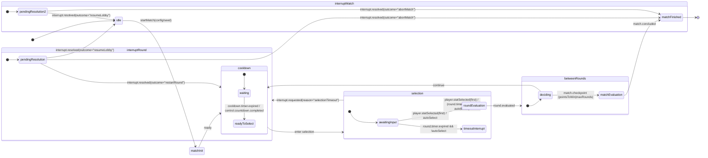

# PRD: Battle Engine

**Supports:**

- [Classic Battle PRD](prdBattleClassic.md)
- [Classic Battle CLI PRD](prdBattleCLI.md)

---

Players aged **8–12** sometimes experience **confusion and frustration** in
battles:

- Timers feel inconsistent across devices.
- Kids are unsure what to do when they run out of time or press the wrong

The **Battle Engine** is split into two cooperating components:
emission.

- **Orchestrator**: owns the state machine, cooldowns, readiness handshakes,
  interrupts, and UI adapter events.
- Enforce **strict separation of concerns** between game logic and
  orchestration.
- Guarantee **deterministic outcomes** using seeded randomness (100% match
  determinism under identical inputs).
- Ensure **testability** through snapshot state inspection and injected
  conformance coverage in integration tests.

---

## 2. Responsibilities & boundaries

### Engine

- Owns the **round timer** (start, pause, resume, stop).
- Compares stat values and computes outcomes.
- Tracks scores and end conditions.
- Emits **domain events** and **round timer events** only.

### Orchestrator

- Drives the authoritative state machine.
- Owns **all cooldowns** between rounds.
- Emits **control events** for readiness and cooldown.
- Handles interrupts and validation events.
- Provides test seams (`getState`, `injectFakeTimers`) and optional
  diagnostics (`debug:*`).

  ### State Catalog Contract

  Orchestrator publishes a State Catalog describing all available FSM nodes. This catalog is the authoritative table used by UI and tooling to render state indicators and to keep client mappings stable.

  Structure:

  ```
  type StateCatalog = {
    version: string;                 // e.g., "v1"
    order: FSMStateName[];           // strict render order
    ids: Record<FSMStateName, number>;  // stable ordinals (10,20,…)
    labels?: Record<FSMStateName,string>; // optional human-readable
    display: { include: FSMStateName[] }; // subset for passive UI
  }
  ```

  Delivery mechanisms:
  - On demand via `getState()` → includes `catalogVersion`
  - Sticky broadcast: `control.state.catalog` event (optional)

---

### 3.1 Engine constructor

`createBattleEngine(config) => BattleEngine`
Config fields:

- `pointsToWin`

### 3.2 Engine controls

- `startRoundTimer(durationMs, onDrift?)`
- `pauseRoundTimer()`
- `resumeRoundTimer()`
- `getScores()`
- `isMatchPoint()`
- `getSeed()` – returns seed in use (for replay/debug).

- `on(eventType, handler)`
- `off(eventType, handler)`

### 3.5 Orchestrator interface

- `confirmReadiness()` – replaces DOM readiness flags
- `requestInterrupt(scope: "round"|"match", reason: string)`
- `getState() => { node, context }`
  - `context` must include at least:
    - `roundIndex`
    - `seed`
    - `timerState`

- `injectFakeTimers(fakeTimersApi)`

---

## 4. Event taxonomy

- `round.started({ roundIndex, availableStats })`
- `round.selection.locked({ statKey, source })`
- `round.evaluated({ statKey, playerVal, opponentVal, outcome, scores })`
- `match.checkpoint({ reason })`
- `match.concluded({ winner, scores, reason })`

### 4.2 Timer events

- `round.timer.tick({ remainingMs })`
- `round.timer.expired()`
- `cooldown.timer.tick({ remainingMs })`
- `cooldown.timer.expired()`

### 4.3 Control / UI adapter events

- `control.countdown.started({ durationMs })`
- `control.countdown.completed()`
- `control.readiness.required({ for })`
- `control.readiness.confirmed({ for })`
  -- `control.state.changed({ from, to, context, catalogVersion })`  
   Emitted by the Orchestrator after every valid FSM transition.  
   Payload includes:
  - `from`: previous FSM state name (e.g., "matchInit")
  - `to`: new FSM state name (e.g., "cooldown")
  - `context`: minimal snapshot `{ roundIndex, scores, seed, timerState }`
  - `catalogVersion`: version string of the current State Catalog
  - Optional debug metadata (`{ transition: { trigger } }`)

  Notes:
  - This event is the authoritative adapter signal for UI consumers (Battle State Indicator, Scoreboard, CLI renderers).
  - Always fired after state entry is confirmed.
  - Guaranteed idempotent: the latest event fully reflects the current FSM node.
  - UI consumers must treat this event as the single source of truth for rendering and testing assertions.

### 4.4 Interrupt & validation

- `interrupt.requested({ scope: "round"|"match", reason })`
- `interrupt.resolved({ outcome: "restartRound"|"resumeLobby"|"abortMatch" })`
- `input.invalid({ kind, detail })`
- `input.ignored({ kind:"duplicateSelection" })`
- `error.recoverable({ message, scope })`
- `error.fatal({ message, scope })`

### 4.5 Diagnostics (optional)

- `debug.transition({ from, to, trigger })`
- `debug.state.snapshot({ state, context })`
- `debug.watchdog({ where, elapsedMs })`

---

## 5. State machine overview

```
[Diagram Recommended Here: state graph from idle → matchFinished with overlay]
```

### 5.1 States

- `idle`
- `matchInit`
- `cooldown`
- `selection`
- `roundEvaluation`
- `betweenRounds`
- `matchEvaluation`
- `matchFinished`
- Overlay: `adminOverlay` (debug/test only)

### 5.2 Transitions

- `idle --startMatch--> matchInit`
- `matchInit --ready--> cooldown`
- `cooldown --cooldown.timer.expired|control.countdown.completed--> selection`
- `selection --player.statSelected(first)--> roundEvaluation`
- `selection --round.timer.expired & autoSelect=true--> roundEvaluation`
- `selection --round.timer.expired & autoSelect=false--> interrupt.requested({reason:"selectionTimeout"})`
- `roundEvaluation --evaluate--> betweenRounds`
- `betweenRounds --check & (match point|maxRounds)--> matchEvaluation`
- `betweenRounds --check & else--> cooldown`
- `matchEvaluation --finalize--> matchFinished`
- `interrupt.* --resolve--> interrupt.resolved({outcome})`

---

## 6. Timer & readiness contract

- Engine emits only `round.timer.*` events.
- Orchestrator emits `cooldown.timer.*` and `control.*` events.
- UI adapter listens to control events and calls `confirmReadiness()`.

No DOM selectors are part of the contract.

Note:

- After each readiness or timer-triggered transition, the orchestrator must emit `control.state.changed`.
- UI modules must not infer transitions from domain/timer events directly; they consume only `control.state.changed` for authoritative rendering and logic.
- Transition handling is composed through helpers (`emitDiagnostics`, `emitReadiness`, `emitStateChange`) to isolate diagnostics, control, and taxonomy concerns.
- Interrupt resolutions use an explicit `{ event: outcome }` map (e.g., `restartMatch → restartRound`).

---

## 7. Interrupts & validation

- Emit `interrupt.requested({reason})` on abnormal flows.
- Emit `interrupt.resolved({outcome})` once handled.
- Emit `input.invalid()` or `input.ignored()` as required.
- Admin overlay may override or replay rounds.

---

## 8. Determinism & seeding

- All randomness must be seeded.
- Orchestrator injects the seed.
- Engine exposes `getSeed()`.
- Same seed + inputs = identical outcomes (100% determinism goal).

---

## 9. Edge case handling

### Normative rules

- Invalid input → `input.invalid`
- Duplicate input → `input.ignored`
- Timeout without autoSelect → `interrupt.requested({reason})`
- Interrupts must resolve with `interrupt.resolved`

### Deprecated behaviors

- Silent invalid ties (NaN=0)
- UI imperative events (`scoreboardShowMessage`)

---

## 10. Acceptance criteria (Gherkin)

```gherkin
Feature: Battle Engine acceptance criteria
  In order to verify the Battle Engine and Orchestrator meet the PRD
  As a product/test author
  I want executable-style Gherkin scenarios that describe the expected behaviour

  Background:
    Given a Battle Engine and Orchestrator are available

  Scenario: Engine emits required domain and timer events
    Given a match is started
    When a round begins
    Then the engine emits "round.started"
    And the engine emits "round.timer.tick" events while the timer runs
    And the engine emits "round.timer.expired" when the round timer reaches zero
    And the engine emits "round.evaluated" after a stat selection is evaluated

  Scenario: Orchestrator uses control events for readiness and cooldown
    Given the orchestrator begins the match initialization
    When the countdown for readiness starts
    Then the orchestrator emits "control.countdown.started"
    And when the countdown completes it emits "control.countdown.completed"
    And cooldown timers are published as "cooldown.timer.tick" and "cooldown.timer.expired"

  Scenario: Validation and interrupt events are emitted (per §4.4)
    Given an invalid input is received
    Then the system emits "input.invalid" with details
    Given a duplicate selection is received
    Then the system emits "input.ignored" with kind "duplicateSelection"
    Given a selection timeout occurs and autoSelect is false
    Then the system emits "interrupt.requested" with reason "selectionTimeout"

  Scenario: Public APIs expose state and test seams
    Given a match is started with a known seed
    When the API client calls getState()
    Then the returned state includes at least "roundIndex", "scores", "seed", and "timerState"
    And the engine exposes getSeed()
    And injectFakeTimers() can be called to control timer progression in tests

  Scenario: Deterministic outcomes with fixed seed
    Given two engine instances are created with the same seed
    And both receive the same sequence of inputs and selections
    When both matches are executed
    Then both instances produce identical outcomes and scores

  Scenario: Debug events are optional and excluded from acceptance tests
    Given debug mode is disabled for acceptance tests
    When a match runs in acceptance mode
    Then no "debug.*" events are emitted as part of the verified behaviour

  Scenario: Readiness confirmation after countdown
    Given a player starts a match
    When the readiness countdown finishes
    Then the player is shown a readiness confirmation screen
    And the orchestrator emits "control.readiness.confirmed"

  Scenario: Auto-select when round timer expires and autoSelect=true
    Given a round begins with autoSelect set to true
    When the round timer expires
    Then the system automatically selects a stat on behalf of the player
    And the round proceeds to evaluation

  Scenario: Timeout screen when round timer expires and autoSelect=false
    Given a round begins with autoSelect set to false
    When the round timer expires
    Then the system emits "round.timer.expired"
    And the player is shown a timeout screen with recovery options
    And the orchestrator emits "interrupt.requested" with a selection timeout reason

  Scenario: Animated comparison and scoreboard update after evaluation
    Given a stat has been chosen for the round
    When evaluation occurs
    Then the UI shows an animated comparison of values
    And the scoreboard is updated with the new scores

  Scenario: Victory or defeat screen on match conclusion
    Given a match concludes and a winner is determined
    When the match finalization occurs
    Then the player sees a clear victory or defeat screen
    And the final scores are displayed
```

---

## 11. Testing & observability

- `getState()` snapshot for FSM + context.
- `injectFakeTimers()` for full test determinism.
- Fixed seed → repeatable outcomes.
- Optional `debug:*` events for diagnostics.

Note:

- `control.state.changed` is the contract event for snapshotting FSM transitions during tests.
- Consumers (UI, tests) should assert against `to` and `context` values rather than raw engine timer or debug events.
- `debug.state.snapshot` remains available but is not normative.

---

## 12. Migration support

During transition:

| Legacy Event        | Replacement Event             |
| ------------------- | ----------------------------- |
| `roundResolved`     | `round.evaluated`             |
| `roundStart`        | `round.started`               |
| `matchOver`         | `match.concluded`             |
| `roundTimeout`      | `round.timer.expired`         |
| `countdownStart`    | `control.countdown.started`   |
| `countdownFinished` | `control.countdown.completed` |

Remove legacy glue code post-migration.

---

## 13. Glossary

- **Engine**: Timer, scoring, stat evaluation, emits core game events.
- **Orchestrator**: Controls state machine and UI readiness/cooldowns.
- **Readiness**: Programmatic confirmation, not DOM-based.
- **Interrupts**: Explicit recovery paths with `interrupt.resolved`.
- **Admin Overlay**: Dev/test-only state layer, not in production FSM.

- **State Catalog**: authoritative table of FSM states, IDs, labels, and display rules.
- **Catalog Version**: semantic version string ensuring client ↔ engine alignment.
- **UI Adapter Event**: stable, engine-owned events (e.g., `control.state.changed`) consumed by presentation modules.

---

## 14. Mermaid state diagram — Battle Engine

_Figure: Mermaid state diagram — shows the battle engine state machine from
idle to matchFinished. Suggested alt text: "State machine with orchestrator
cooldown, selection, evaluation, interrupts, and match conclusion."_



Notes
Engine emits: round.started, round.selection.locked, round.evaluated, round.timer.tick/expired.
Orchestrator emits: cooldown.timer._, control.countdown._, control.readiness._, match.checkpoint, match.concluded, interrupt._.
Admin overlay is out-of-band (not shown) and can re-enter at roundEvaluation via a controlled override.

---

## 15. Tasks

- [ ] 1.0 Implement Battle Engine Core
  - [ ] 1.1 Add constructor `createBattleEngine(config)`
  - [ ] 1.2 Implement round timer controls: start, pause, resume, stop
  - [ ] 1.3 Implement `evaluateSelection()` logic
  - [ ] 1.4 Track scores and rounds
  - [ ] 1.5 Emit domain and timer events

- [ ] 2.0 Implement Orchestrator State Machine
  - [ ] 2.1 Define all states and transitions per spec
  - [ ] 2.2 Integrate readiness confirmation flow
  - [ ] 2.3 Manage cooldown timers and transitions
  - [ ] 2.4 Handle interrupts and validation events
  - [ ] 2.5 Emit `control.state.changed` after each FSM transition
  - [ ] 2.6 Provide State Catalog (getState() + optional sticky event)
  - [ ] 2.7 Ensure `catalogVersion` is included in all state change payloads
  - [ ] 2.8 Update tests to assert on `control.state.changed`

- [ ] 3.0 Public API Surface
  - [ ] 3.1 Implement `getState()` and `injectFakeTimers()`
  - [ ] 3.2 Add `confirmReadiness()` and `requestInterrupt()`
  - [ ] 3.3 Expose event binding methods (`on`, `off`)

- [ ] 4.0 Testing & Observability
  - [ ] 4.1 Add snapshot state validation
  - [ ] 4.2 Validate deterministic outputs under fixed seeds
  - [ ] 4.3 Include optional `debug:*` event hooks

- [ ] 5.0 Migration Support
  - [ ] 5.1 Dual-emit legacy and new events during transition period
  - [ ] 5.2 Clean up legacy UI glue code after migration window
