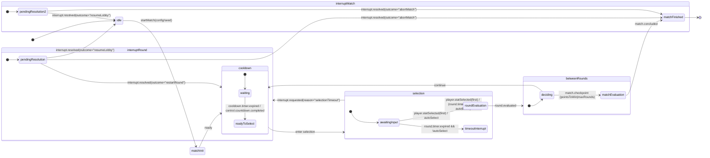

# PRD: Battle Engine (Enhanced)

**Supports:**

* [Classic Battle PRD](prdBattleClassic.md)
* [Classic Battle CLI PRD](prdBattleCLI.md)

---

## 1. TL;DR

The **Battle Engine** is split into two cooperating components:

* **Engine**: handles round timer, stat evaluation, scoring, and domain event emission.
* **Orchestrator**: owns the state machine, cooldowns, readiness handshakes, interrupts, and UI adapter events.

**Design Goals:**

* Enforce **strict separation of concerns** between game logic and orchestration.
* Guarantee **deterministic outcomes** using seeded randomness (100% match determinism under identical inputs).
* Ensure **testability** through snapshot state inspection and injected timers.
* Maintain a **clear, structured event taxonomy** with at least 90% event conformance coverage in integration tests.

---

## 2. Responsibilities & Boundaries

### Engine

* Owns the **round timer** (start, pause, resume, stop).
* Compares stat values and computes outcomes.
* Tracks scores and end conditions.
* Emits **domain events** and **round timer events** only.

### Orchestrator

* Drives the authoritative state machine.
* Owns **all cooldowns** between rounds.
* Emits **control events** for readiness and cooldown.
* Handles interrupts and validation events.
* Provides test seams (`getState`, `injectFakeTimers`) and optional diagnostics (`debug:*`).

---

## 3. Public API

### 3.1 Engine Constructor

`createBattleEngine(config) => BattleEngine`

Config fields:

* `pointsToWin`
* `maxRounds`
* `autoSelect`
* `seed`

### 3.2 Engine Controls

* `startRoundTimer(durationMs, onDrift?)`
* `pauseRoundTimer()`
* `resumeRoundTimer()`
* `stopRoundTimer()`
* `evaluateSelection({ statKey, playerVal, opponentVal }) => { outcome, scores }`

### 3.3 Engine Queries

* `getScores()`
* `getRoundsPlayed()`
* `isMatchPoint()`
* `getSeed()` – returns seed in use (for replay/debug).

### 3.4 Engine Events

* `on(eventType, handler)`
* `off(eventType, handler)`

### 3.5 Orchestrator Interface

* `startMatch(config)`
* `confirmReadiness()` – replaces DOM readiness flags
* `requestInterrupt(scope: "round"|"match", reason: string)`
* `getState() => { node, context }`

  * `context` must include at least:

    * `roundIndex`
    * `scores`
    * `seed`
    * `timerState`
* `injectFakeTimers(fakeTimersApi)`

---

## 4. Event Taxonomy

### 4.1 Domain Events

* `round.started({ roundIndex, availableStats })`
* `round.selection.locked({ statKey, source })`
* `round.evaluated({ statKey, playerVal, opponentVal, outcome, scores })`
* `match.checkpoint({ reason })`
* `match.concluded({ winner, scores, reason })`

### 4.2 Timer Events

* `round.timer.tick({ remainingMs })`
* `round.timer.expired()`
* `cooldown.timer.tick({ remainingMs })`
* `cooldown.timer.expired()`

### 4.3 Control / UI Adapter Events

* `control.countdown.started({ durationMs })`
* `control.countdown.completed()`
* `control.readiness.required({ for })`
* `control.readiness.confirmed({ for })`

### 4.4 Interrupt & Validation

* `interrupt.requested({ scope: "round"|"match", reason })`
* `interrupt.resolved({ outcome: "restartRound"|"resumeLobby"|"abortMatch" })`
* `input.invalid({ kind, detail })`
* `input.ignored({ kind:"duplicateSelection" })`
* `error.recoverable({ message, scope })`
* `error.fatal({ message, scope })`

### 4.5 Diagnostics (Optional)

* `debug.transition({ from, to, trigger })`
* `debug.state.snapshot({ state, context })`
* `debug.watchdog({ where, elapsedMs })`

---

## 5. State Machine Overview

```
[Diagram Recommended Here: state graph from idle → matchFinished with overlay]
```

### 5.1 States

* `idle`
* `matchInit`
* `cooldown`
* `selection`
* `roundEvaluation`
* `betweenRounds`
* `matchEvaluation`
* `matchFinished`
* Overlay: `adminOverlay` (debug/test only)

### 5.2 Transitions

* `idle --startMatch--> matchInit`
* `matchInit --ready--> cooldown`
* `cooldown --cooldown.timer.expired|control.countdown.completed--> selection`
* `selection --player.statSelected(first)--> roundEvaluation`
* `selection --round.timer.expired & autoSelect=true--> roundEvaluation`
* `selection --round.timer.expired & autoSelect=false--> interrupt.requested({reason:"selectionTimeout"})`
* `roundEvaluation --evaluate--> betweenRounds`
* `betweenRounds --check & (match point|maxRounds)--> matchEvaluation`
* `betweenRounds --check & else--> cooldown`
* `matchEvaluation --finalize--> matchFinished`
* `interrupt.* --resolve--> interrupt.resolved({outcome})`

---

## 6. Timer & Readiness Contract

* Engine emits only `round.timer.*` events.
* Orchestrator emits `cooldown.timer.*` and `control.*` events.
* UI adapter listens to control events and calls `confirmReadiness()`.

No DOM selectors are part of the contract.

---

## 7. Interrupts & Validation

* Emit `interrupt.requested({reason})` on abnormal flows.
* Emit `interrupt.resolved({outcome})` once handled.
* Emit `input.invalid()` or `input.ignored()` as required.
* Admin overlay may override or replay rounds.

---

## 8. Determinism & Seeding

* All randomness must be seeded.
* Orchestrator injects the seed.
* Engine exposes `getSeed()`.
* Same seed + inputs = identical outcomes (100% determinism goal).

---

## 9. Edge Case Handling

### Normative Rules

* Invalid input → `input.invalid`
* Duplicate input → `input.ignored`
* Timeout without autoSelect → `interrupt.requested({reason})`
* Interrupts must resolve with `interrupt.resolved`

### Deprecated Behaviors

* Silent invalid ties (NaN=0)
* UI imperative events (`scoreboardShowMessage`)

---

## 10. Acceptance Criteria (Checklist)

* [ ] Emits all required domain and timer events.
* [ ] Uses control events for readiness and cooldown.
* [ ] Emits validation and interrupt events per §4.4.
* [ ] Exposes `getState()` with all required context.
* [ ] Supports `injectFakeTimers()`.
* [ ] Produces deterministic results with same seed/inputs.
* [ ] `debug:*` events are optional and excluded from tests.

---

## 11. Testing & Observability

* `getState()` snapshot for FSM + context.
* `injectFakeTimers()` for full test determinism.
* Fixed seed → repeatable outcomes.
* Optional `debug:*` events for diagnostics.

---

## 12. Migration Support

During transition:

| Legacy Event        | Replacement Event             |
| ------------------- | ----------------------------- |
| `roundResolved`     | `round.evaluated`             |
| `roundStart`        | `round.started`               |
| `matchOver`         | `match.concluded`             |
| `roundTimeout`      | `round.timer.expired`         |
| `countdownStart`    | `control.countdown.started`   |
| `countdownFinished` | `control.countdown.completed` |

Remove legacy glue code post-migration.

---

## 13. Glossary

* **Engine**: Timer, scoring, stat evaluation, emits core game events.
* **Orchestrator**: Controls state machine and UI readiness/cooldowns.
* **Readiness**: Programmatic confirmation, not DOM-based.
* **Interrupts**: Explicit recovery paths with `interrupt.resolved`.
* **Admin Overlay**: Dev/test-only state layer, not in production FSM.


---

## 14. Mermaid State Diagram — Battle Engine



Notes
Engine emits: round.started, round.selection.locked, round.evaluated, round.timer.tick/expired.
Orchestrator emits: cooldown.timer.*, control.countdown.*, control.readiness.*, match.checkpoint, match.concluded, interrupt.*.
Admin overlay is out-of-band (not shown) and can re-enter at roundEvaluation via a controlled override.

## 15. Tasks

- [ ] 1.0 Implement Battle Engine Core
  - [ ] 1.1 Add constructor `createBattleEngine(config)`
  - [ ] 1.2 Implement round timer controls: start, pause, resume, stop
  - [ ] 1.3 Implement `evaluateSelection()` logic
  - [ ] 1.4 Track scores and rounds
  - [ ] 1.5 Emit domain and timer events

- [ ] 2.0 Implement Orchestrator State Machine
  - [ ] 2.1 Define all states and transitions per spec
  - [ ] 2.2 Integrate readiness confirmation flow
  - [ ] 2.3 Manage cooldown timers and transitions
  - [ ] 2.4 Handle interrupts and validation events

- [ ] 3.0 Public API Surface
  - [ ] 3.1 Implement `getState()` and `injectFakeTimers()`
  - [ ] 3.2 Add `confirmReadiness()` and `requestInterrupt()`
  - [ ] 3.3 Expose event binding methods (`on`, `off`)

- [ ] 4.0 Testing & Observability
  - [ ] 4.1 Add snapshot state validation
  - [ ] 4.2 Validate deterministic outputs under fixed seeds
  - [ ] 4.3 Include optional `debug:*` event hooks

- [ ] 5.0 Migration Support
  - [ ] 5.1 Dual-emit legacy and new events during transition period
  - [ ] 5.2 Clean up legacy UI glue code after migration window
