# PRD: Battle Engine

**Entry Point:** `src/helpers/battleEngine.js`
**Used By:** Classic Battle, Battle CLI, Battle Bandit, future modes
**Related Docs:** \[prdBattleScoreboard.md], \[prdSnackbar.md], \[prdBattleStateIndicator.md — Battle State Progress]

---

## 1. Problem Statement

Previous implementations mixed orchestration, logic, and UI responsibilities, leading to inconsistent behaviour, non-deterministic outcomes, and difficulty testing.
The engine must provide a **deterministic, event-driven foundation** for all battle modes, with clear separation of concerns and a stable event taxonomy.

---

## 2. TL;DR

The **Battle Engine** is composed of two cooperating layers:

- **Engine Core** — owns stat evaluation, scoring, round timer, and domain/timer event emission.
- **Orchestrator** — owns the FSM, cooldowns, readiness handshakes, interrupts, and control event emission.

Design goals:

- Strict separation of concerns.
- Deterministic outcomes with seeded randomness (**100% identical outcomes given identical inputs**).
- Testability via state snapshots and **injected fake timers**.
- Canonical event taxonomy, with **≥90% event conformance coverage** in integration tests.

---

## 3. Responsibilities & Boundaries

### Engine Core

- Evaluate chosen stat values and compute round outcome.
- Track cumulative scores.
- Own the **round timer** (start, tick, expire).
- Emit **domain** and **timer** events.

### Orchestrator

- Maintain finite-state machine (FSM).
- Manage **cooldown timers** between rounds.
- Coordinate readiness handshakes.
- Manage interrupts and their resolution.
- Emit **control** events (authoritative for UIs).
- Optionally emit adapter updates (e.g. `scoreboard.update`) for simplified UI wiring.

### Out of Scope

- Rendering.
- Snackbar-style prompts.
- Mode-specific visual layout.

---

## 4. Event Catalog (Authoritative)

Canonical events emitted:

| Category    | Event                                                          | Purpose                            |
| ----------- | -------------------------------------------------------------- | ---------------------------------- |
| Domain      | `round.started({ roundIndex })`                                | New round begins                   |
|             | `round.selection.locked({ roundIndex, statKey })`              | Stat selection locked              |
|             | `round.evaluated({ outcome, scores })`                         | Outcome computed                   |
|             | `match.checkpoint({ scores })`                                 | Periodic checkpoint                |
|             | `match.concluded({ scores })`                                  | Match ends                         |
| Timers      | `round.timer.tick({ remainingMs })`                            | Selection countdown                |
|             | `round.timer.expired()`                                        | Selection timer expired            |
|             | `cooldown.timer.tick({ remainingMs })`                         | Cooldown countdown                 |
|             | `cooldown.timer.expired()`                                     | Cooldown expired                   |
| Control     | `control.state.changed({ from, to, context, catalogVersion })` | **Authoritative FSM transition**   |
|             | `control.countdown.started/ completed`                         | Match pre-start countdown          |
|             | `control.readiness.required/ confirmed`                        | Readiness handshake                |
| Validation  | `input.invalid`, `input.ignored`                               | Invalid or duplicate input         |
| Interrupts  | `interrupt.raised`, `interrupt.resolved`                       | Handling of match-level interrupts |
| Diagnostics | `debug.state.snapshot`                                         | Emit full engine state for tests   |

---

## 5. Authority Rules

- **UIs must not infer transitions** from domain or timer events.
- **Only** `control.state.changed` is authoritative for view/state progression.
- Domain/timer events update values, not transitions.

### Event Authority Sequence Diagram

The diagram below shows one complete round lifecycle, emphasizing the **critical authority boundary**: only `control.state.changed` is authoritative for state transitions. The three-hop event propagation chain (Engine → Orchestrator → UI) ensures clear separation of concerns and deterministic behavior.


> Canonical authority for state names and legal transitions: `src/helpers/classicBattle/stateCatalog.js` and `src/helpers/classicBattle/stateTable.js`.

**Critical Authority Rules (enforced by event taxonomy):**

- **`control.state.changed`** (emitted by Orchestrator FSM) — **ONLY** authoritative signal for view state transitions. Payload includes `from`, `to`, `context`, `catalogVersion`.
- **Domain events** (`round.started`, `round.evaluated`, etc.) — Update values (scores, outcomes), NOT transitions. Useful for snackbars, counters, but insufficient for state progression.
- **Timer events** (`round.timer.tick`, `cooldown.timer.tick`) — Provide tick counts for countdown displays; NOT transition triggers.
- **Validation events** (`input.invalid`, `input.ignored`) — Inform UI of rejected inputs; state unchanged.

**Event Propagation Chain (3-hop):**

1. **Engine Core emits:** `roundStarted`, `roundEnded`, `timerTick` (legacy compatibility internals)
2. **Orchestrator bridges:** Subscribes to Engine.on(), maps to canonical names, emits `round.started`, `control.state.changed` (with FSM authority)
3. **UI listeners:** Consume events via `dispatchBattleEvent` subscriptions; render based on **`control.state.changed` only** for transitions

### Event naming legend

- **Authoritative transition signal:** `control.state.changed` (UI progression must follow this event only).
- **Canonical dotted round events:** `round.started`, `round.selection.locked`, `round.evaluated`.
- **Canonical timer/control namespaces:** `round.timer.*`, `cooldown.timer.*`, `control.countdown.*`.
- **Legacy compatibility names in this PRD:** `roundStarted`, `roundEnded`, `timerTick`, `statSelected` (implementation bridge/internal).

**Design Rationale:**

- Separates concerns: Engine is deterministic logic, Orchestrator is FSM coordination, UI is presentation.
- Guards against invalid state transitions: UIs cannot skip states by listening to intermediate events alone.
- Enables test snapshots: `control.state.changed` provides verifiable FSM trace.
- Allows adapter flexibility: Legacy UIs can read all events; new UIs respect authority boundaries.

---

## 6. State Model

```ts
{
  state: string,              // FSM state
  roundIndex: number,
  scores: { player: number, opponent: number },
  outcome: "playerWin" | "opponentWin" | "draw" | null,
  selection: { statKey: string | null },
  timers: {
    roundRemainingMs: number | null,
    cooldownRemainingMs: number | null
  },
  catalogVersion: string
}
```

---

## 7. Finite-State Machine (FSM) Overview

> **Note**: The states listed below are conceptual/abstract categories. The canonical state machine uses more granular states (e.g., `roundPrompt`, `roundSelect`, `roundResolve`, `roundDisplay`, `matchEvaluate`, etc.). See [prdStateHandler.md](prdStateHandler.md#canonical-state-graph-names) for the detailed, implemented state list and complete diagram.

### States (Conceptual Model)

- **init** — engine constructed, no match started.
- **prestart** — optional countdown / readiness handshake before round 1.
- **selection** — players/AI lock a stat or the round timer expires (auto-pick).
- **evaluation** — engine computes outcome, updates scores, emits result.
- **cooldown** — optional inter-round cooldown.
- **end** — match concluded (target wins reached or terminal interrupt).

### Mapping: Abstract States → Canonical Implementation

```mermaid
flowchart LR
    subgraph Abstract["Abstract/Conceptual Layer<br/>(High-level game flow)"]
        A1["🔷 init"]
        A2["🔷 prestart"]
        A3["🔷 selection"]
        A4["🔷 evaluation"]
        A5["🔷 cooldown"]
        A6["🔷 end"]
    end
    
    subgraph Canonical["Canonical/Granular Layer<br/>(Implementation: stateTable.js)"]
        C1["waitingForMatchStart"]
        C2["matchStart<br/>matchCountdown"]
        C3["roundPrompt<br/>roundSelect"]
        C4["roundResolve<br/>roundDisplay"]
        C5["roundCooldown"]
        C6["matchEvaluate<br/>matchOver"]
    end
    
    A1 -.->|maps to| C1
    A2 -.->|maps to| C2
    A3 -.->|maps to| C3
    A4 -.->|maps to| C4
    A5 -.->|maps to| C5
    A6 -.->|maps to| C6
    
    classDef abstract fill:#lightyellow,stroke:#333,stroke-width:2px,stroke-dasharray: 5 5
    classDef canonical fill:#lightgreen,stroke:#333,stroke-width:2px
    
    class A1,A2,A3,A4,A5,A6 abstract
    class C1,C2,C3,C4,C5,C6 canonical
```



> ✅ **Mapping Reference**: The abstract states above group multiple canonical states for clarity. When reading engine docs (state descriptions, transitions, FSM diagrams), use **canonical names** from the diagram above and [prdStateHandler.md#canonical-state-graph-names](prdStateHandler.md#canonical-state-graph-names). See `src/helpers/classicBattle/stateTable.js` for the authoritative state transition table.

### Transition events

- `startMatch()` → `control.countdown.started` → `control.countdown.completed`
- `round.started({ roundIndex })`
- `round.selection.locked` / `round.timer.expired`
- `round.evaluated({ outcome, scores })`
- `cooldown.timer.*`
- `match.concluded({ scores })`
- `interrupt.raised` / `interrupt.resolved`

### Guards & rules

- Win guard: if `scores.player >= targetWins || scores.opponent >= targetWins` → transition to `end`.
- Timer expiry in `selection` auto-locks per mode rules (e.g. random stat).
- UIs must never infer transitions from non-control events.


> Canonical authority for state names and legal transitions: `src/helpers/classicBattle/stateCatalog.js` and `src/helpers/classicBattle/stateTable.js`.

### State table

| State      | Entry actions                                                 | Accepts                                         | Exit on                                            | Notes                          |
| ---------- | ------------------------------------------------------------- | ----------------------------------------------- | -------------------------------------------------- | ------------------------------ |
| init       | set roundIndex=0, reset scores/outcome                        | startMatch()                                    | countdown started                                  | No timers running.             |
| prestart   | emit `control.countdown.started`                              | readiness/skip, countdown ticks                 | `control.countdown.completed` → `round.started(1)` | Optional per mode.             |
| selection  | start round timer; emit `control.state.changed(to=selection)` | `round.selection.locked`, `round.timer.expired` | to `evaluation`                                    | Auto-pick on expiry.           |
| evaluation | compute outcome; emit `round.evaluated`                       | —                                               | to `end` (win guard) or `cooldown`                 | Deterministic with seeded RNG. |
| cooldown   | start cooldown timer                                          | cooldown ticks                                  | `cooldown.timer.expired` → `round.started(n+1)`    | Optional in some modes.        |
| end        | emit `match.concluded`, freeze timers                         | —                                               | —                                                  | Terminal.                      |

---

## 8. Public API

- **create(config) → EngineInstance**
  Initializes engine with seeded RNG, config, and empty state.

- **startMatch()**
  Begin match; emit countdown + round.started.

- **lockSelection(statKey: string)**
  Lock stat and evaluate.

- **advanceRound()**
  Progress FSM to next round or conclude match.

- **getSnapshot() → StateModel**
  Deterministic state for tests/debugging.

- **destroy()**
  Stops timers, unsubscribes, resets state.

### Event Subscription API

Battle Engine instances behave as lightweight event emitters so game modes can
subscribe directly to lifecycle updates:

```js
import BattleEngine from "./src/helpers/BattleEngine.js";

const engine = new BattleEngine({ pointsToWin: 3 });

engine.on("roundStarted", ({ round }) => {
  console.log(`Round ${round} begins`);
});

engine.on("roundEnded", (payload) => {
  console.log(`Round ended: ${payload.outcome}`);
});
```

- `on(eventName, handler)` attaches a subscriber. Call `off`/`destroy` to
  remove listeners.
- Event payloads expose deterministic snapshots so UIs can render without
  pulling internal engine state.
- The emitter mirrors the canonical catalog:
  - `roundStarted` → `{ round }`
  - `roundEnded` → `{ delta, outcome, matchEnded, playerScore, opponentScore }`
  - `timerTick` → `{ remaining, phase: 'round' | 'cooldown' }`
  - `matchEnded` → same payload as `roundEnded`
  - `error` → `{ message }`

### Usage Notes

- Engine code contains only match logic. Presentation layers subscribe and map
  events to UI helpers (scoreboard, snackbars, state badges).
- Consumers must respect control events as authoritative and avoid inferring
  transitions from domain timers alone.

---

## 9. Lifecycle & Idempotency

- Duplicate stat selections for the same round are ignored (`input.ignored`).
- Out-of-order events (lower `roundIndex` than current) are ignored.
- Engine must be restartable (destroy() + create()).
- Determinism guaranteed if seeded RNG and identical inputs provided.
- Snapshots are idempotent and repeatable.

---

## 10. Performance & Testability

- Timer tick granularity: 1s, drift ≤ 100 ms per 10s.
- Event dispatch latency ≤ 16 ms per frame.
- Must support **fake timers** for deterministic testing.
- Coverage note: `tests/roundManager.cooldown-ready.spec.js` now exercises `startCooldown`
  with an injected scheduler, proving fallback readiness resolves before the default
  timers and replacing the old helper-level `resolveActiveScheduler` assertion.
- Deterministic playback possible with recorded event tapes.
- ≥90% event types must have conformance tests in integration suite.

---

## 11. Acceptance Criteria (Gherkin)

Feature: Engine emits canonical events

Scenario: Round start
When startMatch() is called
Then the engine emits "round.started" with roundIndex 1
And "control.state.changed" to "selection"

Scenario: Timer ticks
Given a selection timer of 5 seconds
When 3 seconds pass
Then the engine emits "round.timer.tick" with remainingMs 2000

Scenario: Stat locked and outcome evaluated
When lockSelection("power") is called
Then the engine emits "round.selection.locked" with statKey "power"
And then emits "round.evaluated" with an outcome and updated scores

Scenario: Outcome persists until state change
Given outcome "playerWin" was emitted for round 3
When "control.state.changed" moves to "selection" for round 4
Then outcome is reset to null

Scenario: Match concluded
When a player reaches 10 wins
Then the engine emits "match.concluded" with final scores
And "control.state.changed" to "end"

Scenario: Ignore duplicate input
When lockSelection("power") is called twice for the same round
Then only the first is accepted
And the second emits "input.ignored"

Scenario: Interrupt raised and resolved
When an interrupt is raised
Then the engine emits "interrupt.raised"
When the interrupt is resolved
Then the engine emits "interrupt.resolved"

Scenario: Debug snapshot
When getSnapshot() is called
Then the engine emits "debug.state.snapshot" with the full state

---

## 12. Risks & Open Questions

- Should we emit a consolidated `scoreboard.update` adapter event to simplify UI consumption?
- Should cooldown visuals be considered part of the Scoreboard or Snackbar?
- Should catalogVersion mismatches throw or warn only?
- How should interrupts be exposed to UIs — surfaced directly, or wrapped in Snackbar notifications?

---
