# PRD: Layout Editor

## Overview

A browser-based layout editor for JU-DO-KON! that allows developers, QA agents, and contributors to view, edit, and create battle mode layouts.

The editor provides a grid-based drag-and-drop interface with live battle previews via iframe integration. It supports importing existing `.layout.js` modules, visual editing with grid snapping, and exporting both JSON and ASCII representations compatible with the Layout Engine.

- **Entry point:** `src/pages/layoutEditor.html`
- **Supports:** Layout Engine
- **Depends on:** `featureFlags.js`, `debugPanel.js`, `battleClassic.html`, `battleQuick.html`

---

## Problem Statement

Currently, layout creation relies on manual JSON or CSS edits. This approach is error-prone, difficult to visualise, and not beginner-friendly. A visual editor will accelerate layout iteration, enforce schema validation, and produce ASCII maps for CI and QA automation.

---

## Goals

- Provide an interactive grid editor UI for positioning and sizing layout regions.
- Enable live preview of layouts using the Layout Engine within an iframe.
- Support import and export of `.layout.js` and `.json` layouts.
- Generate ASCII previews consistent with the Layout Engine’s exporter.
- Store in-progress drafts safely in `localStorage`.
- Allow round-trip editing without loss of coordinate precision.
- Include basic schema validation feedback and metadata versioning.

---

## Non-Goals

- No advanced responsive or mobile layout support.
- No auto-generation of rarity styling or CSS themes.
- No multi-user collaboration or backend persistence.

---

## Personas

- **Developer:** Quickly creates and tests new layouts visually.
- **QA Agent:** Generates ASCII snapshots for regression comparison.
- **Designer/Contributor:** Proposes layout variants without writing code.

---

## Functional Requirements

| ID     | Requirement                                                 | Priority | Notes                                                 |
| ------ | ----------------------------------------------------------- | -------- | ----------------------------------------------------- |
| LED-1  | Provide a canvas overlay with visible component boxes.      | Must     | Aligns to a 60×24 grid.                               |
| LED-2  | Allow drag, resize, and z-order manipulation.               | Must     | Snaps to grid lines.                                  |
| LED-3  | Load existing `.layout.js` module into editor.              | Must     | Uses dynamic ESM import.                              |
| LED-4  | Export layout as downloadable JSON file (`*.layout.json`).  | Must     | Can be converted to `.layout.js` for runtime use.     |
| LED-5  | Export ASCII preview with legend.                           | Must     | Matches Layout Engine format.                         |
| LED-6  | Import JSON or ASCII back into editor.                      | Should   | Preserves coordinate fidelity.                        |
| LED-7  | Apply layout live to battle preview iframe.                 | Should   | Uses `postMessage` to communicate with Layout Engine. |
| LED-8  | Save draft layouts to `localStorage` per mode.              | Should   | Auto-saved on change.                                 |
| LED-9  | Toggle feature flags within the editor UI.                  | Could    | For conditional visibility testing.                   |
| LED-10 | Support keyboard shortcuts (nudge, snap toggle, duplicate). | Could    | Improves productivity.                                |
| LED-11 | Provide a property inspector for selected region.           | Should   | Editable ID, x, y, w, h, z-index fields.              |
| LED-12 | Include alignment guides when elements align.               | Should   | Visual snapping lines.                                |
| LED-13 | Allow “Reset to default layout” action.                     | Should   | Reloads baseline from `/src/layouts/*.layout.js`.     |
| LED-14 | Include layout metadata (id, engineVersion).                | Must     | Required for version tracking.                        |
| LED-15 | Provide live schema validation with visual feedback.        | Should   | Highlights invalid properties in red.                 |

---

## Layout Editor Workflow

```mermaid
graph TD
    A["📐 Open layoutEditor.html"] -->|Load mode selector| B["🎮 Select Battle Mode<br/>Classic / Quick / Other"]
    B -->|Fetch layout| C["📥 Dynamic ESM Import<br/>src/layouts/*.layout.js"]
    C -->|Success| D["🎨 Render Editor UI<br/>Canvas + Inspector"]
    C -->|Fail| E["❌ Show error<br/>Use default layout"]
    D --> F["🖼️ Display live preview<br/>iframe (battle scene)"]
    
    F --> G["✏️ User Edits<br/>Drag/Resize regions"]
    G -->|Change detected| H["🔄 Update property<br/>inspector values"]
    H -->|Valid| I["✅ Apply to preview<br/>postMessage"]
    H -->|Invalid| J["❌ Validation error<br/>Show in red"]
    J --> G
    I -->|Preview updates| F
    
    G -->|Save draft| K["💾 Auto-save to<br/>localStorage<br/>layoutEditor:<modeId>"]
    G -->|Export| L{Export Format}
    L -->|JSON| M["📄 Layout.json<br/>Download file"]
    L -->|ASCII| N["🔤 ASCII preview<br/>Copy/Download"]
    L -->|Reset| O["🔄 Restore default<br/>Reload from disk"]
    
    M --> P["✅ Complete"]
    N --> P
    O --> D
    
    style A fill:lightgreen
    style D fill:lightblue
    style F fill:lightblue
    style G fill:lightblue
    style P fill:lightgreen
    style J fill:lightsalmon
```



**Workflow Stages:**

- **Import**: Load existing `.layout.js` via ESM import or use default
- **Edit**: Drag/resize components; validation in real-time
- **Preview**: Live iframe shows layout as it would appear in battle
- **Export**: JSON for code use; ASCII for CI/documentation
- **Persist**: Auto-save drafts to localStorage; manual export for distribution

---

## Editor UI Architecture: Canvas & Inspector

```mermaid
graph TB
    A["📐 Layout Editor Page<br/>layoutEditor.html"]
    
    A --> B["🎮 Header"]
    B --> C["Mode Selector<br/>Classic/Quick"]
    B --> D["Reset Button<br/>restore default"]
    B --> E["Theme Toggle<br/>Light/Dark"]
    
    A --> F["🖼️ Main Canvas Area<br/>60x24 grid"]
    F --> G["📏 Grid Overlay<br/>faint lines, 1unit snap"]
    F --> H["📦 Component Boxes<br/>draggable, resizable"]
    H --> I["🎯 Selected box:<br/>resize handles + coords"]
    
    A --> J["📋 Property Inspector<br/>right panel"]
    J --> K["Region ID (text)"]
    J --> L["X position (number)"]
    J --> M["Y position (number)"]
    J --> N["Width (number)"]
    J --> O["Height (number)"]
    J --> P["Z-index (number)"]
    K --> Q["Live update<br/>on edit"]
    Q --> R["Validate against<br/>schema"]
    
    A --> S["🔤 ASCII Preview<br/>side/modal"]
    S --> T["Legend:<br/>S=Scoreboard, A=Arena"]
    S --> U["Copy button"]
    S --> V["Download button"]
    
    A --> W["🐛 Console Pane<br/>errors & logs"]
    
    style A fill:lightgreen
    style F fill:lightblue
    style J fill:lightblue
    style S fill:lightblue
    style W fill:lightyellow
```



**Component Hierarchy:**

- **Header**: Mode selection, reset, theme
- **Canvas**: Grid + draggable region boxes with selection handles
- **Inspector**: Editable region properties (ID, x, y, w, h, z)
- **ASCII Preview**: Generated layout snapshot with legend
- **Console**: Error messages and validation feedback

---

## Layout Import/Export Pipeline

```mermaid
graph LR
    A["📥 Input"] -->|Load| B{Source Type}
    
    B -->|ESM Module| C["🔗 Dynamic import<br/>.layout.js"]
    B -->|JSON File| D["📄 Parse JSON<br/>.layout.json"]
    B -->|ASCII Text| E["🔤 ASCII parser<br/>reconstruct coords"]
    B -->|localStorage| F["💾 Restore draft<br/>layoutEditor:key"]
    
    C --> G["✅ Normalize<br/>to Object"]
    D --> G
    E --> G
    F --> G
    
    G --> H["🔍 Validate<br/>schema v1"]
    H -->|Valid| I["📐 Editor State<br/>grid + regions"]
    H -->|Invalid| J["❌ Show errors<br/>highlight fields"]
    
    I --> K{Export Mode}
    J --> L["⚠️ Correction needed"]
    L --> G
    
    K -->|→ JSON| M["📄 layout.json<br/>{id, grid, regions}"]
    K -->|→ ASCII| N["🔤 ASCII layout<br/>grid representation"]
    K -->|→ ESM| O["📜 .layout.js<br/>export default"]
    
    M --> P["💾 Download<br/>or Copy"]
    N --> P
    O --> P
    
    style A fill:lightgreen
    style G fill:lightblue
    style I fill:lightblue
    style P fill:lightgreen
    style J fill:lightsalmon
    style L fill:lightsalmon
```



**Input Formats:**

- ESM `.layout.js` module (dynamic import)
- JSON `.layout.json` file (parse)
- ASCII text (reconstruct from visual)
- localStorage draft (recover unsaved work)

**Output Formats:**

- JSON: structuring for runtime import
- ASCII: documentation and CI snapshots
- ESM: ready-to-use `.layout.js` module

---

## Editor-to-Battle Communication: postMessage Bridge


**Message Protocol:**

- **Type**: LOAD_LAYOUT (send layout to iframe)
- **Payload**: Full layout object with grid, regions, metadata
- **Response**: ACK_LAYOUT_APPLIED (iframe confirms update)
- **Frequency**: On each change (debounced <16ms for 60fps)

**Sandbox Permissions:**

```
allow-scripts (run JavaScript)
allow-same-origin (access Layout Engine)
```

---

## Layout Editing State Machine


**Editing States:**

- **Ready**: Awaiting user interaction
- **RegionSelected**: Region highlighted with handles visible
- **Dragging**: Moving region with grid snap and live preview
- **Resizing**: Adjusting dimensions with corner handles
- **InspectorEdit**: Direct property value editing with validation
- **ValidationError**: Invalid input; show error; allow correction

**Acceptance Criteria:**

- Given a valid layout, the editor renders draggable boxes for each `[data-layout-id]`.
- When a component is moved or resized, the numeric values update live in the property inspector.
- Exported JSON includes accurate coordinates and metadata (`id`, `engineVersion`).
- Reimporting an exported layout reproduces the same arrangement within 0.5% positional deviation.
- ASCII export matches Layout Engine output for identical layouts.
- The live preview iframe updates the battle layout within one animation frame of applying changes.
- Invalid schema values trigger inline validation feedback.

---

## Constraints

- Must run entirely client-side with no backend.
- Works offline on static GitHub Pages.
- Compatible with Chrome, Edge, and Firefox (latest versions).
- Uses `postMessage` for iframe communication.
- Sandboxed iframe permissions: `sandbox="allow-scripts allow-same-origin"`.
- Layout schema must match the Battle Layout Schema v1 contract documented in the Layout Engine PRD (grid, regions, and metadata).

---

## Technical Design

### Communication Interface

- **Editor to iframe:** The editor sends a `postMessage` with the layout object.
- **Iframe to editor:** The iframe sends confirmation messages when layouts are applied successfully.

### Storage

- Drafts are stored as `layoutEditor:<modeId>` in `localStorage`.
- An inline JSON fallback is always available for recovery.

### Validation

- A lightweight validator checks for valid grid integers, defined regions, and unique IDs.
- Invalid entries trigger a red border and warning message.
- Validation uses the Battle Layout Schema v1 rules to ensure exports and previews match runtime expectations.

### Versioning

Each layout export includes `id`, `engineVersion`, and grid dimensions.

---

## UX & UI Considerations

- Canvas shows faint grid lines with snapping every 1 grid unit.
- Selected element highlights with resize handles and coordinate overlay.
- Property Inspector on the right shows editable values.
- ASCII preview appears in a modal or side panel with copy and download options.
- Optional dark/light theme toggle for accessibility.
- “Reset” button reloads default layout for the current mode.
- Errors and logs appear in a bottom console pane.

---

## Testing Strategy

### Vitest

- Validate import/export consistency between JSON, object, and ASCII.
- Test schema validation logic and metadata embedding.
- Test `localStorage` draft restoration.

### Playwright

- Simulate drag-resize actions and assert coordinate updates.
- Verify `postMessage` communication with battle iframe.
- Compare ASCII export output with Layout Engine results.
- Confirm no data loss after reload.

### CI Integration

- Optional GitHub Action to regenerate ASCII snapshots from exported layouts.
- Store ASCII baselines under `/tests/__snapshots__/layout_ascii/`.

---

## Open Questions

- Should the editor support side-by-side comparisons for multiple battle modes?
- Should ASCII export be mandatory for PR submissions?
- Should the editor include a live testing mode that updates during battles?
- Should unsaved changes persist across browser restarts or just the current session?

---

## Tasks

- **1.0** Implement core editor UI (canvas and property panel).
  - **1.1** Grid overlay, snapping, drag/resize logic.
  - **1.2** Add z-index management tools.
- **2.0** Implement layout load and export pipeline.
  - **2.1** Dynamic ESM import from `/src/layouts/*.layout.js`.
  - **2.2** JSON and ASCII export with download options.
  - **2.3** Inline schema validation.
- **3.0** Integrate battle preview iframe.
  - **3.1** Implement `postMessage` bridge.
  - **3.2** Apply layout live using Layout Engine.
- **4.0** Persistence and versioning.
  - **4.1** `localStorage` autosave and restore.
  - **4.2** Metadata tagging (id and version).
- **5.0** UX enhancements.
  - **5.1** Alignment guides and keyboard shortcuts.
  - **5.2** Reset layout and dark mode toggle.
  - **5.3** Validation overlay and console feedback.

---

## Example Export Structure

```json
{
  "id": "classic.v4",
  "engineVersion": "1.1",
  "grid": { "cols": 60, "rows": 24 },
  "regions": {
    "scoreboard": { "x": 1, "y": 1, "w": 60, "h": 4, "z": 1 },
    "arena": { "x": 5, "y": 6, "w": 50, "h": 10, "z": 2 }
  }
}
```

---

## Example ASCII Export

```
+————————————————————+
|                       SCOREBOARD                           |
|                                                            |
| PLAYER HAND        ARENA VIEW         OPPONENT HAND        |
|                                                            |
|                           TIMER                            |
+————————————————————+
```

**Legend:** `S = Scoreboard`, `A = Arena`, `T = Timer`, `P = Player Hand`, `O = Opponent Hand`

---

## Summary

The Layout Editor provides a visual authoring layer for JU-DO-KON! battle layouts, bridging design and code through real-time feedback, validation, and ASCII export integration. By aligning with the `.layout.js` ESM format and Layout Engine runtime, it ensures deterministic, testable, and contributor-friendly layout creation directly within the browser.

---

## Opportunities for Improvement

- Add diagrams or annotated screenshots of the editor to clarify spatial concepts and layout workflows.
- Provide a dedicated glossary for layout-specific terminology (e.g., regions, grid units) to help new contributors ramp up quickly.
- Document example user journeys (Developer, QA, Designer) to illustrate how each persona leverages the editor end-to-end.
