# PRD: Layout Engine

---

## TL;DR

Introduce a **layout engine** that applies predefined **JavaScript-based layout modules** (ESM) at runtime to any JU-DO-KON! battle mode.  
Each layout defines the positions, sizes, and z-order of major UI regions (arena, scoreboard, hands, timer, etc.) using a **grid-based coordinate system**.

The engine ensures layouts are **deterministic, resolution-agnostic, and feature-flag aware**, while remaining fully compatible with **static hosting on GitHub Pages** (no bundler or build pipeline required).

Layouts are loaded synchronously as ESM modules, with a guaranteed **inline JSON fallback** embedded in the page to prevent flicker or failure on load.

---

## Problem Statement

Previously, battle modes hard-coded their DOM/CSS positioning. This caused:

- Difficulty iterating on layouts across modes.
- Inconsistent positioning and drift between releases.
- Manual CSS overrides and missing CI layout snapshots.

Early drafts proposed loading external JSON files at runtime, but this introduces timing, caching, and reliability issues on a static site.  
Instead, layouts will now be distributed as **ES module exports** for deterministic loading, combined with an **inline default layout** that guarantees startup even if a module fails to load.

This approach removes race conditions, avoids stale caches on GitHub Pages, and provides clean observability for QA and CI.

---

## Goals

- Apply layout definitions from **`.layout.js` ESM modules**, not runtime JSON fetches.
- Maintain support for **grid definitions** (e.g. 60×24) with percent-based scaling.
- Apply layouts deterministically via `[data-layout-id]` anchors.
- Respect **feature-flag conditions** (e.g., “show scoreboard only if flag X enabled”).
- Support ASCII export/import for CI verification.
- Fail gracefully if a layout is missing, invalid, or collides.
- Complete layout application within **50 ms average runtime**.
- Ensure layouts remain deterministic and testable with **Vitest** and **Playwright**.

---

## Feasibility Assessment

### Overall verdict

- The proposed layout engine is **technically feasible** within the static GitHub Pages constraints so long as layout modules are served as first-class ESM files and loaded without introducing hot-path dynamic imports.
- Achieving the 50 ms target is realistic: a single `requestAnimationFrame` pass that batches style updates keeps the DOM churn bounded, and prior Classic Battle timing data shows <10 regions mutated per mode.
- Feature-flag aware rendering is compatible with the existing synchronous flag service; the engine simply needs a fast `isEnabled(flagId)` hook before mutating the DOM.

### Key gaps to resolve

- **Module loading policy:** The current draft leans on `import()`; repo guardrails prohibit dynamic imports in battle hot paths. We need a static `layoutRegistry` that imports all published layouts up front (tree-shaken per page) and exposes them by `modeId`, with the inline JSON fallback as a last resort.
- **Fallback freshness:** Embedding JSON in the page prevents flicker but risks drift. Add a generator (`npm run layouts:sync`) that diff-checks each `.layout.js` against its inline fallback and fails CI if they diverge.
- **Schema precision:** Define the layout schema (required fields, allowed region properties, versioning) so validation can be deterministic and type-safe. Without an explicit contract, “lightweight validation” is ambiguous and brittle.
- **Observability hooks:** Meeting the determinism goal requires instrumentation—capture apply timing, active layout ID, and flag outcomes so Playwright/Vitest can assert behaviours without probing implementation details.

### Risk summary

| Risk                       | Impact                                                        | Mitigation                                                                              |
| -------------------------- | ------------------------------------------------------------- | --------------------------------------------------------------------------------------- |
| Dynamic import in hot path | Violates engine policy, introduces jitter on slow connections | Replace with static registry generated at build time (`layouts/index.js`)               |
| Inline fallback drift      | Startup regressions when module and fallback disagree         | CLI sync command + CI check; embed fallback hash next to `<script id="layout-default">` |
| Schema under-specification | Validation false positives/negatives                          | Publish the Battle Layout Schema v1 section in this PRD; update acceptance tests        |
| Feature flag latency       | Layout flash when async flag loads                            | Require synchronous flag hydration before `applyLayout()`; document dependency ordering |

Overall feasibility is high once the mitigations above are incorporated into the implementation plan.

---

## Non-Goals

- No interactive layout editing (see Layout Editor PRD).
- No responsive/mobile scaling beyond grid abstraction.
- No visual design specification (CSS theming remains separate).

---

## Personas

- **Developer:** Commits `.layout.js` files and reviews ASCII diffs in PRs.
- **Designer:** Defines predictable visual placements.
- **QA Agent:** Uses ASCII export to verify layout consistency across builds.

---

## Functional Requirements

| ID    | Requirement                                                    | Priority | Notes                                         |
| ----- | -------------------------------------------------------------- | -------- | --------------------------------------------- |
| LAY-1 | Apply a **JavaScript ESM layout module** to `#battleRoot`.     | Must     | Entry point: `applyLayout()`.                 |
| LAY-2 | Anchor elements by `[data-layout-id]`.                         | Must     | Consistent across battle modes.               |
| LAY-3 | Support grid definitions (`cols`, `rows`) and percent scaling. | Must     | Default 60×24 grid.                           |
| LAY-4 | Apply rect (x, y, w, h) and z-order as inline styles.          | Must     |                                               |
| LAY-5 | Respect `visibleIf.featureFlag` conditions.                    | Must     | Integrates with feature flag module.          |
| LAY-6 | Provide **inline default fallback** when layout fails to load. | Must     | Guarantees deterministic boot.                |
| LAY-7 | Export current DOM layout to ASCII + JSON.                     | Should   | For CI and auditability.                      |
| LAY-8 | Validate layout shape and version at runtime.                  | Should   | Lightweight schema check (no Ajv dependency). |
| LAY-9 | Log applied layout + ASCII snapshot in debug panel.            | Could    | For observability and testing.                |

---

## Acceptance Criteria

- Given a valid `.layout.js` module, calling `applyLayout()` **positions all components correctly** within 50 ms average runtime.
- Layout selection uses the static registry with zero runtime `import()` calls in the battle boot path.
- If a feature flag is disabled, its region **is not rendered**.
- If a layout import fails or is invalid, the **inline default JSON layout** applies automatically.
- Inline fallback hash matches the source module (validated in CI) to prevent drift.
- ASCII output matches the expected token map for CI comparison.
- No visible flicker occurs between page load and layout application.

---

## Constraints

- Layouts live under `src/layouts/*.layout.js`.
- Must operate entirely client-side on GitHub Pages (no server fetch).
- Support all active battle modes: Classic, Quick, CLI.
- Use **static ESM imports** via a generated registry—no hot-path `import()`—with optional `?layout=` URL parameter for testing variant selection.

---

## Edge Cases / Failure States

- **Missing Module File:** Fallback to inline default layout; log warning.
- **Invalid Module Structure:** Log error and use inline default.
- **Duplicate `data-layout-id`:** Log conflict, apply first rect only.
- **Missing DOM Anchor:** Log and skip.
- **Undefined Feature Flag:** Treat as `false` and hide component.
- **Fallback hash mismatch:** Fail validation, trigger inline fallback, and surface error to debug panel/CI.

---

## Design and UX Considerations

- The grid abstraction must visually align to a reference ASCII rendering.
- Example ASCII:

+————————————————————+
| SCOREBOARD |
| |
| PLAYER HAND ARENA VIEW OPPONENT HAND |
| |
| TIMER |
+————————————————————+

- Layout application should happen in one animation frame (`requestAnimationFrame`) after DOM ready.
- Page should start with `#battleRoot { visibility: hidden; }` until layout successfully applies.
- Non-responsive by design; future mobile layouts will use separate modules.

---

## Battle Layout Schema v1

This schema defines the canonical layout payload used by the Layout Engine. It is the source of truth for runtime validation, editor export, and debug tooling. All layouts must conform to this contract, and no additional properties are allowed at any level.

```json
{
  "$schema": "http://json-schema.org/draft-07/schema#",
  "$id": "https://cyanautomation.github.io/judokon/schemas/layoutSchema.v1.json",
  "title": "JU-DO-KON Battle Layout Schema v1",
  "type": "object",
  "additionalProperties": false,
  "required": ["grid", "regions"],
  "properties": {
    "id": {
      "type": "string",
      "minLength": 1,
      "description": "Stable identifier for the layout."
    },
    "variantId": {
      "type": "string",
      "minLength": 1,
      "description": "Optional variant identifier (e.g. 'night-mode')."
    },
    "version": {
      "type": "string",
      "minLength": 1,
      "description": "Version string for schema compatibility (e.g. '1.0.0')."
    },
    "meta": {
      "type": "object",
      "additionalProperties": false,
      "properties": {
        "hash": {
          "type": "string",
          "description": "Hash of the source layout payload."
        },
        "generatedAt": {
          "type": "string",
          "format": "date-time",
          "description": "ISO timestamp indicating when the fallback was generated."
        },
        "author": {
          "type": "string",
          "description": "Optional author or generator tag."
        }
      }
    },
    "grid": {
      "type": "object",
      "additionalProperties": false,
      "required": ["cols", "rows"],
      "properties": {
        "cols": {
          "type": "number",
          "exclusiveMinimum": 0
        },
        "rows": {
          "type": "number",
          "exclusiveMinimum": 0
        }
      }
    },
    "regions": {
      "type": "array",
      "minItems": 1,
      "items": {
        "type": "object",
        "additionalProperties": false,
        "required": ["id", "rect"],
        "properties": {
          "id": {
            "type": "string",
            "minLength": 1
          },
          "ariaLabel": {
            "type": "string",
            "minLength": 1
          },
          "zIndex": {
            "type": "number"
          },
          "rect": {
            "type": "object",
            "additionalProperties": false,
            "required": ["x", "y", "width", "height"],
            "properties": {
              "x": {
                "type": "number",
                "minimum": 0
              },
              "y": {
                "type": "number",
                "minimum": 0
              },
              "width": {
                "type": "number",
                "exclusiveMinimum": 0
              },
              "height": {
                "type": "number",
                "exclusiveMinimum": 0
              }
            }
          },
          "visibleIf": {
            "type": "object",
            "additionalProperties": false,
            "required": ["featureFlag"],
            "properties": {
              "featureFlag": {
                "type": "string",
                "minLength": 1
              }
            }
          },
          "snapTo": {
            "type": "string",
            "description": "Optional snap-to anchor reference."
          }
        }
      },
      "uniqueItems": true
    }
  }
}
```

---

## Implementation Notes

- Inline default layout stored in `<script type="application/json" id="layout-default">…</script>` and stamped with a version/hash that matches the source `.layout.js`.
- A compile-time generated `src/layouts/layoutRegistry.js` statically imports all `.layout.js` modules and exports a map of `{ [modeId]: { default: layoutModule, variants } }` to avoid hot-path dynamic imports.
- `loadLayout(modeId, variantId?)` first resolves the registry entry, then falls back to the inline JSON when the registry misses or fails validation.
- Layout application runs inside a single `requestAnimationFrame` tick, batching `element.style.cssText` updates to minimise layout thrash. After success, the engine sets `data-layout-id` on `#battleRoot`, toggles `visibility: visible`, emits a `layout:applied` event for observers, and records timing metrics.
- Lightweight validation extends beyond shape checks: validate schema version, ensure regions stay within grid bounds, guard against overlapping rects, and flag orphaned `[data-layout-id]`.
- Compose engine telemetry with `{ appliedLayoutId, durationMs, skippedRegions, usedFallback }` and surface it through the existing debug panel for deterministic testing.

---

## Layout Selection & Application Flow

> **⚠️ Status: INFRASTRUCTURE PRESENT but LAYOUT MODULES PENDING**
>
> The layout engine infrastructure (loadLayout, applyLayout, validation) is implemented and ready. However, the layout module files (`.layout.js`) referenced in the flowchart diagram have not yet been created in `src/layouts/`.
>
> Current state: The registry and fallback system exist, but are unpopulated. Inline JSON fallback is the only active path until layout modules are added. See implementation notes below for architecture details.

The flowchart below illustrates the complete layout selection, validation, and application pipeline:

```mermaid
flowchart LR
    Start([Layout Request<br/>modeId, variantId?]) --> RegistryLookup{"Registry<br/>Lookup"}

    RegistryLookup -->|Found| ValidateRegistry["Validate<br/>Registry"]
    RegistryLookup -->|Not Found| FallbackLookup["Fallback<br/>Lookup"]

    ValidateRegistry -->|Valid| ResolveRegistry["Resolve<br/>Module"]
    ValidateRegistry -->|Invalid| FallbackLookup

    ResolveRegistry --> ResolveSuccess{Resolved?}
    ResolveSuccess -->|Yes| FeatureGate1["For Each Region<br/>in Layout"]
    ResolveSuccess -->|No| FallbackLookup

    FallbackLookup --> ValidateFallback["Validate<br/>Fallback"]
    ValidateFallback -->|Valid| FeatureGate1
    ValidateFallback -->|Invalid| FallbackInvalid["Fallback Invalid"]

    FallbackInvalid --> Telemetry["Log Error<br/>to Telemetry"]
    Telemetry --> End1([No Layout Applied<br/>Use Default CSS])

    FeatureGate1 --> CheckFlag{"Feature Flag<br/>Enabled?"}

    CheckFlag -->|Yes| ApplyRect["Apply Rect<br/>x, y, w, h"]
    CheckFlag -->|No| SkipRegion["Skip Region<br/>Log Skipped"]

    ApplyRect --> NextRegion
    SkipRegion --> NextRegion{"More<br/>Regions?"}

    NextRegion -->|Yes| FeatureGate1
    NextRegion -->|No| Batch["Batch Mutations<br/>in RAF"]

    Batch --> ApplySuccess["Set data-layout-id<br/>Toggle Visibility"]
    ApplySuccess --> EmitEvent["Emit layout:applied<br/>Event"]
    EmitEvent --> Telemetry2["Log Success<br/>to Telemetry"]
    Telemetry2 --> End2([Layout Applied<br/>Render Complete])
```



**Key Design Notes:**

- **Feature-Flag Gating Priority:** Feature flag evaluation uses the established priority order: **Overrides > Persisted Settings > Default Values**. Flags are checked per-region; if a flag is not found or resolves to `false`, the region is not rendered.

- **Fallback Strategy:** Layout selection follows a two-tier fallback hierarchy: (1) **Registry Lookup** (static module import via `layoutRegistry`), then (2) **Inline JSON Fallback** (embedded in `<script id="layout-default">`). If both fail validation, telemetry is logged with error context, and the page falls back to its default CSS-based layout.

- **Validation Nodes (Collapsed):** Both Registry and Fallback validation check schema version, region bounds against grid dimensions, duplicate anchors, and matching feature-flag IDs. Specific validation rules and error types are documented in the **Battle Layout Schema v1** section and enforced by the lightweight schema validator (no external dependencies).

- **Inline Fallback Parsing:** If inline JSON fails validation (e.g., malformed JSON, schema violation), the fallback is marked as invalid and logged to telemetry with details (e.g., "Fallback hash mismatch," "Invalid schema version"). Specific parse errors are captured in logging for observability.

- **RAF Batching:** Layout mutations (style updates for position, size, z-order) are batched within a single `requestAnimationFrame` callback to minimise layout thrashing and reflows. The RAF pattern ensures all DOM updates are flushed in one animation frame, keeping average application time under 50 ms. RAF scheduling and callback internals are documented separately in implementation code; the diagram keeps focus on the selection logic.

---

## Recommended Enhancements

1. **Schema & validation contract**
   - Use the Battle Layout Schema v1 section in this PRD plus a generated `src/layouts/types.d.ts` so editors and tests share the same contract.
   - Document allowed region metadata (`visibleIf`, `ariaLabel`, `snapTo`) and reject unknown keys to keep layouts deterministic.
2. **Fallback synchronisation**
   - Create `npm run layouts:sync` that regenerates inline fallbacks from `.layout.js` modules, writes hash/version metadata, and fails CI if drift is detected.
   - Gate merges on the sync command, similar to existing `generatePrdIndex` pretest hook.
3. **Layout registry generation**
   - Build `scripts/generateLayoutRegistry.mjs` that scans `src/layouts/*.layout.js`, produces the static registry, and is executed pre-commit (mirroring PRD index generation).
   - Include variant support by naming convention (`{modeId}.{variant}.layout.js`) so the engine can swap layouts without runtime import strings.
4. **ASCII export specification**
   - Define a canonical character map (`A` = arena, `S` = scoreboard, `T` = timer, etc.) and include metadata headers (grid size, layout id, feature flags) for deterministic diffs.
   - Provide a `tests/fixtures/layouts/*.ascii` directory checked into git to anchor Playwright/Vitest assertions.
5. **Debug & observability**
   - Extend the debug panel contract to log timings, active feature flags, and applied fallback status, enabling low-flake Playwright checks.
   - Consider emitting a `layout:failed` event consumed by QA tooling to surface violations immediately.

---

## Testing Strategy

### Vitest

- Unit-test `applyLayout()` as a pure function (DOM transform only).
- Stub the static `layoutRegistry` to cover default + variant resolution paths and ensure no runtime `import()` calls escape tests.
- Validate fallback logic and feature-flag handling.
- Assert schema validation rejects out-of-bounds regions, duplicate anchors, and stale fallback hashes.

### Playwright

- Verify that page loads hidden → layout applied → visible (no flicker).
- Test layout switching via `?layout=` param.
- Simulate registry misses to confirm inline fallback usage and debug panel telemetry.
- Snapshot ASCII export (including metadata headers) in CI to detect drift and enforce schema parity.

---

## Open Questions

- Should the engine support live re-loading of layout modules via a debug toggle (for design playtests)?
- Should ASCII exports include feature-flag visibility markers?
- Where should `layouts:sync` and registry generation run in the pipeline (pre-commit vs. CI-only) to balance developer ergonomics with determinism?

---

## Tasks

- [ ] 1.0 Implement Layout Engine Core
  - [ ] 1.1 Create `applyLayout()` entry point.
  - [ ] 1.2 Implement `loadLayout()` backed by the static `layoutRegistry` with inline fallback.
  - [ ] 1.3 Anchor elements using `[data-layout-id]`.
  - [ ] 1.4 Apply grid rects and z-index as inline styles inside a single animation frame.

- [ ] 2.0 Feature Flag Integration
  - [ ] 2.1 Parse `visibleIf.featureFlag` from layout object.
  - [ ] 2.2 Check runtime flags and toggle visibility.
  - [ ] 2.3 Emit telemetry for skipped regions (flag disabled).

- [ ] 3.0 Layout Schema & Validation
  - [ ] 3.1 Publish Battle Layout Schema v1 in this PRD and generated typings.
  - [ ] 3.2 Validate shape, bounds, overlap, and fallback version/hash at runtime.

- [ ] 4.0 ASCII + JSON Export
  - [ ] 4.1 Traverse current DOM layout.
  - [ ] 4.2 Export positions to JSON and ASCII for CI diffing.
  - [ ] 4.3 Include metadata headers (layout id, grid size, feature flags) in ASCII snapshot.

- [ ] 5.0 Validation & Fallback Tooling
  - [ ] 5.1 Generate inline fallback JSON via `npm run layouts:sync`.
  - [ ] 5.2 Fail CI if fallback hash/version mismatches source module.
  - [ ] 5.3 Log warning and apply inline default if registry lookup fails or validation errors.

- [ ] 6.0 Layout Registry Automation
  - [ ] 6.1 Implement `scripts/generateLayoutRegistry.mjs`.
  - [ ] 6.2 Add pre-commit/pretest hook to regenerate registry.

- [ ] 7.0 Debug Panel
  - [ ] 7.1 Log layout application success/failure and duration.
  - [ ] 7.2 Display ASCII snapshot, applied layout ID, feature-flag state, and fallback status.

## Source of Truth

- Code: `src/`
- Tests: `tests/` and `playwright/`
- Tracking: `design/productRequirementsDocuments/INDEX.md`
