# Battle Markup PRD

## TL;DR

This PRD defines the canonical DOM/markup contracts used by Classic Battle and related tools (CLI, tests, debug panels). It lists stable IDs, data attributes, and the responsibilities of the markup to support automation and accessibility.

## Owner & Version

- Owner: @frontend-team (placeholder — update to an individual owner)
- Document version: 1.0.0 — changes to markup contracts MUST follow the Governance section below.

## Problem Statement / Why it matters

Playwright tests, CLI integrations, and automation depend on stable DOM hooks. Historically, ad-hoc changes to class names and IDs caused multiple test failures and brittle selectors. Treating markup as a product contract reduces breakage and speeds up safe refactors. This document defines the canonical mapping and the process to change it.

## Goals / Success Metrics

- Authoritative, machine-readable list of stable DOM hooks (IDs, data-attributes, roles) for all battle UI surfaces.
- Reduce test-breakage related to selector drift by 90% in the next quarter.
- All Playwright tests must reference selectors from the canonical mapping (directly or via helper utilities).
- Every markup change that affects a canonical selector must include: PRD update, automated test changes, and a 14-day deprecation window for removals.

## User Stories

- As a test author, I want a single source of truth for selectors so tests remain resilient to styling changes.
- As a developer, I want a documented process to change markup so I can perform safe refactors without surprising test owners.
- As an accessibility reviewer, I want roles/labels mapped to elements so automated accessibility checks are accurate.
- As an external CLI/automation consumer, I want stable hooks so my tooling doesn't break across releases.

## Prioritized Functional Requirements

### P1 — DOM Contracts Inventory

- Feature: Canonical mapping file (`design/dataSchemas/battleMarkup.json`) listing stable hooks: logicalName, selector, dataTestId, role, description, owner, stability, aliases.
- Description: A machine-readable list authoritative for tests/CLI. Changes to entries follow the Change Policy below.

Acceptance Criteria:

- The mapping file exists and contains at minimum entries for: `roundMessage`, `snackbarContainer`, `battleStateBadge`, `playerCard`, `statButton` (per-player), `statLabel`, `statValue`, `selectStatButton`, `autoSelectIndicator`, modal/dialog roots used during battle flows.
- Playwright tests use the mapping via helpers (or import) for at least one representative test in `playwright/`.

### P1 — Change Policy and Governance

- Feature: Documented policy for renaming/deprecating selectors (communication, deprecation window, test updates requirement).
- Description: Steps required to change any canonical selector.

Acceptance Criteria:

- Policy section exists in this PRD and lists required steps (announce, add alias, update tests, remove after deprecation window).
- Every PR that updates a canonical selector includes a checklist linking to this PRD and references affected tests.

### P1 — Accessibility Mapping

- Feature: ARIA role/label guidance for canonical elements and keyboard focus expectations.
- Description: Each canonical entry must include recommended role/aria-label and keyboard behaviors (e.g., stat buttons must be focusable and operable with Enter/Space).

Acceptance Criteria:

- Accessibility guidance is present for each P1 element and Playwright accessibility checks exist for at least the stat-selection flow.

### P2 — Data-test-id Naming Convention

- Feature: Define a stable naming convention for `data-testid`/`data-test-id` attributes and an example linter rule to prefer them over brittle class-name selectors.
- Description: Recommend `data-testid="area:element"` style and discourage using visual or CSS classes as test hooks.

Acceptance Criteria:

- A naming guideline exists and one example test or helper in `playwright/helpers` uses it.

### P2 — Selector Compatibility Aliases

- Feature: Support aliasing old selectors to new selectors during deprecation window (both selectors present) to avoid breaking consumers.
- Description: Mapping entries may include `aliases: []` to hold deprecated selectors that will be removed later.

Acceptance Criteria:

- Mapping entries can include `aliases`, and the Change Policy describes when aliases must be removed.

### P3 — Developer Ergonomics for Selectors

- Feature: Helper utilities for tests to resolve selectors by logical name (e.g., `selectors.roundMessage()` returns the current selector) and a small example helper in `playwright/helpers/selectors.js`.
- Description: Helpers reduce duplication and centralize future updates.

Acceptance Criteria:

- A minimal helper example is present in the repository or linked from this PRD and one test imports it.

## Acceptance Criteria (overall)

- Every P1 requirement has at least one automated test referencing the canonical mapping.
- New or changed canonical selectors must have accompanying PRD/CHANGE notes and an explicit owner.

## Non-Functional Requirements / Design Considerations

- Use semantic HTML where possible and provide ARIA attributes for interactive elements.
- Favor `data-testid` attributes for test hooks instead of CSS classes.
- Keep the DOM tree shallow for key interactive areas to improve test and accessibility traversal performance.
- Minimize number of distinct root IDs to simplify test setup and query performance.

## Accessibility Checklist

- All interactive elements expose a role or are native interactive elements (button, input, a).
- Keyboard users can operate the stat selection flow (Tab to stat, Enter or Space to select).
- Visible focus indicators exist for stat buttons and primary controls.
- ARIA labels exist for non-textual controls (icons, badges) and match the copy used by tests.

## Change Policy (detailed)

1. Propose change in a PR that updates `design/dataSchemas/battleMarkup.json` and this PRD if semantics change.
2. Add `aliases` for removed selectors and keep both selectors present for a minimum deprecation window (default: 14 days) unless security/bugfix requires immediate removal.
3. Update all Playwright tests (or add a migration diff) in the same PR or a follow-up PR referenced by the original.
4. Notify test owners and add an entry to `CHANGELOG.md` referencing the selector change.
5. After the deprecation window, remove aliases and finalize mapping.

## Governance & Versioning

- Mapping file follows semantic versioning for the contract (major.minor.patch). Breaking changes bump major and require a documented migration plan.
- Minor/patch changes may be applied with PRD update and automated test updates.

## Battle Markup Schema

**Schema version:** 1.0.0  
**Generated at:** 2025-09-20T00:00:00Z

This section is the canonical, PRD-owned schema list that fully represents the retired
`battleMarkup.json`/`battleMarkup.generated.js` artifacts. The table below is authoritative for
selectors, data-test IDs, roles, and aliases.

**Generation note:** `design/dataSchemas/battleMarkup.generated.js` is produced from
`design/dataSchemas/battleMarkup.json` via `node scripts/generateBattleMarkup.mjs` (also run in
`npm run pretest` via `npm run generate:battleMarkup`) so CI/test environments always have the
artifact in place.

**Selector authority note:** The authoritative selector for `statButton` is
`.stat-button[data-stat][data-player]` (requires `data-player`). Earlier generated output omitted
`[data-player]`; that omission is incorrect and should not be used.

| logicalName         | selector                               | dataTestId             | role   | description                                                                     | owner         | stability              | aliases       |
| ------------------- | -------------------------------------- | ---------------------- | ------ | ------------------------------------------------------------------------------- | ------------- | ---------------------- | ------------- | ------ | ------------------------ |
| roundMessage        | `#round-message`                       | `battle:round-message` | status | Message shown for round prompts and results.                                    | frontend-team | stable                 | `[]`          |
| snackbarContainer   | `#snackbar-container`                  | `ui:snackbar`          | status | Global transient messages (hints, countdown).                                   | frontend-team | stable                 | `[]`          |
| battleStateBadge    | `#battle-state-badge`                  | `battle:state-badge`   | status | Compact badge showing the current battle state (e.g., selecting, resolving).    | frontend-team | stable                 | `[]`          |
| playerCard          | `.player-card[data-player]`            | `battle:player-card`   | group  | Root element for a player's card. Has attribute data-player with values 0 or 1. | frontend-team | stable                 | `[]`          |
| statButton          | `.stat-button[data-stat][data-player]` | `battle:stat-button`   | button | Interactive stat button. Attributes: data-stat (strength                        | speed         | tech) and data-player. | frontend-team | stable | `["button.stat-action"]` |
| selectStatButton    | `button[data-action=select-stat]`      | `battle:select-stat`   | button | Primary control used to confirm a selected stat (if present in UI variants).    | frontend-team | experimental           | `[]`          |
| autoSelectIndicator | `.auto-select-indicator`               | `battle:auto-select`   | status | Visual indicator shown when the system auto-selects a stat.                     | frontend-team | stable                 | `[]`          |
| modalRoot           | `#modal-root`                          | `ui:modal-root`        | dialog | Root for modals used during battle (confirmations, results).                    | frontend-team | stable                 | `[]`          |

## Example canonical mapping (human-readable excerpt)

- `roundMessage`
  - selector: `#round-message`
  - data-test-id: `battle:round-message`
  - role: `status`
  - description: Message shown for round prompts and results.
  - owner: `frontend-team`
  - stability: `stable`

- `snackbarContainer`
  - selector: `#snackbar-container`
  - data-test-id: `ui:snackbar`
  - role: `status`
  - description: Global transient messages (hints, countdown).

See the Battle Markup Schema section above for the full authoritative list.

## Example Playwright usage (recommended pattern)

// pseudo-code example (test authors should import the selector helper)

```js
// tests/battle/select-stat.spec.js
import selectors from "../../playwright/helpers/selectors";

test("player can select a stat via keyboard", async ({ page }) => {
  await page.goto("/battle/classic");
  await page.focus(selectors.statButton());
  await page.keyboard.press("Enter");
  await expect(page.locator(selectors.roundMessage())).toHaveText(/selected/i);
});
```

## Dependencies and Open Questions

- Depends on: `playwright/helpers` (selector helpers), this PRD as the canonical artifact, and test owner contact list.
- Open: final canonical attribute name (`data-testid` vs `data-test-id`) — recommend `data-testid` for consistency with Playwright conventions but allow repo-wide lint rule to enforce chosen form.

## Next steps

1. Keep the Battle Markup Schema table in this PRD current with any selector changes.
2. Add a small selector helper under `playwright/helpers/selectors.js` that resolves logical names to selectors using the canonical mapping.
3. Update a sample Playwright test to use the helper and show the end-to-end workflow.

## Appendix: Classic Battle Markup (merged from the retired standalone battle markup doc)

Classic battle pages rely on specific element IDs so helper scripts can attach listeners and update the UI. The following IDs must be present for scripts to function.

### Required IDs

| ID                      | Required data hooks                                   | Purpose                                                                                                                    |
| ----------------------- | ----------------------------------------------------- | -------------------------------------------------------------------------------------------------------------------------- |
| `round-message`         | `data-testid="round-message"`                         | Announces prompts and round outcomes.                                                                                      |
| `next-round-timer`      | `data-testid="next-round-timer"`                      | Displays the inter-round countdown.                                                                                        |
| `round-counter`         | `data-testid="round-counter"`                         | Shows current round number.                                                                                                |
| `score-display`         | `data-testid="score-display"`                         | Lists player and opponent scores.                                                                                          |
| `test-mode-banner`      | `data-testid="test-mode-banner"`                      | Indicates when test mode is active.                                                                                        |
| `debug-panel`           | `data-testid="debug-panel"`                           | Collapsible container for debugging info.                                                                                  |
| `debug-output`          | `data-testid="debug-output"`                          | `<pre>` element inside the debug panel.                                                                                    |
| `battle-area`           | `data-testid="battle-area"`                           | Wrapper containing player and opponent cards.                                                                              |
| `player-card`           | `data-testid="player-card"`                           | Container for the player's card.                                                                                           |
| `opponent-card`         | `data-testid="opponent-card"`                         | Container for the opponent's card.                                                                                         |
| `stat-buttons`          | `data-testid="stat-buttons"`                          | Group of stat selection buttons.                                                                                           |
| `round-result`          | `data-testid="round-result"`                          | Displays the result of the round.                                                                                          |
| `next-button`           | `data-role="next-round"`, `data-testid="next-button"` | Advances to the next round when ready. Pressing it always skips the cooldown regardless of the `skipRoundCooldown` flag.   |
| `stat-help`             | `data-testid="stat-help"`                             | Opens stat selection help.                                                                                                 |
| `quit-match-button`     | `data-testid="quit-match"`                            | Triggers the quit match flow.                                                                                              |
| `battle-state-progress` | `data-testid="battle-state-progress"` (optional)      | Optional list tracking match state transitions; pre-populates from the current state and remaps interrupts to core states. |

The primary scoreboard elements (`#round-message`, `#next-round-timer`, `#round-counter`, `#score-display`, `#battle-state-badge`, and `#test-mode-banner`) live inside a `.battle-status-header` container. The numeric/timer/status metrics are grouped within a `.battle-status-metrics` wrapper so the header can present them in responsive columns without changing the canonical IDs or ARIA roles.

### Data attributes and test hooks

Every required ID must expose a matching `data-testid` so automation can bind to a stable attribute without relying on CSS or copy. The `next-button` additionally requires `data-role="next-round"` so helper scripts can detect the control even when markup is rearranged. These hooks are enforced in the DOM tests at `tests/pages/battlePages.dom.test.js`.

### Example Markup

```html
<div id="stat-buttons" role="group" aria-label="Select a stat to battle">
  <button data-stat="power"></button>
  <!-- additional stat buttons -->
</div>

<div class="action-buttons">
  <button id="next-button" data-role="next-round" class="battle-control-button" disabled>
    Next
  </button>
  <button id="stat-help" class="battle-control-button" aria-label="Stat selection help">?</button>
  <button id="quit-match-button" class="battle-control-button">Quit Match</button>
</div>
```

## Markup Contract Hierarchy

```mermaid
graph TD
    A["🏗️ Battle Markup Contract<br/>design/dataSchemas/battleMarkup.json"]

    A -->|Generated by| B["📜 battleMarkup.generated.js<br/>node scripts/generateBattleMarkup.mjs"]
    A -->|Authoritative list| C["📋 Canonical Schema Table<br/>(in this PRD)"]

    C --> D["🔹 Logical Names"]
    C --> E["🔹 Selectors"]
    C --> F["🔹 Data-TestID"]
    C --> G["🔹 ARIA Roles"]
    C --> H["🔹 Aliases"]

    D --> I["Examples:<br/>statButton<br/>roundMessage<br/>playerCard<br/>snackbarContainer"]
    E --> J["Examples:<br/>.stat-button[data-stat]<br/>#round-message<br/>.player-card[data-player]<br/>#snackbar-container"]
    F --> K["Examples:<br/>battle:stat-button<br/>battle:round-message<br/>battle:player-card<br/>ui:snackbar"]
    G --> L["Examples:<br/>button<br/>status<br/>group<br/>dialog"]
    H --> M["Deprecated selectors<br/>kept during grace period<br/>auto-removed later"]

    style A fill:lightblue
    style C fill:lightgreen
    style I fill:lightyellow
    style J fill:lightyellow
    style K fill:lightyellow
    style L fill:lightyellow
```



**Contract Layers:**

- **JSON Source**: `battleMarkup.json` is the single source of truth
- **Generated Artifact**: `battleMarkup.generated.js` produced during build/pretest
- **Canonical Table**: PRD documents the current mapping with owner notes
- **Attributes**: Each entry maps to multiple attributes (selector, ID, ARIA role, data-testid)

---

## Classic Battle Markup Structure: DOM Tree


**Canonical IDs (Required):**

- `round-message`, `next-round-timer`, `round-counter`, `score-display`
- `player-card`, `opponent-card`, `stat-buttons`
- `next-button`, `quit-match-button`, `stat-help`
- `snackbar-container`, `modal-root`

All required IDs must have matching `data-testid` attributes for test automation.

---

## Selector Change Policy Lifecycle

```mermaid
graph LR
    A["🎯 Old Selector<br/>In production"] -->|14-day grace period| B["🔄 Both selectors present<br/>Old + New"]
    B -->|Tests migrated| C["✅ New selector<br/>Old in aliases"]
    C -->|After deprecation window| D["🗑️ Old selector removed<br/>Aliases cleared"]
    D -->|Future reference| E["📚 CHANGELOG notes<br/>removal date"]

    A -->|Step 1| F["1️⃣ Propose change<br/>Update JSON + PRD"]
    F -->|Step 2| G["2️⃣ Add alias for old<br/>Keep both selectors"]
    G -->|Step 3| H["3️⃣ Update all tests<br/>Playwright migrations"]
    H -->|Step 4| I["4️⃣ Notify owners<br/>Add CHANGELOG entry"]
    I -->|Step 5| J["5️⃣ Wait 14 days<br/>Deprecation window"]
    J -->|Step 6| K["6️⃣ Remove old selector<br/>& aliases"]
    K --> D

    style A fill:lightgreen
    style B fill:lightyellow
    style C fill:lightgreen
    style D fill:lightsalmon
```



**Change Process:**

1. Propose selector change in PR (update `battleMarkup.json` and this PRD)
2. Add `aliases` array with old selector; keep both selectors present
3. Update all Playwright tests (or provide migration diff)
4. Notify test owners; add CHANGELOG entry
5. Wait minimum 14 days (unless security/bugfix requires immediate action)
6. Remove old selector and clear aliases

**Governance:**

- Major changes (API breaks): Increment version, require migration plan
- Minor/patch changes: Update PRD + tests in same PR

---

## Selector Mapping: Logical Name → Attributes Table


**Schema Entries (Authoritative):**
Each entry includes:

- **logicalName**: Human-readable identifier
- **selector**: CSS/DOM selector (preferred, test-safe form)
- **dataTestId**: `area:element` format for data-testid attribute
- **role**: ARIA role (button, status, group, dialog, etc.)
- **description**: Purpose and usage notes
- **owner**: Team responsible for changes
- **stability**: stable / experimental / deprecated
- **aliases**: Array of old selectors (for deprecation window)

---

## Keyboard & Accessibility Mapping

```mermaid
graph TD
    A["⌨️ Battle Interaction Model"]

    A --> B["Tab Navigation"]
    B --> C["Tab cycles through:<br/>stat buttons<br/>next button<br/>quit match button"]
    B --> D["Shift+Tab cycles<br/>in reverse"]

    A --> E["Stat Selection"]
    E --> F["Arrow Keys<br/>(if implemented):<br/>↑↓ between stats<br/>← → cycle through"]
    E --> G["Enter/Space<br/>Activates focused<br/>stat button"]
    E --> H["data-testid<br/>present for<br/>automation"]

    A --> I["Focus Indicators"]
    I --> J["Visible outline<br/>for keyboard focus"]
    I --> K["aria-current<br/>attribute on<br/>focused stat"]

    A --> L["ARIA Labels"]
    L --> M["aria-label:<br/>Stat button names<br/>(Strength, Speed, Technique)"]
    L --> N["aria-live<br/>on round messages<br/>(polite region)"]
    L --> O["aria-label<br/>on next/quit buttons"]

    A --> P["Status Announcements"]
    P --> Q["#round-message<br/>role=status<br/>aria-live=polite"]
    P --> R["#snackbar-container<br/>role=status<br/>aria-live=assertive"]

    style A fill:lightgreen
    style B fill:lightblue
    style E fill:lightblue
    style I fill:lightblue
    style L fill:lightblue
```



**Accessibility Standards:**

- **Keyboard Navigation**: Tab through all interactive elements (stat buttons, next, quit)
- **Focus Indicators**: Visible outline on focused elements
- **ARIA Roles**: Use semantic roles (button, status, group, dialog)
- **Live Regions**: Round messages and snackbar use aria-live for announcements
- **Labels**: All buttons have aria-labels or visible text labels

**Acceptance Criteria:**

Ensure the canonical mapping in this PRD includes entries for all Required IDs above and provides `data-testid` values.

- Add unit tests that validate the selector helper maps logical names to the canonical selectors.
- Add a DOM-level test to assert that the `next-button`, `stat-help`, and `quit-match-button` have matching `data-testid` attributes when rendered.
