# PRD: Quick Battle

**Game Mode ID:** `4`
**Entry Point:** `battleQuick.html`
**Shares Engine With:** Battle Engine Core (see \[prdBattleEngine.md])

---

## TL;DR

Quick Battle is Ju-Do-Kon!’s **fastest battle mode**. It is a **single-round, instant-winner match** designed for players who want a short, decisive experience. No round select modal, no extended progression — just one draw, one stat choice, one outcome.

**Experience snapshot:**

> A player taps “Quick Battle,” picks **Power**, wins the round, and instantly sees the victory modal. The whole match lasts less than a minute.

---

## Problem Statement

Classic Battle introduces players to stats and outcomes, but even its shortest format (3-point win target) takes multiple rounds. Players sometimes want a **super-fast match** — to test a single card, to demo the game, or to play in very short breaks.

Quick Battle addresses this by offering a **single-round resolution**, cutting friction while reusing the familiar battle loop.

---

## Goals

### Player Goals

- Play a full battle experience in **under 60 seconds**.
- Test individual judoka cards quickly.
- Get a clear win/loss/draw result without multi-round commitment.
- Use the same intuitive interface as Classic Battle, but with no round target selection.

### Product Goals

- Provide a **snack-size mode** for demos, showcases, and impatient players.
- Increase engagement for players who want quick experiments (e.g., comparing two cards).
- Reuse existing Classic Battle logic with minimal changes.

---

## Non-Goals

- Multi-round play.
- Points-to-win customization.
- Deck management or extended scoring.
- Alternative stat weighting or new scoring logic.

---

## User Stories

- As a **player in a hurry**, I want a one-round match so I can play without time commitment.
- As a **collector**, I want to test how my new card performs quickly.
- As a **demo host**, I want to show off Ju-Do-Kon!’s battle loop in under a minute.
- As a **tester**, I want deterministic one-round outcomes for repeatable validation.

---

## Gameplay Basics

- No round select modal — match starts immediately.
- Both sides draw **one random card** from the shared dataset.
- Player sees their card and chooses a stat (Power, Speed, Technique, etc.).
- A 30-second timer runs; if it expires, a stat is auto-selected (`autoSelect`).
- Opponent AI selects its stat after a short artificial delay.
- The two stats are compared.
- The result is shown instantly (Win/Loss/Draw).
- A match end modal appears with outcome, cards, and “Play Again” / “Quit” options.

---

## Technical Considerations

- Must reuse the same random card draw (`generateRandomCard`) and opponent AI logic as Classic Battle.
- No need for round progression, cooldown, or scoreboard counters beyond displaying single result.
- Scoreboard integration limited to: stat selection prompts, “Opponent is choosing…”, and final outcome.
- Reuse the 30s stat selection timer, with same auto-select + drift handling rules as Classic Battle.
- Debug/test mode should allow seed injection to reproduce single-round results.

---

## Functional Requirements

| Priority | Feature              | Requirement                                                                 |
| -------- | -------------------- | --------------------------------------------------------------------------- |
| **P1**   | Random Card Draw     | Each player draws one unique card; no duplicates.                           |
| **P1**   | Stat Selection       | Player chooses from visible stats; buttons disabled after selection.        |
| **P1**   | Stat Selection Timer | 30s countdown; auto-selects on expiry if `autoSelect = true`.               |
| **P1**   | Scoring & Results    | Win/Loss/Draw decided by single stat comparison; display outcome in modal.  |
| **P1**   | Match End            | Match always ends after one round; modal must show cards and result.        |
| **P2**   | Opponent AI          | Easy = random; Medium = ≥ average stat; Hard = highest stat. Default: Easy. |
| **P2**   | Quit Flow            | Quit button and header logo prompt confirmation.                            |
| **P3**   | Debug/Testing Mode   | Deterministic seed, debug panel, state list available via feature flags.    |

---

## Feature Flags

- `autoSelect` (default **true**) — auto-pick stat on timeout.
- `enableTestMode` (default **false**) — enable debug panel, seed control.
- `statHotkeys` (default **true**) — allow keyboard 1–5 for stat buttons.

---

## UX & Design

- Layout identical to Classic Battle (player card left, opponent card right).
- Snackbars prompt player: “Choose a stat” → “Opponent is choosing…” → outcome.
- End modal replaces multi-round scoreboard; must emphasise the decisive result.
- Accessibility and WCAG standards identical to Classic Battle.

---

## Quick Battle: Single-Round Game Loop

```mermaid
graph TD
    A["🎮 Player launches<br/>Quick Battle"] -->|Direct start| B["🃏 Card Draw Phase"]
    B -->|Each side draws<br/>one unique card| C["📍 Display Player Card<br/>+ Opponent Card<br/>(face-down placeholder)"]
    
    C --> D["⏱️ Stat Selection Phase<br/>30s countdown"]
    D --> E["👁️ Player sees<br/>stat buttons"]
    E -->|Player selects stat| F["✅ Player stat chosen"]
    E -->|30s expires +<br/>autoSelect=true| G["🤖 Auto-select<br/>random stat"]
    
    F --> H["⏳ Opponent thinking<br/>Delay 500-1000ms<br/>Show: Opponent is choosing"]
    G --> H
    
    H -->|AI selects stat<br/>per difficulty| I["🎲 Opponent stat chosen<br/>Difficulty:<br/>Easy=random<br/>Medium=avg+<br/>Hard=max"]
    
    I --> J["⚖️ Compare Phase<br/>Player stat vs<br/>Opponent stat"]
    J --> K{Outcome}
    K -->|Player > Opponent| L["🏆 VICTORY<br/>Show modal"]
    K -->|Player < Opponent| M["💔 DEFEAT<br/>Show modal"]
    K -->|Player = Opponent| N["🤝 DRAW<br/>Show modal"]
    
    L --> O["🎉 End Modal<br/>Cards + Result<br/>Play Again / Quit"]
    M --> O
    N --> O
    
    O -->|Play Again| A
    O -->|Quit| P["🚪 Return to<br/>Menu"]
    
    style A fill:lightgreen
    style B fill:lightblue
    style C fill:lightblue
    style D fill:lightblue
    style J fill:lightyellow
    style L fill:lightgreen
    style M fill:lightsalmon
    style N fill:lightyellow
    style O fill:lightblue
```

**Game Flow:**
1. **Card Draw**: Each player gets one random unique card
2. **Stat Selection**: 30s countdown; player picks; auto-select on timeout
3. **Opponent AI**: Selects based on difficulty (Easy/Medium/Hard)
4. **Resolution**: Compare stats; Win/Loss/Draw
5. **End Modal**: Show outcome; Play Again or Quit

**Timing:**
- Card draw: instant
- Stat selection: 30s with countdown timer
- Opponent delay: 500–1000ms (artificial thinking time)
- Modal display: show immediately after comparison

---

## Quick Battle vs Classic Battle Comparison

| Feature | Quick Battle | Classic Battle | Shared |
|---------|--------------|----------------|--------|
| **Duration** | <60s | 5-15min | N/A |
| **Rounds** | 1 (fixed) | 3+ (customizable) | Stat selection loop |
| **Round Select Modal** | ❌ None | ✅ Present | Card draw format |
| **Scoreboard** | Shows current only | Shows progression | Result calculation |
| **End Condition** | After round 1 | Win target reached | Stat comparison logic |
| **Difficulty** | Easy/Medium/Hard | Implicit (opponent AI) | Same AI algorithm |
| **Timer (30s)** | ✅ Per stat selection | ✅ Per stat selection | Identical countdown |
| **Auto-Select** | ✅ On timeout | ✅ On timeout | Same drift handling |
| **Opponent AI** | Selectable | Fixed (game default) | Score comparison logic |
| **Victory Modal** | ✅ Immediate | ✅ After match end | Modal structure |
| **Keyboard Hotkeys** | ✅ 1-5 for stats | ✅ 1-5 for stats | Feature flag controlled |

**Key Differences:**
- **No round selection**: Quick launches immediately to card draw
- **Single round**: Match always ends after stat comparison
- **Instant result**: Modal appears directly after stat comparison
- **Optional difficulty selection**: Player may choose opponent difficulty

---

## Quick Battle State Machine

**State Definitions:**
- **Card Draw**: Initialize game; shuffle; assign random cards
- **Selection**: 30s timer with auto-select fallback
- **Opponent Thinking**: Artificial delay (500–1000ms) with "thinking..." message
- **Comparison**: Reveal both cards and stat values; compute outcome
- **Result Modal**: Victory/Defeat/Draw with Play Again / Quit options

---

## Quick Battle End Modal: Result Presentation

```mermaid
graph TD
    A["📊 End Modal<br/>after 1 round"]
    
    A --> B{Outcome<br/>Type}
    
    B -->|Victory| C["🏆 VICTORY Header<br/>Gold background"]
    B -->|Defeat| D["💔 DEFEAT Header<br/>Red background"]
    B -->|Draw| E["🤝 DRAW Header<br/>Gray background"]
    
    C --> F["Card Showdown<br/>Player Card | vs | Opponent Card"]
    D --> F
    E --> F
    
    F --> G["📊 Stat Comparison<br/>Player: Power [X]<br/>vs<br/>Opponent: Power [Y]<br/>(or Speed, Technique, etc.)"]
    
    G --> H["🎖️ Outcome Detail<br/>You won by [Z] points<br/>or<br/>Tied at [X] points<br/>or<br/>Lost by [Z] points"]
    
    H --> I["🎛️ Action Buttons"]
    I --> J["Play Again<br/>(restart game)"]
    I --> K["Quit<br/>(return to menu)"]
    
    J --> L["Back to Quick<br/>Battle start"]
    K --> M["Confirm quit<br/>→ Menu"]
    
    style A fill:lightblue
    style C fill:lightgreen
    style D fill:lightsalmon
    style E fill:lightyellow
    style F fill:lightblue
    style G fill:lightblue
```

**Modal Content:**
- **Header**: Victory/Defeat/Draw with appropriate styling
- **Card Showdown**: Both cards displayed side-by-side
- **Stat Comparison**: Show selected stat + values for both players
- **Outcome Detail**: Points difference or draw marker
- **Actions**: Play Again (loop) or Quit (menu)

---

## Timer Behavior: Selection Countdown & Auto-Select

```mermaid
graph TD
    A["⏱️ Stat Selection Started<br/>Timer: 30s"] -->|Normal| B["📊 Countdown ticking<br/>30s → 25s → 20s ..."]
    B -->|Timer > 2s| C["✅ Waiting for<br/>player selection"]
    B -->|User selects| D["✅ Selection confirmed<br/>Cancel timer<br/>Proceed to opponent"]
    
    B -->|Timer ≤ 2s| E["⚠️ Drift detected<br/>Duration > 2s+<br/>Reset countdown"]
    E --> B
    
    B -->|Timer reaches 0| F{autoSelect<br/>enabled?}
    F -->|Yes| G["🤖 Auto-select<br/>random stat"]
    F -->|No| H["⏸️ Wait for manual<br/>selection"]
    
    G --> I["✅ Stat selected via<br/>timeout"]
    D --> J["Proceed to opponent<br/>AI thinking phase"]
    I --> J
    H --> J
    
    style A fill:lightgreen
    style B fill:lightblue
    style C fill:lightblue
    style D fill:lightgreen
    style E fill:lightyellow
    style G fill:lightyellow
    style I fill:lightgreen
    style J fill:lightblue
```

**Timer Mechanics:**
- **Countdown**: 30s visible to player
- **Drift Detection**: If duration > 2s of expected, reset and show "Waiting..." message
- **Auto-Select**: On timeout (if `autoSelect = true`), pick random stat
- **Player Selection**: Cancel timer immediately; proceed to opponent phase

**Acceptance Criteria:**

- Player can launch Quick Battle, play one round, and see end modal in ≤ 60 s.
- Stat selection timer behaves correctly (pause/resume, auto-select, drift fix).
- Opponent’s choice appears after short delay with “Opponent is choosing…” message.
- End modal always appears after one round with correct outcome.
- Quit flow always confirms before exiting.
- Accessibility: all controls labelled, keyboard-navigable, and ARIA-compliant.
- Test mode hooks work identically to Classic Battle.

---

## Edge Cases

- **Dataset load failure:** Show error with Retry.
- **Timer drift (>2 s):** Show “Waiting…” and reset countdown.
- **AI failure:** Falls back to random stat.
- **Unexpected error:** Show error and return to home screen.

---

## Constants

- `ROUND_SELECTION_MS = 30_000`
- `MAX_ROUNDS = 1`
- `COOLDOWN_MS = 0` (not used)

---

## Dependencies

- **Judoka dataset:** `judoka.json`.
- **Shared modules:** Random card draw, Scoreboard, Snackbar, Modal.

---

## Open Questions

1. Should Quick Battle allow difficulty selection up front (Easy/Medium/Hard), or default to Easy?
2. Should results screen emphasise card art more strongly, since there’s no score progression?
3. Should Quick Battle be included in onboarding/tutorial flows, or only as an optional fast mode?

---

## Tasks

- [ ] 1.0 Match Setup
  - [ ] 1.1 Launch directly into card draw; no round select modal.
  - [ ] 1.2 Draw one card per side from dataset.

- [ ] 2.0 Round Execution
  - [ ] 2.1 Display player card and stat buttons.
  - [ ] 2.2 Start 30s stat timer; auto-select if needed.
  - [ ] 2.3 Apply opponent AI stat choice.

- [ ] 3.0 Resolution
  - [ ] 3.1 Compare stats and determine outcome.
  - [ ] 3.2 Update Scoreboard with choice + outcome.
  - [ ] 3.3 Show match end modal.

- [ ] 4.0 UX & Accessibility
  - [ ] 4.1 Match Classic Battle layout.
  - [ ] 4.2 Ensure accessibility standards (contrast, ARIA, keyboard nav).
