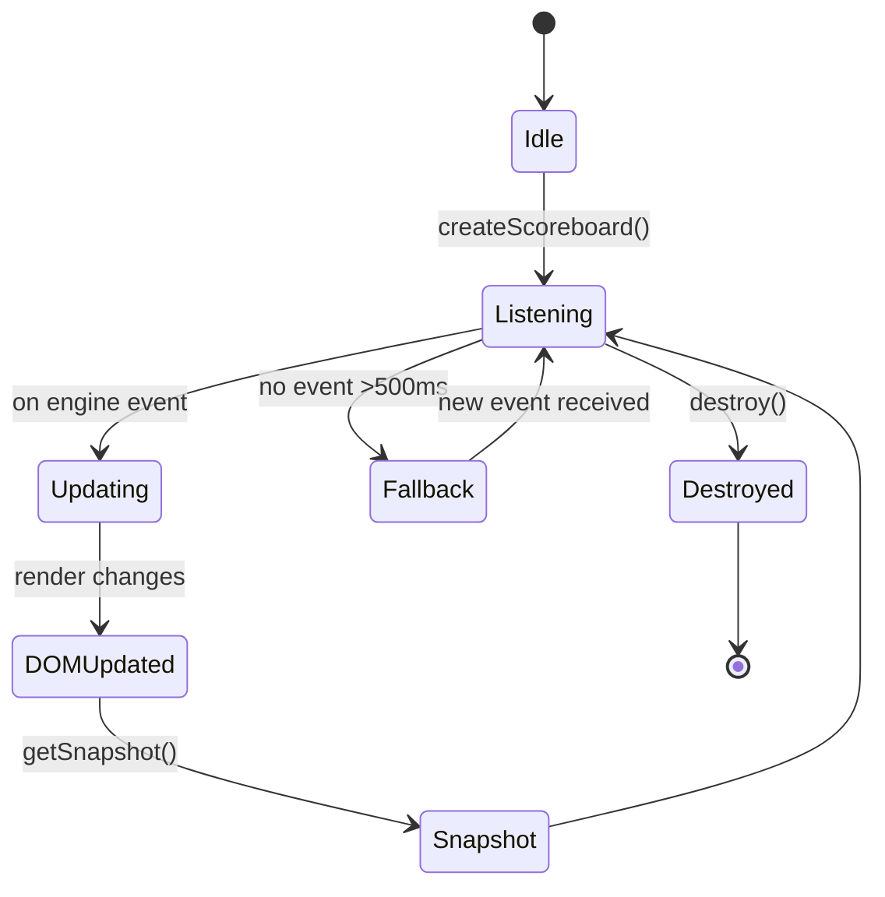

# PRD: Battle Scoreboard

**Entry Point:** `src/helpers/battleScoreboard.js`
**Used By:** Classic Battle (UI), Battle CLI, Battle Bandit, future modes
**Related Docs:** \[prdBattleEngine.md], \[prdSnackbar.md], \[prdClassicBattle.md], \[prdBattleStateIndicator.md]

---

## 1. Problem Statement

Players often struggle to understand who is winning or what just happened in a battle because the scoreboard looks and behaves differently across modes (Classic, CLI, Bandit). For example, in one mode the “Round Winner” stays visible, but in another it disappears quickly, leaving kids unsure of the result.
This inconsistency makes it harder for players (especially 8–12-year-olds, who rely on clear, persistent cues) to track progress and feel confident in their decisions. It also leads to frustration when switching between battle modes, since the same game information isn’t always shown in the same way.
We need a unified scoreboard that always shows the battle state (rounds, timer, scores, and outcome messages) clearly, consistently, and predictably — so kids can easily follow the action and feel rewarded when they win a round.

---

## 2. TL;DR

The **Battle Scoreboard** is a **mode-agnostic, UI-only reflector** of persistent battle information.
It communicates **only with the Battle Engine/Orchestrator**, not with any other UI elements or the main battle area.
Its role is to present **engine-derived state** in a reusable, consistent way across different battle modes.

Styling and layout may differ per mode (via CSS themes), but the **structure, attributes, and behaviour remain identical**.

---

## 3. Goals

1. Independence from main battle area and UI components.
2. Reusability across Classic, CLI, Bandit, and future battle modes.
3. Consistent data attributes and DOM structure for styling and testing.
4. Deterministic updates, driven only by Battle Engine events.
5. Accessibility compliance (screen readers, reduced motion).
6. Clear persistence and fallback behaviour for outcome and status messages.

---

## 4. Scope & Non-Goals

**In Scope**

* Rendering of persistent scoreboard elements:

  * round outcome/status message,
  * stat selection timer,
  * round counter,
  * current match score.
* Outcome/status persistence rules: outcome messages remain until replaced by a new engine event; transient prompts are excluded.
* Fallback “Waiting…” message if no valid state/event is received within 500ms.
* Consumption of canonical events from the Battle Engine/Orchestrator.
* Exposure of a stable DOM structure with `data-scoreboard-*` attributes.
* Theming/styling handled purely through CSS, not logic.
* Accessibility: live regions, reduced motion compliance.

**Out of Scope**

* Transient prompts (e.g., “Choose a stat”, “Opponent is choosing”). These belong to Snackbar and must not be duplicated in the scoreboard.
* Awareness of game area, judoka cards, or animations.
* Business logic (scoring, stat comparison, win conditions).
* CSS styling rules (themes only override visuals).

---

## 5. Responsibilities & Boundaries

The scoreboard is an **information presentation function**.
It does not emit control events or infer logic.
Its only boundary is **receiving domain/control events from the engine** and rendering them for the player.
The scoreboard must remain usable in **any battle mode** without code modification.

---

## 6. Public API

| Name                     | Signature                                              | Purpose                                                    |
| ------------------------ | ------------------------------------------------------ | ---------------------------------------------------------- |
| **createScoreboard**     | `(container?: HTMLElement) -> HTMLElement`             | Create scoreboard DOM elements and append to container.    |
| **update**               | `(event: BattleEngineEvent) -> void`                   | React to Battle Engine events and update scoreboard state. |
| **getSnapshot**          | `() -> ScoreboardState`                                | Return current state (round, score, timer, status).        |
| **destroy**              | `() -> void`                                           | Remove event listeners, DOM cleanup.                       |
| **initScoreboard**       | `() -> void`                                           | Initialize internal state.                                 |
| **showMessage**          | `(text: string) -> void`                               | Force update scoreboard message (overrides).               |
| **clearMessage**         | `() -> void`                                           | Remove any message.                                        |
| **showTemporaryMessage** | `(text: string, duration: number) -> void`             | Show temporary message and revert.                         |
| **updateTimer**          | `(secondsRemaining: number) -> void`                   | Update timer UI.                                           |
| **clearTimer**           | `() -> void`                                           | Hide timer.                                                |
| **updateRoundCounter**   | `(round: number) -> void`                              | Update round number.                                       |
| **updateScore**          | `(playerScore: number, opponentScore: number) -> void` | Update scoreboard scores.                                  |

---

## 7. Event Handling

**Event Types Consumed:**

* `engine.round.started`
* `engine.round.completed`
* `engine.match.completed`
* `engine.timer.tick`
* `display.round.message`
* `display.timer.show`
* `display.readiness.update`

**Event Guarantees:**

* Events are **idempotent**.
* Delivered in **strict order**.
* Scoreboard should not rely on UI-specific dispatch chains.

---

## 8. State Model

The scoreboard maintains an immutable internal `ScoreboardState`:

```ts
interface ScoreboardState {
  roundNumber: number;
  timer: number | null;
  playerScore: number;
  opponentScore: number;
  statusMessage: string;
  outcomeMessage?: string;
}
```

**Message Precedence:**

1. Outcome message (if present)
2. Engine round messages
3. "Waiting..." fallback

---

## 9. Reusability & Theming

* DOM structure is stable and identical across all modes.
* Mode variations are achieved via **CSS themes**, applied to the scoreboard root element.
* All DOM nodes include `data-scoreboard-*` attributes for styling and test selectors.
* No branching logic for different modes.

---

## 10. Canonical DOM Structure

```html
<div class="scoreboard" data-scoreboard-root>
  <div class="scoreboard__round" data-scoreboard-round>
    Round <span data-scoreboard-round-number>1</span>
  </div>

  <div class="scoreboard__status" 
       role="status" aria-live="polite" aria-atomic="true"
       data-scoreboard-status>
    Waiting...
  </div>

  <div class="scoreboard__timer" data-scoreboard-timer>
    <span data-scoreboard-timer-value>30</span>s
  </div>

  <div class="scoreboard__score" data-scoreboard-score>
    <span class="scoreboard__score-player" data-scoreboard-player-score>0</span>
    –
    <span class="scoreboard__score-opponent" data-scoreboard-opponent-score>0</span>
  </div>
</div>
```

**Notes:**

* Root always includes `data-scoreboard-root`.
* Each section has its own `data-scoreboard-*` attribute.
* CLI variant renders same structure in plain text.

---

## 11. Accessibility

* Uses ARIA live regions (`aria-live="polite"`, `aria-atomic="true"`).
* Announcements must occur within 500ms of event receipt.
* Respects reduced motion system preferences.
* CLI mode must mirror visual output.

---

## 12. Behavioral Specifications

* **Outcome messages override all others.**
* **"Waiting..." fallback appears** if no update is received within 500ms.
* Timer must **tick once per second**, with a drift of ≤100ms.
* Timer and score updates **must complete animations within 500ms**, and persist for ≥1s.
* Score updates are announced **if different** from previous snapshot.

---

## 13. Testing & Determinism

* `getSnapshot()` exposes internal state for testing.
* Integration tests use mocked events, no visual rendering.
* Verify message precedence and timer behavior under delay.

---

## 14. Dependencies

* Battle Engine/Orchestrator event stream.
* CSS themes.
* No awareness of other UI or battle systems.

---

## 15. Lifecycle Diagram



---

## 16. Acceptance Criteria

AC1 – Independence from Main Game Area
Given the player is in any battle mode
When the scoreboard is displayed
Then it should show round, timer, scores, and messages without depending on other UI components.

AC2 – Consistency Across Modes
Given the player switches between Classic, Bandit, or CLI mode
When the scoreboard is shown
Then the structure and information should be identical, with only visual style changing.

AC3 – Event-Driven Updates
Given the battle engine sends a new event (e.g., round completed)
When the scoreboard receives it
Then the scoreboard should update only from that event and not from unrelated UI actions.

AC4 – Outcome/Status Persistence
Given a round has ended with an outcome (e.g., Player Wins)
When no new engine events have arrived
Then the scoreboard should keep showing the outcome until the next event replaces it.

AC5 – Fallback Message
Given no valid event is received for 500ms
When the scoreboard is idle
Then it should show a “Waiting…” message so the player is never left confused.

AC6 – Performance & Responsiveness
Given the player is watching the scoreboard update
When a round ends and scores change
Then the scoreboard should update within 200ms, animations should finish within 500ms, and the timer should tick every second with no more than 100ms drift.

AC7 – Accessibility & Comprehension
Given a player is using a screen reader or reduced motion setting
When the scoreboard updates
Then it should announce the change within 500ms and respect reduced-motion preferences.

AC8 – Testability & Determinism
Given a developer runs integration tests with mocked events
When getSnapshot() is called
Then the scoreboard should return a deterministic state that matches what the player sees.

AC9 – Edge Cases
Given the battle engine sends an invalid or duplicate event
When the scoreboard processes it
Then the scoreboard should ignore it and keep showing the last valid state.

---

## 17. Functional Requirements (Prioritized)

| Priority | Feature                  | Description                                                         |
| -------- | ------------------------ | ------------------------------------------------------------------- |
| P1       | Scoreboard DOM Structure | Generate stable DOM with `data-scoreboard-*` selectors              |
| P1       | Event-Driven Updates     | Only update on engine events; 500ms fallback                        |
| P1       | Accessibility Compliance | Live regions, screen reader support, reduced motion                 |
| P2       | Snapshot API             | `getSnapshot()` for deterministic state inspection                  |
| P2       | CSS Theming              | Allow external themes to visually differentiate scoreboard per mode |
| P3       | CLI Compatibility        | Render scoreboard in plain text format with identical structure     |

---

## 18. Open Decisions

* Should win/loss messages use different colors or icons?
* Should the scoreboard announce player readiness, or defer to Snackbar?
* Should we display draw outcomes differently in score format?

---

## Tasks

- [ ] 1.0 Implement Scoreboard Creation
  - [ ] 1.1 Define `createScoreboard(container)` to create and append DOM nodes
  - [ ] 1.2 Ensure DOM structure matches canonical layout with proper `data-scoreboard-*` attributes
  - [ ] 1.3 Apply CSS themes for mode-specific visuals

- [ ] 2.0 Implement Event-Driven Updates
  - [ ] 2.1 Define `update(event)` to handle specific engine events
  - [ ] 2.2 Implement outcome persistence until next event
  - [ ] 2.3 Add fallback "Waiting..." message after 500ms of silence
  - [ ] 2.4 Enforce no updates outside of engine event triggers

- [ ] 3.0 Add Accessibility Support
  - [ ] 3.1 Add ARIA live regions for status and score
  - [ ] 3.2 Implement reduced motion respect for animations
  - [ ] 3.3 Ensure CLI output renders an equivalent text representation

- [ ] 4.0 Implement State Snapshotting
  - [ ] 4.1 Implement `getSnapshot()` to return current scoreboard state
  - [ ] 4.2 Ensure returned state is serializable and test-friendly

- [ ] 5.0 Lifecycle & Cleanup
  - [ ] 5.1 Implement `destroy()` to remove DOM nodes and event listeners
  - [ ] 5.2 Validate against double-destroy or destroy-before-create edge cases
