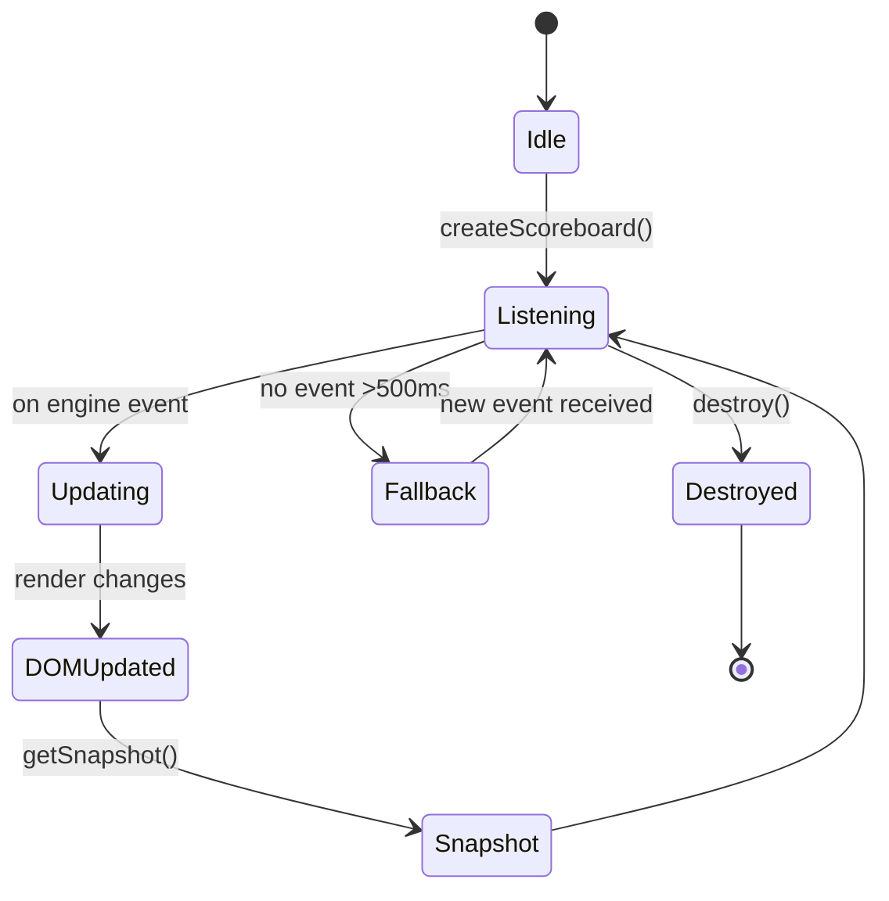

# PRD: Battle Scoreboard

**Entry Point:** `src/helpers/battleScoreboard.js`
**Used By:** Classic Battle (UI), Battle CLI, Battle Bandit, future modes
**Related Docs:** \[prdBattleEngine.md], \[prdSnackbar.md]

---

## 1. TL;DR

The **Battle Scoreboard** is a **mode-agnostic, UI-only reflector** of persistent battle information.
It communicates **only with the Battle Engine/Orchestrator**, not with any other UI elements or the main battle area.
Its role is to present **engine-derived state** in a reusable, consistent way across different battle modes.

Styling and layout may differ per mode (via CSS themes), but the **structure, attributes, and behaviour remain identical**.

---

## 2. Goals

1. Independence from main battle area and UI components.
2. Reusability across Classic, CLI, Bandit, and future battle modes.
3. Consistent data attributes and DOM structure for styling and testing.
4. Deterministic updates, driven only by Battle Engine events.
5. Accessibility compliance (screen readers, reduced motion).
6. Clear persistence and fallback behaviour for outcome and status messages.

---

## 3. Scope & Non-Goals

**In Scope**

* Rendering of persistent scoreboard elements:

  * round outcome/status message,
  * stat selection timer,
  * round counter,
  * current match score.
* Outcome/status persistence rules: outcome messages remain until replaced by a new engine event; transient prompts are excluded.
* Fallback “Waiting…” message if no valid state/event is received within 500ms.
* Consumption of canonical events from the Battle Engine/Orchestrator.
* Exposure of a stable DOM structure with `data-scoreboard-*` attributes.
* Theming/styling handled purely through CSS, not logic.
* Accessibility: live regions, reduced motion compliance.

**Out of Scope**

* Transient prompts (e.g., “Choose a stat”, “Opponent is choosing”). These belong to Snackbar and must not be duplicated in the scoreboard.
* Awareness of game area, judoka cards, or animations.
* Business logic (scoring, stat comparison, win conditions).
* CSS styling rules (themes only override visuals).

---

## 4. Responsibilities & Boundaries

The scoreboard is an **information presentation function**.
It does not emit control events or infer logic.
Its only boundary is **receiving domain/control events from the engine** and rendering them for the player.
The scoreboard must remain usable in **any battle mode** without code modification.

---

## 5. Public API

| Name                 | Signature                                  | Purpose                                                                       |
| -------------------- | ------------------------------------------ | ----------------------------------------------------------------------------- |
| **createScoreboard** | `(container?: HTMLElement) -> HTMLElement` | Create scoreboard DOM elements and append to container. Returns root element. |
| **update**           | `(event: BattleEngineEvent) -> void`       | React to Battle Engine events and update relevant scoreboard sections.        |
| **getSnapshot**      | `() -> ScoreboardState`                    | Return current scoreboard state (round, score, status message, timer).        |
| **destroy**          | `() -> void`                               | Clean up event listeners and DOM nodes.                                       |

---

## 6. Event Handling

The scoreboard consumes only **canonical engine events**, for example:

* `engine.round.started({ roundNumber })`
* `engine.timer.tick({ secondsRemaining })`
* `engine.round.completed({ outcome, scores })`
* `engine.match.completed({ winner })`

**Persistence rules**

* Outcome messages (`round.completed`) persist until replaced by a new engine event.
* Fallback “Waiting…” state is displayed if no event is received for 500ms+.
* Status messages (e.g., “Round 2 started”) overwrite the previous message immediately.

No scoreboard update should occur outside of an engine event.

---

## 7. Reusability & Theming

* DOM structure is stable and identical across all modes.
* Mode variations are achieved via **CSS themes**, applied to the scoreboard root element.
* All DOM nodes include `data-scoreboard-*` attributes for styling and test selectors.
* No branching logic for different modes.

---

## 8. Canonical DOM Structure

  

    Round 1
  

  

    Waiting...
  

  

    30s
  

  

    0
    –
    0
  

**Notes**

* Root always includes `data-scoreboard-root`.
* Each section has its own `data-scoreboard-*` attribute for stable selectors.
* CLI variant renders the same structure as plain text.

---

## 9. Accessibility

* ARIA live regions used for score and status updates (`aria-atomic="true"`).
* Announcements must occur within 500ms of event receipt.
* Reduced motion preference respected for score animations.
* CLI variant must provide equivalent plain-text output.

---

## 10. Testing & Determinism

* `getSnapshot()` provides deterministic state for integration tests.
* Tests validate scoreboard independence by mocking engine events without rendering other UI.
* Persistence behaviour tested by simulating delayed events and verifying fallback to “Waiting…”.

---

## 11. Dependencies

* Battle Engine/Orchestrator event stream.
* CSS themes for mode-specific styling.
* No other dependencies.

---

## 12. Lifecycle Diagram

---

## 13. Acceptance Criteria

| ID  | Requirement                      | Acceptance Criteria                                                                                          |
| --- | -------------------------------- | ------------------------------------------------------------------------------------------------------------ |
| AC1 | Independence from main game area | Scoreboard functions correctly with only engine events, no references to battle area DOM or other UI.        |
| AC2 | Consistency across modes         | DOM structure identical across Classic, CLI, Bandit; differences achieved only via CSS themes.               |
| AC3 | Event-driven updates             | Scoreboard only updates in response to Battle Engine events, never from direct UI calls.                     |
| AC4 | Outcome/status persistence       | Outcome messages persist until replaced; fallback “Waiting…” appears if no event for >500ms.                 |
| AC5 | Performance and timing           | Score updates within 200ms; timer ticks at 1Hz with ≤100ms drift; animations complete ≤500ms, persist ≥1s.   |
| AC6 | Accessibility                    | Live regions update within 500ms; ARIA compliance verified; reduced motion respected.                        |
| AC7 | Testability                      | `getSnapshot()` returns a deterministic state; integration tests validate updates with mocked engine events. |
| AC8 | Reusability                      | `createScoreboard()` and `destroy()` can be called in isolation; no mode-specific branching in logic.        |
