# PRD: Battle Scoreboard

**Entry Point:** `src/helpers/battleScoreboard.js`
**Used By:** Classic Battle (UI), Battle CLI, Battle Bandit, future modes
**Related Docs:** \[prdBattleEngine.md], \[prdSnackbar.md], \[prdBattleStateIndicator.md — Battle State Progress]

---

## 1. Problem Statement

Battle modes previously suffered from inconsistent or tightly coupled scoreboard implementations.
Players were often confused by **transient prompts overlapping persistent status displays**, or misreading score changes due to animation delays.

The scoreboard resolves this by **cleanly separating persistent battle state (scores, round outcomes, timers)** from **transient prompts** (Snackbar responsibility). A unified, mode-agnostic scoreboard is required to reflect battle state in a consistent, deterministic manner, decoupled from the rest of the game UI.

---

## 2. TL;DR

The **Battle Scoreboard** is a **UI-only reflector** of persistent battle information.

- It consumes events from the **Battle Engine/Orchestrator** event bus.
- It does **not** contain any business logic.
- It renders only **engine-derived state** and persists outcome/score until the next authoritative state transition.
- Styling and layout may differ by mode (via CSS themes), but structure and behavior remain identical.

---

## 3. Goals

1. Independence from the main battle area and transient UI components.
2. Reusability across Classic, CLI, Bandit, and future battle modes.
3. Strict alignment to the **canonical event catalog** defined in \[prdBattleEngine.md].
4. Deterministic, idempotent updates suitable for automated and AI-driven matches.
5. Accessibility and reduced-motion compliance.
6. Numeric UX thresholds:
   - Score animation completes within ≤500 ms and persists ≥1 s.
   - Stat selection timer visible within ≤200 ms of event.
   - Fallback “Waiting…” state visible within ≤500 ms if no state arrives.

---

## 4. Non-Goals

- Transient prompts (e.g. _“Opponent is choosing…”_) — handled by **Snackbar**.
- Game/business logic such as stat comparison or round winner calculation.
- Readiness handshakes — handled by Snackbar or control panels.
- Cooldown visuals (unless explicitly added later).

---

## 5. Event Catalog (Consumed)

The scoreboard listens **only** to the canonical events from the Battle Engine/Orchestrator:

| Event                                                          | Purpose                        | Notes                              |
| -------------------------------------------------------------- | ------------------------------ | ---------------------------------- |
| `control.state.changed({ from, to, context, catalogVersion })` | Authoritative state transition | Drives visibility and reset rules. |
| `round.started({ roundIndex })`                                | New round begins               | Updates round index.               |
| `round.timer.tick({ remainingMs })`                            | Selection timer countdown      | Updates visible timer.             |
| `round.evaluated({ outcome, scores })`                         | Round result                   | Updates outcome + scores.          |
| `match.concluded({ scores })`                                  | Final result                   | Locks scoreboard.                  |

---

## 6. Authority Rules

- **All visual transitions** are keyed off `control.state.changed`.
- Domain/timer events update values but **do not** drive transitions.
- Outcomes persist until the next `control.state.changed` to `roundSelect` or `roundWait`.
- Duplicate or out-of-order events are ignored (idempotency guard).

### 6a. Event Authority & Propagation Flow

The following diagram illustrates the multi-actor event propagation chain and highlights the authority boundary between authoritative state transitions (solid arrows) and value-only updates (dashed arrows). This clarifies how the Orchestrator acts as a bridge between the Engine Core and the Scoreboard UI, ensuring deterministic state management and strict separation of concerns.

```mermaid
%%{init: {'theme': 'default', 'flowchart': {'htmlLabels': true, 'curve': 'basis'}}}%%
sequenceDiagram
    participant Engine as Engine Core<br/>(Deterministic Logic)
    participant Orch as Orchestrator<br/>(FSM Authority)
    participant UI as Scoreboard<br/>(UI Reflector)
    participant Player as Player/CLI

    Note over Engine,UI: ⭐ Authority Boundary: Only control.state.changed drives state transitions
    Note over Engine,UI: Legend: authoritative = state transition (->>) | value-only = no transition (-->>)

    Player->>UI: Mounts scoreboard
    Note right of UI: Fallback: "Waiting…" (500ms timeout)
    UI->>Orch: Subscribe to canonical events

    loop Round Lifecycle
        Engine->>Orch: roundStarted({roundIndex})
        Orch->>Orch: Map to FSM state context
        Orch->>UI: control.state.changed(to: "roundSelect")<br/>⭐ AUTHORITATIVE<br/>—drives state transition
        UI->>UI: Reset outcome area,<br/>show round index

        rect rgb(200, 230, 201)
            Note over Engine,UI: Value-only updates (idempotent, non-driving)
            Engine-->>UI: round.timer.tick({remainingMs})<br/>—value-only (non-driving)
            UI->>UI: Update timer display<br/>(no state transition)
            Engine-->>UI: round.timer.tick({remainingMs})<br/>—ignored if duplicate
            UI->>UI: (idempotency: same roundIndex)
        end

        Player->>Orch: Select stat
        Orch->>Engine: (command)
        Engine->>Orch: roundEnded({outcome, scores})
        Orch->>UI: control.state.changed(to: "roundResolve")<br/>⭐ AUTHORITATIVE
        Orch->>UI: control.state.changed(to: "roundDisplay")<br/>⭐ AUTHORITATIVE
        Orch->>UI: control.state.changed(to: "matchEvaluate")<br/>⭐ AUTHORITATIVE
        UI->>UI: Hold previous outcome display

        Engine-->>UI: round.evaluated({outcome, scores})<br/>—value-only
        UI->>UI: Update scores + outcome,<br/>animate display

        alt Continue match
            Orch->>UI: control.state.changed(to: "roundWait")<br/>⭐ AUTHORITATIVE
        else Match reaches win target
            Orch->>UI: control.state.changed(to: "matchDecision")<br/>⭐ AUTHORITATIVE
            Orch->>UI: control.state.changed(to: "matchOver")<br/>⭐ AUTHORITATIVE
        end

        Note right of UI: Outcome persists until next<br/>control.state.changed
    end

    alt Match Concluded
        Engine-->>UI: match.concluded({scores})<br/>—value-only
        UI->>UI: Lock scoreboard,<br/>display final scores
    end

    Player->>UI: Unmounts
    UI->>UI: Destroy, unsubscribe
```



**Diagram Rationale:** This sequenceDiagram clarifies the three-hop event propagation (Engine → Orchestrator → Scoreboard) and visually encodes the authority boundary through arrow styles: solid arrows for state-driving events (`control.state.changed`), dashed arrows for value-only events (domain/timer). The diagram shows identity-based stale guarding (`sequence`, `roundIndex`, `matchToken`), fallback timeout behavior, and outcome persistence rules. This eliminates ambiguity around which events trigger state transitions versus which merely update display values.

**Test Coverage**: Verified by: [tests/helpers/battleScoreboard.event-sequences.test.js](tests/helpers/battleScoreboard.event-sequences.test.js) — validates event propagation order and state transitions; [tests/components/Scoreboard.idempotency.test.js](tests/components/Scoreboard.idempotency.test.js) — tests fallback timeout and persistence rules

### 6b. Idempotency Guard Algorithm

The following flowchart details the decision logic that Scoreboard uses to guard against stale and out-of-order events. This is critical for deterministic test execution and AI-driven match simulations.


**Diagram Rationale:** This flowchart makes explicit the implemented stale-check ordering from `isStaleAgainstAuthority`: (1) sequence precedence, (2) roundIndex comparison, then (3) the matchToken mismatch edge case when sequence/roundIndex are absent. It also keeps `control.state.changed` as the sole authoritative state-transition source (`updateControlAuthority`). By visualizing these decision points with color coding (green for updates, red for ignores), the diagram ensures that downstream AI agents, developers, and test frameworks can reliably reason about event processing order and identity-based stale rejection. For maintainability, treat `extractRoundIdentity` and `isStaleAgainstAuthority` as the single source of truth for guard semantics.

**Test Coverage**: Verified by: [tests/helpers/battleScoreboard.idempotency.test.js](tests/helpers/battleScoreboard.idempotency.test.js) — validates stale-check ordering and idempotency guards against duplicate/out-of-order events; [tests/components/Scoreboard.test.js](tests/components/Scoreboard.test.js) — tests state transitions and value-only update paths

---

## 7. State Model

```ts
{
  roundIndex: number,
  timerRemainingMs: number | null,
  scores: { player: number, opponent: number },
  outcome: "playerWin" | "opponentWin" | "draw" | null,
  state: string,            // echo of control.state.changed.to
  catalogVersion: string
}
```

**DOM Contract:**

- Outcome is exposed via `data-outcome` attribute on the root scoreboard element.
- Values: `"playerWin"`, `"opponentWin"`, `"draw"`, or `"none"`.
- This supports deterministic UI testing.

---

## 8. Public API

- **create(container?: HTMLElement) → HTMLElement**
  Creates scoreboard DOM, subscribes to engine events.

- **destroy()**
  Unsubscribes, clears DOM, resets state.

- **getSnapshot() → StateModel**
  Returns the current internal state (for tests/debugging).

### DOM Integration & Usage

The scoreboard module exposes DOM helpers that guarantee a consistent element
structure across battle modes:

```js
import {
  createScoreboard,
  initScoreboard,
  resetScoreboard,
  Scoreboard
} from "../src/components/Scoreboard.js";

const container = createScoreboard();
document.body.appendChild(container);

resetScoreboard();
initScoreboard(container);
```

- `createScoreboard()` returns a ready-to-append container that already
  includes the required round message, timer, round counter, and score nodes.
- `initScoreboard(rootEl)` wires the singleton scoreboard instance to the DOM
  and subscribes it to the canonical battle events.
- `resetScoreboard()` **must** be called before re-initialising the default
  instance in tests or hot-module scenarios so that stale listeners and DOM
  references are cleared deterministically.

When constructing custom harnesses, the `Scoreboard` class can be instantiated
directly for advanced control:

```js
const scoreboard = new Scoreboard({
  messageEl: container.querySelector("#round-message"),
  timerEl: container.querySelector("#next-round-timer"),
  roundCounterEl: container.querySelector("#round-counter"),
  scoreEl: container.querySelector("#score-display")
});

scoreboard.showMessage("Ready!");
scoreboard.updateScore(1, 0);
```

Both helper flows reuse the same DOM nodes so that transient UI (snackbars)
and persistent state (scoreboard) remain isolated but coordinated.

---

## 9. Lifecycle & Idempotency

- Multiple `create()` calls return the same instance.
- `destroy()` unsubscribes from all topics and nulls state.
- Out-of-order events (older `roundIndex`) are ignored.
- Stale events are ignored using authority identity checks (`sequence`, then `roundIndex`, then `matchToken` edge case).
- **Fallback behaviour:**
  - If no `control.state.changed` event is received within 500 ms of mount, display “Waiting…” until the first state arrives.

---

## 10. Performance & Accessibility

- Updates must commit within 16 ms (60 fps budget).
- Animation duration ≤ 500 ms; disable via `prefers-reduced-motion`.
- Timer drift ≤ 100 ms per 10 seconds (driven only by engine ticks).
- Live region announcements triggered only on outcome or state change (not every tick).

---

## 11. Acceptance Criteria (Gherkin)

Feature: Scoreboard updates from engine events

Background:
Given a running match
And the scoreboard is bound to the engine event bus

Scenario: Round start updates round index
When the engine emits "round.started" with roundIndex 3
Then the scoreboard shows round 3
And the outcome area is cleared

Scenario: Selection timer ticks
Given the state is "roundSelect"
When the engine emits "round.timer.tick" with remainingMs 5000
Then the scoreboard shows "00:05"

Scenario: Outcome persists until next roundSelect/roundWait transition
When the engine emits "round.evaluated" with outcome "playerWin" and scores { player: 4, opponent: 2 }
Then the scoreboard shows "You win" and 4–2
And it remains until the next "control.state.changed" to "roundSelect" or "roundWait"

Scenario: Match concluded freezes scoreboard
When the engine emits "match.concluded" with scores { player: 10, opponent: 7 }
Then the scoreboard locks with final scores 10–7
And no further timer updates are rendered

Scenario: Ignore duplicate round events
Given the scoreboard already shows roundIndex 5
When the engine emits "round.started" with roundIndex 5
Then the scoreboard does not re-render

Scenario: Fallback waiting state
Given the scoreboard has just been created
When no "control.state.changed" event is received within 500 ms
Then the scoreboard shows "Waiting…"
And it is cleared on the next state change

---

## 12. Risks & Open Questions

- Should cooldown timers ever be displayed here, or always via Snackbar?
- Do we need a lightweight adapter event (`scoreboard.update`) to simplify UI wiring?
- Should we version-lock `catalogVersion` at binding time and throw if mismatched?

---

Would you like me to now do the **same reconciliation pass for the Battle Engine PRD** — i.e. check what detail from the original was lost when I aligned it, and merge back any important omissions?

## Mockups


