# PRD: Battle State Progress

**Entry Points:** Classic wrapper `src/helpers/battleStateProgress.js`; shared indicator utility `src/helpers/battleStateIndicator.js`
**Used By:** Classic Battle (UI + CLI)
**Authoritative Source of Truth:** \[prdBattleEngine.md] — FSM, events, and state catalog

---

## 1. TL;DR

> Terminology note: Previously called “Battle State Indicator”. All UI copy, tooltips, and documentation now use **Battle State Progress** to reflect the same feature.

The **Battle State Progress** experience is a **UI-only reflector** of the Battle Engine/Orchestrator finite-state machine (FSM).
It renders a horizontal list of FSM states and exposes an ARIA live announcer for accessibility.

The component provides **real-time visual and screen-reader feedback** about the current battle phase, ensuring players can track gameplay progress across all supported interfaces. It holds **no business logic** and **does not infer** or remap states.

**Consumes exactly one canonical event stream:**
`control.state.changed({ from, to, context, catalogVersion })`

---

## 2. Scope & Non-Goals

**In scope:**

- Render a stable, ordered list of FSM states supplied by the engine/orchestrator.
- Highlight the active state.
- Announce the active state via a screen-reader live region.
- Expose a headless query (`getActiveState()`) for tests.

**Out of scope:**

- State normalization or mapping (interrupts, labels, IDs).
- Cooldown timers, readiness handshakes, or scoring logic.
- Scoreboard behavior or UI (see `prdBattleScoreboard.md`).

---

## 3. Explicit Goals

- Reflect all FSM transitions with visual and ARIA updates within **2ms** of receiving `control.state.changed`.
- Render all states from `catalog.display.include` in order within **10ms** on initialization.
- Provide 100% parity between the visual indicator and the last received FSM state (`getActiveState()` match).
- Ensure that the announcer always reflects the **raw FSM state**, including unknown states.
- Fail gracefully (return `{ isReady: false }`) in **non-browser or SSR environments**.

---

## 4. Dependencies & Contracts

### 4.1 Event Contract

**Event name:** `control.state.changed`
**Payload structure:**

- `from`: FSMStateName
- `to`: FSMStateName
- `context`:
  - `roundIndex`: number
  - `scores`: { p1: number; p2: number }
  - `seed`: string
  - `timerState?`: { phase: "round" | "cooldown"; remainingMs: number }

- `catalogVersion`: string
- `debug?`: { transition: { trigger: string } }

**Source:** Emitted by the Orchestrator after each FSM transition.

### 4.2 State Catalog Contract

Provided at init via `getCatalog()` or sticky event `control.state.catalog`.

**Structure:**

- `version`: "v1"
- `order`: FSMStateName\[]
- `ids`: Record\<FSMStateName, number>
- `labels?`: Record\<FSMStateName, string>
- `display`: { include: FSMStateName\[] }

---

## 5. Public API

`createBattleStateIndicator(config): Promise<{ cleanup, isReady, getActiveState }>`

**Config parameters:**

- `featureFlag?`: boolean
- `mount`: HTMLElement or selector string
- `announcer`: HTMLElement or selector string
- `events`: { on, off } — event bus bindings
- `getCatalog`: function returning a Promise<StateCatalog>

**Returns:**

- `cleanup()`: removes all listeners
- `isReady`: boolean, set after catalog + paint
- `getActiveState()`: returns FSMStateName or null

---

## 6. Rendering Rules

**Root structure:**
Classic markup provides:

```html
<section class="battle-state-progress-wrapper" data-feature-battle-state-progress="wrapper">
  <ul
    id="battle-state-progress"
    class="battle-state-progress"
    data-feature-battle-state-progress="list"
    role="status"
    aria-live="polite"
    aria-atomic="true"
    aria-label="Battle state progress timeline"
  ></ul>
</section>
```

- `<li>` nodes render for each state in `catalog.display.include`.
- Wrapper remains hidden when the feature flag is disabled.

**Each `<li>` should have:**

- `data-state-raw="<name>"`
- `data-state-id="<number>"`
- (optional) `data-state-label="<label>"`
- Active item: `.active` and `aria-current="step"`

**Announcer region (CLI + shared component):**

`<p id="battle-state-announcer" data-flag="battleStateAnnouncer" aria-live="polite" aria-atomic="true">State: <name></p>`

- Classic Battle relies on the existing announcer embedded in the HUD.
- CLI mounts the announcer next to the indicator timeline.

**Unknown states (shared component):**

- Do not create `<li>`.
- Still update announcer text with the raw state.
- Add `data-unknown="true"` to the root element for downstream tooling.

---

## 6.5 State Progress Update Flow

**Event Reception → DOM Update Pipeline**:

```mermaid
graph LR
    A["📨 control.state.changed<br/>{ from, to, catalogVersion }"] -->|Extract state| B["🔍 Catalog check<br/>Version matches?"]
    B -->|No| C["♻️ Reload catalog<br/>via getCatalog()"]
    B -->|Yes| D["📍 Find 'to' state<br/>in catalog"]
    C --> D
    D -->|Found| E["🎨 DOM Update<br/>Remove .active"]
    D -->|Unknown| F["⚠️ Log unknown state<br/>Set data-unknown"]
    E --> G["✨ Highlight new state<br/>Add .active class"]
    G --> H["📢 Update announcer<br/>aria-live region"]
    F --> H
    H --> I["✅ Complete<br/>getActiveState = 'to'"]
    style A fill:#lightgreen
    style I fill:#lightcyan
    style F fill:#lightsalmon
    style H fill:#lightblue
```



**Initialization Sequence**:


**State Query API**:

- `getActiveState()` → Returns FSMStateName (string) or null
- Guaranteed parity with last received `control.state.changed` event
- Used in tests for assertions (`expect(getActiveState()).toBe("cooldown")`)

---


- On init: fetch catalog, render ordered list, no state selected by default
- On `control.state.changed`:
  - Highlight the `to` state
  - Update announcer with raw state
  - Reload catalog if `catalogVersion` differs

- If `featureFlag` is false: return stub object, do nothing
- If SSR or no DOM: return `{ isReady: false }`

---

## 8. Accessibility

- Announcer text always equals raw FSM state
- Only active `<li>` has `aria-current="step"`
- Supports `prefers-reduced-motion`
- No keyboard focus management (non-interactive)

---

## 9. Design and UX Considerations

- Visual style should match the CLI’s terminal look (historically retro-themed) without depending on a globally selectable Retro mode
- No shadows or animations; align with CLI aesthetic
- Announcer should be invisible visually but fully screen-reader compatible
- Layout should allow horizontal scrolling if too many states

---

## 10. Non-Functional Requirements

- **Performance:** Init ≤10ms, updates ≤2ms
- **Reliability:** Safe handling of unknown states
- **Memory:** Cleanup must release listener references
- **Determinism:** Always reflects most recent `control.state.changed`
- **Testability:** `getActiveState()` must return current FSM state

---

## 11. Acceptance Criteria (Gherkin)

**Feature:** Battle State Progress

**Background:**
Given the orchestrator provides a StateCatalog version "v1"
And the UI subscribes to "control.state.changed"

**Scenario: Initial render**
When the progress component initializes
Then it renders `<li>` items in catalog.display.include order
And no item is active until a state change arrives

**Scenario: State change reflection**
Given the indicator is initialized
When control.state.changed => { from: "matchInit", to: "cooldown" }
Then `<li data-state-raw="cooldown">` is active with `aria-current="step"`
And announcer text is "State: cooldown"
And `getActiveState()` returns "cooldown"

**Scenario: Catalog version update**
Given the indicator has catalogVersion "v1"
When a change arrives with catalogVersion "v2"
Then the progress component reloads the new catalog

**Scenario: Unknown state**
When control.state.changed => { to: "interruptRound" }
Then announcer says "State: interruptRound"
And root has `data-unknown="true"`

**Scenario: Feature flag off**
Given featureFlag is false
When the indicator initializes
Then `isReady` is false and no DOM rendered

---

## 12. Test Coverage & Verification

**Status Badge**: ✅ **VERIFIED** — Validated against:
- `src/helpers/battleStateProgress.js` — Main indicator implementation
- `src/helpers/battleStateIndicator.js` — Shared indicator utility
- `tests/helpers/battleStateProgress.test.js` — FSM state display tests
- `playwright/battle-classic/state-progress.spec.js` — State transition E2E tests
- Classic battle initialization references in `src/pages/battleClassic.init.js`

**Tested Behaviors**:
- ✅ Catalog fetch and ordered list rendering (<10ms)
- ✅ State change reflection (<2ms update after event)
- ✅ Unknown state handling (data-unknown, announcer parity)
- ✅ Feature flag toggle (stub vs active behavior)
- ✅ Catalog version reload on change
- ✅ Screen reader announcement via aria-live
- ✅ Accessibility parity (no keyboard, aria-current, reduced motion)

**Related Diagrams**:
- [Battle Engine FSM](prdBattleEngine.md#fsm-state-catalog) — State definitions and catalog
- [Battle Event System](prdBattleEventSystem.md) — control.state.changed event contract

---

## 13. Telemetry (Optional)

- `progress.render.ms`
- `progress.update.ms`
- `progress.unknown_state.count`
- `progress.catalog_reload.count`

---

## 13. Migration Notes

- Replace legacy `battleStateChange` with `control.state.changed`
- Remove local ID tables; use `catalog.ids`
- Ensure announcer always reflects raw FSM state (test parity)

---
