# PRD: Browse Judoka

---

**Game Mode ID:** `7` (URL: browseJudoka.html)

Browse Judoka is accessible from the Main Page ([prdHomePageNavigation.md](prdHomePageNavigation.md)), Navigation Bar ([prdNavigationBar.md](prdNavigationBar.md)), or Navigation Map ([prdNavigationMap.md](prdNavigationMap.md)) and opens a full-screen roster view. Players first see a country filter panel alongside a card carousel.

The carousel relies on the `buildCardCarousel` helper ([prdCardCarousel.md](prdCardCarousel.md)) and filtering uses the Country Flag Picker ([prdCountryPickerFilter.md](prdCountryPickerFilter.md)).

---

## TL;DR

Browse Judoka includes a scrollable, responsive carousel that allows players to view every available judoka card, fostering exploration, strategic team building, and a sense of ownership. This PRD defines how to implement a performant, accessible browsing experience across mobile and desktop.

> Kai hears that a new rare judoka has been added to the game, and excitedly visits the Browse Judoka screen. Swiping through the collection, he sees cards elegantly snap into place. The center card zooms slightly as it comes into focus, making it feel like a physical binder. He starts planning his next team with ease, deepening his connection to the judoka roster.

---

## Problem Statement

Players currently lack a centralized way to view all available judoka, making roster exploration cumbersome — leading to frustration and disengagement.

> _“I want to see all judoka in one place so I don’t waste time hunting for cards.”_ — Player feedback

This problem is especially pressing now as the roster grows, and players want a quick way to plan their team or see which cards are available in the game.

---

## Goals

- Allow players to explore the entire roster in one place.
- Encourage discovery of new judoka to build creative teams.
- Support smooth browsing on devices.
- Increase attachment to favorite fighters through easy access.
- Keep players engaged by making team planning enjoyable.

---

## Non-Goals

- No advanced sorting or search features in this version.
- No judoka editing or management from the browse screen.
- No card acquisition or unlock actions from this view.

---

## User Stories

- As a player interested in building my team, I want to browse all judoka cards quickly so I can plan my roster effectively (**view 10 cards in ≤10 s**).
- As a mobile player, I want the roster to display correctly on my phone so I can explore judoka anywhere.
- As a keyboard-only user, I want to navigate the listed cards using arrow keys so I can browse without a mouse.
- As a visually impaired player, I want focus highlights and alt text so I can browse judoka using assistive technologies.
- As a collector, I want smooth, satisfying animations when scrolling, so I feel excited about exploring my roster.
- As a fan of my national team, I want to filter judoka by country so I can focus on athletes from my homeland.

---

## Functional Requirements

| Priority | Feature                         | Description                                                                                                                                                                                       |
| -------- | ------------------------------- | ------------------------------------------------------------------------------------------------------------------------------------------------------------------------------------------------- |
| **P1**   | Scrollable Card Interface       | Allow players to scroll through the full judoka roster.                                                                                                                                           |
| **P1**   | Stats Data Binding              | Pull stats from `judoka.json` for accurate card display.                                                                                                                                          |
| **P1**   | Responsive Layout               | Adapt card layout across devices (mobile & desktop).                                                                                                                                              |
| **P2**   | Placeholder for Invalid Entries | Show default card if an entry is missing or invalid.                                                                                                                                              |
| **P2**   | Carousel Display of Cards       | Present cards in a swipe/scroll carousel with large "Previous" and "Next" arrow buttons for efficient browsing. (See [PRD: Judoka Card Carousel](prdCardCarousel.md) for carousel requirements.)  |
| **P2**   | Hover/Keyboard Navigation       | Support interactions for accessibility.                                                                                                                                                           |
| **P2**   | Country Filter Disclosure       | Use native `<details>`/`<summary>` semantics for the country filter accordion to gain built-in focus management, keyboard toggling (Enter/Space), and announced state changes for screen readers. |
| **P3**   | Page Markers                    | Show "current page of total" below the carousel with the active page highlighted.                                                                                                                 |

---

## Browse Judoka Workflow

```mermaid
graph TD
    A["🎮 Player selects<br/>Browse Judoka"] -->|Navigate from Menu/Map/Bar| B["📍 Open browseJudoka.html"]
    B --> C["📥 Load judoka.json<br/>(async)"]
    C -->|Success| D["🔍 Display Country<br/>Filter Panel"]
    C -->|Fail| E["❌ Show Error<br/>+ Retry Button"]
    E -->|Retry| C
    E -->|Abandon| Z["Exit to Menu"]
    D --> F{"Data<br/>Empty?"}
    F -->|Yes| G["📭 Show<br/>No cards message"]
    F -->|No| H["🎨 Build Card Carousel<br/>via buildCardCarousel()"]
    H --> I["⬅️➡️ Display Navigation<br/>Arrows + Page Markers"]
    I --> J["👁️ Player Explores"]
    J -->|Swipe/Keyboard/Click| K["📍 Navigate Cards"]
    K --> L["🎯 Center Card<br/>Enlarged +10%"]
    L --> J
    J -->|Select Country| M["🌍 Filter by Country"]
    M --> N["🔄 Update Carousel<br/>with Filtered Data"]
    N -->|Found matches| K
    N -->|No matches| O["📭 Show<br/>No judoka found"]
    O --> J
    J -->|Back/Menu| Z["Exit Browse"]
    style A fill:lightgreen
    style J fill:lightblue
    style Z fill:lightyellow
    style E fill:lightsalmon
    style G fill:lightsalmon
    style O fill:lightsalmon
```



**Flow Annotations:**

- **Entry**: Player navigates to Browse Judoka from main menu, map, or navigation bar
- **Data Loading**: judoka.json fetched asynchronously; retry on failure
- **Country Filter**: Alphabetical country list from judoka roster
- **Carousel Display**: Cards rendered via buildCardCarousel with 1-2 (mobile) or 3-5 (desktop) visible
- **Navigation**: Left/right arrows, swipe, keyboard (arrow keys), or mouse click
- **Filtering**: Country selection filters carousel in real-time
- **Exit**: Back button or menu navigation returns to previous screen

---

## Country Filter Integration Flow

```mermaid
graph LR
    A["🌍 Global<br/>Judoka List<br/>100 cards"] -->|Filter Panel<br/>Displayed| B["📍 Country<br/>Selector"]
    B -->|User selects<br/>country| C["🔍 Extract matching<br/>judoka"]
    C -->|Filter SUCCESS| D["✅ Carousel<br/>Updated<br/>Filtered cards"]
    C -->|No matches| E["📭 Empty state<br/>No judoka found"]
    D -.->|User clears<br/>filter| F["🔄 Reset to<br/>all judoka"]
    F -->|Refilter| A
    E -->|Retry selection| B
    B -->|Escape/Close| G["📊 Show<br/>All cards"]
    style A fill:lightgreen
    style B fill:lightblue
    style D fill:lightgreen
    style E fill:lightsalmon
    style F fill:lightblue
    style G fill:lightgreen
```



**Integration Points:**

- **Filter Entry**: details/summary disclosure opens country picker
- **Data Binding**: Country codes from judoka.json matched against flag assets
- **Real-Time Update**: Carousel carousel refresh on country selection
- **Reset Path**: Clear filter icon or close picker returns to unfiltered state
- **Empty State**: "No judoka found" message when no matches for selected country

---

## Carousel Display: Responsive Card Layout

| Context | Mobile (320-600px) | Desktop (>600px) |
|---------|-------------------|------------------|
| **Cards Visible** | 1-2 cards | 3-5 cards |
| **Center Zoom** | 1.05x (tap focus) | 1.10x (hover/focus) |
| **Snap Behavior** | Touch swipe + center snap | Click next/prev + auto-center |
| **Page Markers** | Below carousel (full width) | Below carousel (centered) |
| **Navigation Arrows** | Swipe-only on mobile | Large Prev/Next buttons |
| **Card Height** | Flex (maintains aspect) | Locked ~400px |
| **Spacing** | 8px gap | 16px gap |
| **Bottom Stack** | Filter above carousel <768px | Filter beside carousel >768px |

**Carousel Specifications:**

```
- Max cards per row: 5 (desktop) / 1 (mobile strict)
- Lazy load images on viewport visibility
- GPU-accelerated translate3d animations <400ms
- Smooth scroll physics with inertia deceleration
- Focus outline: 2px solid, 4:1 contrast ratio
- Touch target: 44px minimum (cards + buttons)
```

---

## Keyboard & Touch Navigation States


**Navigation States:**

- **Ready**: Initial state, awaiting user interaction
- **Browsing**: Carousel active, keyboard/touch navigation available
- **CardFocused**: Individual card in focus, enlargement applied
- **CardSelected**: Card opened (if tap action defined in future)
- **Filtering**: Country picker open, selection mode active
- **FilterApplied**: Carousel updates post-filter, markers reset

---

## Error Handling & Recovery State Machine


**Error Recovery:**

- **Fetch Failures**: Show error + Retry button; reload judoka.json on retry
- **Empty Data**: Display "No cards available" message
- **Filter Empty**: Display "No judoka found for [country]" + option to clear filter
- **Image Failures**: Use default judoka card (id=0) placeholder
- **Flag Asset Failures**: Use generic fallback flag icon, preserve alt text

**Acceptance Criteria:**

- If the judoka list is empty, display a message saying “No cards available.”
- The full list of up to 100 judoka cards loads and is visible quickly.
- On mobile (320px–600px), 1–2 cards are visible at once; on desktop (>600px), 3–5 cards are visible, and layout adapts fluidly on window resize.
- If `judoka.json` contains an invalid or missing card entry, show a default placeholder card instead.
- Scrolling rapidly through the card carousel remains smooth.
- If the network fails to load `judoka.json`, display an error message: “Unable to load roster” and provide a button to retry.
- Using keyboard arrow keys (left/right) moves focus to the previous/next card, and the focused card is visually highlighted and enlarged.
- The Country Flag Picker panel appears below the top bar, is accessible via keyboard and screen reader, and supports closing with Escape.
- Country flags are displayed alphabetically, with alt-text and aria-labels for accessibility.
- If no judoka exist for a selected country, display "No judoka found".
- If a flag asset fails to load, display a fallback flag icon.
- The clear filter icon resets the filter to show all judoka.
- The country picker supports minimum tap target size (44x44px) and color contrast per WCAG 2.1 AA.
- Keyboard navigation and focus outlines are visible for all picker elements.

---

## Edge Cases / Failure States

- If `judoka.json` fails to load, display an error message: “Unable to load roster.”
- If a card image fails, show the default judoka card (judoka id=0).
- On network interruption during data fetch, prompt the user to retry.

---

## Design and UX Considerations

See [PRD: Judoka Card Carousel](prdCardCarousel.md) for carousel-specific animations, responsiveness, and mockups.

- The Country Flag Picker panel appears below the persistent top bar and stacks above the carousel on screens below 768px.
- Picker supports keyboard navigation (Tab/Shift+Tab, Enter/Space, Escape) and screen reader accessibility.
- The picker toggle uses a native `<details>/<summary>` disclosure so semantics, focus management, and keyboard shortcuts follow platform expectations while keeping the custom styling.
- Picker displays only countries present in `judoka.json`. Countries are sorted alphabetically using `localeCompare`, and each flag image includes alt text and an `aria-label` based on the country name.
- Picker provides a clear filter icon to reset selection.
- If no judoka exist for a selected country, an empty state message is shown.
- If a flag asset fails to load, the picker swaps it for a generic fallback flag icon while keeping the accessible label.
- Picker is responsive and touch targets are ≥44px.
- Country filter accordion uses native `<details>` and `<summary>` so disclosure state, focus order, and keyboard toggling follow built-in browser semantics, providing automatic ARIA state management and screen reader announcements.
- Judoka cards must display all stats without scrolling on common desktop resolutions (e.g., 1440px width).

Country list generation uses `localeCompare` for alphabetical sorting, applies the country name as both alt text and `aria-label`, and falls back to a generic icon if a flag image fails to load.

### QA Notes

- Rely on the browser’s default focus outline, `summary` activation, and `details[open]` state styling when testing the country filter accordion—custom hover/keyboard affordances are intentionally minimal because native semantics already cover them.
- Verify that the disclosure state persists appropriately during filtering operations and that the `details[open]` attribute correctly reflects the visual state.

---

## Player Settings

No player settings or toggles are applicable for this feature.

---

## Dependencies

- `buildCardCarousel` helper for rendering cards (see [PRD: Judoka Card Carousel](prdCardCarousel.md))
- Country Flag Picker for filtering (see [PRD: Country Picker Filter](prdCountryPickerFilter.md))

---

## Open Questions

Search will be included in a future update to keep the initial scope focused.

---

## User Flow: Browse Judoka

**Entry**

- Player selects “Browse Judoka” from the main menu, navigation map or bottom navigation bar.
- System loads `judoka.json` data asynchronously.
- If loading fails, show error message with “Retry” button.
- If list empty, show “No cards available” message.

**Browsing**

- Cards display in a horizontal carousel.
- On mobile: 1–2 cards visible; on desktop: 3–5 cards visible.
- Player can scroll/swipe cards horizontally.
- Smooth snapping behavior to center cards on scroll end.
- Center card is visually enlarged (~10%) for focus.
- Scroll markers update to reflect current carousel position.

**Navigation**

- Player can navigate cards by:
  - Touch/swipe on mobile.
  - Mouse hover (enlarges card).
  - Keyboard arrow keys (left/right) move focus and enlarge card.
- Focused card is highlighted visually for accessibility.

**Error Handling**

- If a card image fails, show the default judoka card (judoka id=0).
- On network issues during loading, prompt with retry.

---

## Technical Considerations

- Built on `src/pages/browseJudoka.html` to load data.
- Uses `src/helpers/carouselBuilder.js` via `buildCardCarousel`.
- Integrates the Country Flag Picker for filtering.

---

## UI/UX Wireframe

```text
+---------------------------------------------------------+
|
+---------------------------------------------------------+
|                                                     |
| < [Card] [Card] [Card] [Card] [Card] > | <-- Carousel with scroll arrows
|                                                     |
| [Page Markers] | <-- "current page of total" below cards
|                                                     |
| [Message or Error area] | <-- Dynamic messages (loading, errors)
+---------------------------------------------------------+
```

**Wireframe Annotations:**

- Carousel: Horizontally scrollable row of cards with large "Previous" and "Next" arrow buttons on desktop; players can also swipe or scroll on mobile.
- Cards: Each card displays judoka stats; center card is enlarged by ~10%.
- Page Markers: Display "current page of total" below the carousel with the active page highlighted; updates are announced via `aria-live` for screen readers.
- Messages: Area below markers for dynamic feedback such as “No cards available” or error messages.
- Touch Targets: Cards and buttons sized ≥44px for accessibility compliance. See [UI Design Standards](../codeStandards/codeUIDesignStandards.md#9-accessibility--responsiveness) for full guidelines.
- Responsive Adaptation: On mobile, 1–2 cards visible; on desktop, 3–5 cards visible.
- On screens below 768px the filter bar stacks above the carousel to avoid card shrinkage.

---

## Tasks

- [x] 1.0 Initialize Browse Judoka
  - [x] 1.1 Load `judoka.json` roster data.
  - [x] 1.2 Display the Country Flag Picker filter panel.
  - [x] 1.3 Invoke `buildCardCarousel` with loaded data.
- [x] 2.0 Responsive Layout and Accessibility
  - [x] 2.1 Design card layouts for mobile (1-2 cards) and desktop (3-5 cards)
  - [x] 2.2 Ensure touch targets ≥44px and WCAG 4.5:1 contrast compliance (see [UI Design Standards](../codeStandards/codeUIDesignStandards.md#9-accessibility--responsiveness))
  - [x] 2.3 Add card enlargement on hover and keyboard focus highlighting
- [x] 3.0 Error Handling and Edge Case Management
  - [x] 3.1 Display “No cards available” if list empty
  - [x] 3.2 Show error message with retry if `judoka.json` fails to load
  - [x] 3.3 Use default card for invalid/missing entries or failed images
  - [x] 3.4 Handle network interruptions with retry prompt
- [ ] 4.0 Performance Optimization
  - [ ] 4.1 Ensure full list loads quickly for 100 cards
  - [ ] 4.2 Maintain smooth movements during rapid scrolling
- [ ] 5.0 Interaction Enhancements
  - [ ] 5.1 Add ripple or scaling animation on tap/click
  - [x] 5.2 Implement page markers showing "current page of total" with active highlight and aria-live updates
- [x] 6.0 Keyboard and Accessibility Support
  - [x] 6.1 Enable arrow key navigation left/right through cards
  - [x] 6.2 Manage focus state and ensure visible outlines
- [ ] 7.0 Accessibility Announcements
  - [ ] 7.1 Announce filter changes and carousel updates via `aria-live` for screen readers (beyond just error/empty states)
- [ ] 8.0 UI/UX Enhancements
  - [ ] 8.1 Add loading spinner or progress indicator while fetching data
  - [x] 9.0 Country Picker
    - [x] 9.1 Display flags for countries in `judoka.json`, sorted alphabetically
    - [x] 9.2 Add alt-text and `aria-label` using each country's name
    - [x] 9.3 Swap to a fallback icon when a flag asset fails to load

---

[Back to Game Modes Overview](prdGameModes.md)
