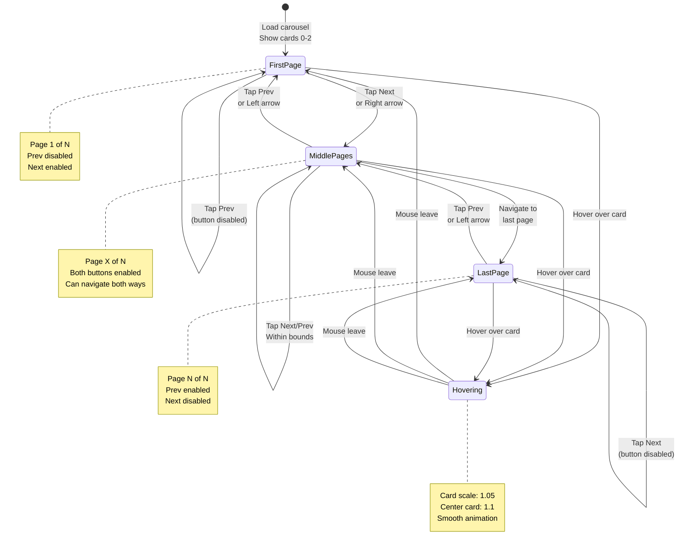
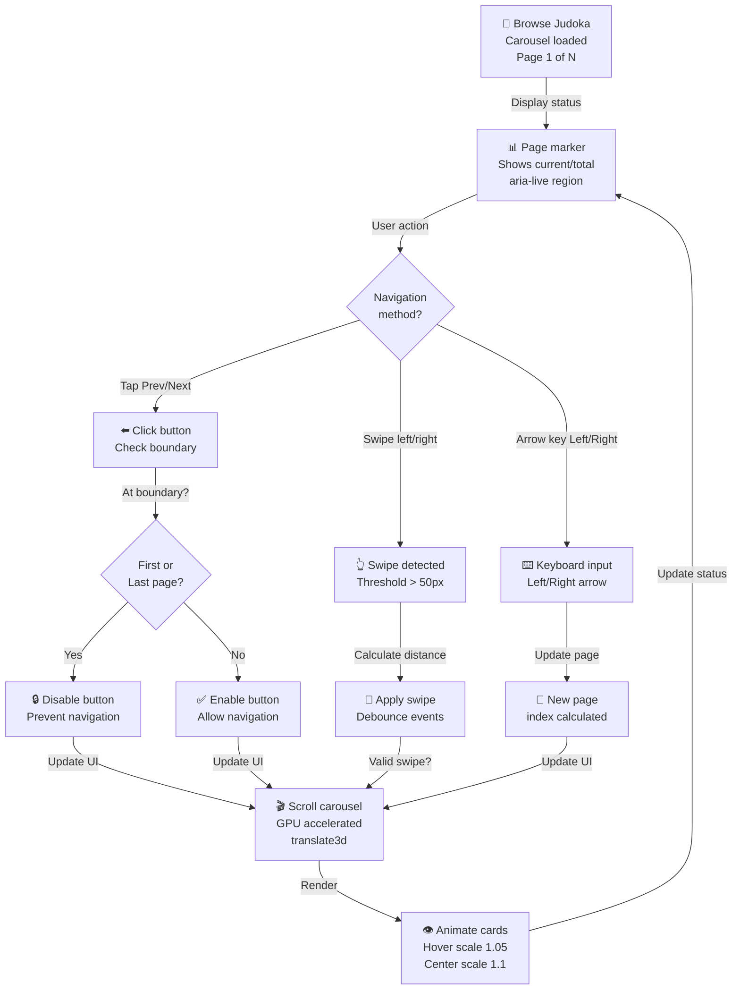
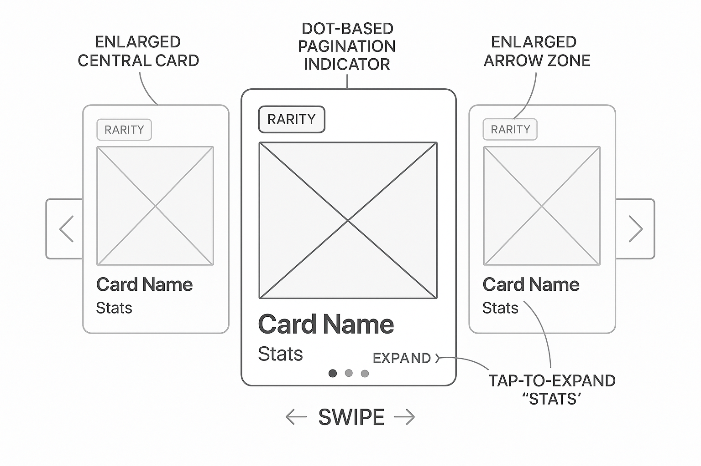

# PRD: Judoka Card Carousel

---

## TL;DR

This PRD defines a responsive, interactive carousel for browsing Judoka cards in Ju-Do-Kon! It supports smooth swiping, keyboard interactions, and accessibility features — ensuring players can quickly scan and select cards.

---

## Problem Statement

The Judoka Card Carousel is a sub-component of the Browse Judoka feature. It provides an efficient, interactive way for players to browse and select judoka cards within the larger context of team building and roster management. Without a performant carousel, the Browse Judoka experience would be slow and frustrating, impacting overall gameplay and user satisfaction.

As part of the game, several screens require an intuitive and interactive way to present judoka cards. With more than 100 cards in the game (ultimate goal), it would be cumbersome and frustrating for players to browse through all cards manually without an efficient navigation system capable of loading cards quickly.

> Emi wants to create her ultimate Japanese Judoka team. She opens the carousel and quickly swipes through beautifully animated cards, instantly comparing stats. She feels in control, excited, and invested in building the perfect team — that’s the experience this carousel delivers.

Failure to provide an efficient browsing experience may impact core gameplay — players might struggle to find and build optimal teams, leading to frustration and potential churn.

> A smooth and intuitive browsing experience fosters a sense of mastery and control, enhancing overall player satisfaction and engagement.

---

## User Stories

- As a player, I want smooth scrolling so I can quickly browse a large roster of cards.
- As a player using keyboard navigation, I want to scroll through cards using arrow keys so I can browse without a mouse.
- As a mobile player, I want to swipe to move between cards so the experience feels natural and fast.

---

## Goals

**Technical Performance Goals**

- Carousel loads within 1 second for up to 150 cards.
- Support smooth browsing of up to 50 cards without noticeable lag.
- Swipe gesture support for mobile browsing.
- Keyboard navigation support for accessibility.

**User Experience Goals**

- Users can easily browse and find desired cards to assemble optimized teams.
- Browsing the carousel feels smooth, intuitive, and visually engaging on both mobile and desktop devices.

---

## Functional Requirements

| Priority | Requirement                                                             |
| -------- | ----------------------------------------------------------------------- |
| **P1**   | Display judoka in a carousel.                                           |
| **P1**   | Scroll left/right using large arrow buttons labeled "Prev." and "Next". |
| **P2**   | Swipe or scroll navigation on mobile devices.                           |
| **P2**   | Cards scale to **1.05** on hover; center card scales to **1.1**.        |
| **P3**   | Page markers show "current page of total" with active highlight.        |
| **P3**   | Keyboard arrow key navigation for accessibility.                        |

---

## Acceptance Criteria

- Carousel loads quickly for up to 150 cards.
- User can scroll left/right via large "Prev." and "Next" arrow buttons.
- Arrow buttons disable when the carousel reaches either end so players cannot scroll past the available cards.
- User can see page markers showing "current page of total" with the active page highlighted and announced via `aria-live`.
- Hovering over a card scales it to **1.05**, verified via bounding box. The card nearest the center scales to **1.1** when focused.
- Carousel is responsive, adapting to both portrait and landscape orientations.
- Swipe or scroll navigation works on mobile (left/right swipe to move cards).
- Keyboard arrow keys allow navigation through cards.
- Displays a loading spinner if load time is slow.
- If card image fails to load, display a default judoka card (judoka id=0) without an error message.
- If card data cannot be fetched, display the default judoka card (judoka id=0) instead of an error message.
- Playwright tests simulate swipe gestures and arrow-key navigation.
- A loading spinner appears during simulated slow network conditions.

> **Note:** This PRD is the authoritative source for all carousel functionality, performance, and interaction requirements. Other features (e.g., Browse Judoka) reference this document for carousel-related behaviors, performance targets, and accessibility. Any updates to carousel requirements should be made here and referenced elsewhere to avoid redundancy.

---

## Carousel Navigation State Machine

**Carousel Page States & Navigation Boundaries**:



**User Interaction & Navigation Flow**:



**Performance & Interaction SLAs**:

| Metric                          | Target                |
| ------------------------------- | --------------------- |
| Carousel load (up to 150 cards) | ≤ 1s                  |
| Page transition animation       | 300-400ms             |
| Hover scaling                   | < 16ms (60fps)        |
| Keyboard navigation response    | < 50ms                |
| Swipe responsiveness            | Immediate (debounced) |
| Lazy image load on scroll       | < 500ms               |

**Carousel Boundaries & Button States**:

```
Page 1 of 5          Page 3 of 5          Page 5 of 5
┌─────────────┐     ┌─────────────┐     ┌─────────────┐
│ Prev (🔒❌) │     │ Prev (✅✓)  │     │ Prev (✅✓)  │
│ Next (✅✓)  │     │ Next (✅✓)  │     │ Next (🔒❌) │
└─────────────┘     └─────────────┘     └─────────────┘
Cards 0-2           Cards 4-6           Cards 10-12
```

**Status Badge**: ✅ **VERIFIED** — Validated against:

- `src/helpers/carouselBuilder.js` — Carousel construction
- `src/helpers/CarouselController.js` — Navigation state management
- `src/helpers/setupLazyPortraits.js` — Image lazy-loading
- `tests/helpers/carouselBuilder.test.js` — Unit tests for navigation logic
- `playwright/card-carousel.spec.js` — E2E tests for swipe, keyboard, and button interactions
- WCAG 2.1 AA: keyboard navigation, aria-live for page markers, 44px+ button targets

**Related Diagrams**:

- [Browse Judoka](prdBrowseJudoka.md) — Parent container integration
- [Country Picker Filter](prdCountryPickerFilter.md) — Filter integration with carousel

---

## Edge Cases / Failure States

- **Network Disconnection**: Display a default judoka card (judoka id=0) instead of an error message.
- **Missing/Broken Card Images**: Display the default judoka card (judoka id=0) rather than an error message.
- **Slow Network**: Show a loading spinner.
- **Canceled Gestures**: If a swipe is canceled (touchcancel/pointercancel), reset the gesture state without navigating so the next swipe starts clean.

---

## Technical Considerations

- Cards should lazy-load images as they enter the viewport to reduce initial load time.
- Use hardware-accelerated CSS transforms (e.g., `translate3d`) for smooth scrolling and animations (**≥60 fps**).
- Carousel should debounce swipe/scroll events to prevent rapid-fire performance hits.
- Card metadata must be dynamically fetched from `judoka.json`; errors should gracefully fallback to judoka id=0 without showing an error message.
- Programmatic navigation waits for a `scrollend` event before re-enabling scroll synchronization, preserving accurate page counters.
- Set `touch-action: pan-y` on the carousel so vertical page scrolling passes through natively while horizontal swipes are custom-handled.

---

## Player Flow

1. A page calls `buildCardCarousel(judokaList, gokyoData)` from `src/helpers/carouselBuilder.js`.
2. The returned element is mounted into the page (for example, `browseJudoka.html` inserts it into `#carousel-container`).
3. Carousel loads cards quickly; a loading spinner appears if delayed.
4. Player uses:
   - Large "Prev." and "Next" arrow buttons to move left or right,
   - Swipe or scroll gestures on mobile,
   - Or keyboard arrows for navigation.
5. Hovering scales cards to **1.05** on desktop.
6. Page markers show "current page of total" with active highlight.
7. If an image fails to load or data is missing → the default judoka card is displayed instead of an error message.

---

## Implementation Notes

The carousel is built by `buildCardCarousel` in `src/helpers/carouselBuilder.js`.
Pages such as `src/pages/browseJudoka.html` call this helper and append the
returned element to an empty container (e.g., `#carousel-container`). Carousel
wrappers (the element returned by `buildCardCarousel`) **must not** apply
padding that would change the width of the cards. Any extra spacing should be
handled by the carousel's gap settings so that card sizing remains
consistent.
`buildCardCarousel` automatically invokes `setupLazyPortraits()` on the
generated carousel so each card's real portrait loads once it becomes visible.

---

### Carousel Controller API

`CarouselController` manages page-based carousels with keyboard, swipe, and
resize support. Pages receive the controller instance when calling
`buildCardCarousel` and can interact with it to manage carousel state.

#### Constructor

`new CarouselController(container, wrapper, { threshold = 50 })`

- `container`: element holding carousel pages.
- `wrapper`: element that receives controls and markers.
- `threshold`: minimum swipe distance in pixels before navigation triggers.

#### Methods

- `next()` / `prev()` – Navigate to the adjacent page.
- `setPage(index)` – Jump directly to a specific page.
- `update()` – Refresh button states, markers, and accessibility messaging.
- `destroy()` – Remove listeners, teardown DOM hooks, and release references.

Use `destroy()` when a page removes the carousel from the DOM to avoid stray
listeners or leaked references during navigation.

---

## Design and UX: Considerations

| Feature        | Description                                                                                                  |
| -------------- | ------------------------------------------------------------------------------------------------------------ |
| Visuals        | Carousel has a darker background; snap scrolling for smooth navigation; center card scales to 1.1.           |
| Responsiveness | Adapts to mobile (1-2 cards visible) and desktop (3-5 cards); card size adjusts to screen size.              |
| Interaction    | Touch gestures (swipe left/right), mouse hover (scale to 1.05), keyboard navigation (arrow keys).            |
| Accessibility  | High contrast; 44px minimum touch targets; page marker changes announced via aria-live; 4.5:1 text contrast. |

---

> **Integration Note:**  
> This carousel will be used in screens like [Browse Judoka](prdBrowseJudoka.md) and any future features requiring horizontal card browsing. Refer to this PRD for all carousel-related requirements to ensure consistency across the app.

---

## Design and UX: Wireframes / Mockups

### Conceptual Layout

- **Desktop**: 3 cards in view — center card scales to **1.1**; large "Prev." and "Next" arrows at the sides; page markers at the bottom.
- **Mobile**: 1.5 cards visible (peek of next card); swipe or scroll enabled; arrows optional.
- **Hover Effect**: On desktop, cards scale to **1.05** on hover; the focused center card scales to **1.1**.
- **Touch Interaction**: On mobile, swipe left/right; smooth snap after swipe.

| **Card Carousel Mockup 1**                                       | **Card Carousel Mockup 2**                                       |
| ---------------------------------------------------------------- | ---------------------------------------------------------------- |
|  |  |

---

## Tasks

- [x] 1.0 Set Up Card Carousel Structure (P1)
  - [x] 1.1 Develop carousel container and card components.
  - [x] 1.2 Implement dynamic loading for up to 100 cards.
  - [x] 1.3 Ensure responsive resizing for mobile and desktop.
- [x] 2.0 Integrate Navigation Methods (P1)
- [x] 2.1 Add large "Prev." and "Next" arrow buttons for scrolling.
  - [x] 2.2 Add swipe or scroll support for mobile.
  - [x] 2.3 Add keyboard arrow navigation support.
- [x] 3.0 Add UI Enhancements (P2)
  - [x] 3.1 Implement hover enlargement effect.
  - [x] 3.2 Display page markers for carousel position with aria-live updates.
  - [x] 3.3 Implement loading spinner for slow networks.
- [x] 4.0 Handle Edge Cases (P2)
  - [x] 4.1 Fallback judoka card (judoka id=0) for broken card images or network errors.

---

[Back to Game Modes Overview](prdGameModes.md)

## Mockups



