# PRD: Card Codes

---

## TL;DR

This PRD defines a Card Code Generation Function for Ju-Do-Kon!, creating short, obfuscated, human-friendly codes representing individual Judoka cards. Players can easily share, recreate, and validate their cards, boosting engagement and social play. Codes are fast to generate (<100ms), readable, tamper-resistant, and optimized for low manual entry error rates.

---

## 1. Overview

The Card Code Generation Function transforms key attributes of a Judoka (player card) into a **unique, readable alphanumeric code**. This code allows players to easily share, recreate, and validate specific Judoka cards in the game.

> **Player Feedback:**
>
> - _"I want to show my best fighter to my friend!"_ — Early playtest feedback from a hypothetical 10-year-old user.
> - _"Typing long names is annoying. Codes are cooler and easier!"_ — Anonymous feedback from playtest logs.

Players gain a sense of **ownership and pride** by sharing their custom Judoka quickly and easily **(share action <2 s)**. **Without simple sharing, engagement can drop**, especially for kids who expect fast, low-effort interactions (**<200 ms UI response**).

### Goals

- Share and recreate favorite Judoka with a short, easy-to-type code.
- Avoid frustration with typos or unreadable characters.

### System Features

- **Unique**: Each Judoka’s stats and identity produce a distinct code.
- **Obfuscated**: Prevents easy manipulation.
- **Readable**: Uses a limited, kid-friendly character set.
- **Formatted**: Improves readability and typing accuracy.

### Key Requirements

- **Security and Usability** are equally important.
- **≤100ms generation time** for producing the code.
- **Auto-generated** whenever a card is created or updated and saved into `judoka.json`.
- Code is **visible** on card screens (where relevant).
- Players can **input shared codes** with a **<2% manual entry error rate**.
- **Easy copying** and **auto-hyphenation** during code entry for better usability.

---

## 2. Purpose and Value

### For Players

Enables easy sharing and potential import/export of Judoka using compact, friendly codes.

> Toshi finishes creating his dream Judoka. He taps “Copy Code” and sends it to his friend on chat. His friend enters the code on their own device and instantly sees Toshi’s powerful fighter appear, ready for battle. Sharing feels magical — effortless, exciting, and social.

### For the Game

Adds integrity and authenticity by encoding Judoka attributes securely.

### For Developers

Simplifies storage and retrieval of Judoka data without exposing sensitive information.

---

## User Stories

- As a player who’s proud of my Judoka, I want to share a short code with friends so they can battle with or against my creation.
- As a player on mobile, I want the code entry to auto-format with hyphens so it’s easy to type and reduces errors.

---

## 3. Functional Requirements

| Priority | Feature                  | Description                                                          |
| -------- | ------------------------ | -------------------------------------------------------------------- |
| **P1**   | Input Validation         | Ensure all required Judoka fields are present and valid.             |
| **P1**   | String Concatenation     | Build the raw code string from Judoka attributes and stats.          |
| **P1**   | XOR Obfuscation          | Apply XOR encoding to obfuscate the raw string.                      |
| **P1**   | Readable Charset Mapping | Convert to a friendly 32-character readable code.                    |
| **P1**   | Chunk Formatting         | Format the code into 4-character chunks separated by hyphens.        |
| **P1**   | Save to File             | Save the generated code into `judoka.json`.                          |
| **P2**   | Error Handling           | Provide clear error messages or fallback to a generic code.          |
| **P2**   | UI Surfacing             | Display generated code with copy/paste support and input validation. |
| **P2**   | Performance Compliance   | Ensure code generation completes within 100ms.                       |

---

### 3.2 Process (P1)

1. **Concatenate Stats**
   - Combine power, speed, technique, kumikata (grip fighting), and newaza (ground grappling) into a single string.
2. **Build Raw Code String**
   - Format: `v1-FIRSTNAME-SURNAME-COUNTRY-WEIGHTCLASS-SIGNATUREMOVEID-STATS`
   - Example: `v1-TADAHIRO-NOMURA-JP-60-1234-98765`
3. **Apply XOR Encoding**
   - XOR each character’s ASCII code with `(index + 37) % 256`.
4. **Map to Readable Charset**
   - Map to: `ABCDEFGHJKLMNPQRSTUVWXYZ23456789` (avoiding I, O, 1, 0).
5. **Chunking**
   - Group characters into 4-character chunks, separated by hyphens (`-`).
6. **Output**
   - Example output: `F7KP-WQ9M-ZD23-HYTR`

---

### 3.3 Output (P1)

- **Card Code**: A hyphen-separated, obfuscated alphanumeric code (e.g., `F7KP-WQ9M-ZD23-HYTR`).

---

## 4. Non-Functional Requirements

- **Readability**: Friendly character set.
- **Security**: Light obfuscation deters casual reverse-engineering.
- **Error Handling**: Standardized error messages.
- **Performance**: Code generation under 100ms.
- **Consistency**: Same input produces the same code.

---

## 5. Example

### Input

```json
{
  "firstname": "Tadahiro",
  "surname": "Nomura",
  "country": "JP",
  "weightClass": 60,
  "signatureMoveId": 1234,
  "stats": {
    "power": 9,
    "speed": 8,
    "technique": 7,
    "kumikata (grip fighting)": 6,
    "newaza (ground grappling)": 5
  }
}
```

### Output

```text
F7KP-WQ9M-ZD23-HYTR
```

---

## Card Code Generation Pipeline

```mermaid
graph TD
    A["📋 Input Judoka Object"] -->|Extract attributes| B["📊 Concatenate Stats<br/>Power + Speed + Technique<br/>+ Kumikata + Newaza"]
    
    B --> C["🔗 Build Raw String<br/>Format: v1-FNAME-LNAME-COUNTRY<br/>-WEIGHT-SIGID-[STATS]"]
    
    C --> D["Verify all fields<br/>present & valid"]
    D -->|Valid| E["✅ Raw string ready<br/>Example:<br/>v1-TADAHIRO-NOMURA-JP<br/>-60-1234-98765"]
    D -->|Invalid| F["⚠️ Missing fields<br/>Fallback to<br/>generic code"]
    
    E --> G["🔐 XOR Encoding<br/>For each char:<br/>ASCII XOR (index+37)%256"]
    G --> H["📊 Encoded bytes<br/>raw → obfuscated"]
    
    H --> I["🗺️ Map to Charset<br/>Charset:<br/>ABCDEFGHJKLMNPQRST<br/>UVWXYZ23456789<br/>(no I,O,1,0)"]
    I --> J["🔤 Readable chars<br/>Example: F7KP..."]
    
    J --> K["📦 Chunk into<br/>4-char groups"]
    K --> L["➕ Join with<br/>hyphens"]
    
    L --> M["✅ Final Code<br/>Example:<br/>F7KP-WQ9M-ZD23-HYTR"]
    F --> M
    
    M --> N["💾 Save to judoka.json<br/>attach code field"]
    
    style A fill:lightgreen
    style E fill:lightblue
    style G fill:lightblue
    style M fill:lightgreen
    style F fill:lightsalmon
```



**Generation Steps:**
1. **Extract & Validate**: Gather all required fields from Judoka object
2. **Concatenate**: Build raw string from name, country, weight, signature move, stats
3. **XOR Encoding**: Obfuscate each character using XOR with position-dependent key
4. **Charset Mapping**: Convert bytes to readable alphanumeric set (A–Z, 2–9, no confusing letters)
5. **Chunking**: Group into 4-character chunks separated by hyphens
6. **Save**: Store code in judoka.json for later retrieval

---

## Card Code Structure & Encoding Example

```mermaid
graph TB
    A["📝 Example Generation"]
    
    A --> B["Input Judoka:<br/>Tadahiro Nomura<br/>Country: JP<br/>Weight: 60kg<br/>Signature: 1234<br/>Stats: 9,8,7,6,5"]
    
    B --> C["Step 1: Build Raw String<br/>v1-TADAHIRO-NOMURA-JP-60-1234-98765"]
    
    C --> D["Step 2: XOR Encoding<br/>Char 0: 'v' (118) XOR (0+37)%256=37<br/>→ 118 XOR 37 = 87<br/>Char 1: '1' (49) XOR (1+37)%256=38<br/>→ 49 XOR 38 = 11<br/>... continue for all chars"]
    
    D --> E["Step 3: Map bytes to Charset<br/>87 mod 32 = 23 → 'X'<br/>11 mod 32 = 11 → 'L'<br/>... convert all bytes to charset indices"]
    
    E --> F["Step 4: Get Charset Characters<br/>Charset: ABCDEFGHJKLMNPQRSTUVWXYZ23456789<br/>Index 23 → 'X'<br/>Index 11 → 'L'<br/>Result: XL... (example, not actual)"]
    
    F --> G["Step 5: Format with Hyphens<br/>Full result: F7KP-WQ9M-ZD23-HYTR"]
    
    G --> H["✅ Output Code Ready<br/>Obfuscated, readable<br/>Deterministic (same input<br/>→ same output)"]
    
    style A fill:lightblue
    style C fill:lightgreen
    style D fill:lightyellow
    style E fill:lightyellow
    style F fill:lightyellow
    style H fill:lightgreen
```



**Key Properties:**
- **Deterministic**: Same Judoka → same code every time
- **Obfuscated**: XOR encoding prevents casual reverse-engineering
- **Readable**: Charset avoids confusing characters (no I/O/1/0)
- **Compact**: ~20-24 characters including hyphens
- **Error Resistant**: Hyphen grouping aids manual entry

---

## Error Handling & Validation Flow

```mermaid
graph TD
    A["🔍 Validate Input<br/>Judoka object"] -->|All fields present| B["✅ Valid"]
    A -->|Missing field| C["⚠️ Invalid<br/>Missing: firstname<br/>or surname<br/>or country, etc."]
    A -->|Invalid type| D["⚠️ Invalid<br/>Stats not numbers<br/>or out of range"]
    
    B --> E["Generate code<br/>complete process"]
    C --> F["📝 Fallback Code<br/>Use generic pattern<br/>Generic-XXXXXXXX"]
    D --> F
    
    E --> G["✅ Code generated<br/>Save to judoka.json"]
    F --> G
    
    G --> H{Code valid?}
    H -->|Yes| I["💾 Store + return<br/>code to UI"]
    H -->|No| J["❌ Error message<br/>inform user"]
    
    I --> K["Display in UI<br/>Copy button available"]
    J --> K
    
    style A fill:lightblue
    style B fill:lightgreen
    style C fill:lightsalmon
    style D fill:lightsalmon
    style F fill:lightyellow
    style I fill:lightgreen
    style K fill:lightblue
```



**Validation Checks:**
- All required fields present (firstname, surname, country, weight, signature move ID, stats)
- Stats are numbers within valid range
- Country code is valid format
- Weight class is positive number

**Fallback Strategy:**
- If validation fails, generate generic code with fallback pattern
- Display error message to user
- Suggest correction steps

---

## Card Code UI: Display & User Entry

```mermaid
graph LR
    A["🎴 Card Screen"]
    
    A -->|Display section| B["📋 Card Code Panel<br/>Label: Card Code"]
    B --> C["🔤 Code Display<br/>Example: F7KP-WQ9M-ZD23-HYTR<br/>(monospace font)]
    C --> D["📋 Copy Button<br/>Click to clipboard"]
    D --> E["✅ Toast:<br/>Copied!"]
    
    A -->|Input section| F["💬 Code Entry Input"]
    F --> G["Auto-format on input:<br/>Removes spaces<br/>Converts to UPPERCASE<br/>Removes invalid chars<br/>Adds hyphens automatically"]
    G --> H["Invalid char detected?<br/>Show red outline +<br/>informational message"]
    
    G -->|Formatted| I["✅ Code valid<br/>Format check passed<br/>Ready for import"]
    I --> J["🔍 Validate against<br/>known codes or pattern"]
    J -->|Match found| K["✅ Code recognized<br/>Show matched Judoka<br/>Load/preview card"]
    J -->|No match| L["❌ Code not found<br/>Suggest create new"]
    
    style A fill:lightgreen
    style B fill:lightblue
    style C fill:lightyellow
    style D fill:lightblue
    style F fill:lightblue
    style G fill:lightyellow
    style K fill:lightgreen
    style L fill:lightsalmon
```

**Display UX:**
- Show code in monospace font for clarity
- Copy button for easy sharing
- Toast confirmation when copied
- QR code option (if supported)

**Entry UX:**
- Auto-format: Remove spaces, add hyphens, uppercase
- Real-time validation feedback
- Show matching Judoka on valid codes
- Suggest error correction

---

## Charset Mapping: Readable Character Set

```mermaid
graph TD
    A["🗺️ Charset Mapping<br/>32 friendly characters"]
    
    A --> B["Base Charset:<br/>ABCDEFGHJKLMNPQRSTUVWXYZ23456789"]
    
    B --> C["Index 0-7: A B C D E F G H"]
    B --> D["Index 8-15: J K L M N P Q R"]
    B --> E["Index 16-23: S T U V W X Y Z"]
    B --> F["Index 24-31: 2 3 4 5 6 7 8 9"]
    
    A --> G["❌ Excluded Characters<br/>Confusing letters:"]
    G --> H["I (looks like 1)"]
    G --> I["O (looks like 0)"]
    G --> J["1 (looks like I)"]
    G --> K["0 (looks like O)"]
    
    A --> L["✅ Why this set?"]
    L --> M["Kid-friendly"]
    L --> N["Minimal typos<br/>in manual entry"]
    L --> O["32 = 2^5<br/>efficient encoding"]
    L --> P["No similar-looking<br/>characters"]
    
    style A fill:lightblue
    style B fill:lightgreen
    style C fill:lightyellow
    style D fill:lightyellow
    style E fill:lightyellow
    style F fill:lightyellow
    style G fill:lightsalmon
    style L fill:lightblue
```



**Charset Strategy:**
- 32 characters = 5 bits per character
- Avoids I, O, 1, 0 (easily confused)
- Alphabetical (A–Z) + numeric (2–9)
- Optimized for <2% manual entry error rate

**Performance Targets:**
- Code generation: <100ms
- UI response: <200ms
- Manual entry: <2% error rate
- Copy to clipboard: <50ms

---

- Given a valid Judoka, when code generation runs, a valid code is produced.
- Given a Judoka with missing fields, fallback to a generic code.
- Generated codes use only A–Z, 2–9, and hyphens.
- Codes group characters into 4-character hyphenated chunks.
- The same Judoka always yields the same output code.
- Code generation completes in under 100ms.
- Manual code entry must have an error rate under 2% on average.

---

## 7. Edge Cases / Failure States (P2)

- Very large or malicious strings.
- Potential code collisions.
- Encoding failures or memory issues.

**Fallback:** Display a generic card code (judoka id=0) if any failure occurs.

---

## 8. Wireframes

| **Card Code Display and Entry Mockup 1**                                     | **Card Code Display and Entry Mockup 2**                                     |
| ---------------------------------------------------------------------------- | ---------------------------------------------------------------------------- |
|  |  |

---

## 9. Developer Notes

### 9.1 Encoding Strategy Rationale

- **XOR Obfuscation:** Lightweight, fast (**<100 ms**), non-cryptographic.
- **Readable Character Set:** Improves accuracy (no I, O, 1, 0).
- **Hyphenation:** Easier error detection.
- **Versioning:** Ensures backward compatibility.

### 9.3 Limitations

- XOR is not cryptographic.
- No cryptographic collision-proofing.
- No decoding to avoid tampering.

### 9.4 Potential Enhancements

- Customizable chunk size.
- Add checksum digit to detect manual entry errors.
- Admin-only decode function for tournament verification.
- Salt/nonce for reduced collisions.

### 9.5 UI Input Considerations

- Code visible on card detail screens, where relevant.
- Copy-to-clipboard button (44x44px target size).
- Input field with auto-hyphenation.
- Invalid character prevention at input level.

---

## 10. Player Flow

**Code Generation and Sharing Flow**

- Player creates or updates Judoka → system generates code.
- Code saved to judoka.json and displayed on card detail screen.
- Player taps copy button → code copied to clipboard.
- Player sends code to friend.
- Friend opens code entry screen → types or pastes code.
- System validates and reconstructs Judoka or shows error.

---

## Tasks

- [ ] 1.0 Card Code Generation Function
  - [x] 1.1 Validate input Judoka object for all required fields.
  - [x] 1.2 Concatenate Judoka stats and key attributes into raw string.
  - [x] 1.3 Apply XOR encoding with index-based key.
  - [x] 1.4 Map encoded string to 32-character readable alphabet.
  - [x] 1.5 Format string into chunks of 4 characters with hyphens.
  - [x] 1.6 Return the final formatted code.
  - [x] 1.7 Save the generated code into `judoka.json`.
- [ ] 2.0 Error Handling and Edge Cases
  - [x] 2.1 Fallback to a generic card code (judoka id=0) if encoding fails. ([tests/helpers/cardCode.test.js](../../tests/helpers/cardCode.test.js))
  - [ ] 2.2 Handle unusually large string input safely.
- [ ] 3.0 Unit Tests
  - [x] 3.1 Test valid Judoka object produces correct code format.
  - [x] 3.2 Test invalid input triggers correct error fallback.
  - [x] 3.3 Test same input always results in the same output code.
  - [ ] 3.4 Simulate edge cases like large inputs and validate fallback behavior.
- [ ] 4.0 UI Surface Interaction
  - [ ] 4.1 Ensure the generated code is visible on relevant card display screens.
  - [ ] 4.2 Support copy-to-clipboard functionality.
  - [ ] 4.3 Add input validation for code entry screens.
  - [ ] 4.4 Implement auto-hyphenation as players type shared codes.

---

[Back to Game Modes Overview](prdGameModes.md)

## Mockups


