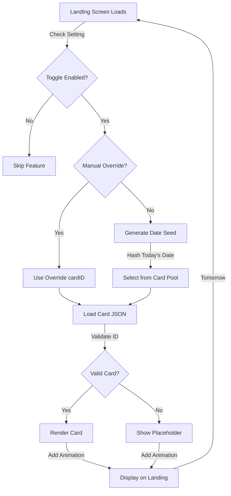
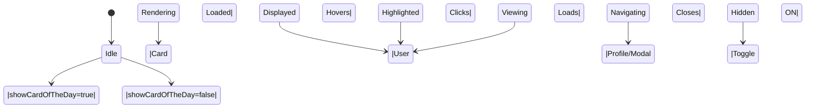
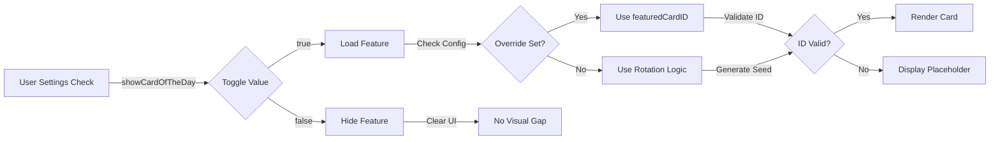

# PRD: Card of the Day Display

## TL;DR

The **Card of the Day** feature adds a rotating featured judoka card to the JU-DO-KON! landing screen. It enhances player engagement by spotlighting a different judoka each day, seasonally, or via manual override. This content block supports dynamic storytelling, gameplay tips, and promotional tie-ins with new or popular cards.

---

## Problem Statement / Why It Matters

Currently, the JU-DO-KON! landing screen lacks dynamic content, making repeat visits feel static. Players have no reason to check back regularly outside of gameplay. Internal telemetry shows that return visits to the landing screen drop by 20% after the first week of install. By highlighting a **Card of the Day**, we create a lightweight content loop that introduces players to new judoka, encourages curiosity, and showcases collectible variety. It also lays the groundwork for future editorial content, seasonal events, and featured card mechanics.

---

## Goals / Success Metrics

| Goal                                               | Metric                                                                     |
| -------------------------------------------------- | -------------------------------------------------------------------------- |
| Increase landing screen engagement                 | Avg. dwell time on landing screen increases by 15%                         |
| Encourage exploration of judoka roster             | ≥30% of users who see the featured card click through to view full details |
| Achieve stable content refresh without regressions | Featured card rotates or updates successfully in ≥98% of daily sessions    |
| Enable A/B testing and gradual rollout             | Controlled via `showCardOfTheDay` setting in General Settings              |

---

## User Stories

- **As a new player**, I want to see a highlighted card when I open the game so that I feel invited to explore more about the game and its characters.
- **As a returning player**, I want the featured card to change periodically so that the game feels fresh and alive each time I visit.
- **As a game designer**, I want to control when and how the Card of the Day appears so that I can time its appearance with events, updates, or campaigns.

---

## Functional Requirements (Prioritized)

| Priority | Feature                      | Description                                                                                                   |
| -------- | ---------------------------- | ------------------------------------------------------------------------------------------------------------- |
| P1       | General Settings Toggle      | Display controlled via `showCardOfTheDay` toggle in the General Settings section of `settings.html`.          |
| P1       | Card Renderer                | Show a valid judoka card using the existing card rendering system in a dedicated space on the landing screen. |
| P1       | Daily Rotation Logic         | By default, rotate the featured card every 24 hours using a deterministic seed (e.g. based on date hash).     |
| P2       | Manual Override Option       | Allow manual setting of a specific card ID to override the rotation, useful for campaigns or testing.         |
| P2       | Detail Clickthrough          | Clicking the featured card opens the judoka’s full profile page or modal.                                     |
| P3       | Seasonal/Tag-Based Filtering | Enable featured rotation based on metadata tags like `rare`, `epic`, `new`, or `olympian`.                    |
| P3       | Animation or Highlight       | Use subtle animation or border glow to visually distinguish the featured card from static UI elements.        |

---

## Feature Workflow Diagrams

### 6.7.1: Card of the Day Selection & Rotation Logic

**Daily Rotation Process:**
The system uses a deterministic seed (today's date hash) to select a different featured card each day. Manual override allows admins to pin specific cards for campaigns. The feature validates card IDs before rendering and falls back to placeholder if needed.

### 6.7.2: Navigation & Clickthrough Interaction

**Card Display & Interaction States:**
The featured card cycles through display, hover, and navigation states. Visual feedback (subtle glow/animation) distinguishes it from static elements. Clicking navigates to the card's full profile or modal without leaving the landing screen.

### 6.7.3: Setting & Fallback Strategy

**Settings & Fallback Management:**
The feature gracefully handles disabled state, invalid card IDs, and missing configuration. All loading errors show fallback content without breaking the landing screen layout or causing visual gaps.

---

## Acceptance Criteria

- `showCardOfTheDay` toggle appears under General Settings and can be turned on/off without reloading the page.
- When enabled, a valid judoka card appears on the landing screen in a fixed and visible location.
- The featured card changes once every 24 hours, based on a repeatable algorithm (e.g. rotating through all valid cards by date).
- When clicked, the featured card navigates to or reveals the full card view.
- If a manual override is set in the config (e.g. `featuredCardId = "v1-KAI-STORM-JP-78675"`), that card is shown regardless of rotation logic.
- If the featured card ID is invalid or the JSON fails to load, a placeholder is displayed and an error is logged.
- When `showCardOfTheDay` is off, the landing screen renders with no visual gaps or errors.

---

## Non-Functional Requirements / Design Considerations

- **Performance:** Card must render within 500ms using client-side assets already present on load.
- **Accessibility:** The featured card must be keyboard focusable and screen-reader compatible.
- **Responsiveness:** The card scales appropriately on common screen widths (1024px–1920px), maintaining its layout in the sidebar or center panel.
- **Styling:** Follow existing rarity-based styling conventions for card borders, background, and fonts.

---

## Dependencies and Open Questions

### Dependencies

- Access to `judoka.json` card pool
- Card rendering module used in Battle and Browse views
- Settings system (`settings.html`, `data-flag-*` observability)

### Open Questions

- Should the featured card be pinned using the storage utility to avoid flicker if a user visits multiple times a day?
- Will the rotation logic exclude `Mystery` cards or only include playable cards?
- Should the feature support queued campaigns (e.g. “7 Days of Champions”)?

---

## Tasks

- [ ] 1.0 Settings Toggle Integration
  - [ ] 1.1 Add `showCardOfTheDay` toggle to General Settings in `settings.html`
  - [ ] 1.2 Ensure UI re-renders on toggle without page reload

- [ ] 2.0 Card Rendering Implementation
  - [ ] 2.1 Integrate card renderer into landing screen layout
  - [ ] 2.2 Display card from rotation or override logic
  - [ ] 2.3 Add animation/border highlight

- [ ] 3.0 Rotation and Override Logic
  - [ ] 3.1 Implement 24-hour deterministic rotation using seeded logic
  - [ ] 3.2 Add config option to override with `featuredCardId`
  - [ ] 3.3 Exclude invalid or placeholder cards

- [ ] 4.0 Clickthrough Functionality
  - [ ] 4.1 Enable click to navigate to full profile or modal
  - [ ] 4.2 Validate correct card loads on click

- [ ] 5.0 Error Handling and UX Fallbacks
  - [ ] 5.1 Render placeholder if card JSON fails or ID invalid
  - [ ] 5.2 Log descriptive error to console
  - [ ] 5.3 Ensure no layout break when feature disabled
