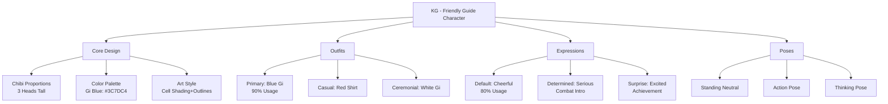
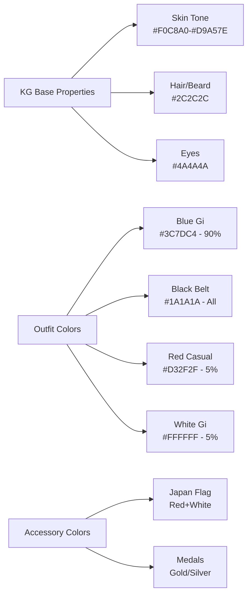

# PRD: Character Design

## TL;DR

This PRD defines the comprehensive design specifications for "KG," the friendly guide character in JU-DO-KON!. KG serves as the game's mascot and helper, providing advice, encouragement, and tips to players aged 8-12. The character follows a chibi (super-deformed) cartoon style with consistent visual identity, expression guidelines, and scene-specific variations. This PRD ensures consistent character representation across all game interfaces, promotional materials, and user interactions.

---

## Problem Statement

The JU-DO-KON! game requires a consistent, appealing character identity to serve as a guide and mascot for young players. Without standardized character design specifications, different implementations of KG could vary significantly in appearance, personality expression, and visual quality. This inconsistency would confuse players, weaken brand identity, and reduce the character's effectiveness as a friendly guide. Clear design standards are essential for maintaining KG's visual appeal and ensuring consistent user experience across all game contexts.

---

## Goals

- **Visual Consistency**: Establish unified character appearance across all game implementations
- **Age Appropriateness**: Ensure character design appeals to target audience of ages 8-12
- **Brand Identity**: Create memorable, distinctive mascot that represents JU-DO-KON! values
- **Emotional Connection**: Design character that feels friendly, approachable, and encouraging
- **Implementation Clarity**: Provide detailed specifications for developers and artists
- **Cultural Authenticity**: Represent Japanese martial arts heritage appropriately and respectfully

---

## User Stories

- As a young player, I want an encouraging character guide so that I feel supported while learning the game
- As a game developer, I want clear character specifications so that I can implement KG consistently
- As an artist, I want detailed design guidelines so that I can create appropriate KG artwork
- As a parent, I want age-appropriate character design so that my child enjoys a safe gaming experience
- As a brand manager, I want consistent character representation so that KG strengthens our game identity

---

## Prioritized Functional Requirements

| Priority | Feature                         | Description                                                                    |
| -------- | ------------------------------- | ------------------------------------------------------------------------------ |
| P1       | Core Character Design           | Fundamental appearance specifications including proportions, colors, and style |
| P1       | Facial Features and Expressions | Detailed facial design with expression variations for different contexts       |
| P1       | Default Outfit and Variations   | Primary judo gi design with alternative clothing options                       |
| P1       | Color Palette Standards         | Exact color specifications for consistent reproduction                         |
| P2       | Pose Library                    | Standard poses for common game scenarios and interactions                      |
| P2       | Scene-Specific Adaptations      | Character variations for different game contexts and backgrounds               |
| P3       | Accessory and Prop Guidelines   | Optional items and tools for specific scenarios                                |

---

## Functional Requirements

### 1. Core Character Design (P1)

**Character Identity:**

- **Name**: KG
- **Role**: Friendly, energetic guide character providing advice and encouragement
- **Target Appeal**: Ages 8-12 with universal approachability
- **Personality**: Confident, encouraging, slightly exaggerated for expressiveness

**Design Style:**

- **Art Style**: Chibi (super-deformed) cartoon style
- **Proportions**: 3 heads tall with large head relative to body
- **Head-to-body Ratio**: Head approximately 1/3 of total height
- **Build**: Stout, strong build with wide torso and thick limbs
- **Extremities**: Large hands and feet for expressiveness and visual balance

**Visual Treatment:**

- **Outlines**: Bold, dark black outlines around character
- **Shading**: Flat cell shading style with slight warm lighting
- **Highlights**: Soft highlights for dimensional depth
- **Background Integration**: Character design works across varied backgrounds

### 2. Facial Features and Expressions (P1)

**Facial Structure:**

- **Head Shape**: Rounded head with broad, expressive face
- **Eyes**: Large, rounded eyes with thick black eyebrows
- **Mouth**: Wide mouth capability for various expressions
- **Beard**: Full, dark, neatly groomed beard matching thick eyebrows
- **Hair**: Bald on top (shaved) with hair around the sides
- **Skin Tone**: Light to medium tone representing Japanese ethnicity (HEX `#F0C8A0` to `#D9A57E`)

**Expression Variations:**

- **Default**: Cheerful and friendly with wide smile showing visible teeth
- **Determined**: Brows furrowed with serious mouth for important moments
- **Surprised**: Wide eyes with open mouth for unexpected events
- **Confident**: Arms crossed posture with slight smile
- **Thinking**: Hand on chin with curious, contemplative expression

**Expression Usage Guidelines:**

- Default cheerful expression for 80% of appearances
- Determined expression for challenge introductions and serious advice
- Surprised expression for achievement celebrations and unexpected events
- Confident expression for game rule explanations
- Thinking expression for puzzle-solving and strategy tips

### 3. Default Outfit and Variations (P1)

**Primary Outfit (Default):**

- **Gi Color**: Blue judo gi (HEX `#3C7DC4` - Pantone 285M)
- **Belt**: Black belt tied at waist with proper knot detail (HEX `#1A1A1A`)
- **Insignia**: Japan flag patch on left chest of gi
- **Footwear**: Barefoot by default for authentic martial arts representation

**Alternative Outfits:**

- **Casual Variation**: Red t-shirt and blue shorts for informal scenes
- **Gi Color Alternatives**: Red or white gi for special contexts (black belt remains constant)
- **Seasonal Adaptations**: Lightweight variations for outdoor scenes
- **Ceremonial**: Formal gi presentation for awards and achievements

**Outfit Usage Guidelines:**

- Default blue gi for 90% of game interactions
- Casual clothes for non-martial arts contexts (tutorials, celebrations)
- Alternative gi colors for special events or opponent matching
- Maintain black belt across all variations for rank consistency

### 4. Color Palette Standards (P1)

**Primary Colors:**

- **Gi Blue**: HEX `#3C7DC4` (Pantone 285M)
- **Belt Black**: HEX `#1A1A1A`
- **Skin Tone Range**: HEX `#F0C8A0` to `#D9A57E`
- **Hair/Beard**: HEX `#2C2C2C` (dark brown-black)
- **Eye Color**: HEX `#4A4A4A` (dark gray-brown)

**Secondary Colors:**

- **Casual Shirt Red**: HEX `#D32F2F`
- **Casual Shorts Blue**: HEX `#1976D2`
- **Japan Flag Red**: HEX `#BC002D`
- **Japan Flag White**: HEX `#FFFFFF`

**Color Usage Requirements:**

- All colors must maintain WCAG AA contrast ratios against backgrounds
- Color consistency across all digital and print media
- Accessibility consideration for colorblind users
- Proper color reproduction in various lighting conditions

### 5. Pose Library (P2)

**Standard Poses:**

- **Default Dynamic**: Pointing upward with confident expression
- **Thumbs Up**: Encouraging gesture with bright smile
- **Energetic Jump**: Mid-air with fists raised in triumph
- **Arms Crossed**: Confident standing pose for explanations
- **Thinking Pose**: Hand on chin for contemplative moments
- **Cheering**: Fists in air for celebrations and victories

**Prop Interaction Poses:**

- **Holding Signs**: Large signboards with pointer stick
- **Award Presentation**: Holding trophies, scrolls, or certificates
- **Teaching Gesture**: Demonstrating techniques or pointing to information
- **Welcome Pose**: Open arms for greetings and introductions

**Pose Selection Guidelines:**

- Match pose to emotional context of interaction
- Ensure stable foot placement for visual balance
- Maintain open, confident posture across all poses
- Consider background and UI element placement

### 6. Scene-Specific Adaptations (P2)

**Background Integration:**

- **Dojo Scenes**: Tatami mats and wooden walls, slightly blurred
- **Stadium Context**: Crowd backgrounds for celebrations
- **Outdoor Training**: Grassy areas with blue sky
- **Stage Presentations**: Spotlights and formal backgrounds
- **UI Integration**: Plain backgrounds for interface elements

**Contextual Adaptations:**

- **Giving Advice**: Pointing gesture with dojo background
- **Trophy Celebration**: Trophy holding with cheering crowd
- **Casual Interaction**: Relaxed pose with informal background
- **Tutorial Context**: Clear, uncluttered backgrounds for focus
- **Achievement Moments**: Spotlight emphasis with celebration elements

### 7. Scenario Prompt Reference (P2)

**Version History:**

- v2.0.0 (October 2024): Consolidated character design guidance with expanded prompt matrix and implementation checklist
- v1.0.0: Initial character design specifications covering baseline poses, outfits, and expressions

**When to Use Each Scenario:**

- **Onboarding & Tutorials**: Use intro, teaching, and thinking scenarios when guiding players through new mechanics or explaining rules.
- **Match Flow Moments**: Apply challenge, countdown, and victory scenarios during pre-match briefings, round transitions, and post-match celebrations.
- **Out-of-Match Engagement**: Leverage celebration, community, and seasonal scenarios for events, rewards, and promotional beats outside active gameplay.
- **Support & Safety**: Use warning, safety, and accessibility-focused prompts when delivering parental guidance, fair-play reminders, or moderation messaging.

**Base Prompt Template:**

A chibi-style cartoon character, 3-heads tall, with a large head and stout body. He has a bald head with thick black beard and eyebrows, big round eyes, and a wide, friendly smile with visible teeth. Skin tone is light-medium beige, representing Japanese ethnicity. He wears a blue judo gi with a black belt and a small Japan flag patch on the left chest. Art style uses bold black outlines, flat cell shading, and warm ambient lighting to emphasize a confident, friendly personality.

**Scene-Specific Prompt Table:**

| Scene                       | Prompt Additions                                                                                                                |
| --------------------------- | ------------------------------------------------------------------------------------------------------------------------------- |
| Giving Advice               | Pointing upward with one hand, smiling brightly. Background: dojo with tatami mats and wooden walls, slightly blurred.          |
| Teaching Technique          | Demonstrating a throw stance with open palm gesture. Background: clean dojo mat with minimal UI callouts.                       |
| Challenge Intro             | Arms crossed, confident grin. Background: neutral gradient with subtle speed lines.                                             |
| Countdown Moment            | Hands on hips, focused expression, small stopwatch icon nearby. Background: minimal spotlight vignette.                         |
| Dynamic Jump                | Mid-air jump, fists raised in triumph, joyful expression. Background: stadium crowd cheering.                                   |
| Trophy Celebration          | Holding a trophy with a proud grin. Background: stage with spotlights and cheering crowd, blurred.                              |
| Thinking Pose               | Standing calmly, hand on chin, curious expression. Background: plain white with soft shadow.                                    |
| Holding a Sign              | Holding a large signboard ("Welcome to Ju-Do-Kon!") and a pointer stick. Background: dojo interior with mats.                   |
| Casual Clothes              | Red t-shirt and blue shorts, barefoot, holding a water bottle, waving. Background: grassy outdoor training area with blue sky.  |
| Community Event             | Waving with open hand, friendly eyes. Background: banner with confetti and small crowd silhouettes.                             |
| Seasonal Winter             | Wearing a light scarf over the gi, cheeks slightly rosy. Background: soft snowflakes and cool blue gradient.                    |
| Seasonal Summer             | Rolled sleeves, sweat drop, cheerful wave. Background: bright sky with sun flare and training field.                            |
| Safety Reminder             | Calm, reassuring smile, open palms. Background: simple gradient with subtle safety icon (shield/heart).                         |
| Accessibility Encouragement | Gentle thumbs-up, warm expression. Background: neutral pastel gradient with high contrast, minimal decorative elements.         |
| Parent Guidance             | Slightly serious but kind expression, pointing to a tip card. Background: clean interface-friendly panel with ample whitespace. |

**Detailed Example Prompts:**

- **Onboarding — Giving Advice**  
  **Prompt:** Use the base prompt. Add: "KG stands in a dojo, pointing upward with one hand, smiling brightly with visible teeth. Background shows tatami mats and wooden walls, slightly blurred, with warm ambient lighting."
- **Tutorial — Teaching Technique**  
  **Prompt:** Use the base prompt. Add: "KG demonstrates a basic judo stance, one open palm forward, calm confident smile. Background is a clean dojo mat with minimal UI callouts and soft shadow."
- **Match Flow — Countdown Moment**  
  **Prompt:** Use the base prompt. Add: "KG faces forward with hands on hips and focused eyes, a small stopwatch icon near his shoulder. Background is a subtle spotlight vignette with no clutter."
- **Match Flow — Trophy Celebration**  
  **Prompt:** Use the base prompt. Add: "KG holds a trophy in one hand with a joyful grin, standing on a stage with soft spotlights and a blurred cheering crowd behind him."
- **Out-of-Match — Community Event**  
  **Prompt:** Use the base prompt. Add: "KG waves with open hand, friendly eyes, confetti drifting in the air. Background is a festive banner with soft crowd silhouettes."
- **Support & Safety — Parent Guidance**  
  **Prompt:** Use the base prompt. Add: "KG holds a tip card and gestures toward it with a gentle, reassuring expression. Background is a clean UI panel with ample whitespace and muted tones."

### 8. Implementation Guidelines (P1)

**Required Design Standards:**

- Maintain the 3-heads tall chibi proportion.
- Use dynamic, energetic poses that reinforce KG's encouraging personality.
- Keep the gi neat with the black belt properly tied when in uniform.
- Match facial expressions to the narrative context while preserving friendliness.
- Retain flat, cartoonish rendering with bold outlines and warm lighting.

**Design Restrictions:**

- Do not render KG with realistic or overly detailed anatomy.
- Do not remove or omit the Japan flag patch when KG wears the gi.
- Do not introduce heavy shading, complex gradients, or textured rendering styles.

**Do & Don't Checklist:**

**Do:**

- Keep line weights bold and consistent around the entire silhouette to preserve the cartoon cut-out style.
- Anchor every pose with planted, balanced foot placement to avoid awkward or unstable silhouettes.
- Pair mouth shapes and eyebrow angles intentionally so emotions read clearly at small sizes.
- Reuse the canonical color palette swatches; document any temporary deviations with rationale and HEX values.
- Stage supporting props so they reinforce KG’s role as coach (clipboards, tablets, trophies) rather than steal focus.
- Provide layered source files (separate outlines, fills, highlights) to support downstream animation or recoloring.
- Keep head shape rounded and large, with eyes and brows proportioned for immediate readability.
- Maintain consistent beard and eyebrow thickness to preserve KG’s identity across expressions.
- Preserve the Japan flag patch placement on the left chest in all gi-based renders.
- Use clear silhouette spacing between arms and torso so gestures remain readable at small sizes.
- Ensure belt knot direction and end lengths remain symmetrical for visual consistency.

**Don't:**

- Stretch or squash the head-to-body ratio beyond the 3-heads-tall silhouette.
- Swap the black belt for other colors or remove belt knot detailing in the name of simplification.
- Mix rendering styles (e.g., painterly textures, photoreal lighting) that conflict with the flat cel-shaded look.
- Add aggressive weaponry, intimidating facial expressions, or other elements that contradict KG’s mentor tone.
- Place busy background props directly behind KG’s face or hands where they compete with key gestures.
- Export final art without transparent backgrounds or crop margins, which complicates UI placement.
- Change the gi collar shape or sleeve length in ways that break judo uniform authenticity.
- Overcrowd the scene with props that compete with KG’s outline or primary gesture.
- Use harsh shadows or neon highlights that overwhelm the warm, friendly lighting style.
- Depict KG in poses that feel unbalanced or off-center relative to the frame.

---

## Design System Diagrams

### 6.8.1: Character Design Hierarchy



**Design System Organization:**
KG's character design follows a hierarchical structure with core proportions, color specifications, outfit variations, and expression templates. All variations maintain consistent identity while adapting to different game contexts.

### 6.8.2: Color Palette & Outfit Matrix



**Outfit & Color Specifications:**
All character colors maintain WCAG AA contrast standards and reproduce consistently across digital and print media. Outfit matrix shows primary gi usage (90%) and special occasion variations for seasonal or story events.

### 6.8.3: Expression & Pose Library For Different Scenes

```mermaid
stateDiagram-v2
    [*] --> Meditation

    Meditation --> Default
    Default: Cheerful Smile 😊
    Default --> Thinking

    Thinking: Hand on Chin 🤔
    Thinking --> Tutorial

    Tutorial --> Confident
    Confident: Arms Crossed 💪
    Confident --> Gameplay

    Gameplay --> Determined
    Determined: Furrowed Brow ⚡
    Determined --> Achievement

    Achievement --> Surprised
    Surprised: Wide Eyes & Open Mouth 😮
    Surprised --> [*]

    style Meditation fill:#lightblue
    style Default fill:#lightgreen
    style Thinking fill:#lightyellow
    style Confident fill:#lightgreen
    style Determined fill:#lightgreen
    style Surprised fill:#lightgreen
```

**Expression & Context Mapping:**
Each scene and game context has assigned expressions that convey KG's personality and response to player actions. Default cheerful expression (80% usage) keeps KG approachable; context-specific expressions (determined/surprised/thinking) enhance storytelling and player connection.

---

## Acceptance Criteria

- [ ] Character design maintains consistent 3-head proportion across all implementations
- [ ] All facial expressions clearly convey intended emotions and contexts
- [ ] Color palette adheres to exact HEX specifications for brand consistency
- [ ] Default blue gi with black belt appears in 90% of character instances
- [ ] Character design appeals to target age group (8-12) based on user testing
- [ ] All poses maintain visual balance and confident posture
- [ ] Character integrates seamlessly with various background contexts
- [ ] Design specifications are detailed enough for accurate reproduction
- [ ] Cultural representation is respectful and authentic
- [ ] Character appearance is consistent across different artists and developers

---

## Non-Functional Requirements

**Visual Quality:**

- Character design must render clearly at minimum 32x32 pixel resolution
- Scalable design that maintains clarity from small icons to large illustrations
- Consistent appearance across different display technologies and color profiles

**Performance:**

- Character artwork files optimized for web and mobile platforms
- Efficient sprite sheets and animation frame management
- Quick loading times for character appearances in game interfaces

**Accessibility:**

- Character design distinguishable for users with color vision deficiencies
- Clear visual hierarchy and contrast for all expressions and poses
- Alternative text descriptions available for screen reader users

**Cultural Sensitivity:**

- Respectful representation of Japanese martial arts traditions
- Appropriate use of cultural symbols (Japan flag, traditional gi)
- Avoidance of stereotypes while maintaining cultural authenticity

---

## Edge Cases / Failure States

**Design Inconsistency:**

- Documentation of acceptable variation ranges for different implementation contexts
- Guidelines for maintaining character identity when technical limitations require simplification
- Procedures for quality review and approval of new character artwork

**Cultural Appropriateness:**

- Review process for ensuring respectful cultural representation
- Guidelines for adapting character for different cultural contexts if needed
- Sensitivity protocols for character use in marketing and promotional materials

**Technical Limitations:**

- Fallback designs for low-resolution or low-color display scenarios
- Simplified versions for performance-constrained environments
- Alternative representations for accessibility requirements

---

## Dependencies and Open Questions

**Dependencies:**

- Art asset creation and management system
- Brand guidelines and style guide integration
- Cultural consultation for authentic representation
- User testing capabilities for age-appropriate appeal validation

**Open Questions:**

- Should KG have voice acting, and if so, what vocal characteristics?
- How should the character evolve or be updated over time?
- What level of animation is appropriate for different game contexts?
- Should there be multiple character variations or companions?

---

## Mockups / Visual Reference

**Character Sheet Requirements:**

- Full character design sheet showing proportions and construction guidelines
- Expression chart displaying all approved facial expressions
- Color palette swatches with exact HEX values
- Pose library with staging and usage notes
- Context examples showing character in various game scenarios

**Style Guide Integration:**

- Character design elements must align with overall JU-DO-KON! visual identity
- Consistent art direction with game UI and environmental design
- Brand-appropriate character personality expression

---

## Tasks

- [x] Consolidate existing character design documentation into unified PRD
- [ ] Create comprehensive character design sheet with all specifications
- [ ] Develop expression chart with usage guidelines
- [ ] Design pose library with context-specific variations
- [ ] Establish color reproduction standards and testing procedures
- [ ] Create character implementation guide for developers and artists
- [ ] Conduct user testing with target age group for appeal validation
- [ ] Develop character animation guidelines and specifications
- [ ] Create cultural sensitivity review checklist
- [ ] Establish character design approval and quality assurance process

---

## Source Files Consolidated

This PRD now consolidates the full KG character design and prompt guidance that previously lived in separate Character Design Document and Character Prompt Sheet references. Those standalone documents have been formally retired and removed from the repository; reference this PRD for the canonical, end-to-end specifications. Updated October 2024 to capture the consolidation release.
