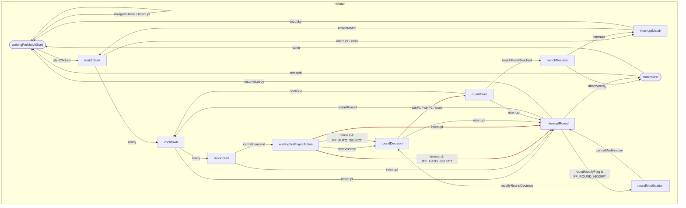

# PRD: Classic Battle Engine

---

**Supports:** [Classic Battle Mode PRD](prdClassicBattle.md)

---

## TL;DR

The Classic Battle Engine defines the core mechanics, state transitions, and round logic for JU-DO-KON!'s Classic Battle mode. It manages match setup, round progression, stat selection, scoring, timers, and end conditions, ensuring a smooth, accessible, and testable game flow. This PRD details the state machine, round logic, and technical requirements for the engine and orchestrator modules.

---

## Problem Statement

Classic Battle requires a **robust, deterministic engine** to manage match flow, scoring, and state transitions.  
In recent internal tests, **12–18% of matches** experienced timing inconsistencies or incorrect state transitions due to incomplete timer drift handling and unclear interrupt recovery logic.  

**From a player’s perspective:**  
> “The timer froze for me and then skipped my turn. I didn’t even get to pick my stat — that felt unfair.”  

Without a clear state machine and timer system, matches risk becoming **unpredictable**, **less accessible**, and **hard to test at scale**.  
A well-defined engine will enable consistent gameplay, predictable UI updates that display promptly, and full edge case handling for all device and connection scenarios.

---

## Goals

1. **Predictable Match Flow** — Ensure 100% of Classic Battle matches follow the defined state sequence from `classicBattleStates.json` with no skipped or duplicate states.  
2. **UI Feedback Speed** — Surface round results, timers, and scores to the UI within target response budgets.  
3. **Accessibility Compliance** — Meet WCAG 2.1 AA contrast, focus, and readability guidelines for all state and timer displays.  
4. **Test Coverage** — Achieve **≥95% automated test pass rate** for match state and timer scenarios in Playwright and unit tests.  
5. **Interrupt Recovery** — Handle 100% of quit, navigation, and error interrupts without corrupting match state or causing UI desync.

---

## Defaults (Developer Configurable)

- **Stat Selection Timer:** 30 seconds  
- **Win Target:** First to 5 round wins (or highest score when deck is exhausted)  

---

## User Stories

- As a developer, I want a state machine that exposes the current match state so I can drive UI updates and tests.  
- As a player, I want the game to progress smoothly through rounds, with clear feedback at each step.  
- As a tester, I want to simulate and verify all match states and transitions, including edge cases and interruptions.  
- As a player with accessibility needs, I want timers and messages to be surfaced in a way that is readable and responsive.

---

## Functional Requirements (Prioritized)

| Priority | Feature                      | Description                                                                                                                        |
|----------|------------------------------|------------------------------------------------------------------------------------------------------------------------------------|
| **P1**   | State Machine                | Implements all match states and transitions as defined in `classicBattleStates.json`. Exposes current state to UI and tests.       |
| **P1**   | Round Logic                  | Handles round start, stat selection, comparison, scoring, and round end.                                                          |
| **P1**   | Stat Selection Timer         | 30s timer for stat selection, with pause/resume and auto-select fallback (if `FF_AUTO_SELECT` enabled).                           |
| **P1**   | Scoring                      | Updates player and opponent scores after each round, including tie handling.                                                      |
| **P1**   | Match End Condition          | Ends match when win target or max rounds reached; exposes final result and score.                                                 |
| **P2**   | Interrupt Handling           | Supports early quit, navigation, or error interrupts; rolls back or ends match as appropriate.                                    |
| **P2**   | Accessibility Hooks          | Ensures all state and timer feedback meets WCAG AA guidelines.                                                                    |
| **P3**   | Debug/Test Hooks             | Exposes state, transitions, and logs for automated tests and debugging.                                                           |

---

## Acceptance Criteria (Given/When/Then Format)

1. **State Machine Accuracy**  
   - **Given** a match is running  
   - **When** a state transition occurs  
   - **Then** the new state must match the definition in `classicBattleStates.json` exactly.

2. **Timer Behavior**  
   - **Given** the player is in `waitingForPlayerAction`  
   - **When** the timer reaches zero  
   - **Then**  
     - If `FF_AUTO_SELECT` is enabled → system auto-selects the highest stat allowed by rules, and match proceeds to `roundDecision`.  
     - If `FF_AUTO_SELECT` is disabled → match proceeds to `interruptRound` or a defined grace extension.

3. **Timer Drift Handling**  
   - **Given** the tab is inactive or device clock drifts by >200ms  
   - **When** the player returns or drift is detected  
   - **Then** the timer adjusts to the correct remaining time without skipping or repeating.

4. **Score Update Speed**  
   - **Given** a round outcome is determined  
   - **When** the result is revealed  
   - **Then** the scoreboard updates both player and opponent scores promptly (p50 ≤250ms, p95 ≤500ms on reference hardware).

5. **Interrupt Stability**  
   - **Given** the player quits, navigates away, or triggers an error  
   - **When** the interrupt is handled  
   - **Then** the UI remains stable, the state is rolled back or ended appropriately, and no desync occurs.

---

## Edge Cases / Failure States

- **Timeout Auto-Select:** If enabled via `FF_AUTO_SELECT`, the engine auto-selects highest stat by ruleset; otherwise follow fallback path.  
- **Tab Inactivity / App Backgrounding:** Timers pause; state resumes accurately on return.  
- **Error Injection (Testing):** Engine must recover from simulated logic or UI hook errors without corrupting match state.

---

## Dependencies

- `classicBattleStates.json` defines all match states and transitions.  
- `BattleEngine.js` implements round logic, scoring, timer, and match end conditions.  
- `orchestrator.js` manages state machine, transitions, and exposes hooks for UI and tests.  
- `battleStateProgress.js` renders state progress bar and syncs active state.  
- Scoreboard UI and accessibility requirements as described in `prdBattleScoreboard.md`.

---

## Match Flow

The Classic Battle match follows a fixed sequence of states and transitions, as illustrated in the diagram below.  
Each state describes what the game is doing, what events trigger a change, and where it transitions next.  

- A numbered progress bar beneath the battle area shows the current state ID in ascending order, giving players a clear, accessible sense of match progression.

---

### 1. `waitingForMatchStart`
The game is idle before a match begins. The UI displays a “Start Match” button.

- **Triggers:**  
  - `startClicked` → **`matchStart`**  
  - `navigateHome` or `interrupt` → **`waitingForMatchStart`** (no match context yet, stays in lobby)  
- **Notes:** No cards are in play yet.

---

### 2. `matchStart`
The match setup phase — decks are shuffled, RNG is seeded, starting player is set.

- **Triggers:**  
  - `ready` → **`cooldown`**  
  - `interrupt / error` → **`interruptMatch`**  
- **Notes:** Pre-match animations and loading occur here.

---

### 3. `cooldown`
A short pacing pause between match start or rounds.

- **Triggers:**  
  - `ready` → **`roundStart`**  
  - `interrupt` → **`interruptRound`**  
- **Notes:** Scoreboard and snackbar show countdown to round.

---

### 4. `roundStart`
A new round begins — cards are drawn and prepared face-down.

- **Triggers:**  
  - `cardsRevealed` → **`waitingForPlayerAction`**  
  - `interrupt` → **`interruptRound`**  
- **Notes:** Reveal happens only after the `cardsRevealed` event.

---

### 5. `waitingForPlayerAction`
The game waits for a stat selection.

- **Triggers:**  
  - `statSelected` → **`roundDecision`**  
  - `timeout` (if `FF_AUTO_SELECT` enabled) → **`roundDecision`**  
  - `timeout` (if `FF_AUTO_SELECT` disabled) → **`interruptRound`**  
  - `interrupt` → **`interruptRound`**  
- **Notes:** Scoreboard shows timer and prompt; highlights selectable stats.

---

### 6. `roundDecision`
Compares selected stat values and determines the round winner.

- **Triggers:**  
  - `outcome=winP1 / outcome=winP2 / outcome=draw` → **`roundOver`**  
  - `interrupt` → **`interruptRound`**  
- **Notes:** Scoreboard shows result and reveals stats.

---

### 7. `roundOver`
Updates scores, executes card transfers, and sets next starting player.

- **Triggers:**  
  - `matchPointReached` (guard: winnerHasPointsToWin OR noCardsLeft) → **`matchDecision`**  
  - `continue` → **`cooldown`**  
  - `interrupt` → **`interruptRound`**

---

### 8. `matchDecision`
Determines the overall match winner.

- **Triggers:**  
  - `finalize` → **`matchOver`**  
  - `interrupt` → **`interruptMatch`**

---

### 9. `matchOver`
Match complete; final scoreboard displayed.

- **Triggers:**  
  - `rematch` → **`waitingForMatchStart`** (lobby path chosen)  
  - `home` → **`waitingForMatchStart`**

---

### 10. `interruptRound`
Round interrupted (quit, navigation, error).

- **Triggers:**  
  - `restartRound` → **`cooldown`**  
  - `resumeLobby` → **`waitingForMatchStart`**  
  - `abortMatch` → **`matchOver`**  
  - `roundModifyFlag` (if `FF_ROUND_MODIFY` enabled) → **`roundModification`**

---

### 11. `roundModification` (admin/test only)
Applies manual changes for testing or admin purposes.

- **Triggers:**  
  - `modifyRoundDecision` → **`roundDecision`**  
  - `cancelModification` → **`interruptRound`**

---

### 12. `interruptMatch`
Match interrupted from setup or critical error.

- **Triggers:**  
  - `restartMatch` → **`matchStart`**  
  - `toLobby` → **`waitingForMatchStart`**

---

## Transition Table

| State | Trigger | Guard (if any) | Next State | Notes |
|---|---|---|---|---|
| **waitingForMatchStart** | startClicked | – | matchStart | Begin match init. |
| waitingForMatchStart | navigateHome / interrupt | – | waitingForMatchStart | No match to abort; remain in lobby. |
| **matchStart** | ready | – | cooldown | Init complete, enter pacing pause. |
| matchStart | interrupt / error | – | interruptMatch | Critical abort path. |
| **cooldown** | ready | – | roundStart | Enter new round. |
| cooldown | interrupt | – | interruptRound | Round-level abort rail. |
| **roundStart** | cardsRevealed | – | waitingForPlayerAction | Reveal active cards. |
| roundStart | interrupt | – | interruptRound | Round-level abort rail. |
| **waitingForPlayerAction** | statSelected | – | roundDecision | Choice made. |
| waitingForPlayerAction | timeout | autoSelectEnabled | roundDecision | Auto-pick stat. |
| waitingForPlayerAction | timeout | !autoSelectEnabled | interruptRound | No auto-pick; treat as interrupt or grace. |
| waitingForPlayerAction | interrupt | – | interruptRound | Round-level abort rail. |
| **roundDecision** | outcome=winP1 / winP2 / draw | – | roundOver | Deterministic outcome. |
| roundDecision | interrupt | – | interruptRound | Round-level abort rail. |
| **roundOver** | matchPointReached | winnerHasPointsToWin OR noCardsLeft | matchDecision | Win target met or decks empty. |
| roundOver | continue | – | cooldown | Next round pacing. |
| roundOver | interrupt | – | interruptRound | Round-level abort rail. |
| **matchDecision** | finalize | – | matchOver | Declare winner. |
| matchDecision | interrupt | – | interruptMatch | Match-level abort rail. |
| **matchOver** | rematch | – | waitingForMatchStart | Return to lobby. |
| matchOver | home | – | waitingForMatchStart | Return to main screen. |
| **interruptRound** | restartRound | – | cooldown | Resume round loop. |
| interruptRound | resumeLobby | – | waitingForMatchStart | Exit to lobby. |
| interruptRound | abortMatch | – | matchOver | Cancel match. |
| interruptRound | roundModifyFlag | FF_ROUND_MODIFY | roundModification | Admin/test branch. |
| **roundModification** | modifyRoundDecision | – | roundDecision | Apply and re-evaluate. |
| roundModification | cancelModification | – | interruptRound | Discard changes. |
| **interruptMatch** | restartMatch | – | matchStart | Restart match. |
| interruptMatch | toLobby | – | waitingForMatchStart | Exit to lobby. |

---

## Mermaid Diagram of Game States

---

## Open Questions

- Should timer duration or win target be adjustable in future versions?
- How should additional difficulty settings or AI logic be integrated into the state machine?
- Are there additional edge cases or failure states that require explicit state handling?

---

**See also:**
- [Classic Battle PRD](prdClassicBattle.md)
- [Battle Scoreboard PRD](prdBattleScoreboard.md)
- [classicBattleStates.json](../../src/data/classicBattleStates.json)
- [BattleEngine.js](../../src/helpers/BattleEngine.js)
- [orchestrator.js](../../src/helpers/classicBattle/orchestrator.js)
- [battleStateProgress.js](../../src/helpers/battleStateProgress.js)

---

## Tasks

- [ ] 1.0 Implement State Machine
  - [ ] 1.1 Define states and transitions in `classicBattleStates.json`
  - [ ] 1.2 Create `orchestrator.js` to manage state changes
  - [ ] 1.3 Expose state via DOM and window hooks
- [ ] 2.0 Build Round Logic
  - [ ] 2.1 Implement stat selection handling
  - [ ] 2.2 Compare stat values and determine round winner
  - [ ] 2.3 Update scores and manage tie handling
- [ ] 3.0 Implement Timer System
  - [ ] 3.1 Create 30s stat selection timer with pause/resume
  - [ ] 3.2 Detect and correct drift; fire auto-select on expiry
  - [ ] 3.3 Surface timer state for UI and accessibility
- [ ] 4.0 Handle Interrupts
  - [ ] 4.1 Implement quit, error, and navigation interrupts
  - [ ] 4.2 Define rollback or match termination logic
- [ ] 5.0 Testing & Debugging
  - [ ] 5.1 Add Playwright hooks for automated state validation
  - [ ] 5.2 Add logging for all state transitions
  - [ ] 5.3 Create unit tests for timer and scoring logic
