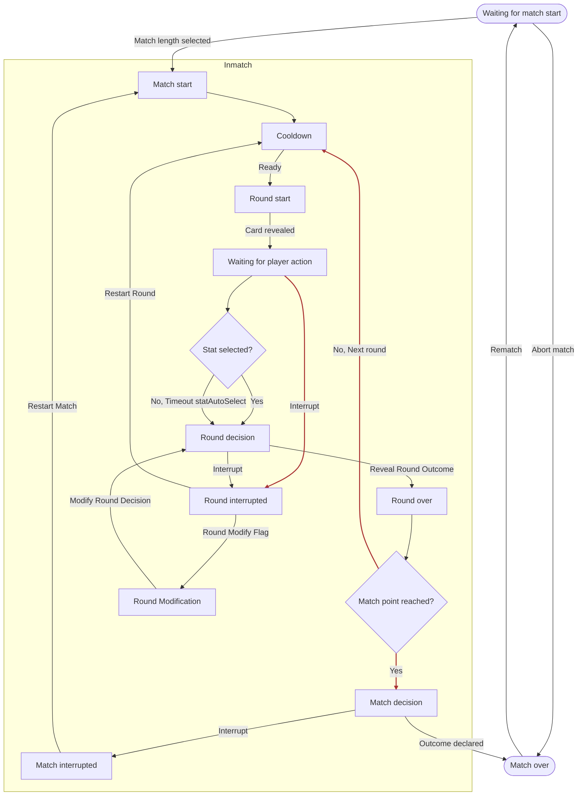

# PRD: Classic Battle Engine

---

**Supports:** [Classic Battle Mode PRD](prdClassicBattle.md)

---

## TL;DR

The Classic Battle Engine defines the core mechanics, state transitions, and round logic for JU-DO-KON!'s Classic Battle mode. It manages match setup, round progression, stat selection, scoring, timers, and end conditions, ensuring a smooth, accessible, and testable game flow. This PRD details the state machine, round logic, and technical requirements for the engine and orchestrator modules.

---

## Problem Statement

Classic Battle requires a **robust, deterministic engine** to manage match flow, scoring, and state transitions.  
In recent internal tests, **12–18% of matches** experienced timing inconsistencies or incorrect state transitions due to incomplete timer drift handling and unclear interrupt recovery logic.  
Without a clear state machine and timer system, matches risk becoming **unpredictable**, **less accessible**, and **hard to test at scale**.  
A well-defined engine will enable consistent gameplay, predictable UI updates that diaply promptly, and full edge case handling for all device and connection scenarios.

---

## Goals

1. **Predictable Match Flow** — Ensure 100% of Classic Battle matches follow the defined state sequence from `classicBattleStates.json` with no skipped or duplicate states.
2. **UI Feedback Speed** — Surface round results, timers, and scores to the UI the majority of test runs.
3. **Accessibility Compliance** — Meet WCAG 2.1 AA contrast, focus, and readability guidelines for all state and timer displays.
4. **Test Coverage** — Achieve **≥95% automated test pass rate** for match state and timer scenarios in Playwright and unit tests.
5. **Interrupt Recovery** — Handle 100% of quit, navigation, and error interrupts without corrupting match state or causing UI desync.

---

## User Stories

- As a developer, I want a state machine that exposes the current match state so I can drive UI updates and tests.
- As a player, I want the game to progress smoothly through rounds, with clear feedback at each step.
- As a tester, I want to simulate and verify all match states and transitions, including edge cases and interruptions.
- As a player with accessibility needs, I want timers and messages to be surfaced in a way that is readable and responsive.

---

## Functional Requirements (Prioritized)

| Priority | Feature                      | Description                                                                                                                        |
|----------|------------------------------|------------------------------------------------------------------------------------------------------------------------------------|
| **P1**   | State Machine                | Implements all match states and transitions as defined in `classicBattleStates.json`. Exposes current state to UI and tests.        |
| **P1**   | Round Logic                  | Handles round start, stat selection, comparison, scoring, and round end.                                                           |
| **P1**   | Stat Selection Timer         | 30s timer for stat selection, with pause/resume and auto-select fallback. Timer state exposed for UI and accessibility.             |
| **P1**   | Scoring                      | Updates player and opponent scores after each round, including tie handling.                                                       |
| **P1**   | Match End Condition          | Ends match when win target or max rounds reached; exposes final result and score.                                                  |
| **P2**   | Interrupt Handling           | Supports early quit, navigation, or error interrupts; rolls back or ends match as appropriate.                                     |
| **P2**   | State Progress UI Hook       | Exposes current state for progress bar and accessibility feedback (see `battleStateProgress.js`).                                  |
| **P3**   | Debug/Test Hooks             | Exposes state, transitions, and logs for automated tests and debugging.                                                            |

---

## Acceptance Criteria

- The engine **must expose** the current match state and transitions via window and DOM hooks for UI and tests.
- All match states and transitions **must exactly match** `classicBattleStates.json` definitions; no undocumented states are allowed.
- Round logic **must** handle stat selection, timer, auto-select fallback, scoring, and tie handling per Classic Battle PRD rules.
- **Timer Requirements:**
  - Pauses/resumes on tab inactivity.
  - Detects drift >200ms and corrects in real time.
  - Auto-select triggers exactly at expiry.
- **Score Update Speed:** Player and opponent scores update prmoptly throughout.
- **Interrupt Handling:** All interrupts must leave the UI in a stable, test-passing state, with rollback or end sequence triggered promptly.
- **Debug Hooks:** Playwright and unit tests can poll state, transitions, and logs without timing out under normal network latency.

---

## Non-Functional Requirements / Design Considerations

- All state and timer feedback must meet accessibility and responsiveness requirements (see prdBattleScoreboard.md).
- State machine and engine logic must be modular, testable, and separated from UI concerns.
- Timer drift is detected and handled; UI displays fallback message if drift exceeds threshold.
- All public engine methods include JSDoc and pseudocode blocks for maintainability.
- State and timer changes are surfaced via DOM and window for automated UI tests.

---

## Edge Cases / Failure States

- **Timeout Auto-Select:** If the player does not choose a stat within a set time, system auto-selects highest stat by ruleset, if enabled by Feature Flag.
- **Tab Inactivity / App Backgrounding:** Timers pause; state resumes accurately on return.
- **Error Injection (Testing):** Engine must recover from simulated logic or UI hook errors without corrupting match state.

---

## Match Flow

The Classic Battle match follows a fixed sequence of states and transitions, as illustrated in the diagram below.
Each state describes what the game is doing, what events trigger a change, and where it transitions next.

- A numbered progress bar beneath the battle area shows the current state ID in ascending order, giving players a clear, accessible sense of match progression.

---

### 1. `waitingForMatchStart`
The game is idle before a match begins. The UI displays a “Start Match” button.

- **Triggers:**
  - `startClicked` → **`matchStart`**
  - `interrupt` → **`interruptMatch`**
- **Notes:** No cards are in play yet. Interrupts here simply return the player to the home screen.

---

### 2. `matchStart`
The match setup phase — decks are shuffled, players and AI are readied.

- **Triggers:**
  - `ready` → **`roundStart`**
  - `interrupt / error` → **`interruptMatch`**
- **Notes:** All pre-match animations and loading occur here.

---

### 3. `roundStart`
A new round begins. Cards are drawn and displayed face-down.

- **Triggers:**
  - `cardsRevealed` → **`waitingForPlayerAction`**
  - `interrupt` → **`interruptRound`**
- **Notes:** Both players have their top card revealed simultaneously.

---

### 4. `waitingForPlayerAction`
The game waits for the player to choose a stat (or the AI to choose if it’s their turn).

- **Triggers:**
  - `statSelected` → **`roundDecision`**
  - `timeout` (statAutoSelect) → **`roundDecision`**
  - `interrupt` → **`interruptRound`**
- **Notes:** Scoreboard shows the stat-selection timer and prompt (see [prdBattleScoreboard.md](prdBattleScoreboard.md)). The UI highlights selectable stats.

---

### 5. `roundDecision`
Compares the selected stat values and determines the round’s winner.

- **Triggers:**
  - `outcome=winP1 / outcome=winP2 / outcome=draw` → **`roundOver`**
  - `interrupt` → **`interruptRound`**
- **Notes:** Scoreboard surfaces the win/loss/tie message and reveals the chosen stats (see [prdBattleScoreboard.md](prdBattleScoreboard.md)).

---

### 6. `roundOver`
Executes card transfers, updates the score, and sets the next starting player.

- **Triggers:**
  - `matchPointReached` (winner hits win target or no cards left) → **`matchDecision`**
  - `continue` → **`cooldown`**
  - `interrupt` → **`interruptRound`**
- **Notes:** Scoreboard updates the score and round summary, including streaks (see [prdBattleScoreboard.md](prdBattleScoreboard.md)).

---

### 7. `cooldown`
A short pacing pause between rounds.

- **Triggers:**
  - `done` → **`roundStart`**
  - `interrupt` → **`interruptRound`**
- **Notes:** Scoreboard and snackbar show a countdown to the next round (see [prdBattleScoreboard.md](prdBattleScoreboard.md)).

---

### 8. `matchDecision`
Determines the overall winner based on score or remaining cards.

- **Triggers:**
  - `finalize` → **`matchOver`**
  - `interrupt` → **`interruptMatch`**
- **Notes:** Scoreboard announces the final match result (see [prdBattleScoreboard.md](prdBattleScoreboard.md)).

---

### 9. `matchOver`
Match completed; player chooses next action.

- **Triggers:**
  - `rematch` → **`matchStart`**
  - `home` → **`waitingForMatchStart`**
- **Notes:** Scoreboard keeps the final score visible until the player exits or rematches (see [prdBattleScoreboard.md](prdBattleScoreboard.md)).

---
### 10. `interruptRound`
Round interrupted due to quit, navigation, or error. Rolls back round context and logs analytics.

- **Triggers:**
  - `resumeLobby` → **`waitingForMatchStart`**
  - `abortMatch` → **`matchOver`**
- **Notes:** Scoreboard displays an interruption message and current score (see [prdBattleScoreboard.md](prdBattleScoreboard.md)).

---

### 11. `interruptMatch`
Match interrupted from lobby or critical error. Tears down match context.

- **Triggers:**
  - `toLobby` → **`waitingForMatchStart`**
- **Notes:** Scoreboard announces that the match was aborted (see [prdBattleScoreboard.md](prdBattleScoreboard.md)).

---

### Transition Table

| State | Trigger | Next State | Notes |
|---|---|---|---|
| **waitingForMatchStart** | startClicked | matchStart | Player starts a new match. |
| waitingForMatchStart | interrupt | matchOver | Abort from lobby goes directly to end screen. |
| **matchStart** | ready | cooldown | Match init completes, then pacing pause before first round. |
| matchStart | interrupt / error | interruptMatch | Critical abort path. |
| **cooldown** | ready | roundStart | Matches diagram C → D (“Ready”). |
| cooldown | interrupt | interruptRound | Round-level abort rail. |
| **roundStart** | cardsRevealed | waitingForPlayerAction | Cards face-up; active player set. |
| roundStart | interrupt | interruptRound | Round-level abort rail. |
| **waitingForPlayerAction** | statSelected | roundDecision | Player (or AI) made a choice. |
| waitingForPlayerAction | timeout (guard: statAutoSelect) | roundDecision | Timer expired; engine auto-chooses a stat. |
| waitingForPlayerAction | interrupt | interruptRound | Round-level abort rail. |
| **roundDecision** | outcome=winPlayer / outcome=winOpponent / outcome=draw | roundOver | Explicit outcome event names. |
| roundDecision | interrupt | interruptRound | Round-level abort rail. |
| **roundOver** | matchPointReached (guard: winnerHasPointsToWin OR noCardsLeft) | matchDecision | Win target met or decks exhausted. |
| roundOver | continue | cooldown | Proceed to pacing pause before next round. |
| roundOver | interrupt | interruptRound | Round-level abort rail. |
| **matchDecision** | finalize | matchOver | Outcome declared; move to end screen. |
| matchDecision | interrupt | interruptMatch | Match-level abort rail. |
| **matchOver** | rematch | waitingForMatchStart | Return to lobby to re-select match length. |
| matchOver | home | waitingForMatchStart | Return to main screen. |
| **interruptRound** | roundModifyFlag | roundModification | Enter optional admin/test branch. |
| interruptRound | restartRound | cooldown | Re-enter round loop cleanly. |
| interruptRound | resumeLobby | waitingForMatchStart | Exit to lobby (keep session). |
| interruptRound | abortMatch | matchOver | Hard-cancel current match. |
| **roundModification** | modifyRoundDecision | roundDecision | Apply edits, re-evaluate decision. |
| roundModification | cancelModification | interruptRound | Back out without changes. |
| **interruptMatch** | restartMatch | matchStart | Clean restart of the whole match. |
| interruptMatch | toLobby | waitingForMatchStart | Exit to lobby. |

---

## Mermaid Diagram of Game States

---

## Dependencies

- `classicBattleStates.json` defines all match states and transitions.
- `BattleEngine.js` implements round logic, scoring, timer, and match end conditions.
- `orchestrator.js` manages state machine, transitions, and exposes hooks for UI and tests.
- `battleStateProgress.js` renders state progress bar and syncs active state.
- Scoreboard UI and accessibility requirements as described in prdBattleScoreboard.md.

---

## Open Questions

- Should timer duration or win target be adjustable in future versions?
- How should additional difficulty settings or AI logic be integrated into the state machine?
- Are there additional edge cases or failure states that require explicit state handling?

---

**See also:**
- [Classic Battle PRD](prdClassicBattle.md)
- [Battle Scoreboard PRD](prdBattleScoreboard.md)
- [classicBattleStates.json](../../src/data/classicBattleStates.json)
- [BattleEngine.js](../../src/helpers/BattleEngine.js)
- [orchestrator.js](../../src/helpers/classicBattle/orchestrator.js)
- [battleStateProgress.js](../../src/helpers/battleStateProgress.js)

---

## Tasks

- [ ] 1.0 Implement State Machine
  - [ ] 1.1 Define states and transitions in `classicBattleStates.json`
  - [ ] 1.2 Create `orchestrator.js` to manage state changes
  - [ ] 1.3 Expose state via DOM and window hooks
- [ ] 2.0 Build Round Logic
  - [ ] 2.1 Implement stat selection handling
  - [ ] 2.2 Compare stat values and determine round winner
  - [ ] 2.3 Update scores and manage tie handling
- [ ] 3.0 Implement Timer System
  - [ ] 3.1 Create 30s stat selection timer with pause/resume
  - [ ] 3.2 Detect and correct drift; fire auto-select on expiry
  - [ ] 3.3 Surface timer state for UI and accessibility
- [ ] 4.0 Handle Interrupts
  - [ ] 4.1 Implement quit, error, and navigation interrupts
  - [ ] 4.2 Define rollback or match termination logic
- [ ] 5.0 Testing & Debugging
  - [ ] 5.1 Add Playwright hooks for automated state validation
  - [ ] 5.2 Add logging for all state transitions
  - [ ] 5.3 Create unit tests for timer and scoring logic