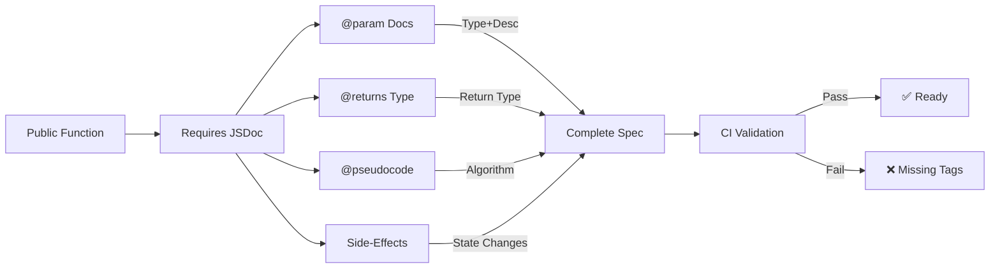
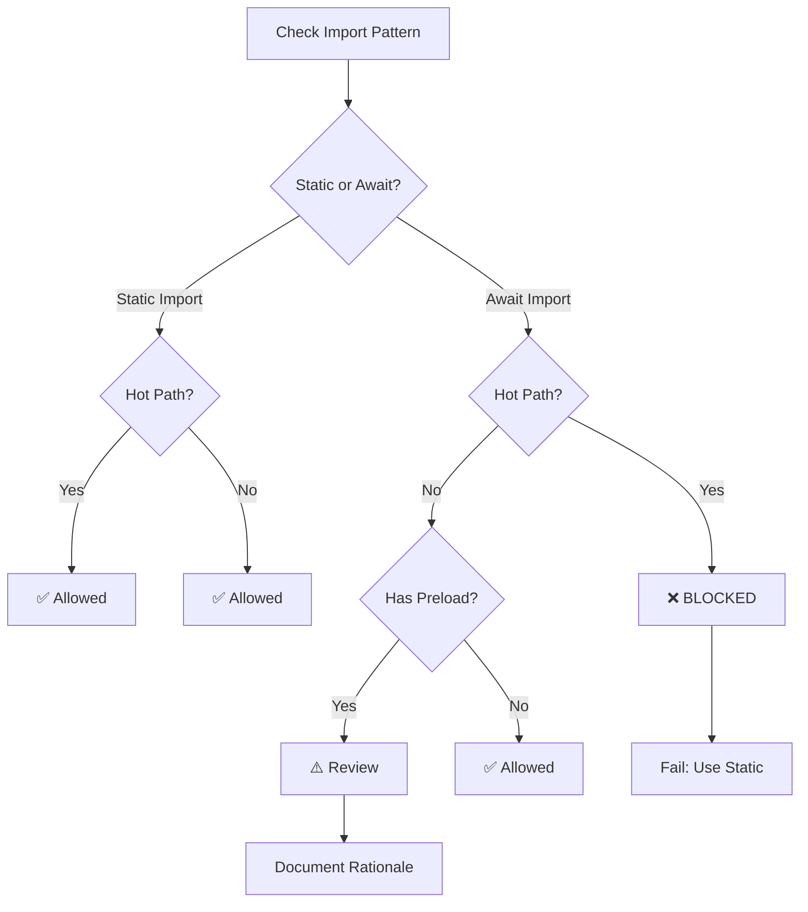

# Code Standards PRD

## TL;DR

This PRD consolidates developer-facing standards that affect product quality and public contracts: JSDoc/pseudocode requirements, testing standards, Playwright evaluation guidelines, and the rules agents must follow when changing public APIs. It references the consolidated guidance in [PRD: Development Standards](./prdDevelopmentStandards.md) and [PRD: Testing Standards](./prdTestingStandards.md) (formerly stored in `design/codeStandards/`) and codifies sections that must be treated as product requirements.

## Problem Statement / Why it matters

Inconsistent code standards lead to unclear public API contracts, brittle tests, and reduced maintainability. Some code standard items are critical enough to be enforced as product-level requirements (for example: `@pseudocode` JSDoc on public functions and no dynamic imports in hot paths).

## Goals / Success Metrics

- Consolidate code standards that map to product-quality or contract requirements.
- Ensure AI agents and humans can detect and enforce the most important rules automatically (lint/CI checks).

## User Stories

- As a code reviewer, I want clear rules about public API documentation so I can enforce them consistently.
- As an AI agent, I want a machine-readable list of constraints (e.g., no `await import()` in hot paths).

## Standards Enforcement Diagrams

### 6.9.1: Code Review Standards Validation Pipeline

```mermaid
flowchart TD
    A[PR Submitted] -->|Hook| B[Lint Check]
    B -->|eslint| C{Errors?}
    C -->|Yes| D[Fail: Fix Lint]
    C -->|No| E[JSDoc Check]
    E -->|@pseudocode| F{Complete?}
    F -->|No| G[Fail: Add Docs]
    F -->|Yes| H[Hot-Path Check]
    H -->|await import| I{Violations?}
    I -->|Yes| J[Fail: Use Static]
    I -->|No| K[Test Coverage]
    K -->|Happy+Edge| L{≥80%?}
    L -->|No| M[Fail: Add Tests]
    L -->|Yes| N[PASS: Merge]
    
    style A fill:#lightblue
    style B fill:#lightyellow
    style E fill:#lightyellow
    style H fill:#lightyellow
    style K fill:#lightyellow
    style D fill:#lightsalmon
    style G fill:#lightsalmon
    style J fill:#lightsalmon
    style M fill:#lightsalmon
    style N fill:#lightgreen
```

**Standards Validation Pipeline:**
Every PR submission triggers automated checks: linting for syntax/style, JSDoc for public API documentation (@pseudocode tags), import policy for hot paths (no dynamic imports), and test coverage requirements. All checks must pass before merge.

### 6.9.2: Public API Documentation Requirements



**API Documentation Checklist:**
All public functions (exported from modules) must include complete JSDoc with @pseudocode blocks describing the algorithm and @param/@returns documenting inputs/outputs. Side-effects and state mutations must be explicitly documented for clarity and maintainability.

### 6.9.3: Hot-Path Import Policy & Rule Enforcement



**Hot-Path Import Restrictions:**
Hot-path files (battle engine, stat selection, render loops) must use static imports to guarantee deterministic load times. Dynamic imports are blocked on hot paths; optional heavy modules use preload strategies instead. This ensures consistent <300ms performance targets.

---

## Prioritized Functional Requirements

P1 - Public API Documentation Rule: All public functions must include `@pseudocode` in JSDoc and a short description of side-effects.

Acceptance Criteria:

- CI check or checklist references this rule; examples included.

P1 - Hot-path Import Rule: Hot-path files must use static imports; dynamic imports are allowed only for optional/large modules with a preload strategy.

Acceptance Criteria:

- A list of hot-path files is referenced and the rule is documented (see `design/productRequirementsDocuments/prdArchitecture.md` for hot-path guidance).

P2 - Test Quality Standards: Define minimal test coverage requirements for PRs touching public APIs (happy path + 1 edge case) and fake timer usage for time-sensitive logic.

Acceptance Criteria:

- The testing standards are referenced; example tests and required patterns are included.

P2 - Playwright/E2E Conventions: Document selector strategy and avoidance of direct DOM manipulation in tests.

Acceptance Criteria:

- Playwright guidance exists and links to `playwright/` fixtures and example tests.

## Non-Functional Requirements / Design Considerations

- CI must run linters and test suites on PRs that touch public APIs.
- Static analysis should flag missing `@pseudocode` tags or dynamic imports in hot paths.

## Dependencies and Open Questions

- Consolidates content from the retired `design/codeStandards/*.md` documents now captured within [PRD: Development Standards](./prdDevelopmentStandards.md) and [PRD: Testing Standards](./prdTestingStandards.md).
- Open question: whether `@pseudocode` is required in private helper functions that are exported for testing only.
