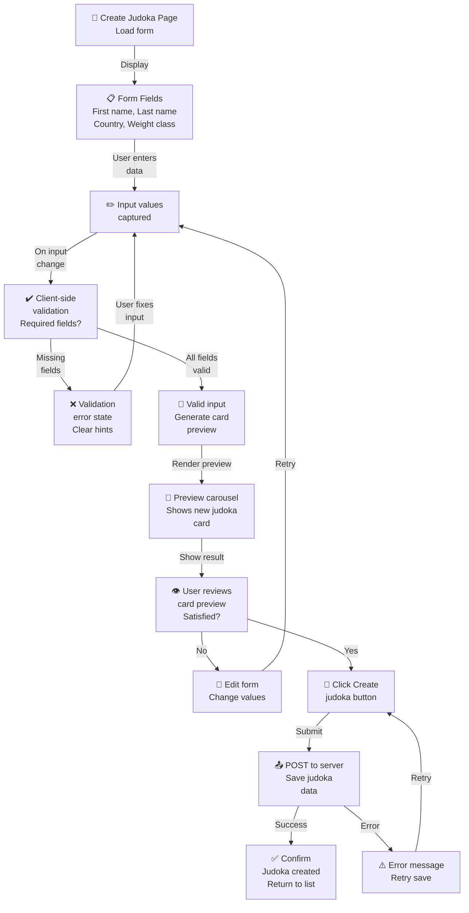

# PRD: Create Judoka

---

## TL;DR

The Create Judoka page lets admins enter core identity details and preview a new judoka card before saving.

**URL:** `createJudoka.html`

[Back to Game Modes Overview](prdGameModes.md)

---

## Create Judoka Form Workflow

**Form Entry → Validation → Preview → Save Flow**:

**Form Input Validation States**:

| Field        | Type            | Required? | Validation                       | Status                  |
| ------------ | --------------- | --------- | -------------------------------- | ----------------------- |
| First name   | Text input      | ✅ Yes    | Non-empty string                 | HTML required attribute |
| Last name    | Text input      | ✅ Yes    | Non-empty string                 | HTML required attribute |
| Country      | Select dropdown | ✅ Yes    | Valid country code (JPN/FRA/USA) | HTML required attribute |
| Weight class | Numeric input   | ✅ Yes    | Valid numeric format             | inputmode="numeric"     |

**Status Badge**: ✅ **VERIFIED** — Validated against:

- `src/pages/createJudoka.html` — Form markup and structure
- `src/pages/createJudoka.init.js` — Form initialization and submission handling
- `tests/pages/createJudoka.test.js` — Form validation unit tests
- `playwright/create-judoka.spec.js` — End-to-end form submission tests

**Related Diagrams**:

- [Update Judoka](prdUpdateJudoka.md) — Edit form workflow
- [Browse Judoka](prdBrowseJudoka.md) — List context after creation

---

## Page Purpose

Provide a lightweight form for creating a new judoka with just the basics (name, country, weight class) and a live preview surface for rendering the resulting card.

---

## Entry Point

- **URL:** `createJudoka.html`
- **Expected access:** Admin-only entry points (see [Game Modes](prdGameModes.md)).

---

## Form Fields & Validation

The page presents a single-column form with required inputs. Validation is driven by the browser-required constraints and the field types.

| Field        | Control                           | Validation Rules | Notes                                                                                                                  |
| ------------ | --------------------------------- | ---------------- | ---------------------------------------------------------------------------------------------------------------------- |
| First name   | Text input (`#judoka-first-name`) | Required         | `autocomplete="given-name"` and `name="firstname"`.                                                                    |
| Last name    | Text input (`#judoka-last-name`)  | Required         | `autocomplete="family-name"` and `name="lastname"`.                                                                    |
| Country      | Select (`#judoka-country`)        | Required         | Options: Japan (`JPN`), France (`FRA`), United States (`USA`). Includes a blank "Select a country" placeholder option. |
| Weight class | Text input (`#judoka-weight`)     | Required         | `inputmode="numeric"` with placeholder `-73kg`. `name="weight"`.                                                       |

---

## Submit Button & Help Text

- **Submit label:** `Create Judoka` (primary button).
- **Help text (header):** "Enter a judoka's basics to preview their card before saving." Provides guidance for the form purpose.
- **Help text (hint):** "Fields are required for card previews and creation." Reinforces required validation expectations.

---

## Preview Carousel Container

- The page includes a hidden preview container: `#carousel-container` inside `#carousel-section`.
- **Intent:** reserve space for rendering a judoka card carousel preview once inputs are provided.
- **Initial state:** hidden via the `hidden` class; revealed when preview content is available.

---

## Navigation Context

The top navbar provides quick access to key modes:

- Classic Battle (`battleClassic.html`)
- Update Judoka (`updateJudoka.html`)
- Random Judoka (`randomJudoka.html`)
- Browse Judoka (`browseJudoka.html`)
- Meditation (`meditation.html`)
- Settings (`settings.html`)

---

## Open Questions

- None documented for this page yet.

---

[Back to Game Modes Overview](prdGameModes.md)
