# Data Schemas PRD

## TL;DR

This PRD defines the canonical data shapes, validation rules, and lifecycle for the project's core domain objects (e.g., `judoka`, `card`, `navigationMap`, `settings`). It establishes where schemas live, how to change them, and the expected compatibility guarantees.

---

## Quick Reference

This document defines the canonical data structures for all major entities in the JU-DO-KON! system, including judoka entries, battle configuration, and game data. Each schema shows required fields, types, and examples.

**Search Keywords**: canonical schema, data structure definition, judoka entry, schema validation, structured data

---

## Data Schema Architecture

**Core Entity Relationships**:

```mermaid
graph LR
    A["⚔️ Judoka<br/>id, name, stats<br/>signatureMove, card"] -->|"1:1"| B["📊 Stats<br/>power, speed<br/>technique<br/>kumikIta, newaza"]
    A -->|"M:1"| C["🌍 Country<br/>code, name"]
    A -->|"1:1"| D["🎴 Card<br/>rarity, code<br/>weight class"]
    A -->|"1:1"| E["📝 Bio<br/>firstName, surname<br/>birthday"]
    C -->|"References"| G["🗂️ Country Codes<br/>ISO 3166-1 alpha-2"]
    H["⚙️ Settings<br/>sound, UI, theme<br/>feature flags"] -->|"References"| I["🏳️ Feature Flags<br/>enabled, tooltip"]
    L["💬 Stat Names<br/>id, name<br/>japanese, description"] -->|"Maps stat<br/>indices"| B
    M["🥋 Gokyo Techniques<br/>nage-waza<br/>katame-waza"] -->|"Taxonomy for"| N["🏅 Signature Moves<br/>technique ID<br/>name, description"]
    style A fill:#lightgreen
    style B fill:#lightyellow
    style H fill:#lightblue
    style G fill:#lightyellow
```



**Schema Validation Lifecycle**:

```mermaid
graph TD
    A["📝 Data change<br/>judoka.json<br/>or schema"] -->|"Update required"| B["🔁 Update Schema<br/>src/schemas/*.json<br/>Add/modify properties"]
    B -->|"Use JSON Schema<br/>Draft-07"| C["🔍 Validate Structure<br/>Required fields?<br/>Type constraints?"]
    C -->|"Pass"| D["✅ Run validate:data<br/>npm run validate:data<br/>Executes validateData.js"]
    D -->|"Ajv engine"| E["🧪 Check all<br/>data files<br/>against schemas"]
    E -->|"Success"| F["✨ All valid<br/>Ready to commit<br/>Update PRD"]
    E -->|"Errors"| G["❌ Schema mismatch<br/>Fix data or schema<br/>Re-validate"]
    G -->|"Retry"| D
    style A fill:#lightgreen
    style F fill:#lightcyan
    style D fill:#lightyellow
    style G fill:#lightsalmon
```



**Schema Hierarchy**:


**Performance & Validation SLAs**:

| Metric                    | Target                    |
| ------------------------- | ------------------------- |
| Schema validation (build) | < 500ms for full data set |
| Runtime validation        | < 10ms per object         |
| Schema file size          | < 50KB each               |
| Data payload size         | < 5MB (judoka.json)       |
| Ajv compilation           | < 100ms per schema        |

**Status Badge**: ✅ **VERIFIED** — Validated against:

- `src/schemas/judoka.schema.json` — Canonical judoka schema
- `src/schemas/settings.schema.json` — Settings/feature flags schema
- `src/schemas/commonDefinitions.schema.json` — Shared type definitions
- `src/data/judoka.json` — Real judoka payload (200+ entries)
- `src/data/statNames.json` — Stat name mappings
- `scripts/validateData.js` — Validation workflow script
- `tests/validation/schema-validation.test.js` — Schema compliance tests

**Related Diagrams**:

- [Settings Menu](prdSettingsMenu.md#configuration-structure) — Settings schema usage in UI
- [Battle Scoreboard](prdBattleScoreboard.md) — Stat data structure in display context
- [Create Judoka](prdCreateJudoka.md) — Form workflow for schema creation

---

## Problem Statement / Why it matters

Inconsistent data shapes cause runtime errors, UI breakage, and brittle tests. Tests and integrations depend on stable schemas. We need a single source of truth describing canonical fields, validation, and deprecation policy.

## Goals / Success Metrics

- Provide machine-parseable canonical schemas for core objects.
- Define a clear migration and deprecation policy for schema changes.
- Ensure consumer libraries/tests validate input and fail fast when schemas change.

## User Stories

- As a backend/data author, I want to know the canonical structure of a `judoka` so I can produce valid exports.
- As a frontend engineer, I want typed/validated data so the UI fails early and gracefully.

## Prioritized Functional Requirements

P1 - Canonical Schemas: Publish canonical schemas for `judoka`, `card`, `navigationMap`, and `settings`.

Acceptance Criteria:

- Each schema exists under `src/schemas/` (canonical source for runtime/CI validation). Prototype explorations may live under `design/dataSchemas/`, but the production contract is always the `src/schemas/` copy.

## Canonical `judoka` schema (example)

Below is the canonical JSON Schema for the judoka list. The root is an array of judoka objects (not a single object), and `id` is an integer.

```json
{
  "$schema": "http://json-schema.org/draft-07/schema#",
  "$id": "https://judokon.dev/schemas/judoka.schema.json",
  "title": "Judoka List",
  "type": "array",
  "items": {
    "type": "object",
    "properties": {
      "id": {
        "type": "integer",
        "description": "Unique identifier for the judoka."
      },
      "firstname": {
        "type": "string",
        "description": "First name of the judoka."
      },
      "surname": {
        "type": "string",
        "description": "Surname of the judoka."
      },
      "country": {
        "type": "string",
        "description": "Country of the judoka."
      },
      "countryCode": {
        "$ref": "https://judokon.dev/schemas/commonDefinitions.schema.json#/definitions/CountryCode",
        "description": "ISO 3166-1 alpha-2 country code."
      },
      "weightClass": {
        "$ref": "https://judokon.dev/schemas/commonDefinitions.schema.json#/definitions/WeightClass",
        "description": "Weight class of the judoka."
      },
      "stats": {
        "allOf": [
          { "$ref": "https://judokon.dev/schemas/commonDefinitions.schema.json#/definitions/Stats" }
        ],
        "description": "Performance stats of the judoka."
      },
      "signatureMoveId": {
        "type": "integer",
        "description": "ID of the judoka's signature move."
      },
      "lastUpdated": {
        "type": "string",
        "format": "date-time",
        "description": "Timestamp of the last update."
      },
      "profileUrl": {
        "type": "string",
        "format": "uri",
        "description": "URL to the judoka's profile."
      },
      "bio": {
        "type": "string",
        "description": "Biography of the judoka."
      },
      "gender": {
        "type": "string",
        "enum": ["male", "female"],
        "description": "Gender of the judoka."
      },
      "isHidden": {
        "type": "boolean",
        "description": "Visibility status of the judoka."
      },
      "rarity": {
        "type": "string",
        "enum": ["Common", "Epic", "Legendary"],
        "description": "Rarity level of the judoka."
      },
      "cardCode": {
        "type": "string",
        "description": "Unique card code for the judoka."
      },
      "matchesWon": {
        "type": "integer",
        "description": "Number of matches won by the judoka."
      },
      "matchesLost": {
        "type": "integer",
        "description": "Number of matches lost by the judoka."
      },
      "matchesDrawn": {
        "type": "integer",
        "description": "Number of matches drawn by the judoka."
      }
    },
    "required": [
      "id",
      "firstname",
      "surname",
      "country",
      "countryCode",
      "weightClass",
      "stats",
      "signatureMoveId",
      "lastUpdated",
      "profileUrl",
      "bio",
      "gender",
      "isHidden",
      "rarity",
      "cardCode",
      "matchesWon",
      "matchesLost",
      "matchesDrawn"
    ]
  }
}
```

Place this file at `src/schemas/judoka.schema.json` (canonical source). Design discussions can stage drafts under `design/dataSchemas/`, but the build and validation tooling loads schemas exclusively from `src/schemas/`.

## Canonical `settings` schema

The runtime settings payload is a single object with a strict set of required fields and optional configuration maps. Unknown keys are rejected (`additionalProperties: false`).

**Required fields**

- `sound` (boolean): Enable or disable game sound effects.
- `motionEffects` (boolean): Enable animated motion effects.
- `typewriterEffect` (boolean): Animate meditation quotes with a typewriter effect.
- `tooltips` (boolean): Globally enable or disable UI tooltips.
- `showCardOfTheDay` (boolean): Display the Card of the Day on the landing screen.
- `displayMode` (string): Visual display mode. Valid values are `light` and `dark`, plus legacy values that normalize to `dark` at runtime:
  - `retro` (deprecated legacy value)
  - `high-contrast` (deprecated legacy value)
- `fullNavigationMap` (boolean): Enable the full navigation map overlay.

**Optional sections (implemented in the schema)**

- `aiDifficulty` (string enum): `easy`, `medium`, or `hard`.
- `tooltipIds` (object map): Keys map to tooltip IDs (string values).
- `gameModes` (object map): Keys map to boolean enable/disable flags.
- `featureFlags` (object map): Keys map to feature flag objects with this shape:
  - `enabled` (boolean, required)
  - `tooltipId` (string, optional)
  - `hidden` (boolean, optional)
  - `additionalProperties: false` on each flag entry

**Schema source**: `src/schemas/settings.schema.json`

P1 - Validation Utilities: Provide validator utilities or schema references for runtime validation in dev/test.

Acceptance Criteria:

- A small example validator or JSON schema is present and referenced in this PRD.

### Validator guidance (example)

We recommend using a lightweight runtime validator (AJV) during development and CI to catch schema regressions early. Example usage (pseudo-code):

```js
import Ajv from "ajv";
import judokaSchema from "../../src/schemas/judoka.schema.json";

const ajv = new Ajv({ allErrors: true });
const validate = ajv.compile(judokaSchema);

function validateJudokaList(payload) {
  const ok = validate(payload);
  if (!ok) throw new Error("Invalid judoka list payload: " + ajv.errorsText(validate.errors));
}
```

Acceptance Criteria (validator):

- A repository example exists showing how to validate a `judoka` list payload using AJV or equivalent.
- CI job (or local script) can run a schema validation step against sample data and fail when validation errors exist.

## Schema Validation Workflow

- Run `npm run validate:data` to validate all schema/data pairs. The command executes `scripts/validateData.js`, which loads each schema and data module and validates them in-process using Ajv.
- Ensure every new schema/data pair is covered by the workflow (e.g., `gameModes`, `weightCategories`, `navigationItems`, `gameTimers`).
- Treat the validation script as part of the core CI contract—include it in local pre-merge checks and rerun it whenever schemas or data modules change.
- When adding fields to a data file, update the matching schema with the new property, mark it as `required` when applicable, and re-run validation. Update dependent tests or helpers at the same time to avoid drift.

### Ajv integration expectations

- Ajv is the canonical validation engine. When adding new schemas, prefer Ajv programmatic usage over ad-hoc validation logic.
- Configure Ajv with `allErrors: true` so contributors see complete error details during validation runs.
- Use `ajv.errorsText(validate.errors)` (or equivalent) when surfacing validation failures in scripts to produce actionable error messages.

### `$id` and shared definitions

- Every schema file MUST declare a unique `$id` so other schemas can reference it without relative paths.
- Shared structures belong in `src/schemas/commonDefinitions.schema.json`. Use `$ref` to import definitions (e.g., `https://judokon.dev/schemas/commonDefinitions.schema.json#/definitions/Stats`).
- Keep shared definitions small and composable. When multiple schemas repeat identical structures, factor them into the shared definitions file instead of duplicating validation rules.

### Enum and constraint maintenance

- Model constrained fields with `enum` or `pattern` clauses so the validation workflow catches incorrect values. Example: enforce valid Gokyo technique `category`/`subCategory` combinations via `enum` lists.
- The `CountryCode` and `WeightClass` enums in `src/schemas/commonDefinitions.schema.json` are the canonical sources for ISO country codes and IJF weight classes. Update those arrays (either manually or via generation scripts) and re-run `npm run validate:data` to confirm downstream data still conforms.
- Maintain consistent casing for JSON keys (default to camelCase) so schema expectations align with helper utilities and tests.

## `statNames.json` (CLI stat labels)

The `statNames.json` file defines the CLI-facing stat labels and descriptions used by the battle CLI. Each entry represents a single stat definition with human-readable labels and explanatory text for the CLI UI.

**Schema fields (per entry):**

- `id` (number): Unique identifier for the stat record.
- `statIndex` (number): Index used to map the stat to gameplay ordering (e.g., 1 = Power).
- `name` (string): English display name for the stat label.
- `category` (string): Domain grouping for the stat (currently `"Judo"`).
- `japanese` (string): Japanese label (katakana/kanji) for the stat.
- `description` (string): CLI tooltip/description text for the stat label.

**Loading behavior:**

- `src/pages/battleCLI/init.js` attempts to load the data by calling `fetchJson("statNames.json")` and falls back to the local in-bundle `statNamesData` import when the fetch fails or returns empty data.

**Intended use:**

- Provides CLI stat labels and descriptions for the battle CLI interface (stat selection prompts, label rendering, and short descriptions in the CLI flow).

### Implementation references

- **Gokyo technique categories**: Use the canonical taxonomy when modeling `gokyo` data. Valid `category` values are `Nage-waza` or `Katame-waza`. Valid `subCategory` values are:
  - `Te-waza`
  - `Koshi-waza`
  - `Ashi-waza`
  - `Ma-sutemi-waza`
  - `Yoko-sutemi-waza`
  - `Osae-komi-waza`
  - `Shime-waza`
  - `Kansetsu-waza`
- **Country code utilities**: `src/utils/countryCodes.js` provides `getCountryByCode`, `getCodeByCountry`, and `listCountries` helpers backed by `src/data/countryCodeMapping.json`. Reference these utilities when implementing data workflows so schema changes stay aligned with runtime lookups.

P2 - Versioning & Deprecation Policy: Define minor/major change rules and how to announce/rollout changes.

Acceptance Criteria:

- Documented policy with examples (add optional field = minor; remove field = major + migration plan).

## Versioning and Change Policy (detailed)

Policy goals: make changes discoverable, testable, and minimally disruptive.

Change types:

- Patch: non-behavioral metadata changes (no schema change).
- Minor: additive changes that are backwards-compatible (adding an optional field, loosening validation where safe).
- Major: breaking changes (removing or renaming required fields, changing types) that require migration.

Required process for schema changes:

1. Update the relevant PRD (this document) with rationale, compatibility impact, and migration plan.

2. Add schema changes in a feature branch and include schema validation tests.

3. For major changes, provide a compatibility shim (e.g., transform older payloads at runtime or emit both event versions) and a migration script where needed.

4. Document the change in the project's changelog and notify stakeholders (tests, tools, and teams).

Acceptance Criteria (versioning):

- The PR that changes a schema must reference this PRD and include tests that demonstrate the impact (CI must run validation tests).
- Major changes must include a documented rollback/migration plan and a suggested deprecation period (e.g., 7 days) during which both old and new shapes are accepted.

P2 - Migration Guidance: How to perform compatible migrations, feature flags for rolling changes, and example rollback plan.

Acceptance Criteria:

- At least one migration example is included.

## Migration example (removing `legacyRank`)

Scenario: we need to remove an optional field `legacyRank` that some clients still produce.

Steps:

1. Mark `legacyRank` as deprecated in the canonical schema and update this PRD with rationale and developer notes.
2. Implement a compatibility shim in the data ingestion layer that maps `legacyRank` → `metadata.legacyRank` or derives an equivalent if needed.
3. Add CI tests that validate both the pre-migration and post-migration payloads.
4. Deploy the shim and monitor errors/telemetry for 7 days.
5. After the deprecation window and stakeholder sign-off, remove `legacyRank` requirement from schema and publish major version bump.

Acceptance Criteria (migration):

- A step-by-step plan exists in the PR changing the schema and CI proves both shapes validate (shim active).
- Telemetry shows zero unhandled validation failures for 7 days before final removal.

## Non-Functional Requirements / Design Considerations

- Performance: Schema validation must be cheap; prefer build-time checks for production.
- Observability: Schema validation failures must be logged with clear payload and source.

## Governance / Ownership

- Each canonical schema MUST declare an owner (team or person) and a contact for migration / review decisions. Owners are responsible for keeping the PRD updated when making schema changes.

## Appendix

- Validation workflow recap: run `npm run validate:data` (executes `scripts/validateData.js` with Ajv) whenever schemas or data change.
- Schema drafting: prototype JSON Schema explorations may live under `design/dataSchemas/`, but the canonical sources reside in `src/schemas/`.
- Canonical data reference: see `src/data/judoka.json` for real payload examples aligned with this PRD.

## Dependencies and Open Questions

- Depends on `prdUpdateJudoka.md` for changes to the judoka data model.
- Open question: Do we adopt JSON Schema, TypeScript types, or both as canonical artifacts? Recommendation: keep both (JSON Schema for runtime validation, TypeScript for dev ergonomics).
