# Event Contracts PRD

## TL;DR

Defines the canonical event names, payload schemas, emitters, consumers, and versioning policy used across JU-DO-KON!. Tests, the CLI, and integrations rely on these events; this document is the single source of truth.

> **Status**: This PRD fully replaces the retired `design/eventNamingAudit.md` inventory. All event naming guidance, audit tables, and migration checklists now live here.

## Problem Statement / Why it matters

Event names and payloads are often used as implicit contracts between modules. Without explicit documentation and a versioning plan, changes break tests and third-party integrations.

## Goals / Success Metrics

- Publish a discoverable inventory of events with payload schemas.
- Define a versioning and deprecation policy for event changes.
- Reduce test breakages due to event changes to near zero by requiring PRD sign-off for breaking changes.

## User Stories

- As a test author, I want stable event names so Playwright tests don't flake.
- As an integration consumer, I want payload schemas so I can parse events reliably.

## Prioritized Functional Requirements

P1 - Event Inventory: A table listing event name, emitter, primary consumers, payload schema reference, and owner.

Acceptance Criteria:

- The table is populated and included in this PRD.

P1 - Payload Schemas: Define JSON schema (or TypeScript types) for each event payload.

Acceptance Criteria:

- At least P1 events include schema examples and sample payloads.

P2 - Versioning Policy: Define breaking vs non-breaking changes and the release process (major/minor tagging, migration period).

Acceptance Criteria:

- A clear policy document exists with examples (e.g., adding optional field = minor, removing field = major + migration plan).

P2 - Consumer Contract Tests: Provide test snippets or helpers that validate event contract adherence in CI.

Acceptance Criteria:

- Example unit/integration tests exist or are referenced.

## Event Inventory (starter)

| Event name              | Emitter       | Primary consumers     | Payload schema (path)                                         | Owner             |
| ----------------------- | ------------- | --------------------- | ------------------------------------------------------------- | ----------------- |
| `battle:round-start`    | Battle Engine | UI, CLI, tests        | `design/dataSchemas/events/battle.round-start.schema.json`    | Battle Engine     |
| `battle:stat-selected`  | UI / CLI      | Battle Engine, tests  | `design/dataSchemas/events/battle.stat-selected.schema.json`  | Classic Battle UI |
| `battle:round-resolved` | Battle Engine | UI, scoreboard, tests | `design/dataSchemas/events/battle.round-resolved.schema.json` | Battle Engine     |

Owners must keep this table current. Add new events with a short rationale and acceptance tests.

## Sample Event Payload Schemas

`design/dataSchemas/events/battle.round-start.schema.json` (example)

```json
{
  "$schema": "http://json-schema.org/draft-07/schema#",
  "title": "battle:round-start",
  "type": "object",
  "required": ["roundNumber", "playerIds"],
  "properties": {
    "roundNumber": { "type": "integer", "minimum": 1 },
    "playerIds": { "type": "array", "items": { "type": "string" }, "minItems": 2, "maxItems": 2 },
    "seed": { "type": "integer" }
  },
  "additionalProperties": false
}
```

`design/dataSchemas/events/battle.stat-selected.schema.json` (example)

```json
{
  "$schema": "http://json-schema.org/draft-07/schema#",
  "title": "battle:stat-selected",
  "type": "object",
  "required": ["playerId", "statKey", "timestamp"],
  "properties": {
    "playerId": { "type": "string" },
    "statKey": { "type": "string" },
    "timestamp": { "type": "string", "format": "date-time" },
    "context": { "type": "object" }
  },
  "additionalProperties": false
}
```

`design/dataSchemas/events/battle.round-resolved.schema.json` (example)

```json
{
  "$schema": "http://json-schema.org/draft-07/schema#",
  "title": "battle:round-resolved",
  "type": "object",
  "required": ["tie", "details"],
  "properties": {
    "winnerId": { "type": ["string", "null"] },
    "tie": { "type": "boolean" },
    "details": { "type": "object" }
  },
  "additionalProperties": false
}
```

## Versioning and Deprecation Rules for Events

- Non-breaking (minor) changes: adding optional fields, loosening formats. No immediate consumer action required but must be announced.
- Breaking (major) changes: removing/renaming required fields or changing semantics — require PRD update, migration plan, and a compatibility period where both old and new payloads are produced (if feasible).

Process:

1. Update `prdEventContracts.md` with rationale and migration approach.
2. Add schema change and consumer contract tests in the same PR.
3. For breaking changes, emit both old and new event shapes for at least one release cycle and include telemetry to monitor consumer errors.

### Breaking Change Decision Tree

> **Status**: ASPIRATIONAL - Full 1-cycle compatibility layer **NOT YET IMPLEMENTED**
>
> Current state: Events are either current OR deprecated; no intermediate dual-emission window is observed in production. See [Event Lifecycle Diagram](#event-lifecycle-diagram) for implemented behavior.
>
> Future implementation roadmap: Track field removals in event aliases and emit both old and new names during transition period (1 cycle = 1 release).

```mermaid
flowchart TD
    A["Proposed Event Change"] --> B{"Is field<br/>required?"}
    B -->|Yes| C{"Removing or<br/>renaming field?"}
    B -->|No| D{"Type or<br/>semantics<br/>changed?"}
    C -->|Yes| E["🔴 BREAKING CHANGE"]
    C -->|No| F{"Making format<br/>stricter?"}
    D -->|Yes| E
    D -->|No| G["🟢 NON-BREAKING"]
    F -->|Yes| E
    F -->|No| G
    E --> H["Action: Major Release<br/>+ 1-cycle Compatibility (Proposed)<br/>+ Telemetry"]
    G --> I["Action: Minor Release<br/>+ Announce Change<br/>No Consumer Urgency"]
```



**Rationale**: This flowchart encodes the intended versioning policy, enabling test authors and implementers to classify changes algorithmically. The 1-cycle compatibility layer is planned but not yet implemented.

### Event naming legend

- **Authoritative UI transition signal:** `control.state.changed` (state progression source of truth).
- **Canonical dotted round events:** `round.started`, `round.selection.locked`, `round.evaluated`.
- **Canonical timer/control namespaces:** `round.timer.*`, `cooldown.timer.*`, `control.countdown.*`, `control.state.*`.
- **Legacy compatibility names:** `roundStarted`, `roundResolved`, `roundEnded`, `statSelected`, `countdownStart`, `countdownFinished`, `timerTick`.

### Legacy Event Notes

- `roundEnded` is now an engine-internal legacy event. Consumers must prefer the domain event `round.evaluated`.
- `roundResolved` remains a legacy compatibility event on the battle event bus. New handlers and tests should use `round.evaluated` for evaluation results.

### Event Lifecycle Diagram

> **Status**: ASPIRATIONAL - ProposedDual and 1-cycle compatibility flow **NOT FULLY IMPLEMENTED**
>
> Current implementation: Events transition directly from Current → Deprecated → Removed. The ProposedDual state and telemetry tracking shown in this diagram are planned but not yet active in production.
>
> Future enhancement: Implement ProposedDual state and dual-emission logic to emit both old and new event names simultaneously during 1-cycle transition periods, with error telemetry.

```mermaid
stateDiagram-v2
    [*] --> Current: Event introduced
    Current --> ProposedDual: Rename proposed<br/>(breaking change)<br/>⚠️ Planned
    ProposedDual --> Deprecated: End of 1-cycle<br/>compatibility period<br/>⚠️ Planned
    Deprecated --> Removed: Major version<br/>boundary
    Current --> DeprecatedNoMigration: Old event<br/>(no migration)
    DeprecatedNoMigration --> Removed: Hard removal
    Removed --> [*]

    note right of Current
        Stable, emitted once.
        Consumers rely on this name.
    end note

    note right of ProposedDual
        Dual emission (planned):
        Both old + new names emitted
        for 1 release cycle.
        Telemetry tracks consumer errors.
    end note

    note right of Deprecated
        Old name only.
        Consumers should migrate.
        Warnings logged.
    end note

    note right of Removed
        Old name no longer emitted.
        Breaking change complete.
    end note
```



**Rationale**: This state diagram visualizes the intended event evolution process, showing the 1-cycle compatibility window and deprecation phases. The ProposedDual and advanced telemetry tracking are planned enhancements.

## Consumer Test Guidance

Provide lightweight consumer tests that validate event payloads in CI. Example (Node/Jest pseudo-code):

```js
import Ajv from "ajv";
import roundStartSchema from "../../design/dataSchemas/events/battle.round-start.schema.json";

test("round-start event matches schema", () => {
  const ajv = new Ajv();
  const validate = ajv.compile(roundStartSchema);
  const sample = { roundNumber: 1, playerIds: ["p1", "p2"] };
  expect(validate(sample)).toBe(true);
});
```

Acceptance Criteria (tests):

- Each P1 event has at least one consumer test that validates schema adherence in CI.

## Common Event Examples (starter list)

- `battle:round-start` – emitted by Battle Engine when a new round starts. Payload: `{ roundNumber: number, playerIds: [string, string] }`.
- `battle:stat-selected` – emitted when a player selects a stat. Payload: `{ playerId: string, statKey: string, timestamp: string }`.
- `battle:round-resolved` – emitted when round resolution completes. Payload: `{ winnerId?: string, tie: boolean, details: object }`.

## Non-Functional Requirements / Design Considerations

- Events must be idempotent where possible or include an idempotency key.
- Events should be small and serializable to JSON.

## Dependencies and Open Questions

- Cross-reference: `prdBattleEngine.md`, `prdBattleClassic.md`, and `prdTestingStandards.md`.
- Open question: Should events be namespaced with owner module (e.g., `engine:`) or product area (e.g., `battle:`)? Recommendation: use product area prefixes (e.g., `battle:`) with module ownership documented.

## Appendices

### Appendix A: Battle Event Emitters Inventory

This appendix is the canonical emitter inventory. Each row lists the logical event emitted through `emitBattleEvent` and the modules responsible for emission. The appendix has been cross-checked against the primary event inventory above to ensure no loss of canonical event names.

#### Emitter-Consumer Flow Diagram (Complete Event Categories)

> **Note**: This diagram has been updated to reflect the **complete event inventory** of 40+ events currently emitted in the codebase. See **Full Emitter Inventory** table below for the canonical reference of all events.


**Rationale**: This comprehensive event flow diagram shows all 40+ events organized by 7 categories (Timer, Control, State, UI, Player, Score, Round). Emitter modules on the left produce events; consumer modules on the right consume them. For a detailed inventory of every event including specific modules that emit them, see the **Full Emitter Inventory** table directly below.

#### Full Emitter Inventory Event | Emitter modules |

| ----------------------------- | -------------------------------------------------------------------------------------------------------------------------------------------------------------------------------------------------------------------------------------------------------------------------------------------------------------------------------------------------------------------------------------------------------------------------------------------------------------------------------------------------------------------------------------------------------------------------------------------------------------------------------------------- |
| `battleStateChange` | `src/helpers/classicBattle/orchestrator.js` |
| `control.countdown.completed` | `src/helpers/classicBattle/cooldowns.js`<br>`src/helpers/classicBattle/roundManager.js` |
| `control.countdown.started` | `src/helpers/classicBattle/cooldowns.js`<br>`src/helpers/classicBattle/roundManager.js` |
| `control.readiness.confirmed` | `src/helpers/classicBattle/orchestrator.js` |
| `control.readiness.required` | `src/helpers/classicBattle/orchestrator.js` |
| `control.state.catalog` | `src/helpers/classicBattle/orchestrator.js` |
| `control.state.changed` | `src/helpers/classicBattle/orchestrator.js` |
| `cooldown.timer.expired` | `src/helpers/classicBattle/roundManager.js` |
| `cooldown.timer.tick` | `src/helpers/classicBattle/cooldowns.js`<br>`src/helpers/classicBattle/engineBridge.js`<br>`src/helpers/classicBattle/roundManager.js` |
| `countdownFinished` | `src/helpers/classicBattle/timerService.js`<br>`src/helpers/classicBattle/uiService.js` |
| `countdownStart` | `src/helpers/classicBattle/cooldowns.js` |
| `debug.state.snapshot` | `src/helpers/classicBattle/orchestrator.js` |
| `debug.transition` | `src/helpers/classicBattle/orchestrator.js` |
| `debugPanelUpdate` | `src/helpers/classicBattle/eventDispatcher.js`<br>`src/helpers/classicBattle/handleRoundError.js`<br>`src/helpers/classicBattle/orchestrator.js`<br>`src/helpers/classicBattle/stateHandlers/interruptMatchEnter.js`<br>`src/helpers/classicBattle/stateHandlers/interruptRoundEnter.js`<br>`src/helpers/classicBattle/stateHandlers/roundDecisionEnter.js`<br>`src/helpers/classicBattle/stateHandlers/roundDecisionHelpers.js`<br>`src/helpers/classicBattle/stateHandlers/roundModificationEnter.js`<br>`src/helpers/classicBattle/stateHandlers/waitingForMatchStartEnter.js`<br>`src/helpers/classicBattle/stateTransitionListeners.js` |
| `display.score.update` | `src/helpers/classicBattle/engineBridge.js`<br>`src/helpers/classicBattle/roundResolver.js` |
| `input.ignored` | `src/helpers/classicBattle/selectionHandler.js` |
| `interrupt.requested` | `src/helpers/classicBattle/eventDispatcher.js` |
| `interrupt.resolved` | `src/helpers/classicBattle/orchestrator.js` |
| `match.concluded` | `src/helpers/classicBattle/engineBridge.js` |
| `matchOver` | `src/helpers/classicBattle/engineBridge.js`<br>`src/helpers/classicBattle/roundManager.js`<br>`src/helpers/classicBattle/roundUI.js`<br>`src/helpers/classicBattle/stateHandlers/matchOverEnter.js` |
| `nextRoundTimerReady` | `src/helpers/classicBattle/cooldowns.js`<br>`src/helpers/classicBattle/roundManager.js` |
| `opponentCardReady` | `src/helpers/classicBattle/controller.js` |
| `opponentReveal` | `src/helpers/classicBattle/roundResolver.js` |
| `round.evaluated` | `src/helpers/classicBattle/roundResolver.js` |
| `round.selection.locked` | `src/helpers/classicBattle/selectionHandler.js` |
| `round.started` | `src/helpers/classicBattle/engineBridge.js` |
| `round.timer.expired` | `src/helpers/classicBattle/timerService.js` |
| `round.timer.tick` | `src/helpers/classicBattle/engineBridge.js`<br>`src/helpers/classicBattle/timerService.js` |
| `roundOptionsReady` | `src/helpers/classicBattle/roundSelectModal.js` |
| `roundPrompt` | `src/helpers/classicBattle/snackbar.js` |
| `roundResolved` | `src/helpers/classicBattle/engineBridge.js`<br>`src/helpers/classicBattle/roundManager.js`<br>`src/helpers/classicBattle/roundResolver.js` |
| `roundStarted` | `src/helpers/classicBattle/roundManager.js` |
| `roundTimeout` | `src/helpers/classicBattle/testHooks.js`<br>`src/helpers/classicBattle/timerService.js` |
| `scoreboardClearMessage` | `src/helpers/classicBattle/stateHandlers/interruptMatchEnter.js`<br>`src/helpers/classicBattle/stateHandlers/interruptRoundEnter.js`<br>`src/helpers/classicBattle/stateHandlers/roundModificationEnter.js`<br>`src/helpers/classicBattle/stateHandlers/waitingForMatchStartEnter.js` |
| `scoreboardShowMessage` | `src/helpers/classicBattle/handleRoundError.js`<br>`src/helpers/classicBattle/orchestrator.js`<br>`src/helpers/classicBattle/stateHandlers/interruptMatchEnter.js`<br>`src/helpers/classicBattle/stateHandlers/interruptRoundEnter.js`<br>`src/helpers/classicBattle/stateHandlers/roundDecisionEnter.js`<br>`src/helpers/classicBattle/stateHandlers/roundModificationEnter.js` |
| `startClicked` | `src/helpers/classicBattle/roundSelectModal.js` |
| `statButtons:disable` | `src/helpers/classicBattle/roundUI.js`<br>`src/helpers/classicBattle/stateHandlers/waitingForPlayerActionExit.js` |
| `statButtons:enable` | `src/helpers/classicBattle/stateHandlers/waitingForPlayerActionEnter.js` |
| `statSelected` | `src/helpers/classicBattle/selectionHandler.js` |
| `statSelectionStalled` | `src/helpers/classicBattle/autoSelectHandlers.js`<br>`src/helpers/classicBattle/testHooks.js` |

### Appendix B: Listener Inventory (DOM & Event Bus)

This appendix consolidates listener findings grouped by DOM or custom event name. Many listeners mirror event bus emissions above; others handle DOM lifecycle concerns such as orientation changes. Treat this as the authoritative listener inventory for documentation and audits.

| Event                | Listener modules                                                                                                                                                                                                                                                                                                                                                                                                                                                                                                                                                                                 |
| -------------------- | ------------------------------------------------------------------------------------------------------------------------------------------------------------------------------------------------------------------------------------------------------------------------------------------------------------------------------------------------------------------------------------------------------------------------------------------------------------------------------------------------------------------------------------------------------------------------------------------------ |
| `beforeunload`       | `src/helpers/classicBattle/interruptHandlers.js`                                                                                                                                                                                                                                                                                                                                                                                                                                                                                                                                                 |
| `change`             | `src/helpers/classicBattle/controller.js`<br>`tests/helpers/featureFlags.test.js`                                                                                                                                                                                                                                                                                                                                                                                                                                                                                                                |
| `click`              | `src/helpers/classicBattle/cardSelection.js`<br>`src/helpers/classicBattle/debugPanel.js`<br>`src/helpers/classicBattle/endModal.js`<br>`src/helpers/classicBattle/interruptHandlers.js`<br>`src/helpers/classicBattle/quitButton.js`<br>`src/helpers/classicBattle/quitModal.js`<br>`src/helpers/classicBattle/roundSelectModal.js`<br>`src/helpers/classicBattle/uiHelpers.js`<br>`src/helpers/classicBattle/uiService.js`<br>`tests/examples/testArchitectureDemo.test.js`<br>`tests/helpers/classicBattle/timerService.nextRound.test.js`<br>`tests/helpers/uiHelpers.resetBattleUI.test.js` |
| `error`              | `src/helpers/classicBattle/interruptHandlers.js`                                                                                                                                                                                                                                                                                                                                                                                                                                                                                                                                                 |
| `featureFlagsChange` | `src/helpers/classicBattle/view.js`                                                                                                                                                                                                                                                                                                                                                                                                                                                                                                                                                              |
| `game:reset-ui`      | `src/helpers/classicBattle/uiHelpers.js`                                                                                                                                                                                                                                                                                                                                                                                                                                                                                                                                                         |
| `keydown`            | `src/helpers/classicBattle/statButtons.js`<br>`src/helpers/classicBattle/uiHelpers.js`                                                                                                                                                                                                                                                                                                                                                                                                                                                                                                           |
| `nav:ready`          | `tests/helpers/bottomNavigation.test.js`                                                                                                                                                                                                                                                                                                                                                                                                                                                                                                                                                         |
| `opponentCardReady`  | `tests/helpers/classicBattle/controller.startRound.test.js`                                                                                                                                                                                                                                                                                                                                                                                                                                                                                                                                      |
| `orientationchange`  | `src/helpers/classicBattle/uiHelpers.js`                                                                                                                                                                                                                                                                                                                                                                                                                                                                                                                                                         |
| `pagehide`           | `src/helpers/classicBattle/interruptHandlers.js`<br>`src/helpers/classicBattle/setupScheduler.js`<br>`src/helpers/classicBattle/setupUIBindings.js`                                                                                                                                                                                                                                                                                                                                                                                                                                              |
| `resize`             | `src/helpers/classicBattle/uiHelpers.js`                                                                                                                                                                                                                                                                                                                                                                                                                                                                                                                                                         |
| `round-start-error`  | `src/helpers/classicBattle/uiHelpers.js`                                                                                                                                                                                                                                                                                                                                                                                                                                                                                                                                                         |
| `roundStarted`       | `tests/helpers/classicBattle/controller.startRound.test.js`                                                                                                                                                                                                                                                                                                                                                                                                                                                                                                                                      |
| `roundStartError`    | `src/helpers/classicBattle/view.js`<br>`tests/helpers/classicBattle/controller.startRound.test.js`                                                                                                                                                                                                                                                                                                                                                                                                                                                                                               |
| `toggle`             | `src/helpers/classicBattle/debugPanel.js`                                                                                                                                                                                                                                                                                                                                                                                                                                                                                                                                                        |
| `unhandledrejection` | `src/helpers/classicBattle/interruptHandlers.js`                                                                                                                                                                                                                                                                                                                                                                                                                                                                                                                                                 |
| `visibilitychange`   | `src/helpers/classicBattle/orchestrator.js`                                                                                                                                                                                                                                                                                                                                                                                                                                                                                                                                                      |

### Appendix C: Test Event Utilities and Dispatch Patterns

This appendix records how tests observe or synthesize events. These utilities and patterns should remain stable to keep CI deterministic and to serve as the single source of truth for test-facing event contracts.

| Pattern                                                   | Test modules                                                    |
| --------------------------------------------------------- | --------------------------------------------------------------- |
| `document.dispatchEvent(new KeyboardEvent("keydown", …))` | `tests/pages/battleCLI.onKeyDown.test.js`                       |
| `getCountdownStartedPromise()`                            | `tests/helpers/classicBattle/timeoutInterrupt.cooldown.test.js` |
| `getEscapeHandledPromise()`                               | `tests/pages/battleCLI.onKeyDown.test.js`                       |
| `getRoundTimeoutPromise()`                                | `tests/helpers/classicBattle/timeoutInterrupt.cooldown.test.js` |
| `waitForNextRoundReadyEvent(page)`                        | `playwright/fixtures/waits.js`                                  |

## Audit Appendix

### Categorized Event Inventory

#### Timer Events (10)

- `control.countdown.completed`
- `control.countdown.started`
- `cooldown.timer.expired`
- `cooldown.timer.tick`
- `countdownFinished`
- `countdownStart`
- `nextRoundTimerReady`
- `round.timer.expired`
- `round.timer.tick`
- `roundTimeout`

#### UI Events (4)

- `control.readiness.required`
- `opponentCardReady`
- `statButtons:disable`
- `statButtons:enable`

#### State Events (13)

- `battleStateChange`
- `control.state.catalog`
- `control.state.changed`
- `debug.state.snapshot`
- `match.concluded`
- `matchOver`
- `round.evaluated`
- `round.selection.locked`
- `round.started`
- `roundOptionsReady`
- `roundPrompt`
- `roundResolved`
- `roundStarted`

#### Player Events (2)

- `statSelected`
- `statSelectionStalled`

#### Scoreboard Events (2)

- `scoreboardClearMessage`
- `scoreboardShowMessage`

#### Debug Events (2)

- `debug.transition`
- `debugPanelUpdate`

#### Control Events (1)

- `control.readiness.confirmed`

#### Uncategorized Events (6)

- `display.score.update`
- `input.ignored`
- `interrupt.requested`
- `interrupt.resolved`
- `opponentReveal`
- `startClicked`

### Recommended Naming Convention

> ⚠️ **STATUS: ASPIRATIONAL - FUTURE IMPLEMENTATION**
>
> This section documents the proposed hierarchical event naming convention. These namespaces and event names are **NOT YET IMPLEMENTED** in the codebase. This is a roadmap for future refactoring to improve event organization and discoverability.
>
> **Current State**: Events are emitted with mixed naming conventions (see [Current Event Names Analysis](#current-event-names-analysis)). Legacy names like `roundTimeout`, `statSelected`, and `scoreboardShowMessage` remain in use.
>
> **Migration Timeline**: To be scheduled in a future release. See [Migration Mapping](#migration-mapping) for the full transition plan.
>
> **Next Steps**: Once this convention is approved, create a feature branch to:
>
> 1. Implement alias mappings in `battleEngineState.js` for dual emission during transition period
> 2. Update all tests and CLI integrations to use new names
> 3. Deprecate old names after 1-2 release cycles
> 4. Remove legacy aliases

**Proposed structure:**


**Rationale**: Hierarchical visualization of the 6 proposed namespaces and their canonical event names. This structure will improve discoverability and consistency once implemented. See **Migration Mapping** section below for old → new transitions and implementation roadmap.

### Migration Mapping

#### High-Priority Migrations

| Current Name             | Proposed Name               | Category   | Priority |
| ------------------------ | --------------------------- | ---------- | -------- |
| `roundTimeout`           | `timer.roundExpired`        | timer      | High     |
| `statButtons:enable`     | `ui.statButtonsEnabled`     | ui         | Medium   |
| `statButtons:disable`    | `ui.statButtonsDisabled`    | ui         | Medium   |
| `scoreboardShowMessage`  | `scoreboard.messageShown`   | scoreboard | Medium   |
| `scoreboardClearMessage` | `scoreboard.messageCleared` | scoreboard | Medium   |
| `debugPanelUpdate`       | `debug.panelUpdated`        | debug      | Medium   |
| `matchOver`              | `state.matchOver`           | state      | High     |
| `statSelected`           | `player.statSelected`       | player     | Medium   |

### Current Event Names Analysis

**All unique event names currently in use:**

```js
"battleStateChange";
"control.countdown.completed";
"control.countdown.started";
"control.readiness.confirmed";
"control.readiness.required";
"control.state.catalog";
"control.state.changed";
"cooldown.timer.expired";
"cooldown.timer.tick";
"countdownFinished";
"countdownStart";
"debug.state.snapshot";
"debug.transition";
"debugPanelUpdate";
"display.score.update";
"input.ignored";
"interrupt.requested";
"interrupt.resolved";
"match.concluded";
"matchOver";
"nextRoundTimerReady";
"opponentCardReady";
"opponentReveal";
"round.evaluated";
"round.selection.locked";
"round.started";
"round.timer.expired";
"round.timer.tick";
"roundOptionsReady";
"roundPrompt";
"roundResolved";
"roundStarted";
"roundTimeout";
"scoreboardClearMessage";
"scoreboardShowMessage";
"startClicked";
"statButtons:disable";
"statButtons:enable";
"statSelected";
"statSelectionStalled";
```

### Test Integration Points

**Test helper functions that need updating:**

- `getCountdownStartedPromise`
- `getEscapeHandledPromise`
- `getRoundTimeoutPromise`
- `waitForNextRoundReadyEvent`

### Implementation Recommendations

1. **Implement backward-compatible alias system** to avoid breaking changes.
2. **Update emitters gradually** using feature flags.
3. **Create migration timeline** with deprecation warnings.
4. **Update test helpers** to use new event names with backward compatibility.
5. **Document event contracts** for future consistency.
