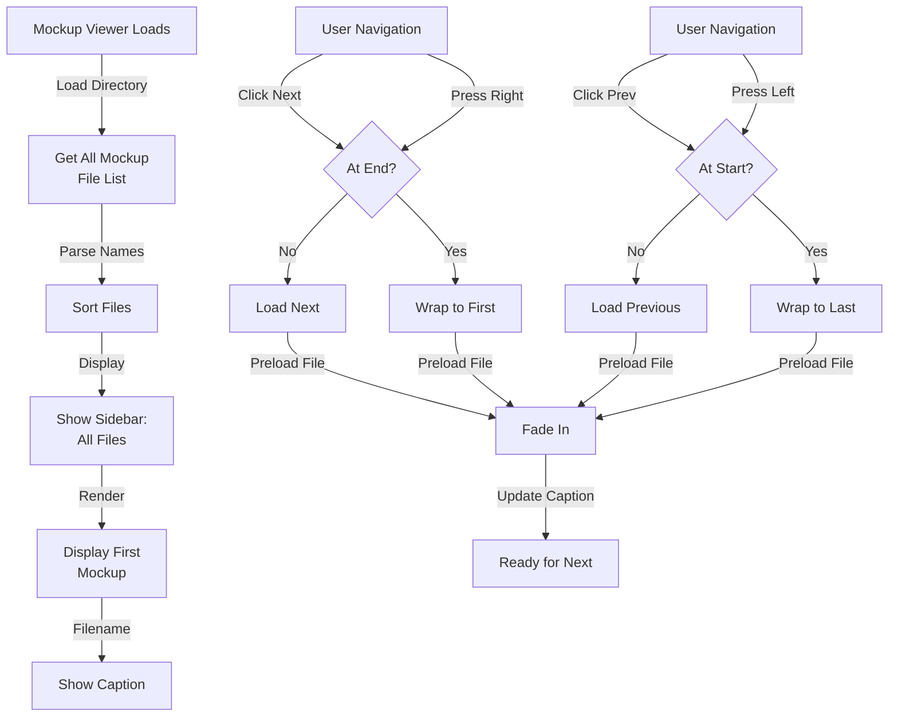
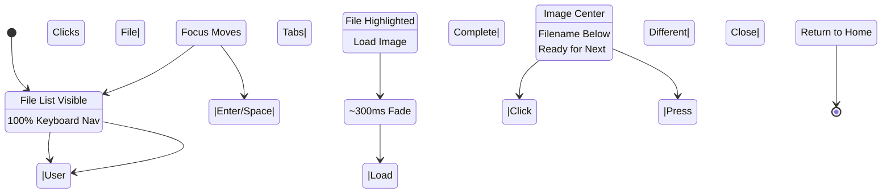
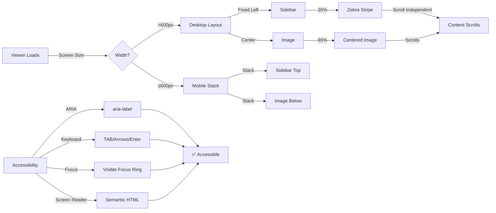
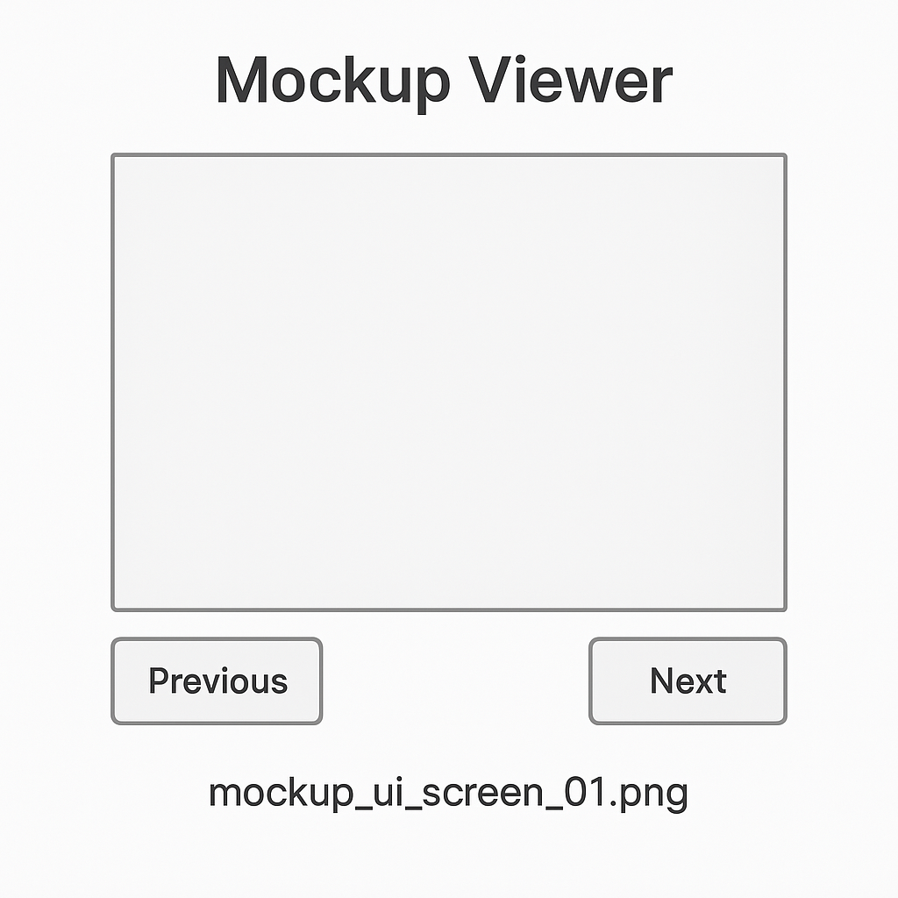

# PRD: Mockup Viewer

## TL;DR

The Mockup Viewer provides a simple, accessible interface for browsing JU-DO-KON! design mockup images. It allows team members and stakeholders to preview all UI mockups in a carousel format, supporting mouse and keyboard navigation. The tool ensures visual consistency and improves design review workflows by centralizing access to UI mockups.

## Problem Statement

Designers and developers previously relied on scattered folder structures to find and compare UI mockups. This fragmentation led to wasted time, difficulty in referencing filenames during discussions, and inconsistent visual evaluations. By aggregating mockups into a single interactive viewer, we reduce this friction and improve team velocity, accuracy, and accessibility in design reviews.

## Goals / Success Metrics

| Goal              | Metric                                                                   |
| ----------------- | ------------------------------------------------------------------------ |
| Load Performance  | 100% of images load within ≤1 second on broadband                        |
| Filename Clarity  | 100% of displayed images show visible filenames                          |
| Accessibility     | Full keyboard/mouse navigation with ARIA support on 100% of controls     |
| UX Responsiveness | Layout remains visually usable across desktop, tablet, and mobile        |
| Engagement        | 100% of mockups accessible on first visit without scrolling or filtering |

## User Stories

- As a designer, I want to quickly flip through all mockups so that I can review UI consistency.
- As a developer, I want to see the filename of each mockup so that I can reference it in discussions.
- As a stakeholder, I want to browse mockups easily without needing special tools or permissions.
- As a user with accessibility needs, I want to navigate mockups using keyboard controls and screen readers.
- As a user, I want to be able to exit or close the viewer easily so I can return to my previous workflow.

## Functional Requirements (Prioritized)

| Priority | Feature             | Description                                                  |
| -------- | ------------------- | ------------------------------------------------------------ |
| P1       | Image Carousel      | Displays one mockup at a time with next/previous controls    |
| P1       | Filename Display    | Shows filename of the currently displayed image              |
| P1       | Mouse Navigation    | Next/Previous buttons for cycling images                     |
| P1       | Keyboard Navigation | Supports left/right arrow keys for navigation                |
| P1       | Sidebar File List   | Left panel lists all mockups for direct selection            |
| P1       | Image Preloading    | Loads adjacent images to reduce wait time                    |
| P2       | Accessibility       | Keyboard interaction, ARIA labels, and screen reader support |
| P2       | Responsive Layout   | Adapts layout for desktop, tablet, and mobile                |
| P3       | Visual Effects      | Fade-in effect on image transitions                          |
| P3       | Exit Functionality  | “Close” button with keyboard focus management                |

---

## Mockup Viewer Workflow Diagrams

### 6.13.1: Image Carousel Navigation Flow

**Navigation & Carousel Logic:**
The viewer loads all mockups from the directory into a sidebar list. Clicking or keyboard navigation (next/previous) cyclically moves through mockups. Adjacent images are preloaded to reduce wait times. Navigation wraps around at ends for seamless browsing.

### 6.13.2: Sidebar Selection & File List Interaction

**Sidebar & File Selection States:**
The sidebar list remains visible during viewing, allowing direct file selection. Full keyboard navigation (TAB, arrow keys, ENTER/SPACE) ensures accessibility. Selected files fade in over ~300ms. The close button always remains accessible for exiting.

### 6.13.3: Accessibility & Responsive Layout

**Responsive Design & Accessibility:**
Desktop layout displays sidebar (35%) and image (65%) side-by-side; mobile stacks them vertically. Sidebar scrolls independently from main content. All controls support full keyboard navigation with visible focus states. ARIA labels and semantic HTML ensure screen reader compatibility.

---

## Acceptance Criteria

- Given the page loads, when the viewer opens, then the first mockup and its filename are visible.
- Given the viewer is open, when the user clicks "Next" or presses the right arrow key, then the next mockup is displayed with filename.
- Given the viewer is open on the last mockup, when the user clicks "Next" or presses right arrow, then navigation wraps to the first mockup.
- Given the viewer is open, when the user clicks "Previous" or presses left arrow key, then the previous mockup is displayed with filename.
- Given the viewer is open on the first mockup, when the user clicks "Previous" or presses left arrow, then navigation wraps to the last mockup.
- Given any mockup is displayed, then its filename is always visible and legible below the image.
- Given the viewer controls, then buttons are accessible via tab/enter/space keys and have descriptive `aria-labels`.
- Given the viewer, then 100% of controls support keyboard interaction and screen reader compatibility.
- Given the images, then 100% load in ≤1 second on a 25 Mbps connection.
- Given the page size, then the layout scales correctly without content loss or overflow on mobile and desktop.
- Given the user navigates images, then a fade-in effect is applied during transitions lasting approximately 300ms.
- Given an image fails to load, then a broken image icon or descriptive alt text is shown instead.
- Given there are no images in the folder, then the message “No mockups found in directory.” is displayed.
- Given a filename is missing or invalid, then “Unnamed_Mockup_X” is displayed with X as a fallback number.
- Given the viewer is open, then a visible “Close” button is available and keyboard focus can be moved to it for exiting.
- Given keyboard navigation, then tab order moves logically through controls and focus is trapped inside the viewer until it is closed.

## Non-Functional Requirements / Design Considerations

- Use JU-DO-KON! color palette, fonts, and component spacing per brand style guide.
- Apply consistent 12px/16px spacing between controls, image, and filename.
- Use semantic HTML elements (`<figure>`, `<figcaption>`, `<button>`, etc.).
- Use no external libraries or frameworks; rely on internal styles, CSS-native ripple feedback, and helper modules (`domReady.js`, etc.).
- Ripple interactions come from the shared button `::after` rules—`setupButtonEffects()` and other DOM-based wrappers stay out of scope.
- Does not require login or permissions to access.
- Fade-in transitions on image switch should last ~300ms with ease-in-out easing.
- Buttons and tap targets must be minimum 44x44 pixels for accessibility.
- Keyboard focus must cycle inside the viewer and not leak outside until the viewer is closed.

## Dependencies and Open Questions

- Image files must be placed in `design/mockups/` with readable names.
- Uses standard helper modules: CSS button tokens for ripple feedback, `domReady.js`, navbar and SVG fallbacks. The ripple styling is CSS-native with no JS helper reinstated.
- Open: Should the viewer support zoom, full-screen, or download options in future versions?

## Wireframe Sketch (Suggested Additions)

**Layout Elements (Desktop View):**

- Left sidebar lists all mockup files for quick navigation and remains fixed to the left edge of the screen.
- Sidebar background uses the `--color-surface` token so zebra stripes stand out.
- Sidebar list items alternate background colors using the `--color-surface` and
  `--color-tertiary` tokens for zebra striping. Odd/even classes start with
  `odd` for the first row.
- Image centered with filename below.
- Images must scale to fit the viewport so wide mockups remain fully
  visible without horizontal scrolling.
- Next and Previous buttons on either side of the image.
- Close button top-right corner.

**Layout Behavior:**

- On mobile: buttons stack vertically below image, filename wraps if needed.
- All spacing/padding respects 12px grid system.
- Buttons have minimum 44x44 px clickable/tap area.

## Tasks

- [x] 1.0 Build Carousel Viewer Component
  - [x] 1.1 Load and display mockup images from `design/mockups/`
  - [x] 1.2 Display filename below the image
  - [x] 1.3 Show first image on page load
  - [x] 1.4 Provide sidebar list of mockups for selection
- [x] 2.0 Implement Image Navigation
  - [x] 2.1 Add "Next" and "Previous" mouse buttons
  - [x] 2.2 Add left/right keyboard arrow navigation
  - [x] 2.3 Loop navigation from last to first and vice versa
- [ ] 3.0 Add Performance and Fallback Logic
  - [ ] 3.1 Preload adjacent images for snappy transitions
  - [ ] 3.2 Handle image load failures with fallback icon or alt text
  - [ ] 3.3 Display message if no images are available
- [ ] 4.0 Accessibility Compliance
  - [ ] 4.1 Add `aria-labels` to all interactive elements
  - [ ] 4.2 Support full keyboard interaction including tab, enter, and space
  - [ ] 4.3 Use semantic HTML with proper roles
  - [ ] 4.4 Implement keyboard focus trapping inside the viewer
- [ ] 5.0 User Flow Enhancements
  - [ ] 5.1 Add visible "Close" button to exit viewer
  - [ ] 5.2 Ensure tab order includes Close button logically
- [ ] 6.0 Final Touches and UX Polish
  - [ ] 6.1 Apply fade-in transition on image switches (~300ms)
  - [ ] 6.2 Ensure responsive layout on desktop/tablet/mobile
  - [ ] 6.3 Align visual style with JU-DO-KON! branding

## Mockups

