# PRD: Navigation Bar

---

## TL;DR

This PRD defines a persistent, responsive bottom navigation bar for Ju-Do-Kon! to provide clear, consistent navigation across all screens. It improves player flow, reduces confusion, and increases session duration by offering quick access to core game modes (**navigation visible within 100 ms**) with accessible, high-performance interactions.

---

## Problem Statement

Players currently experience confusion and increased cognitive load when navigating between game screens due to the lack of a consistent, always-visible navigation system. This leads to flow disruption, frustration, and early session exits.

---

## Description

The **JU-DO-KON!** game features multiple game modes and screens. Players need easy, intuitive navigation to seamlessly transition between activities such as battles, judoka browsing, and training. When navigation is unclear, players experience increased cognitive load and frustration, breaking immersion and potentially leading to session drop-offs.

> After an intense battle, Kenta sees the familiar JU-DO-KON! logo in the bottom-left corner. He taps it, revealing a smooth, scrolling list of game modes (**scroll ≥60 fps**, expand <500 ms). In a couple of seconds, he’s exploring his Judoka roster without friction — he feels confident, immersed, and eager to keep playing.

### Example Scenario

> Player finishes battle → confusion navigating back → flow disruption → early session exit.

---

## User Stories

- As a new player, I want an always-visible navigation bar so I don’t get lost between screens.
- As a mobile user, I want touch-friendly buttons so I can navigate confidently with my thumb.
- As a player who uses screen readers, I want navigation elements to be labeled properly so I can move around the game without barriers.

---

## Goals

- Reduce navigation-related exits by **20%**.
- Increase average session duration per player by **15%**.
- Ensure **44px minimum** touch target size (see [UI Design Standards](../codeStandards/codeUIDesignStandards.md#9-accessibility--responsiveness)).
- Achieve **≥60fps** animation performance on standard mid-tier devices.
- Guarantee fallback application time of **<2 seconds** if `navigationItems.js` fails.
- Meet a text contrast ratio of at least **4.5:1** against the navigation bar background.
- Allow players to confidently navigate between modes without frustration.
- Ensure a consistent, easy-to-use navigation experience across devices.

---

## Non-Goals

- Custom color themes or advanced 3D animations.
- Offline caching beyond the default fallback list.

---

## How It Works

The bottom navigation bar appears consistently across all game screens, populated with pre-seeded links whose visibility and order are driven by `navigationItems.js` via CSS. Each item references an entry in `gameModes.json` via its `id` so mode names and descriptions remain consistent.

### Standard Mode (Default View)

- Navigation links are laid out in a horizontal row.
- Each navigation item occupies **equal width**, keeping touch targets balanced across the bar.
- A bottom-left corner **ju-do-kon!** logo acts as an interactive button.
- Tapping the logo reveals a vertically unrolled text menu listing the available game modes (functions in both landscape and portrait orientation).
- Links and labels scale responsively with screen size.

### Portrait Mode

- In portrait orientation, or on screens narrower than **480px**, the horizontal row collapses into a **hamburger button** in the bottom left corner.
- Tapping the hamburger reveals a vertically unrolled text menu listing the available game modes (functions in both landscape and portrait orientation).

### Flow

- After any activity, the persistent nav bar is visible.
- On small screens or portrait orientation, only the hamburger button shows; tapping it expands the text list.
- Player selects a mode and is taken to that screen.
- If `navigationItems.js` fails, revert to a default order and auto-reload.

### Intentional Exceptions

- **Browse Judoka**, **Random Judoka**, **Meditation**, and **Settings** screens intentionally hide the persistent navigation bar to provide a focused, full-screen experience tailored to their respective interactions.

### Technical Considerations

- Use `navigationItems.js` to drive CSS classes that control which pre-seeded links are visible and in what order; fallback to defaults on failure.
- Cache loaded mode list to avoid redundant fetches across sessions.
- Use hardware-accelerated CSS transforms for nav animations (e.g., `translate3d`).
- Optimize for devices as small as 320px width (typical of older low-end Android devices).
- Listen for device orientation events to trigger smooth re-layout without stutter (**re-layout <500 ms**).

### Dependencies / Integrations

- `gameModes.json` defines the available modes.
- `navigationItems.js` references those modes by `id` and controls navigation order and visibility.
- CSS variables `--color-secondary` and `--button-text-color` for styling.
- Existing footer layout modules.

---

## Wireframes / Visual Reference

- **Default Mode**: Horizontal navigation bar with clickable links and a bottom-left corner ju-do-kon logo. A simplified vertical text list expands on logo tap. _(Visual reference to be attached.)_
- **Portrait Mode**: A hamburger button in the bottom left expands a simplified vertical text list.

---

## Functional Requirements

| Priority | Feature                | Description                                                                                                                      |
| :------: | :--------------------- | :------------------------------------------------------------------------------------------------------------------------------- |
|  **P1**  | Standard Nav Bar       | Fixed horizontal navigation pinned to the bottom of the viewport with scalable, equal-width links and a bottom-left corner logo. |
|  **P2**  | Portrait Text Menu     | Text-based vertical menu expansion on button click for portrait and landscape (collapsed) orientation.                           |
|  **P2**  | Small Screens Support  | Row collapses to a hamburger menu and adjusts for screens as small as 320px — scale font and spacing.                            |
|  **P2**  | Visual Feedback        | Positive click/tap feedback animation for all links and buttons.                                                                 |
|  **P1**  | Hover & Active States  | Distinct hover feedback and a persistent active state indicate the current screen.                                               |
|  **P1**  | Fallback Data Handling | Hardcoded default order and visibility if `navigationItems.js` fails to load.                                                    |

---

## Acceptance Criteria

- Touch targets maintain **≥44px** size across all device resolutions (see [UI Design Standards](../codeStandards/codeUIDesignStandards.md#9-accessibility--responsiveness)).
- Navigation is visible on **100%** of standard game screens, excluding **Browse Judoka**, **Random Judoka**, and **Meditation**, which intentionally omit the persistent nav bar.
- Standard nav bar shows pre-seeded links whose visibility and order are driven by `navigationItems.js` via CSS.
- Each link in the horizontal layout spans equal width to keep the bar balanced.
- Each navigation button shows a distinct hover state on pointer devices.
- The navigation button for the current screen remains visibly active.
- On screens <**480px** the bar collapses into a hamburger button; tapping reveals a vertical list.
- The function of tapping the icon in the bottom left corner works in landscape or portrait mode.
- Clicking a link navigates successfully to the intended screen.
- Tapping the bottom-left button toggles expansion/collapse.
- If `navigationItems.js` fails, apply a hardcoded default order within **<2 seconds**.
- Show notification and auto-reload if mid-session loading fails.
- Smooth re-layout during device rotation mid-animation, with transition completion time **<500ms**.
- Text contrast meets WCAG **4.5:1**.
- Animations must run at **≥60fps**.
- Respect OS-level **reduced motion** settings for users preferring minimal animations.

---

## Edge Cases / Failure States

- Data source fails → load default list in <2s.
- Menu fails mid-session → notify user and auto-reload.
- Device rotates mid-animation → cancel and re-layout.
- Small devices (<320px) → menu scales to fit.

---

## Design and UX Considerations

The standard navbar uses `--color-secondary` for its background and `--button-text-color` for text.


---

## Navigation Bar Responsive Layout & States

**Responsive Breakpoints**:


**Navigation Bar Interaction State Machine** (Desktop/Standard Mode):

```mermaid
stateDiagram-v2
    [*] --> Collapsed: Page Load (≥480px)
    
    Collapsed: 📍 Standard Bar<br/>Logo | Links (horizontal)<br/>Equal width, 44px+ targets
    
    Collapsed --> LinkClicked: Tap/Click link
    Collapsed --> MenuExpanded: Tap JU-DO-KON! logo
    
    LinkClicked: ✉️ Navigate to Mode<br/>Transition <100ms
    LinkClicked --> [*]
    
    MenuExpanded: 📂 Menu Open<br/>Vertical text list (overlay)
    
    MenuExpanded --> MenuOption: Tap menu item
    MenuExpanded --> Collapsed: Tap logo again / Tap outside
    
    MenuOption: ✉️ Navigate to Mode<br/>Transition <100ms
    MenuOption --> [*]
    
    note right of Collapsed
        Links visible:
        - Driven by navigationItems.js
        - Fallback if load fails (≤2s)
        - Active state marks current page
    end note
    
    note right of MenuExpanded
        Vertical overlay menu
        Shows all available modes
        Slide-up animation <500ms
    end note
```



**Navigation Bar Responsive Behavior** (Mobile/Portrait Mode):

```mermaid
stateDiagram-v2
    [*] --> CollapsedHamburger: Page Load (<480px)
    
    CollapsedHamburger: ☰ Hamburger Button<br/>Bottom-left, 44px+<br/>(or Logo + icon)
    
    CollapsedHamburger --> Expanding: Tap hamburger button<br/>Tap Logo
    
    Expanding: 🎬 Expanding...<br/>Slide-up menu <500ms
    
    Expanding --> MenuOpen: Menu visible<br/>Vertical text list
    
    MenuOpen: 📂 Menu Open<br/>Item1 | Item2 | ... | ItemN<br/>44px+ tap targets
    
    MenuOpen --> ItemTap: Tap menu item
    MenuOpen --> Collapsing: Tap hamburger / outside
    MenuOpen --> Collapsing: Orientation change detected
    
    Collapsing: 🎬 Collapsing...<br/>Slide-down menu <500ms
    
    Collapsing --> CollapsedHamburger: Animation complete
    
    ItemTap: ✉️ Navigate to Mode<br/>Transition <100ms<br/>Menu auto-collapses
    ItemTap --> [*]
    
    note right of MenuOpen
        Fallback on navigationItems.js failure:
        Show hardcoded default list ≤2s
        Auto-reload on mid-session failure
    end note
```



**Navigation Bar Component Layout** (Desktop):

```
+─────────────────────────────────────────────────────────+
│  [Logo] │ Link1  │ Link2  │ Link3  │ Link4  │ Link5   │  ← Standard Mode (≥480px)
│  (44px) │ (equal widths, all 44px+)                   │  ← Bottom fixed
+─────────────────────────────────────────────────────────+
```

**Navigation Bar Component Layout** (Mobile):

```
+──────────────────────────────────────────────────────────+
│  [Hamburger]                                            │  ← <480px (portrait mode)
│  (44px+)                                                │  ← Bottom fixed
+──────────────────────────════════════════════════════────+
     ↓ (on tap, slides up)
+──────────────────────────────────────────────────────────+
│ × Link1     (44px+)  ←─ Vertical list overlay          │
│   Link2     (44px+)                                     │
│   Link3     (44px+)                                     │
│   Link4     (44px+)                                     │
│   Link5     (44px+)                                     │
+──────────────────────────────────────────────────────────+
```

**Data Flow & CSS Visibility Control**:

```mermaid
graph TD
    A["navigationItems.js"] --> B["CSS Classes Applied"]
    B --> C{"Link Visibility?"}
    C -->|Display:block| D["✅ Visible in Nav"]
    C -->|Display:none| E["❌ Hidden from Nav"]
    
    F["gameModes.json"] --> G["Mode metadata<br/>(id, name, path)"]
    A --> G
    
    H["Screen Detection"] --> I{"Current Page?"}
    I -->|Matches link id| J["🎯 Active state<br/>Highlight/bold"]
    I -->|No match| K["⚪ Inactive state"]
    
    D --> L["NavBar Item Rendered"]
    E --> M["NavBar Item Filtered"]
    J --> L
    K --> L
    
    N["Fallback Path"] --> O{"navigationItems.js<br/>Load Failed?"}
    O -->|Yes| P["⚠️ Use hardcoded<br/>default order ≤2s"]
    O -->|No| Q["✅ Use dynamic order"]
    
    P --> R["NavBar Renders<br/>w/ fallback list"]
    Q --> R
    
    style B fill:#lightyellow
    style D fill:#lightgreen
    style J fill:#lightcyan
    style P fill:#ffe6e6
    style R fill:#lightblue
```



**Screen-Level Visibility Rules**:

| Screen | NavBar Visible? | Rationale |
|---|---|---|
| Home | ✅ Yes | Primary entry point; navigation needed |
| Battle Classic | ✅ Yes | Navigate between modes during play |
| Battle CLI | ✅ Yes | Navigate between modes (keyboard available) |
| Browse Judoka | ❌ No | Full-screen experience; card browsing focus |
| Random Judoka | ❌ No | Full-screen card display; focused view |
| Meditation | ❌ No | Full-screen zen mode; immersion priority |
| Settings | ❌ No | Full-screen settings; focused configuration |
| Tooltips | ✅ Yes | Information feature; nav may aid return |

**Performance & Accessibility SLAs**:

- **Logo/Hamburger Tap Response**: <100ms (visual feedback)
- **Menu Expand/Collapse Animation**: <500ms (smooth, 60fps)
- **Navigation Transition**: <100ms (mode change latency)
- **Fallback Activation**: ≤2 seconds (if navigationItems.js fails to load)
- **Orientation Change Reflow**: <500ms (no jank/stutter)
- **Touch Target Size**: 44px minimum (all interactive elements)
- **Text Contrast**: ≥4.5:1 (WCAG AA, all text on nav)
- **Animation Frame Rate**: ≥60fps (all transitions)
- **Reduced Motion**: Respect OS settings (prefers-reduced-motion media query)

**Status Badge**: ✅ **VERIFIED** — Validated against:
- `tests/fixtures/navigationItems.js` — Navigation items fixture with mock data
- `src/components/navigationBar.js` — CSS class control via navigationItems.js
- `src/data/gameModes.json` — Mode metadata references
- Playwright tests (homepage, battle, settings navigation flows)
- WCAG 2.1 AA compliance: 44px+ targets, 4.5:1 contrast, keyboard navigation, screen readers

**Related Diagrams**:
- [Home Page Navigation](prdHomePageNavigation.md) — Primary 2×2 grid menu
- [Navigation Map](prdNavigationMap.md) — Thematic map expansion from footer
- [Game Modes Overview](prdGameModes.md) — All 7 modes and their destinations
- [Settings Menu](prdSettingsMenu.md) — Settings feature flag control

### Accessibility

- **44px+** touch targets (see [UI Design Standards](../codeStandards/codeUIDesignStandards.md#9-accessibility--responsiveness)).
- High-contrast text labels (WCAG 4.5:1).
- Screen reader support: all navigation elements properly labeled.
- Respect OS **reduced motion** settings.

### Responsiveness

- Layout adapts to screen widths from **320px to 2560px**.
- Equal-width links ensure buttons remain evenly spaced at all sizes.
- Below **480px**, the row collapses into a hamburger button to conserve space.

### Interaction Feedback

- Tap animation on navigation interactions.
- Smooth slide-in/slide-out transitions (**<500ms**).

---

## Open Questions

- **Pending:** Decide if the bar should auto-hide after a period of inactivity.
- **Pending:** Identify which screens, if any, should suppress the nav bar entirely.

---

[Back to Game Modes Overview](prdGameModes.md)

## Mockups


