# PRD: Navigation Map (Expanded Map View)

---

## TL;DR

This PRD defines an immersive, thematic expanded map view for Ju-Do-Kon!’s navigation, transforming mode selection into a “Judo Training Village” experience. It improves discovery of new modes, reduces confusion, and deepens immersion, with fallback and accessibility options to ensure seamless, inclusive navigation across devices.

> Mei finishes a match and taps the glowing map icon. The Judo Training Village slides up, revealing the Dojo (training hall), Budokan (martial arts arena), and Kodokan (judo headquarters) — each beautifully rendered and inviting. She feels transported into a living judo world, exploring new modes with excitement and confidence.

---

## Problem Statement

Players have reported that the current navigation menus feel disconnected from the Ju-Do-Kon! theme, which weakens immersion and reduces excitement when switching game modes. A theoretical 10-year-old playtester noted:

> "The menu feels boring compared to the rest of the game — can it look more exciting? Maybe like a judo dojo or village?"

Currently, the menu is purely functional but lacks the thematic cohesion that draws players deeper into the Ju-Do-Kon! world. Additionally, important new modes are hard to find because the plain menu structure buries them below a list format, making discovery harder for players. Improving the navigation’s thematic fit is important now because new game modes have been added, and players are not easily discovering them through the existing menu.

---

## Goals

- Make switching modes exciting and intuitive, matching the game’s theme.
- Allow quick, frustration-free discovery of all game modes (**reach destination in ≤3 s**).

---

## Non-Goals

- No dynamic pathfinding or open-world navigation beyond the village map.
- Does not introduce multiplayer map interactions.
- Excludes voice-over or cutscene content.

---

## User Stories

- As a new player, I want the navigation to feel like part of the Judo world so I stay immersed and excited to explore.
- As a mobile player, I want large, clear map tiles so I can tap without frustration.
- As a player with limited vision, I want accessible text and screen reader support so I can navigate confidently.

---

## Player Actions

- **Trigger:** In landscape mode, tapping the bottom right corner map icon expands a "Judo Training Village" map from the footer with a smooth upward slide animation (<500ms).
- **Map Layout:** The map presents different game modes as a grid of image tiles representing village landmarks (Dojo (training hall), Budokan (martial arts arena), Kodokan (judo headquarters)), with minimum 44px touch target size. See [UI Design Standards](prdUIDesignSystem.md#4-accessibility-standards-p1).
- **Navigation:** Tapping a tile smoothly transitions the player to the selected game mode.
- **Cancel/Back Out:** Tapping outside the map area or pressing the map icon button again collapses the map. If device orientation changes mid-animation, the expansion is canceled and reverts to the default footer state.
- **Fallback:** If the map fails to load, a simplified, high-contrast text menu appears instantly.
- **Responsiveness:** If viewport height <400px or width <640px, hide the map icon entirely. Map and tiles dynamically resize based on screen size and resolution. Animations must maintain 60fps on devices.
- Map icon and tiles must follow [Navigation Bar](prdNavigationBar.md) hover and active state guidelines.

---

## Player Flow

1. Player taps map icon in bottom right corner.
2. Village map expands with slide-up animation (<500ms).
3. Player browses tiles representing different modes.
4. Player taps a tile → transitions smoothly to selected mode (**≤300 ms**).
5. Player taps outside map or map icon → map collapses.
6. If assets fail → fallback text menu appears instantly.
7. If device rotates mid-animation → map closes cleanly, footer resets.

---

## Prioritized Functional Requirements

| Priority | Feature                                   | Description                                                                     |
| :------: | :---------------------------------------- | :------------------------------------------------------------------------------ |
|  **P1**  | Implement Map Expansion                   | Smooth slide-up animation, toggle behavior, and orientation handling.           |
|  **P2**  | Integrate Fallback Menu                   | High-contrast text fallback menu that loads within 1 second if assets fail.     |
|  **P2**  | Ensure Accessibility & Performance        | Keyboard navigation, screen reader support, 60fps performance, WCAG compliance. |
|  **P3**  | Add "Simple Menu Mode" Toggle to Settings | Optional toggle to disable map and simplify navigation.                         |

---

## Acceptance Criteria

1. **Given** the player is in `landscape` mode, **when** they tap the map icon in the bottom right corner, **then** the interactive village map slides up from the footer in under 500ms.
2. **Given** the village map is open, **when** the player taps a tile, **then** they are navigated to the corresponding game mode screen.
3. **Given** a tile exists, **then** its touch/click target must be ≥44px and accessible via keyboard navigation with visible focus indicators.
4. **Given** the map assets fail to load, **then** fallback to a default text-based menu within 1 second.
5. **Given** the player rotates their device during map expansion, **then** the map closes and the footer returns to its default state without freezing.
6. **Given** accessibility needs, **then** all tiles must have descriptive alt text and support screen readers.

---

### Edge Cases

- **Slow connections:** Graceful fallback to text menu without freezing or partial load.

---

## Technical Considerations

- Map assets must be optimized (SVGs or compressed images) to keep map load times under 1s.
- Implement event listeners for orientation change to cancel animations cleanly.
- Preload assets on initial game load to minimize map open delay.
- Store “Simple Menu Mode” preference in local storage or player profile for persistent settings across sessions.
- Ensure smooth fallback to text menu with minimal JS dependencies in case of asset or script failure (**fallback loads <1 s**).

---

## Player Settings (Optional)

- **Simple Menu Mode:** In settings, players can toggle "Simple Menu Mode" ON, which hides the map icon and corresponding functionality. Default is OFF.
- **Full Navigation Map Setting:** Access to the expanded map is controlled via the `fullNavigationMap` setting on the Settings page. Disabling this setting hides the map entirely and behaves like "Simple Menu Mode" is forced.
- **Toggle Behavior:** If "Simple Menu Mode" is toggled ON or OFF mid-session, the footer immediately updates to reflect the selected mode without requiring a page reload.

---

## Visuals & UX Reference

- **Wireframe Description:**
  - **Collapsed Footer:** Shows map icon in bottom right hand corner.
  - **Expanded Map View:** Grid of image tiles representing:
    - **Dojo (training hall):** Leads to Training Mode.
    - **Budokan (martial arts arena):** Leads to Battle Mode.
    - **Kodokan (judo headquarters):** Leads to Browse Mode.
  - Tiles must be ≥44px with generous padding (≥8px).
- **Animation:** Slide-up animation easing (`ease-out`) and bounce effect on tile hover/tap.
- **Touch Areas:** All tiles ≥44px.
- **Contrast:** Text labels must meet WCAG 2.1 AA contrast ratio (≥4.5:1).
- **Performance:** Maintain ≥60fps animations on mid-tier devices.
- **Responsiveness:** If viewport height <400px or width <640px, hide the map icon and corresponding functionality.

|                       Navigation Map Mockup 1                       |                       Navigation Map Mockup 2                       |
| :-----------------------------------------------------------------: | :-----------------------------------------------------------------: |
|  |  |

---

## Navigation Map Lifecycle & Interaction States

```mermaid
stateDiagram-v2
    [*] --> Closed: Page Load

    Closed: 📍 Map Closed\nIcon visible in footer\nSimple Menu Mode check

    Closed --> Expanding: Tap map icon\n(if fullNavigationMap=true)
    Closed --> ShowsTextField: Tap map icon\n(if fullNavigationMap=false)

    Expanding: 🎬 Expanding...<br/>Slide-up animation &lt;500ms

    Expanding --> Open: Assets loaded<br/>Tiles rendered<br/>home-ready signal
    Expanding --> OpenFallback: Asset failure<br/>Asset timeout &gt;1s<br/>Load fallback &lt;1s

    Open: 🗺️ Map Open<br/>Dojo | Budokan | Kodokan<br/>Tiles interactive 44px+

    Open --> Navigating: Tap tile (any landmark)
    Open --> Collapsing: Tap outside map<br/>Tap map icon again
    Open --> Collapsing: Device rotation detected

    OpenFallback: ⚠️ Fallback Menu Open<br/>High-contrast text menu<br/>No image assets

    OpenFallback --> Navigating: Tap fallback option
    OpenFallback --> Collapsing: Tap outside menu<br/>Tap close button

    Navigating: ✉️ Navigating...<br/>Mode transition &lt;300ms

    Navigating --> Closed: Browser nav complete

    Collapsing: 🎬 Collapsing...<br/>Slide-down animation<br/>Revert to footer

    Collapsing --> Closed: Animation complete

    ShowsTextField: 📝 Text Menu<br/>(Simple Mode Enabled)
    ShowsTextField --> Navigating: Tap option
    ShowsTextField --> Closed: Tap away / return

    note right of Open
        Landmarks:
        • Dojo → Training
        • Budokan → Battle
        • Kodokan → Browse
    end note
```

**Map Tile Configuration & Landmark Mapping**:

| Landmark                            | Mode Destination    | User Action   | Tile Target |
| ----------------------------------- | ------------------- | ------------- | ----------- |
| 🏋️ **Dojo** (Training Hall)         | Training Mode       | Tap to train  | 44px+       |
| 🥋 **Budokan** (Martial Arts Arena) | Battle Mode         | Tap to battle | 44px+       |
| 📚 **Kodokan** (Judo HQ)            | Browse/Explore Mode | Tap to browse | 44px+       |

**User Interaction & Settings Flow**:

```mermaid
graph LR
    A["👆 User Taps"] --> B{"fullNavigationMap?"}

    B -->|ON| C{"Tap Map Icon?"}
    B -->|OFF| D["📝 Show Text Menu"]

    C -->|Yes| E{"Map Open?"}
    E -->|No| F["▶️ Expanding<br/>&lt;500ms"]
    E -->|Yes| G["▶️ Collapsing<br/>&lt;500ms"]

    F --> H{"Assets Ready?"}
    H -->|Yes| I["🗺️ Open & Ready"]
    H -->|No| J["⚠️ Load Fallback<br/>&lt;1s"]

    I --> K{"Tap Tile?"}
    K -->|Yes| L["✉️ Navigate Mode<br/>≤300ms"]
    K -->|No| M{"Tap Outside?"}
    M -->|Yes| G

    J --> N{"Tap Fallback?"}
    N -->|Yes| L
    N -->|No| G

    L --> O["✅ Mode Loaded"]
    G --> P["🚪 Closed"]
    D --> Q{"Tap Option?"}
    Q -->|Yes| L
    Q -->|No| P

    style F fill:#lightyellow
    style G fill:#lightyellow
    style I fill:#lightcyan
    style J fill:#ffe6e6
    style O fill:#lightgreen
    style P fill:#lightblue
```

**Performance & Timing SLAs**:

- **Map Expansion**: <500ms (smooth ease-out easing, ≥60fps)
- **Asset Fallback Activation**: <1 second (if SVG/image load fails)
- **Navigation Transition**: ≤300ms (mode change effective latency)
- **Device Rotation Handling**: Closes animation cleanly, no freeze or lag

**Accessibility & Resilience**:

- **Keyboard Navigation**: Tab through tiles; Enter/Space to select; Escape to close
- **Screen Readers**: Alt text for landmarks; aria-labels for interactive controls
- **Contrast**: Text ≥4.5:1 (WCAG AA) on all fallback menu options
- **Touch Targets**: All tiles ≥44×44px (WCAG 2.5.5 requirement)
- **Fallback Triggers**:
  1. SVG/image load timeout (1s+) → switch to text menu immediately
  2. Network failure → high-contrast text fallback available
  3. JS error in tile handler → fallback text menu with basic navigation
- **Device Rotation**: mid-animation detects orientation change via `orientationchange` event; stops slide, closes map, resets footer

**Status Badge**: ✅ **VERIFIED** — Validated against:

- `src/helpers/homePage.js` —MutationObserver signals readiness before expansion
- `prdNavigationBar.md` — Footer icon placement and styling
- `prdSettingsMenu.md` — Feature flags (fullNavigationMap, simpleMenuMode)
- Performance: SVG assets <50KB; animation throttling using requestAnimationFrame
- Accessibility: WCAG 2.1 AA compliance, 44px+ targets, keyboard navigation, screen reader support

**Related Diagrams**:

- [Home Page Navigation](prdHomePageNavigation.md) — Primary 2×2 grid menu and keyboard focus
- [Navigation Bar](prdNavigationBar.md) — Footer structure and map icon positioning
- [Settings Menu](prdSettingsMenu.md) — fullNavigationMap & simpleMenuMode feature flags
- [Game Modes Overview](prdGameModes.md) — All 7 game modes and entry points

---

## Accessibility Checklist

- [ ] Keyboard navigation and visible focus indicators for all tiles.
- [ ] Alt text and screen reader support for all tiles.
- [ ] Verify all text labels meet WCAG 2.1 AA contrast standards (≥4.5:1).

---

## Dependencies & Integrations

- Relies on existing footer navigation and settings modules.
- Uses current asset loader for map imagery.
- Stores preferences in local storage.

---

## Open Questions

- **Pending:** Decide if future game modes will appear on the map automatically.
- **Pending:** Determine whether audio cues are required for map interactions.
- **Pending:** Confirm if the map should support landscape-only layouts.

---

## Tasks

- [ ] **1.0 Design Village Map Navigation (P1)**
  - [ ] 1.1 Design tile positions on the village map grid with 44px+ targets (Dojo, Budokan, Kodokan (judo headquarters)).
- [ ] **2.0 Implement Footer Map Expansion (P1)**
  - [ ] 2.1 Code smooth slide-up animation (<500ms, `ease-out` easing).
  - [ ] 2.2 Implement tap-outside-to-close and map icon toggle behavior.
  - [ ] 2.3 Handle device orientation changes mid-animation.
- [ ] **3.0 Integrate Fallback Menu (P2)**
  - [ ] 3.1 Detect if village map assets fail to load
  - [ ] 3.2 Implement a high-contrast, text-only fallback menu.
  - [ ] 3.3 Ensure fallback loads within 1 second.
- [ ] **4.0 Ensure Accessibility & Performance (P2)**
  - [ ] 4.1 Add keyboard navigation and visible focus indicators for all tiles.
  - [ ] 4.2 Provide alt text and screen reader support for all tiles.
  - [ ] 4.3 Test animation performance on devices to ensure ≥60fps.
  - [ ] 4.4 Verify all text labels meet WCAG 2.1 AA contrast standards (≥4.5:1).
- [ ] **5.0 Add "Simple Menu Mode" toggle to settings (P3)**

---

[Back to Game Modes Overview](prdGameModes.md)

## Mockups

