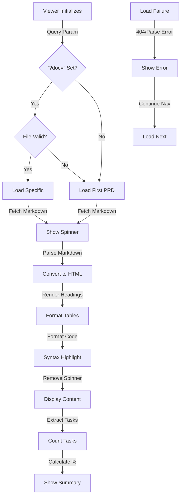
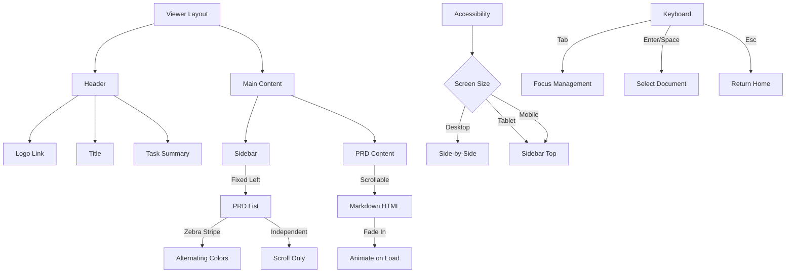

# PRD: Viewer Tool

## TL;DR

The PRD Viewer is a browser-based tool that enables JU-DO-KON! contributors and stakeholders to read, browse, and validate Product Requirements Documents (PRDs) directly within the web application. It provides a user-friendly interface for sequentially viewing all PRDs with keyboard, touch, and sidebar navigation. A loading spinner and robust error handling keep users informed, and the interface meets accessibility standards with ARIA labels and screen reader support.

---

## Problem Statement

Contributors currently face difficulty reviewing PRDs because they must clone the repository or navigate raw markdown files manually. As one contributor shared:

> "Sometimes I spend more time hunting down the right markdown file than actually understanding the requirements."

Non-technical stakeholders struggle even more with raw markdown formatting, leading to misunderstandings and delayed implementations. A dedicated PRD Viewer tool ensures everyone can easily access up-to-date requirements and acceptance criteria in a readable format, improving collaboration and reducing errors.

---

## Goals

- Enable in-browser reading of all PRDs in the `design/productRequirementsDocuments` directory. **(Implemented)**
- Support intuitive navigation (buttons, keyboard, swipe) between documents.
- Render markdown PRDs as readable, styled HTML with tables, code blocks, and headings. **(Implemented)**
- Ensure accessibility and responsive design for all users. **(Implemented: ARIA labels, keyboard navigation, and screen reader audit completed)**
- Allow deep-linking to a specific PRD via a `?doc=` query parameter and update the URL as navigation occurs. **(Implemented)**

---

## User Stories

- As a developer, I want to quickly browse all PRDs in sequence so that I can understand feature requirements without searching the repo.
- As a designer, I want to view PRDs with proper formatting and tables so that I can review acceptance criteria and requirements clearly.
- As a product manager, I want to verify that each PRD is present and up-to-date so that I can track project completeness.
- As any user, I want to easily exit the viewer to the homepage or previous page, so I never feel stuck.

---

## Defined Player Actions and Game Flow

- The player opens the PRD Viewer from the JU-DO-KON! main menu.
- The viewer loads all markdown files from the `design/productRequirementsDocuments` directory. **(Implemented)**
- A loading spinner appears while fetching documents, hiding once content loads or on fetch error. **(Implemented)**
- The player views the first PRD rendered as styled HTML.
- The player navigates between PRDs by:
  - Selecting a document from the sidebar list,
  - Pressing left/right arrow keys,
  - Swiping left/right on touch devices.
- Navigation loops around at the ends of the PRD list.
- The player can click the JU-DO-KON! logo to exit the viewer at any time.
- If loading a markdown file fails, an error message is shown for that document, and the player can continue navigating others. **(Implemented: Fallback message and error logging)**
- If a markdown file is malformed, partial content is shown with a warning badge. **(Implemented)**
- The viewer is fully keyboard operable, supports screen readers, and adapts layout for desktop, tablet, and mobile screens. **(Implemented: keyboard navigation, responsive layout, and screen reader support verified)**

---

## Prioritized Functional Requirements

| Priority | Feature                    | Description                                                          | Status      |
| -------- | -------------------------- | -------------------------------------------------------------------- | ----------- |
| P1       | Markdown PRD Loading       | Load all markdown files from the PRD directory and display them.     | Implemented |
| P1       | Markdown-to-HTML Rendering | Convert markdown to styled HTML with accurate formatting.            | Implemented |
| P1       | Keyboard Navigation        | Allow navigation via arrow keys with focus management.               | Implemented |
| P1       | Touch/Swipe Navigation     | Support swipe gestures with gesture threshold to avoid misfires.     | Implemented |
| P1       | Sidebar Document List      | Sidebar lists all PRDs and selecting one loads that document.        | Implemented |
| P2       | Responsive Layout          | Viewer adapts seamlessly to different device screen sizes.           | Implemented |
| P2       | Accessibility              | Fully accessible UI including ARIA labels and screen reader support. | Implemented |
| P3       | Home Link                  | Provide a prominent link to return to the homepage.                  | Implemented |

---

## PRD Viewer Navigation Diagrams

### 6.14.1: PRD Loading & Markdown Rendering Pipeline



**PRD Loading & Rendering:**
The viewer fetches markdown files from the PRD directory, converts them to styled HTML with proper formatting for headings, tables, and code blocks. If loading fails, an error message shows but navigation continues. Task summaries extract and display completion percentages from each PRD.

### 6.14.2: Navigation Controls & Keyboard Shortcuts

```mermaid
stateDiagram-v2
    [*] --> Viewing
    Viewing: Display PRD
    Viewing: Sidebar Visible
    Viewing: Ready for Input
    
    Viewing -->|Sidebar Click| Selecting
    Viewing -->|Right Arrow| Next
    Viewing -->|Left Arrow| Previous
    Viewing -->|Swipe Right| Previous
    Viewing -->|Swipe Left| Next
    
    Selecting: File Highlighted
    Selecting -->|Update URL| UrlSync
    Previous: Load Prev PRD
    Previous --> UrlSync
    Next: Load Next PRD
    Next --> UrlSync
    
    UrlSync: Push History
    UrlSync: Update ?doc=
    UrlSync -->|Render| Viewing
    
    Viewing -->|Click Home| Exiting
    Exiting: Navigate to \\n    Exiting --> [*]
    
    style Viewing fill:#lightgreen
    style Selecting fill:#lightblue
    style Previous fill:#lightblue
    style Next fill:#lightblue
    style UrlSync fill:#lightyellow
    style Exiting fill:#lightsalmon
```

**Navigation Input Methods:**
Users navigate via sidebar selection, keyboard arrows (left/right), touch swipes with 30px threshold, or direct URL query parameters. All navigation methods update the URL and history so browser back/forward work correctly. Sidebar selection is synced with the active PRD for visual feedback.

### 6.14.3: Responsive Layout & Accessibility Features



**Layout & Accessibility Standards:**
Desktop displays fixed sidebar and scrollable content; mobile stacks them. All text meets WCAG AA contrast ratios. Sidebar uses zebra striping with --color-surface and --color-tertiary tokens. Full keyboard navigation (TAB, arrows, ENTER, ESC) with visible focus states. Animations respect Reduce Motion preferences. Logo link provides quick exit to homepage.

---

## Acceptance Criteria

- Given the PRD Viewer is opened, when loading the markdown files in `design/productRequirementsDocuments/`, then all files are loaded and displayed in sequence. **(Implemented)**
- Given a markdown file is rendered, then headings, tables, lists, and code blocks appear styled as readable HTML. **(Implemented)**
- Given the player presses the right or left arrow keys, then navigation moves accordingly between PRDs. **(Implemented)**
- Given the player selects a document from the sidebar list, then that PRD is displayed in the viewer. **(Implemented)**
- Given the player swipes left or right on a touch device, then the viewer navigates to the next or previous PRD respecting a minimum gesture threshold. **(Implemented)**
- Given the player is on any screen size, then the layout adapts to desktop, tablet, or mobile formats responsively. **(Implemented)**
- Given the player clicks the JU-DO-KON! logo or “Home” link, then the viewer exits to the main homepage. **(Implemented)**
- Given a markdown file fails to load, then an error is logged to the console, a fallback message is shown, and other files remain navigable. **(Implemented)**
- Given malformed markdown content, then partial content is rendered with a warning badge visually indicating an issue. **(Implemented)**
- Given a PRD includes a Tasks section, then the viewer displays the total number of tasks and completion percentage above the document content. **(Implemented)**
- Given the viewer is opened with `?doc=<file>`, then that PRD loads first and the query parameter updates as the user navigates. **(Implemented)**

---

## Non-Functional Requirements / Design Considerations

- The viewer must use the site’s base styles and honour Light and Dark display modes; legacy Retro preferences should gracefully fall back to Dark. **(Implemented)**
- All navigation controls must be operable via keyboard with clear focus states. **(Implemented; verified with keyboard navigation and screen reader audit)**
- The viewer must not expose internal file paths or repository URLs to end users. **(Implemented)**
- Smooth transitions and interaction feedback (hover and active states, swipe animations) should be implemented. **(Fade-in animation and sidebar hover/active feedback implemented)**
- Minimum tap/click target size of 44x44 pixels for all interactive elements with adequate padding. **(Implemented)**

---

## Edge Cases / Failure States

- **Markdown File Fails to Load:** Log error, show fallback message (“Content unavailable”), continue allowing navigation of others. **(Implemented)**
- **Malformed Markdown Content:** Display partial content with warning icon and accessible tooltip. **(Implemented)**
- **Slow Network or File Load Delay:** Show a loading spinner or status message while fetching files. **(Implemented: spinner shows during load and hides after content renders or on error)**
- **Swipe Misfires on Touch Devices:** Use minimum gesture thresholds and debounce timing to avoid accidental navigations. **(Implemented: 30px threshold)**
- **Keyboard Navigation Blocked:** Ensure `tabindex`, role attributes, and focus management are correctly implemented. **(Partially implemented)**

---

## Dependencies and Open Questions

- Depends on the `markdownToHtml` helper for markdown parsing (uses the `marked` library).
- Requires an up-to-date file list from the `design/productRequirementsDocuments` directory.
- Deep-linking uses the `?doc=` query parameter so URLs can bookmark a specific PRD.

### Implementation notes

- History helpers in `src/helpers/prdReader/history.js` coordinate URL updates. Initial loads call `replaceHistory` to
  canonicalize the `?doc=` parameter without polluting the stack, while in-app navigation uses `pushHistory` so browser
  back/forward buttons step through the same document order as the sidebar.
- The viewer binds `popstate` events through `bindHistory`, ensuring sidebar selection and the main content stay in sync
  when users navigate via the browser chrome or external history controls.
- After initial render, remaining PRDs are preloaded in the background to reduce navigation latency. Preloading is
  skipped when the `enableTestMode` feature flag is enabled (per `src/helpers/prdReaderPage.js`) to keep automated runs
  deterministic and prevent test flakiness.

---

## Mockups / Visual Reference

- Header with clickable JU-DO-KON! logo and page title.
- PRD title appears on the left side of the header with a task summary on the right.
- Large scrollable markdown-rendered content area.
- Sidebar scrolls independently from the main preview so the list remains visible while reading.
- Sidebar background uses the `--color-surface` token so zebra stripes stand out.
- Sidebar list items alternate background colors using the `--color-surface` and
  `--color-tertiary` tokens for zebra striping. Odd/even classes start with
  `odd` for the first row.
- Sidebar PRDs are listed alphabetically.
- Selected items briefly pulse (150 ms) to confirm the selection and respect
  reduced motion preferences.
- Warning badge in content area if markdown partially rendered. **(Implemented)**
- Responsive layout for desktop, tablet, and mobile.

**Note:**

- There are no navigation buttons in the UI; navigation is via sidebar, keyboard, or swipe.

---

## Tasks

- [x] 1.0 Set Up Markdown File Loader
  - [x] 1.1 Create function to scan `design/productRequirementsDocuments` directory
  - [x] 1.2 Load markdown content of each file asynchronously
  - [x] 1.3 Implement error handling and fallback display for file load failures

- [x] 2.0 Implement Markdown-to-HTML Renderer
  - [x] 2.1 Integrate `marked` library for parsing markdown
  - [x] 2.2 Apply consistent styles to headings, tables, lists, code blocks
  - [x] 2.3 Benchmark and optimize rendering to complete quickly on devices

- [x] 3.0 Build Navigation System
  - [x] 3.1 Implement keyboard arrow key navigation and focus management
  - [x] 3.2 Add swipe gesture detection with minimum threshold to avoid accidental triggers

- [x] 4.0 Ensure Accessibility and Responsiveness
  - [x] 4.1 Add ARIA labels and roles to interactive elements
  - [x] 4.2 Implement responsive CSS for desktop, tablet, and mobile layouts

  - [x] 4.3 Conduct accessibility testing with keyboard-only and screen reader tools
    - Focus order proceeds from header logo to sidebar items to footer links.
    - Sidebar and footer navigation are announced by screen readers.
    - Pa11y audit of `src/pages/prdViewer.html` reported no accessibility issues.

- [x] 5.0 Add Home Link and Error Handling
  - [x] 5.1 Insert clickable JU-DO-KON! logo and/or dedicated Home link to main page
  - [x] 5.2 Log markdown loading errors to console, display per-file fallback messages, and continue rendering other documents
  - [x] 5.3 Hide internal file paths or URLs from the user interface

- [x] 6.0 Display PRD Task Summary
  - [x] 6.1 Show total task count and completion percentage in the header next to the title

- [x] 7.0 Sidebar Document List
  - [x] 7.1 Sidebar lists all PRDs alphabetically with zebra striping
  - [x] 7.2 Selecting a PRD from the sidebar loads that document

- [x] 8.0 Loading Animation and Error States
  - [x] 8.1 Show fade-in animation when switching documents
  - [x] 8.2 Show loading spinner or status message while fetching files
  - [x] 8.3 Show warning badge for malformed markdown

---

## Glossary

- **Player**: A user who plays JU-DO-KON! and interacts with the game features.
- **Contributor**: A project member who develops, designs, or manages JU-DO-KON! and its documentation.

---

### Accessibility Audit Findings

- Screen reader announces the sidebar as "PRD list" and the footer as "Footer navigation".
- Keyboard focus order: logo link → sidebar items → document content → footer links.
- Arrow Up/Down move through the sidebar while keeping focus on the list. Enter or a mouse click moves focus to the document content.
- Left/Right arrow navigation is available when the document content has focus and keeps focus on that region.
- After navigating, focus moves to the document content and the active sidebar item sets `aria-current="page"` for assistive technologies.
- `pa11y` scan of `src/pages/prdViewer.html` reported no accessibility issues.
