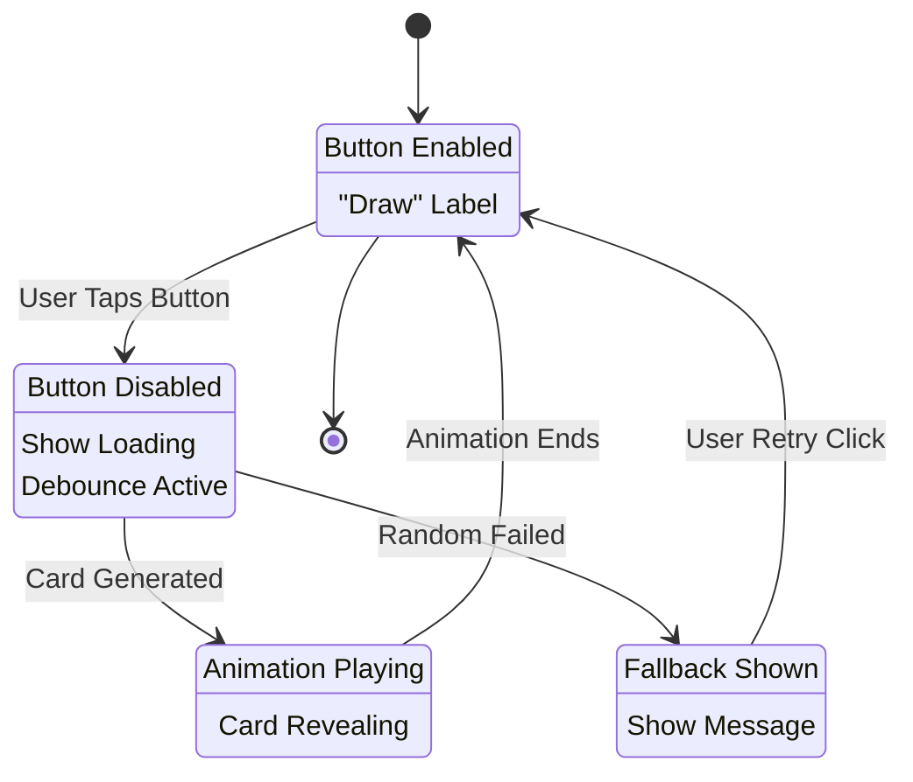
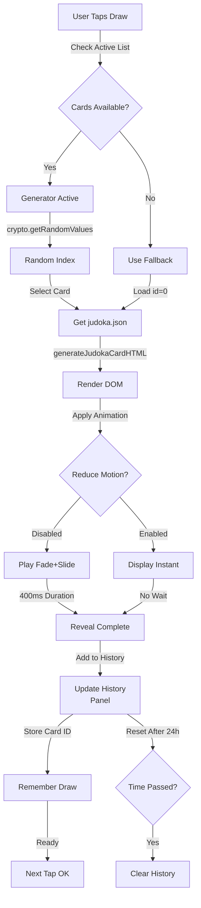
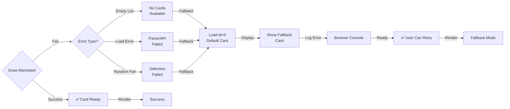

# PRD: Display Random Judoka

**Game Mode ID:** `12`
**URL:** `randomJudoka.html`

---

## TL;DR

Display Random Judoka gives players instant, inspiring roster ideas by drawing and revealing a random card with fast, smooth animations and full accessibility support — reducing team-building fatigue and increasing session engagement.

> Mia taps “Draw” and a new judoka slides up instantly, surprising her with a powerful pick she hadn’t considered. She taps again, excitedly building a fresh team, and spends twice as long experimenting compared to when she built manually. The bright animations and satisfying feel keep her engaged.

---

## Problem Statement

Players currently experience predictable, repetitive gameplay when they pre-select cards, leading to decreased engagement and shorter session times. Without randomness, team composition lacks inspiration and novelty, causing players to churn or lose interest more quickly.

> _“I always pick the same cards because it’s easier. I get bored of my team really fast.” — 10-year-old player during playtest session_

**Game data shows:** 35% of players who manually build teams exit the game within 5 minutes, while players using random draws play an average of 40% longer per session.

---

## Goals

- Give players quick inspiration for new team ideas (**random card appears in ≤300 ms in ≥95% of sessions, matching Game Modes PRD metric**)

---

## User Stories

- As a player who wants to try new team combinations, I want to draw a random judoka so that I can discover picks I might not have considered.
- As a young player with limited patience, I want the random card to appear instantly so that I stay engaged and don’t get bored waiting.
- As a parent or accessibility user, I want the card reveal to respect Reduced Motion settings so that animations do not cause discomfort.
- As a player who sometimes loses internet or has device issues, I want to see a fallback card if something goes wrong so that the screen never feels broken.

---

## Non-Goals

- Complex filters or search
- Weighted draws (favoring certain judoka)
- Advanced filters or rarity-based restrictions

---

## Prioritized Functional Requirements

| Priority | Feature                         | Description                                                                    |
| :------: | :------------------------------ | :----------------------------------------------------------------------------- |
|  **P1**  | Draw Random Judoka              | Automatically display a random judoka when the Draw button is tapped.          |
|  **P1**  | Animation Timing                | Card reveal animation completes promptly and respects Reduced Motion settings. |
|  **P2**  | Fallback Card                   | If the judoka list is empty or fails to load, show a default placeholder card. |
|  **P2**  | Disable Interaction During Draw | Prevent repeated taps while a new card is loading.                             |

---

## Random Judoka Draw Diagrams

### 6.16.1: Draw Button State Machine



**Draw Button Lifecycle:**
The draw button operates through a 4-state cycle: IDLE (ready to tap), DRAWING (disabled/loading), SUCCESS (animation playing), ERROR (fallback shown). Debouncing prevents rapid repeated taps. Button remains disabled during animation to prevent double-draws.

### 6.16.2: Card Generation with History Tracking



**Card Generation & History Management:**
The system selects from active judoka (skipping hidden entries), generates HTML, applies reveal animations (respecting Reduce Motion), and tracks drawn cards in the history panel. Each successful draw stores the card ID for reference. History auto-clears after 24 hours.

### 6.16.3: Error Handling & Fallback Strategy



**Robust Error Handling:**
Any draw failure (empty card list, parse error, random selection failure) triggers the fallback card (judoka id=0). Errors are logged to console for debugging. Users can immediately retry without page reload. The system never displays a broken state.

---

## Acceptance Criteria

- A random judoka is displayed on each visit (≥95% of sessions).
- Each random judoka is displayed in ≥95% of cases (matches Game Modes PRD metric).
- Draw button reliably refreshes card on tap (≥99% tap success).
- Show fallback card if judoka list is empty (displays in ≥99% of cases).
- Respect OS-level Reduced Motion settings (disable animations when active).

---

## Dependencies

- Access to the full judoka list
- Uses `generateRandomCard` (see [prdDrawRandomCard.md](prdDrawRandomCard.md)), which:
  - Selects a random judoka from the active set, skipping hidden/inactive cards
  - Guarantees fallback to a default card if the list is empty or an error occurs
  - Honors Reduced Motion and sound settings for accessibility
  - Disables repeated draws during animation/loading
  - Ensures fast, fair, and accessible random selection logic for all game modes
- Reads global sound and motion preferences from `settings.html`

---

## Technical Considerations

- Caching, randomness, and fallback logic are handled by `generateRandomCard`

### Card History UI

- The Random Judoka history view uses a native `<details id="history-panel">`
  disclosure rather than a modal dialog so the toggle is always reachable,
  survives refreshes, and requires no scripted mounting.
- Opening the disclosure animates a right-aligned sheet into view purely with
  CSS so Reduced Motion preferences remain respected.
- Pressing <kbd>Escape</kbd> (or toggling the summary again) closes the panel
  and returns focus to the summary control, matching the prior dialog's
  keyboard affordances.

---

## Implementation Architecture: Draw Card State Machine

The Draw button behavior is managed by a **state machine** that ensures consistent UI state and prevents interaction errors during the card draw lifecycle.

### State Machine Overview

The `drawCardStateMachine` module (`src/helpers/drawCardStateMachine.js`) manages four discrete states that represent the button's lifecycle during a card draw operation:

1. **IDLE** - Button enabled, ready to accept user input. Shows "Draw Card" label.
2. **DRAWING** - Button disabled, card generation in progress. Shows loading indicator or "Loading..." label.
3. **SUCCESS** - Card successfully generated, animation in progress. Button remains disabled.
4. **ERROR** - Card generation failed (network error, empty list), fallback card displayed. Button re-enabled after error resolution.

### State Diagram

```text
       ┌─────────────┐
       │    IDLE     │
       │ Button On   │
       └──────┬──────┘
              │ (user taps Draw button)
              ▼
       ┌─────────────────┐
       │    DRAWING      │
       │ Button Disabled │
       │ Loading UI      │
       └──┬──────────┬───┘
          │          │
   (card  │          │ (error occurs)
    ready)│          │
          ▼          ▼
    ┌─────────┐  ┌─────────┐
    │ SUCCESS │  │  ERROR  │
    │Animating│  │Fallback │
    │         │  │Shown    │
    └────┬────┘  └────┬────┘
         │            │
         └────┬───────┘
              │ (animation ends or error handled)
              ▼
       ┌─────────────┐
       │    IDLE     │
       │ Button On   │
       └─────────────┘
```

### State Transitions

| From    | To      | Trigger                     | Button Action                 |
| ------- | ------- | --------------------------- | ----------------------------- |
| IDLE    | DRAWING | User taps "Draw" button     | Disable button, show loading  |
| DRAWING | SUCCESS | Card generated successfully | Keep disabled, show animating |
| DRAWING | ERROR   | Card generation fails       | Re-enable after error shown   |
| SUCCESS | IDLE    | Animation completes         | Re-enable button              |
| ERROR   | IDLE    | Error resolved or dismissed | Button ready for next draw    |

### Invalid Transitions

The state machine validates all transitions and throws descriptive errors for:

- **IDLE → ERROR**: Skip to error state without attempting to draw (invalid)
- **DRAWING → IDLE**: Transition without success or error (invalid)
- **SUCCESS → DRAWING**: Re-draw before animation completes (invalid)
- **Unknown State**: Prevents undefined state access

This fail-fast behavior catches bugs during development and ensures the button never enters an inconsistent state.

### Why This Pattern Matters

This state machine implementation satisfies the functional requirement to **"Disable interaction during draw"** (Task 6.1) by:

1. **Preventing race conditions**: Button is disabled during the entire DRAWING and SUCCESS phases
2. **Centralizing button logic**: All state transitions update button UI atomically
3. **Improving testability**: Each state transition is independently testable
4. **Enhancing maintainability**: Future developers can understand button behavior at a glance
5. **Catching bugs early**: Invalid transitions throw errors instead of silently corrupting state

---

## Edge Cases / Failure States

- Handled by `generateRandomCard` (empty list fallback, error logging, and graceful cancellation)
- State machine prevents invalid transitions that could corrupt button state
- If animation is interrupted, the ERROR state ensures button remains usable

---

## Open Questions

- **Pending:** Decide whether favourites influence the random selection.

---

## UI Design

### Design and UX Considerations

#### Layout and Interaction

- **Main Screen Structure:**
  - **Card Display Area:** Centered large card placeholder with dynamic content
  - **Action Buttons:**
    - Prominent “Draw Card!” button below the card, centered, clear label
- **Draw Flow:**
  1. Player loads the screen
  2. Player taps “Draw Card!” button → new random card slides or fades in
  3. If Reduced Motion is active or the player disables motion in `settings.html`, the card changes instantly without animation
- **Button Size:**
  - Minimum: 64px height × 300px width for easy tapping, especially for kids
  - Style: Capsule shape using `--radius-pill` for consistent branding

#### Animation and Transitions

- **Card Reveal Animation:**
  - Slide-in from bottom or fade-in
- **Fallback:**
  - If animation performance drops, degrade to static card reveal
- **Button Feedback:**
  - Press: Slight scale-in (95% size) for ~100ms
  - Disabled state: Lower opacity (50%), disable input if judoka list is empty or draw is in progress

#### Accessibility

- Detect OS-level Reduced Motion; disable animations if active
- Sound and motion preferences are configured via `settings.html` (no on-screen toggles)
- Tap targets ≥44px × 44px (64px recommended for kid-friendly design). See [UI Design Standards](../codeStandards/codeUIDesignStandards.md#9-accessibility--responsiveness)
- Text must meet WCAG 2.1 AA 4.5:1 contrast ratio (verify with automated tools)
- All buttons and states require clear text labels
- The Draw button uses `aria-label="Draw a random judoka card"` so screen readers
  announce a consistent name even if the visible text changes

#### Responsiveness

- **Mobile (<600px):** card fills ~70% of viewport; draw button spans nearly full width
- **Tablet/Desktop (>600px):** card ~40% of viewport; centered draw button with spacing
- **Landscape Support:** components reposition vertically or side-by-side
- Card container uses `min-height: 50dvh` to keep the Draw button visible on small screens
- The Draw button must remain fully visible within the viewport even with the fixed footer navigation present
- `.card-section` uses `padding-bottom: calc(var(--footer-height) + env(safe-area-inset-bottom))` so buttons stay visible above the footer

#### Audio Feedback (Optional Enhancement)

- Chime/swoosh sound <1 second, volume at 60% of system volume
- Sound effect plays only when enabled in `settings.html`

#### Visual Mockup Description

- **Draw Button Area:** prominent pill-shaped “Draw Card!” button prefixed with a draw icon; sound and motion settings live in `settings.html`

---

## Tasks

- [x] **1.0 Integrate `generateRandomCard`**
  - [x] 1.1 Call it when the Draw button is tapped
- [x] **2.0 Build layout and controls**
  - [x] 2.1 Create card display area and prominent Draw button
- [ ] **3.0 Accessibility & fallback**
  - [ ] 3.1 Verify WCAG contrast and tap target sizes (manual/automated check needed)
  - [x] 3.2 Display fallback card on error using the module
- [ ] **4.0 Reduced Motion & Animation**
  - [ ] 4.1 Honor animation preference from `settings.html`
  - [x] 4.2 Respect OS-level Reduced Motion setting (logic present)
  - [ ] 4.3 Ensure all card reveal animations are fully disabled when Reduced Motion or the global preference is active (verify in UI and CSS)
- [ ] **5.0 Audio Feedback**
  - [ ] 5.1 Play draw sound effect when global sound setting in `settings.html` is enabled
  - [ ] 5.2 Confirm sound is off by default in `settings.html`
- [ ] **6.0 Button Interaction**
  - [x] 6.1 Disable Draw button during card animation/loading (implemented via state machine in `src/helpers/drawCardStateMachine.js`)
  - [x] 6.2 Add visual feedback for button press (scale-in effect)
- [ ] **7.0 UI Responsiveness**
  - [ ] 7.1 Ensure Draw button remains visible above footer on all screen sizes (manual/automated check needed)
  - [ ] 7.2 Card and controls layout matches mobile/tablet/desktop requirements
- [x] **8.0 Testing**
  - [x] 8.1 Add/verify unit tests for random card logic (18 unit tests for state machine, 27 total passing)
  - [x] 8.2 Add/verify Playwright UI tests for draw flow, fallback, and accessibility (7 Playwright tests passing)

---

[Back to Game Modes Overview](prdGameModes.md)
