# PRD: Random Stat Auto-Select

## Overview (TL;DR)

Random Stat Auto-Select is an optional game mode in JU-DO-KON! where, if the player does not select a stat within a set time limit, the system automatically selects a random stat for the round. This feature adds urgency and unpredictability to matches and can be toggled via the Settings page.

## Problem Statement

Players sometimes want stats auto-chosen to speed play and reduce decision stress. Random Stat Auto-Select (feature flag key: `autoSelect`) enables automatic stat selection when the timer expires, keeping matches fast-paced and accessible for all play styles.

## Goals / Success Metrics

- Reduce average round stat selection time by **30%** among players who enable Random Stat Auto-Select, measured over a 14-day window.
- Increase **casual match completion rate by 15%** for players with the feature enabled.
- Ensure at least **95% of users can locate and toggle the feature** in Settings during usability tests.
- Maintain **feature toggle persistence across sessions** with 0% error rate in toggle state loss.

## User Stories

- As a new player, I want the game to pick a stat for me if I don't decide quickly, so I can keep playing without stress.
- As a returning player, I want to enable Random Stat Auto-Select for a more dynamic and fast-paced experience.
- As a player, I want to toggle this feature in Settings so I can control my preferred play style.

## Prioritized Functional Requirements

| Priority | Feature                     | Description                                                                     |
| -------- | --------------------------- | ------------------------------------------------------------------------------- |
| P1       | Stat Selection Timer        | Start a countdown timer each round for stat selection (default: 30s).           |
| P1       | Auto-Select Random Stat     | If timer expires, automatically select a random stat and apply it to the round. |
| P1       | Settings Toggle             | Allow players to enable/disable Random Stat Auto-Select via the Settings page.  |
| P2       | Visual Timer Feedback       | Display remaining time to the player during stat selection.                     |
| P2       | Info Message on Auto-Select | Show a message indicating which stat was auto-selected when time runs out.      |
| P3       | Accessibility Compliance    | Ensure timer and messages are accessible (e.g., ARIA live regions, contrast).   |

## Acceptance Criteria

- A visible countdown timer appears during stat selection, starting at 30s (or fallback default if config fails).
- When Random Stat Auto-Select (`autoSelect`) is ON and the timer expires, a valid stat is auto-picked and applied to the round.
- When Random Stat Auto-Select is OFF, timeout follows the interrupt path (`interruptRound`) instead of auto-resolving the round.
- Players can toggle the feature in the Settings page; the toggle is clearly labeled and persists across sessions.
- The auto-select message is displayed to the player when a stat is chosen automatically.
- Timer and messages are accessible (ARIA live, high-contrast, non-obstructive).
- If timer configuration fails, system uses a 30s fallback and shows a loading message.

### State Transition Flowchart: Stat Selection with Auto-Select Branching

```mermaid
flowchart TD
    A["Player enters<br/>stat selection"] --> B["🔊 Announce: Choose stat<br/>check autoSelect state"]
    B --> C{"Is autoSelect<br/>enabled?"}

    C -->|YES| D["Stat selection timer running<br/>Timeout path -> roundResolve"]
    C -->|NO| E["Stat selection timer running<br/>Timeout path -> interruptRound"]

    D --> F{"Player action<br/>before timeout?"}
    E --> F

    F -->|Stat selected| G["Apply selected stat<br/>🔊 Announce: 'You selected [STAT]'"]
    F -->|Timeout + autoSelectEnabled| H["Random stat auto-pick<br/>🔊 Announce: 'Auto-selected [STAT]'"]
    F -->|Timeout + !autoSelectEnabled| I["Interrupt round<br/>Offer resume options"]

    G --> J["Stat locked<br/>Proceed to roundResolve"]
    H --> J
    I --> K["Return to<br/>roundWait state"]

    style A fill:#e3f2fd
    style D fill:#fff9c4
    style E fill:#e8f5e9
    style H fill:#c8e6c9
    style I fill:#ffebee
    style J fill:#c8e6c9
    style K fill:#ffebee
```

**Rationale**: This flowchart encodes the implemented branching logic from `roundSelect`—feature flag gate, dual timeout paths, and immediate stat resolution. The 🔊 annotations indicate where accessibility announcements occur. Focuses on stat selection only; full round flow is handled by the state machine.

## Edge Cases / Failure States

- If timer config fails to load, fallback value of 30s is used.
- If player disconnects mid-selection, default stat is chosen on reconnection.
- If tab is inactive or minimized, timer continues server-side.
- If screen reader fails to announce message, text remains persistently visible.
- If player toggles feature mid-match, change takes effect from next round.

### Timer Initialization & Fallback Diagram

**Rationale (implemented today)**: Runtime code has a single auto-select flag (`autoSelect`) and guard names (`autoSelectEnabled` / `!autoSelectEnabled`) for timeout routing. There is no separate canonical runtime flag for “show selection timer,” so that branch is intentionally removed from this implementation diagram.

**Note (proposed behavior)**: A future explicit display-only timer flag could be introduced, but it is not part of current state-table or settings behavior.

## Non-Functional Requirements / Design Considerations

- Countdown timer must meet WCAG color contrast standards.
- Message region should not disrupt layout or screen reader navigation.
- Feature toggle state must persist via local storage or player profile settings.
- Performance impact of enabling timer and message display should be minimal.

### Settings Persistence Lifecycle

> **Note**: This diagram illustrates the implemented persistence flow at a high level. Race condition handling (e.g., persistence failure while next round starts) is simplified for clarity.

**Rationale (implemented today)**: Settings are stored under a single `settings` localStorage key and merged with `DEFAULT_SETTINGS`/runtime settings JSON; the toggle key is camelCase (`featureFlags.autoSelect.enabled`).

**Note (proposed behavior)**: "Defer to next round" may still be a UX policy choice, but persistence itself is immediate once save succeeds.

## Wireframes / Visual Concepts

_(Visuals to be attached)_

- Timer displayed at the top of the stat selection UI.
- “Auto-selected” message displayed below the stat grid post-expiry.
- Toggle control placed in Settings > Gameplay section with tooltip: “Automatically choose a stat if no selection is made in time.”

## Dependencies and Open Questions

- Depends on `timerControl.js` logic.
- UI components in `battleJudoka.html` and `settings.html`.
- Open Question: Should timer duration be user-configurable in advanced settings?

---

## Tasks

- [ ] 1.0 Implement Stat Selection Timer
  - [ ] 1.1 Add countdown timer to stat selection screen
  - [ ] 1.2 Configure default timer value (30 seconds)
  - [ ] 1.3 Integrate timer with `timerControl.js`

- [ ] 2.0 Develop Auto-Select Random Stat Logic
  - [ ] 2.1 Trigger random stat selection on timer expiry
  - [ ] 2.2 Display auto-select message to player
  - [ ] 2.3 Ensure stat is logged and used in battle logic

- [ ] 3.0 Create Settings Page Toggle
  - [ ] 3.1 Add toggle to Settings UI
  - [ ] 3.2 Link toggle state to game logic
  - [ ] 3.3 Persist toggle state across sessions

- [ ] 4.0 Build Visual Timer Feedback
  - [ ] 4.1 Display visible countdown on stat selection screen
  - [ ] 4.2 Update style for clarity and accessibility

- [ ] 5.0 Ensure Accessibility Compliance
  - [ ] 5.1 Use ARIA live regions for timer and messages
  - [ ] 5.2 Validate contrast and keyboard navigation
  - [ ] 5.3 Test across supported browsers and screen readers
