# Round Selection PRD

## TL;DR

Round selection is the UX that allows players to choose the match length (win target) before Classic Battle begins. This PRD defines the UX flow, persistence, accessibility, and integration with autostart/testing modes.

## Problem Statement / Why it matters

Round selection is the first user interaction in a match flow and affects match pacing and testing. If the selection flow is inconsistent or inaccessible, players may be confused or automated tests may fail.

## Goals / Success Metrics

- Provide an accessible modal that lets users choose points-to-win (short/medium/long: 3/5/10).
- Persist the last choice for returning players.
- Support `?autostart=1` for automated flows and testing.

## User Stories

- As a returning player, I want the previously chosen win target restored so I can quickly start a match.
- As an automated test, I want an `autostart` query param to bypass the modal.

## Prioritized Functional Requirements

P1 - Round Selection Modal: Modal appears at match start unless autostart or saved preference exists. Options: 3, 5, 10 points (short/medium/long).

Acceptance Criteria:

- Modal displays when no saved preference and `?autostart` is not set.
- Selecting an option stores preference in localStorage and starts the match.

-Notes:

1. On page load, `resolveRoundStartPolicy` checks for `?autostart=1` or a saved selection and starts a match immediately if found.
2. When no preference or autostart override is available, present the modal so the player can choose a win target; selecting an option stores it, logs telemetry, and launches the match.
3. If the modal fails to load, log the error and surface a fallback **Start Match** path that resolves points through the same resolver chain and begins the match.

### Initialization Flow: Autostart, Persistence & Fallback Decision Tree

```mermaid
flowchart TB
    A["Page load<br/>battleJudoka.html"] --> B["resolveRoundStartPolicy called"]
    B --> C{"Autostart requested<br/>?autostart=1?"}
    B --> T{"bypassForTests?<br/>!showModalInTest && (testMode || playwright)"}

    C -->|YES| D["Resolve pointsToWin (autostart chain):<br/>1) engine target<br/>2) storage battle.pointsToWin<br/>3) DEFAULT_AUTOSTART_POINTS_TO_WIN"]
    C -->|NO| U
    T -->|YES| D
    T -->|NO| U["Continue non-autostart path"]

    U --> E["Check persisted selection<br/>battle.pointsToWin"]
    E --> F{"Persisted selection<br/>valid option?"}

    F -->|YES| H["Attempt to load modal<br/>with persisted default selected"]
    F -->|NO| H

    H --> I{"Modal load<br/>successful?"}

    I -->|YES| J["🔊 Show modal<br/>Options: 3, 5, 10 points"]
    I -->|NO| K["⚠️ Log error<br/>Modal-fallback start"]

    J --> L["Player selects option"]
    L --> M["Store selection<br/>localStorage<br/>battle.pointsToWin"]
    M --> N["🔊 Log telemetry<br/>Start match"]

    K --> P["Resolve fallback pointsToWin (non-autostart chain):<br/>1) engine target<br/>2) storage battle.pointsToWin<br/>3) DEFAULT_POINTS_TO_WIN (5)"]
    D --> O["Match begins"]
    N --> O
    P --> O

    style A fill:#e3f2fd
    style C fill:#fff9c4
    style T fill:#fff9c4
    style E fill:#fff9c4
    style F fill:#fff9c4
    style U fill:#fff9c4
    style H fill:#fff9c4
    style I fill:#fff9c4
    style D fill:#c8e6c9
    style J fill:#e8f5e9
    style K fill:#ffcdd2
    style P fill:#fff9c4
    style M fill:#fff9c4
    style N fill:#fff9c4
    style O fill:#c8e6c9
```

**Rationale**: This flowchart encodes the three initialization phases—**Check** (autostart + test bypass + resolver chain), **Present** (show modal UI), and **Fallback** (error handling that still uses the same resolver logic)—using decision diamonds for conditional branches. The color scheme distinguishes initialization entry (blue), decision checkpoints (yellow), success paths (green), and error states (red). The 🔊 annotations mark telemetry and accessibility logging points. This focuses on initialization logic only; modal component lifecycle is handled separately by the UI layer. The points-to-win resolution is modeled as a shared chain (engine target → persisted storage → mode-specific default), so autostart does not assume an unconditional fixed value when higher-priority sources are available.

P1 - Autostart Behavior: `?autostart=1` bypasses modal and starts a match using the resolver chain (engine target, then persisted storage, then autostart default if needed).

Acceptance Criteria:

- Visiting `battleJudoka.html?autostart=1` begins a match without showing the modal.

P2 - Persistence: Save and restore last selected points-to-win from localStorage (key: `battle.pointsToWin`).

Acceptance Criteria:

- The saved preference is restored on subsequent page loads.

P2 - Accessibility: Modal must be keyboard navigable, labeled, and dismissible via keyboard with clear focus management.

Acceptance Criteria:

- Modal meets basic accessibility checks (focus trap, ARIA labels, keyboard operation documented).

## Non-Functional Requirements / Design Considerations

- Telemetry: Log selected win target for analytics.
- Testing: Provide Playwright helpers to wait for modal readiness or autostart.

## Dependencies and Open Questions

- Cross-reference: `prdBattleClassic.md` and `prdTestMode.md`.
- Open question: Should the list of options be configurable via settings? Recommendation: keep static for now and raise as P3.
