# Snackbar Notifications PRD

## Overview

Snackbar notifications provide brief, unobtrusive feedback to users near the bottom of the screen. They are used to confirm actions, display errors, or communicate status updates without interrupting gameplay or navigation.

## Problem Statement

Players and users need immediate, accessible feedback for actions (e.g., saving, errors, status changes) that does not disrupt their flow or require dismissing modal dialogs.  
Before snackbars, feedback was inconsistent:

- Some success messages appeared in small, hard-to-see text.
- Certain errors were logged silently without visible player notification.
- Status updates were sometimes shown in pop-ups that blocked gameplay.

> “I didn’t even realize my deck saved—I only found out when I reloaded the game and it was there.” — Player feedback from beta testing

This inconsistency led to confusion, missed information, and reduced trust in the system.

## Goals

- **G1:** Communicate 100% of user actions and system events requiring feedback promptly following trigger.
- **G2:** Maintain a consistent, visually unobtrusive notification style across all game modes and screens.
- **G3:** Meet accessibility standards for live region announcements and color contrast (WCAG 2.1 AA).
- **G4:** Achieve a high success rate in displaying snackbars during automated UI tests.

## User Stories

- As a player, I want to see a confirmation when I save my team so that I know my changes were successful.
- As a user, I want to be notified if an error occurs (e.g., data fails to load) so that I can take corrective action.
- As a developer, I want a simple API to trigger snackbars from any module so that feedback is consistent and easy to implement.

## Player Interaction Flow

1. **Trigger:** Player performs an action (save, load, update) or the system detects an event (error, offline mode).
2. **System Response:** Snackbar appears within promptly following the trigger.
3. **Stacking:** If a new snackbar is triggered while one is visible, it stacks below the existing message (max 2 concurrent). The older message moves up with reduced opacity.
4. **Overflow:** When a 3rd message arrives, the oldest message is dismissed and removed from the queue.
5. **Dismissal Policy:** Each snackbar has an independent 3000ms auto-dismiss timer; no manual close button is provided to reduce interaction overhead.
6. **Accessibility:** Screen readers announce each snackbar text independently via ARIA live region with `role="status"` and `aria-atomic="false"`.

## Visual & UX Reference

- **Position:** Bottom center of the viewport, **16px** above safe zone on mobile to avoid OS navigation bars.
- **Size:** Max width = **480px** on desktop, **90% viewport width** on mobile.
- **Padding:** **12px vertical**, **16px horizontal** inside snackbar.
- **Typography:** Body font, **14px**, medium weight, truncates after 2 lines with ellipsis.
- **Animation:** Fade-in: **250ms**, ease-out; Fade-out: **250ms**, ease-in.
- **Tap/Click Targets:** Entire snackbar area is interactable for potential future use cases (e.g., retry action).
- **Color & Contrast:** Themed background colors with ≥4.5:1 contrast ratio against text; fallback colors if contrast check fails.

## Prioritized Functional Requirements

| Priority | Feature                  | Description                                                                          |
| -------- | ------------------------ | ------------------------------------------------------------------------------------ |
| P1       | Show Snackbar            | Display a temporary message at the bottom of the screen with fade-in/out animation.  |
| P1       | Update Snackbar          | Change the current snackbar's text and restart its timers if already shown.          |
| P1       | Accessibility Compliance | Snackbar uses ARIA live region and `role="status"` for screen readers.               |
| P1       | Configurable Duration    | Snackbar auto-dismisses after a default **3s** and supports **1–10s** range.         |
| P2       | Message Stacking         | Max 2 snackbars visible concurrently; older messages pushed up with reduced opacity. |
| P2       | Theming and Contrast     | Snackbar colors adapt to theme and pass contrast checks (≥4.5:1 ratio).              |
| P2       | Localization Support     | Snackbar text supports multi-language strings and right-to-left layouts.             |

## Acceptance Criteria (Given/When/Then)

1. **Given** the player triggers an action that requires confirmation, **when** the action completes, **then** a snackbar appears promptly and fades out after the configured duration (default **3s**).
2. **Given** a snackbar is already visible, **when** a new snackbar is triggered, **then** the new message stacks below and the existing message moves up with reduced opacity (max 2 concurrent).
3. **Given** two snackbars are visible, **when** a third is triggered, **then** the oldest message is dismissed and the queue shifts.
4. **Given** the snackbar is displayed, **when** viewed by a screen reader, **then** it is announced using ARIA live region with role="status" and aria-atomic="false".
5. **Given** the snackbar text is displayed, **then** it passes WCAG 2.1 AA contrast checks in all supported themes.
6. **Given** the app is in a right-to-left language mode, **then** snackbar text and layout adjust accordingly.
7. **Given** the snackbar is triggered by an error, **then** the error message is displayed in the snackbar.
8. **Given** a custom duration is specified, **when** that duration elapses, **then** the snackbar auto-dismisses.
9. **Given** multiple messages are stacked, **when** each timer expires independently, **then** messages dismiss individually without affecting other visible snackbars.

## Edge Cases / Failure States

- **Offline Mode:** If network errors occur, display an offline snackbar with retry instructions.
- **Empty or Malformed Message:** Default to a generic “Action completed” or “An error occurred” message.
- **Animation Failure:** If animation API is unavailable, show snackbar instantly without fade-in/out.
- **Theme Conflict:** If current theme fails contrast check, override with fallback color scheme.
- **Localization Missing Key:** Fallback to English text with a “[MISSING TRANSLATION]” prefix.

## Non-Functional Requirements / Design Considerations

- Snackbar does not overlap critical UI elements or block navigation.
- Responsive layout: snackbar is centered and adapts to viewport size.
- No persistent timers or memory leaks; timers are cleared on update/removal.
- On mobile, snackbar appears above system navigation bars; on desktop, snackbar is anchored to viewport bottom.

## Z-Index Management

**Centralized Hierarchy:**

The snackbar system uses a centralized z-index management approach defined in `src/styles/base.css`:

- **Snackbars:** `var(--z-index-snackbar) = 1040`
- **Modals:** `var(--z-index-modal) = 1050`
- **Tooltips:** `var(--z-index-tooltip) = 1070`

**Positioning Strategy:**

Snackbars are deliberately positioned BELOW modals and tooltips in the z-index hierarchy:

- **Rationale:** Snackbars provide non-blocking, informational feedback that should not obscure critical interactive elements like modal dialogs or tooltips
- **Behavior:** When a modal is open, snackbars remain visible but layered beneath, ensuring modal interactions take precedence
- **Consistency:** All z-index values are managed through CSS custom properties for maintainability and predictable stacking behavior

---

## Snackbar Queue & Lifecycle Architecture

**Queue Management System** (Max 2 concurrent):

```mermaid
graph TD
    A["🔔 showSnackbar called<br/>message: 'Action saved'"] -->|Add to queue| B["Queue: [msg1]"]

    B --> C["Render msg1<br/>Position: .snackbar-bottom<br/>Opacity 1.0"]

    C --> D["▶️ Fade-in 250ms<br/>ease-out"]

    D --> E["⏱️ Start timer<br/>3000ms (configurable)"]

    E --> F["👆 showSnackbar called<br/>message: 'Round started'"]

    F -->|Add to queue| G["Queue: [msg1, msg2]"]

    G --> H["Render projection:<br/>index 0 → .snackbar-top<br/>index 1 → .snackbar-bottom"]

    H --> I["Animation:<br/>msg1: translateY(-56px), opacity 0.7<br/>msg2: translateY(0), opacity 1.0"]

    I --> J["⏱️ msg2 timer<br/>3000ms started<br/>msg1 timer<br/>continues counting"]

    J --> K["msg1 timer expires"]

    K --> L["▶️ Dismiss msg1<br/>Fade-out 250ms<br/>ease-in"]

    L --> M["Queue: [msg2]"]

    M --> N["Render projection:<br/>index 0 → .snackbar-bottom<br/>Opacity: 1.0"]

    N --> O["⏱️ msg2 timer<br/>continues"]

    O --> P["msg2 timer expires"]

    P --> Q["▶️ Dismiss msg2<br/>Fade-out 250ms"]

    Q --> R["Queue: []<br/>✅ Empty"]

    style C fill:#lightgreen
    style D fill:#lightyellow
    style H fill:#lightcyan
    style L fill:#ffe6e6
    style R fill:#lightblue
```



**Snackbar Individual Behavioral Lifecycle**:

```mermaid
stateDiagram-v2
    [*] --> Created: showSnackbar(msg)

    Created: 📝 Message created<br/>Assigned ID and queued

    Created --> Visible: render projection

    Visible: 👁️ Displayed to user<br/>Timer active<br/>aria-live announces text

    Visible --> Dismissing: timer
    Visible --> Dismissing: overflow
    Visible --> Dismissing: manual dismiss
    Visible --> Dismissing: update policy

    Dismissing: 🔴 Pending removal<br/>Exit animation may run

    Dismissing --> Removed: removal commit

    Removed: ✅ Detached from DOM<br/>Removed from queue

    Removed --> [*]

    note right of Visible
        Transition triggers:
        timer, overflow,
        manual dismiss,
        update policy
    end note
```



**Multi-Message Stacking Behavior**:

```
Timeline:  T=0ms          T=500ms            T=2500ms          T=3000ms
Message 1: [Fade-in ───] [Visible ────────────────────────────] [Fade-out ──]
Message 2:                     [Fade-in ───] [Visible ────────────────────] [Fade-out]

Position:  Msg1 @ bottom  Msg1 @ top (-56px) Msg1 fading out  Both gone
           Invisible      opacity 0.7         Msg2 @ bottom
                          Msg2 @ bottom       opacity 1.0
                          opacity 1.0

Stack:     [msg1]         [msg1 @ top      [msg2 @ bottom    []
                          msg2 @ bottom]    fading...]
```

**Queue Overflow Handling** (3+ messages):

```mermaid
graph LR
    A["Queue: [msg1, msg2]<br/>3rd message arrives"] -->|removeOldest| B["Remove msg1<br/>from queue"]

    B --> C["Queue: [msg2, msg3]"]

    C --> D["msg2 → .snackbar-top<br/>msg3 → .snackbar-bottom"]

    D --> E["✅ Max 2 visible<br/>Oldest auto-dismissed"]

    style E fill:#lightgreen
```



**Snackbar DOM Structure & Accessibility**:

```html
<!-- Container (persistent in DOM) -->
<div
  id="snackbar-container"
  role="status"
  aria-live="polite"
  aria-atomic="false"
  class="snackbar-stack"
>
  <!-- Individual snackbar (dynamic, added per message) -->
  <div
    class="snackbar snackbar-bottom"
    id="snackbar-msg-1"
    role="status"
    aria-live="polite"
    data-message-id="msg-1"
    data-dismissal-timer="3000"
  >
    Action saved!
  </div>

  <!-- Second snackbar (if queued) -->
  <div
    class="snackbar snackbar-top"
    id="snackbar-msg-2"
    role="status"
    aria-live="polite"
    data-message-id="msg-2"
    data-dismissal-timer="3000"
  >
    Round 1 started
  </div>
</div>
```

**Animation Timeline & Positioning**:

```css
/* Snackbar base styles */
.snackbar {
  position: fixed;
  bottom: 16px; /* 16px from bottom safe zone */
  left: 50%;
  transform: translateX(-50%);
  max-width: 480px; /* desktop */
  opacity: 0;
  animation: snackbarFadeIn 250ms ease-out forwards;
  transition: all 300ms cubic-bezier(0.4, 0, 0.2, 1);
}

/* Positioned at bottom (newest message) */
.snackbar-bottom {
  transform: translateX(-50%) translateY(0);
  opacity: 1;
}

/* Positioned above (older message) */
.snackbar-top {
  transform: translateX(-50%) translateY(-56px);
  opacity: 0.7;
}

/* Fade out on removal */
.snackbar-removing {
  animation: snackbarFadeOut 250ms ease-in forwards;
}

@keyframes snackbarFadeIn {
  from {
    opacity: 0;
  }
  to {
    opacity: 1;
  }
}

@keyframes snackbarFadeOut {
  from {
    opacity: 1;
  }
  to {
    opacity: 0;
  }
}

/* Mobile responsive */
@media (max-width: 768px) {
  .snackbar {
    max-width: 90vw; /* 90% viewport width */
    bottom: 20px; /* Above mobile nav safe zone */
  }
}

/* Reduced motion support */
@media (prefers-reduced-motion: reduce) {
  .snackbar {
    animation: none;
    opacity: 1;
  }
}
```

**Snackbar API & Usage**:

```javascript
// API: showSnackbar(message, options)
import { showSnackbar, updateSnackbar, dismissSnackbar } from "./src/helpers/showSnackbar.js";

// Add message to queue (max 2 visible)
showSnackbar("Match saved!", { duration: 3000 }); // Uses default
showSnackbar("Round started!", { duration: 5000 }); // Custom duration 1-10s

// Update most recent snackbar text + restart timer
updateSnackbar("Updated: Round 2 begins");

// Dismiss specific snackbar by ID
dismissSnackbar(messageId);

// Output:
// T=0ms: Queue = [msg1]
// T=500ms: Queue = [msg1, msg2] (msg1 repositioned to top)
// T=2500-3000ms: msg1 dismissed, Queue = [msg2]
// T=5000ms: msg2 dismissed, Queue = []
```

**Performance & Accessibility SLAs**:

| Metric                     | Target         | Notes                                   |
| -------------------------- | -------------- | --------------------------------------- |
| Fade-in Animation          | 250ms          | ease-out easing                         |
| Fade-out Animation         | 250ms          | ease-in easing                          |
| Auto-dismiss Duration      | 3000ms         | Default; configurable 1-10s             |
| Queue Max Size             | 2 visible      | 3rd message auto-removes oldest         |
| Reposition Animation       | 300ms          | msg1 slides up when msg2 shows          |
| Screen Reader Announcement | <100ms         | aria-live="polite" delays non-interrupt |
| Mobile Safe Zone           | 16px+          | Above system navigation bars            |
| Text Contrast              | ≥4.5:1         | WCAG AA compliance                      |
| Reduced Motion             | 100%           | prefers-reduced-motion respected        |
| DOM Container Ready        | Before scripts | Prevents duplicate nodes                |

**Z-Index Stack**:

- **Snackbars:** `--z-index-snackbar = 1040`
- **Modals:** `--z-index-modal = 1050` (above snackbars)
- **Tooltips:** `--z-index-tooltip = 1070` (above all)

**Status Badge**: ✅ **VERIFIED** — Validated against:

- `src/helpers/showSnackbar.js` — Queue API and message lifecycle
- `src/styles/snackbar.css` — Animation timing and positioning
- `tests/helpers/showSnackbar.test.js` — Queue management, stacking, auto-dismiss
- `playwright/snackbar*.spec.js` — End-to-end visibility and timing tests
- WCAG 2.1 AA: aria-live regions, 4.5:1 contrast, reduced motion support

**Related Diagrams**:

- [Battle Action Bar](prdBattleActionBar.md) — Triggers confirm snackbars
- [Battle Scoreboard](prdBattleScoreboard.md) — Uses snackbars for state notifications
- [Settings Menu](prdSettingsMenu.md) — Snackbar confirmation on save

---

## Dependencies and Open Questions

## Dependencies and Open Questions

- Depends on `src/helpers/showSnackbar.js` for queue-based API and logic.
- Depends on `src/styles/snackbar.css` for stacking styles and animation.

## DOM Container Contract

Pages that surface snackbars must render a persistent container near the end of
`<body>` before any script that might trigger notifications during load:

```html
<div id="snackbar-container" role="status" aria-live="polite"></div>
```

If the container is missing at runtime, the helper will create a fallback with
the same ID. Always ship the explicit container to avoid duplicate nodes when
multiple bundles initialise concurrently.

## Usage Guidance

- Use snackbars for brief, non-blocking feedback only. For critical errors or actions requiring user input, use modal dialogs.
- Always provide clear, concise messages (max 1–2 lines).
- Trigger snackbars via `showSnackbar(message)` for new notifications, or `updateSnackbar(message)` to change the current message.
- Do not use snackbars for persistent or complex information.

```js
import { showSnackbar, updateSnackbar } from "./src/helpers/showSnackbar.js";

// Each call adds to the queue (max 2 visible)
showSnackbar("Match started!");
showSnackbar("Round 1 begins"); // Stacks below first message

// Update the most recent snackbar text
updateSnackbar("Round 1: Player's turn");
```

The queue-based architecture supports concurrent messages with independent timers,
automatic positioning, and graceful overflow handling (3rd message dismisses oldest).

## Tasks

- [x] 1.0 Implement Snackbar Component
  - [x] 1.1 Create HTML container for snackbar at bottom center of viewport
  - [x] 1.2 Add ARIA live region and `role="status"` attributes
  - [x] 1.3 Apply responsive CSS for desktop and mobile layouts
- [x] 2.0 Implement Snackbar Animation
  - [x] 2.1 Define fade-in and fade-out animations in CSS with duration and easing
  - [ ] 2.2 Ensure animation fallback for browsers without animation API
  - [x] 2.3 Test for non-overlapping UI and safe zone positioning
- [x] 3.0 Implement Snackbar API
  - [x] 3.1 Create `showSnackbar(message)` function with queue management
  - [x] 3.2 Create `updateSnackbar(message)` function for most recent message
  - [x] 3.3 Implement stacking with MAX_VISIBLE=2 concurrent snackbars
  - [x] 3.4 Implement independent timers per message with cleanup on dismissal
  - [x] 3.5 Expose optional `duration` parameter in `showSnackbar()` (default 3000ms)
- [x] 4.0 Accessibility & Localization
  - [x] 4.1 Ensure ARIA attributes work with screen readers (role="status", aria-atomic="false", aria-live="polite")
  - [x] 4.2 Test WCAG 2.1 AA contrast compliance
  - [ ] 4.3 Implement localization and right-to-left text support
  - [ ] 4.4 Add fallback text for missing localization keys
- [ ] 5.0 Configurable Settings
  - [ ] 5.1 Add constant for default duration (e.g., 3s)
  - [ ] 5.2 Allow configuration of duration between 1–10 seconds
  - [ ] 5.3 Ensure duration changes do not break animations
- [x] 6.0 Testing & Edge Cases
  - [ ] 6.1 Test offline mode snackbar with retry instructions
  - [ ] 6.2 Test empty/malformed message fallback
  - [ ] 6.3 Test theme conflict fallback colors
  - [x] 6.4 Test multiple snackbar triggers in rapid succession (stress test with 5 messages)
  - [x] 6.5 Test variable snackbar durations (independent timers validated)
