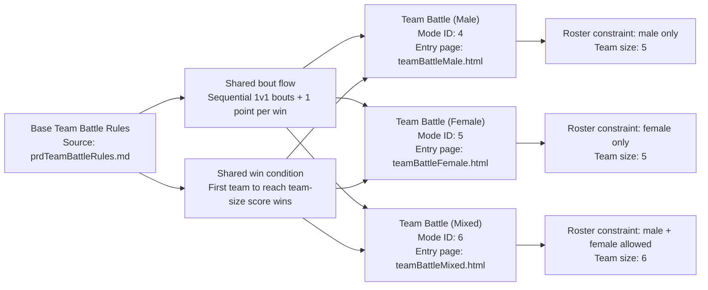

# PRD: Team Battle (Female)

---

## TL;DR

This mode inherits the base rules from [PRD: Team Battle Rules](prdTeamBattleRules.md). It offers all-female teams in a 5‑vs‑5 format.

**Game Mode ID:** `5`
**URL:** `teamBattleFemale.html`

---

## Problem Statement

Players who prefer women-only competition need a dedicated mode that mirrors the male and mixed options. Without it, female judoka receive less representation and players miss a strategic format focused entirely on women’s judo.

---

## Goals

- Showcase female judoka in a balanced 5‑vs‑5 format.
- Keep match length and scoring consistent with other Team Battle modes.

---

## User Stories

- As a player, I want to select a female-only team so I can compete using my favorite women judoka.
- As a developer, I want this mode to reuse the Team Battle Rules logic so maintenance is minimal.

---

## Prioritized Functional Requirements

| Priority | Feature               | Description                                                          |
| :------: | :-------------------- | :------------------------------------------------------------------- |
|  **P1**  | Female Roster Only    | Restrict team selection to judoka marked as female.                  |
|  **P1**  | Fixed Team Size       | Each team contains exactly 5 judoka.                                 |
|  **P1**  | Base Rule Inheritance | Follow all rules in [PRD: Team Battle Rules](prdTeamBattleRules.md). |
|  **P2**  | Early Quit Allowed    | Player may forfeit the match early.                                  |

---

## Acceptance Criteria

- Only female judoka can be chosen when forming a team.
- A match ends when one team scores 5 points.
- All other behavior matches the base Team Battle Rules.
- Quitting early records a loss for the quitting player.

---

## Non-Functional Requirements

- Match flow updates with **≤200 ms** latency.
- Maintain **≥60 fps** during battle animations.

---

## Mode-Specific Details

- Allowed gender: **female only**
- Team size: **5 judoka per team**

---

## Canonical Team Battle Variant Overlay Diagram

> **Diagram source of truth:** This diagram is canonical in [PRD: Team Battle Rules](prdTeamBattleRules.md#canonical-team-battle-variant-overlay-diagram). Keep this copy identical across Team Battle variant PRDs to prevent drift.

## Related Features

- [PRD: Team Battle (Male)](prdTeamBattleMale.md)
- [PRD: Team Battle (Mixed)](prdTeamBattleMixed.md)
- Entry point: [PRD: Team Battle Selection](prdTeamBattleSelection.md)

---

[Back to Game Modes Overview](prdGameModes.md)
