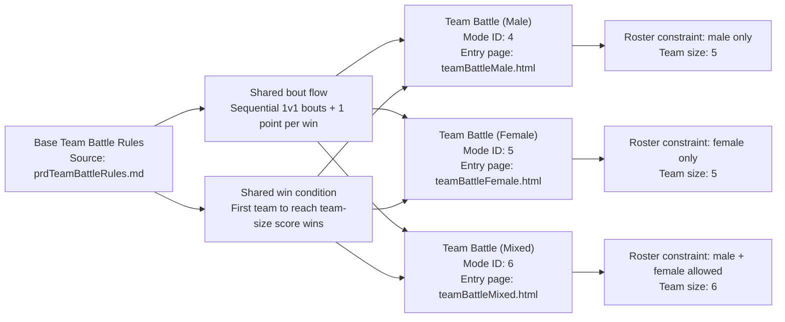

# PRD: Team Battle (Mixed)

---

## TL;DR

This mode inherits the base rules from [PRD: Team Battle Rules](prdTeamBattleRules.md). Mixed teams of men and women compete in a 6‑vs‑6 format.

**Game Mode ID:** `6`
**URL:** `teamBattleMixed.html`

---

## Problem Statement

Players want a mode that lets them mix male and female judoka on the same team. Currently they must rely on custom house rules. This PRD formalizes a mixed format that uses the base Team Battle rules.

---

## Goals

- Support six‑member teams with no gender restrictions.
- Mirror the pacing and scoring of other Team Battle variants.

---

## User Stories

- As a player, I want to mix genders on my team so I can use my favorite judoka regardless of gender.
- As a developer, I want this mode to reuse the base Team Battle logic for consistency.

---

## Prioritized Functional Requirements

| Priority | Feature               | Description                                                          |
| :------: | :-------------------- | :------------------------------------------------------------------- |
|  **P1**  | Mixed Roster Allowed  | Teams may include any combination of male and female judoka.         |
|  **P1**  | Fixed Team Size       | Each team contains exactly 6 judoka.                                 |
|  **P1**  | Base Rule Inheritance | Follow all rules in [PRD: Team Battle Rules](prdTeamBattleRules.md). |
|  **P2**  | Early Quit Allowed    | Player may forfeit the match early.                                  |

---

## Acceptance Criteria

- Teams can contain any mix of male and female judoka.
- A match ends when one team scores 6 points.
- All other behavior matches the base Team Battle Rules.
- Quitting early records a loss for the quitting player.

---

## Non-Functional Requirements

- Match flow updates with **≤200 ms** latency.
- Maintain **≥60 fps** during battle animations.

---

## Mode-Specific Details

- Allowed genders: **any**
- Team size: **6 judoka per team**

---

## Canonical Team Battle Variant Overlay Diagram

> **Diagram source of truth:** This diagram is canonical in [PRD: Team Battle Rules](prdTeamBattleRules.md#canonical-team-battle-variant-overlay-diagram). Keep this copy identical across Team Battle variant PRDs to prevent drift.

## Related Features

- [PRD: Team Battle (Male)](prdTeamBattleMale.md)
- [PRD: Team Battle (Female)](prdTeamBattleFemale.md)
- Entry point: [PRD: Team Battle Selection](prdTeamBattleSelection.md)

---

[Back to Game Modes Overview](prdGameModes.md)
