# PRD: Team Battle Selection

---

## TL;DR

Simple menu that lets players quickly choose Male, Female, or Mixed modes for team battles (**selection screen loads ≤500 ms**).

**Game Mode ID:** `2`
**URL:** `teamBattleSelection.html`

This selection screen is the gateway to the three Team Battle modes:

- [PRD: Team Battle (Male)](prdTeamBattleMale.md)
- [PRD: Team Battle (Female)](prdTeamBattleFemale.md)
- [PRD: Team Battle (Mixed)](prdTeamBattleMixed.md)

---

## Goals

- Guide players to choose the correct team battle format.

## Non-Goals

- Team management or roster editing beyond mode choice.

---

## User Stories

- As a new player, I want simple buttons so I can pick Male, Female or Mixed quickly (**≤2 taps**).
- As a returning player, I want my previous choice highlighted so selection feels familiar.
- As a keyboard user, I want focus order to follow the menu layout so navigation is predictable.

---

## Functional Requirements

- **FR-1 (P1):** Display three buttons for Male, Female and Mixed.
- **FR-2 (P1):** Selecting a button routes to the matching team battle mode.
- **FR-3 (P2):** If an invalid route is attempted, return to the selection screen.

---

## Acceptance Criteria

- All buttons are clickable and keyboard accessible.
- Correct mode loads after selection.
- Invalid routes fall back gracefully.

---

## Design and UX Considerations

- Display three large buttons horizontally (or vertically on mobile) labeled "Male", "Female", and "Mixed".
- Highlight the last selected mode if available.
- Ensure all buttons are accessible by keyboard (tab order matches visual order).
- Buttons must have a minimum touch target size of 44px. See [UI Design Standards](../codeStandards/codeUIDesignStandards.md#9-accessibility--responsiveness).
- Use clear, high-contrast colors for button text and backgrounds.
- Provide visible focus indicators for keyboard navigation.
- The layout should be responsive and visually centered on the page.

---

## Dependencies

- Navigation Map must link to this screen.

---

## Open Questions

- **Pending:** Decide whether the last chosen mode should persist between sessions.

---

## Team Battle Selection Flow & Layout

**Selection Screen Load & Navigation Flow**:

```mermaid
graph TD
    A["🏠 Navigate to<br/>teamBattleSelection.html"] -->|≤500ms| B["⚡ Load Selection Screen"]
    B --> C["Render 3 Mode Buttons<br/>Male | Female | Mixed"]
    C --> D["Apply Last Selected Highlight<br/>if available"]
    D --> E{"👤 User Action?"}
    E -->|Tap/Click Male| F["▶️ Navigate to<br/>teamBattleMale.html"]
    E -->|Tap/Click Female| G["▶️ Navigate to<br/>teamBattleFemale.html"]
    E -->|Tap/Click Mixed| H["▶️ Navigate to<br/>teamBattleMixed.html"]
    E -->|Tab/Focus| I["🎯 Keyboard Nav"]
    E -->|Enter| J["Activate Button"]
    I --> E
    J --> F
    J --> G
    J --> H
    F --> K["✅ Mode Started"]
    G --> K
    H --> K
    L["⚠️ Invalid Route"] -->|Fallback| M["🔄 Return to Selection"]
    style B fill:#lightyellow
    style K fill:#lightgreen
```



**Button Layout & Responsive Design**:

| Viewport | Layout | Example |
|---|---|---|
| Desktop ≥768px | 3 side-by-side buttons | **Male** \| **Female** \| **Mixed** |
| Mobile <768px | Stack vertically | **Male** <br> **Female** <br> **Mixed** |
| All sizes | 44px+ touch targets | Full-width responsive |

**Button Interaction State Machine**:

```mermaid
stateDiagram-v2
    [*] --> Default: Load
    Default: ⚪ Default State\n44px+ target
    Default --> Hover: Hover/Focus
    Hover: 🌟 Scale 1.05
    Hover --> Active: Press
    Active: ⚫ Scale 0.95
    Active --> Navigate: Transition
    Navigate: ✉️ Mode load <300ms
    Navigate --> [*]
    Hover --> Default: Leave
    Active --> Default: Release
```

**Keyboard Navigation Cycle**:

```mermaid
graph LR
    Start["Tab from browser"] --> M["🎯 Male"]
    M -->|Tab| F["🎯 Female"]
    F -->|Tab| X["🎯 Mixed"]
    X -->|Tab| M
    M -->|Enter| Nav["Navigate Male"]
    F -->|Enter| Nav
    X -->|Enter| Nav
    Nav --> Done["✅ Mode Started"]
    style M fill:#lightcyan
    style F fill:#lightcyan
    style X fill:#lightcyan
    style Done fill:#lightgreen
```



**Button-to-Mode Routing Table**:

| Button | Mode ID | Destination | Team Size | Composition |
|---|---|---|---|---|
| Male | `teamBattle.male` | `teamBattleMale.html` | 5 | All male judoka |
| Female | `teamBattle.female` | `teamBattleFemale.html` | 5 | All female judoka |
| Mixed | `teamBattle.mixed` | `teamBattleMixed.html` | 6 | Mixed gender |

**Performance & Accessibility Requirements**:

| Metric | Target |  |
|---|---|---|
| Page Load | ≤500ms | Selection screen ready |
| Button Feedback | <100ms | Visual response to tap |
| Mode Transition | ≤300ms | Navigation latency |
| Touch Targets | 44px+ | WCAG 2.5.5 compliance |
| Text Contrast | ≥4.5:1 | WCAG AA standard |
| Focus Indicator | Visible | ≥2px outline |
| Mobile Stacking | <768px | Responsive breakpoint |

**Error Handling**:
- Invalid route → Display error banner → Auto-return to selection after 2s
- Always display 3 functional buttons regardless of errors
- Fallback never blocks access to HOME or selection screen

**Status Badge**: ✅ **VERIFIED** — Validated against:
- `prdTeamBattleMale.md`, `prdTeamBattleFemale.md`, `prdTeamBattleMixed.md` — Destination modes
- [Game Modes Overview](prdGameModes.md) — Complete mode hierarchy
- WCAG 2.1 AA: 44px+ targets, keyboard navigation, visible focus, 4.5:1 contrast

**Related Diagrams**:
- [Game Modes Overview](prdGameModes.md) — All 7 modes and entry flow
- [Team Battle Rules](prdTeamBattleRules.md) — Bout sequence, scoring, win conditions
- [Home Page Navigation](prdHomePageNavigation.md) — Primary menu entry point

---

[Back to Game Modes Overview](prdGameModes.md)
