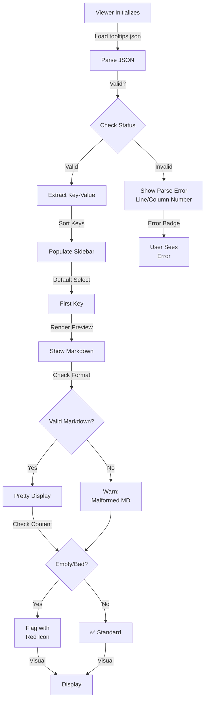
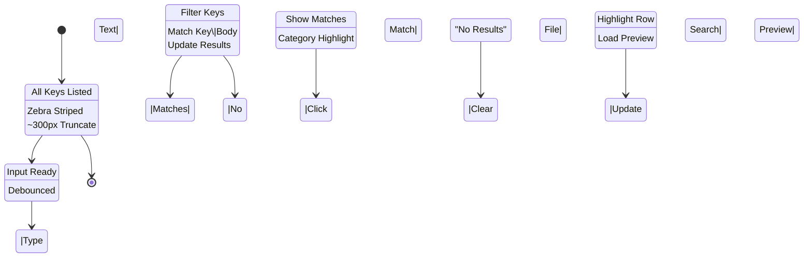

# PRD: Tooltip Viewer

## TL;DR

The Tooltip Viewer is a standalone UI tool for JU-DO-KON! contributors to browse, preview, and validate all tooltip entries from `tooltips.json` in one screen. It is separate from the Tooltip System (which renders tooltips in-game) and is designed for editorial, QA, and development workflows, not for players.

## Problem Statement

JU-DO-KON! relies on a centralized tooltip system for in-game guidance, but there is no way to preview or validate all tooltips outside live gameplay. The Tooltip Viewer solves this by providing a dedicated UI for contributors to inspect, search, and review every tooltip entry, ensuring copy quality and reducing QA errors. This tool is distinct from the Tooltip System, which handles runtime rendering of tooltips in the game UI.

## Goals / Success Metrics

| Goal Description                                                                | Metric                            | Target             |
| ------------------------------------------------------------------------------- | --------------------------------- | ------------------ |
| Allow team members to browse all tooltip entries without touching the game code | Tooltip Viewer accessibility rate | 100%               |
| Reduce tooltip-related QA errors pre-deployment                                 | Tooltip-related bug count         | ↓ 50% per release  |
| Provide previews styled as in-game                                              | Rendering fidelity rating from QA | 100% match         |
| Improve editorial turnaround for tooltip updates                                | Copy revision cycle time          | ↓ from 3 days to 1 |

---

## User Stories

- As a **content editor**, I want to preview all tooltips so I can check clarity, formatting, and tone.
- As a **developer**, I want to verify that tooltip keys render the correct markdown output before wiring them into the UI.
- As a **QA tester**, I want to detect missing, duplicate, or invalid tooltip entries without needing to load every in-game context.

---

## Non-goals

- The viewer is **read-only** — no direct editing or saving.
- The page will only show **static previews**, not live gameplay or dynamic contexts.

---

## UX & UI Behavior

### Layout & Responsiveness

- Desktop: Sidebar (left, 35%) + Preview Pane (right, 65%)
- Mobile: Sidebar stacks above preview (≤600px)
- Smooth transitions when resizing

### Animations & Interactivity

- Clicked key animates with highlight (fade-in + border pulse, 150ms)
- Preview panel fades in on selection
- Search box debounced to avoid lag during input
- **Sidebar supports full keyboard navigation (TAB, arrows, ENTER) for accessibility**
- **Sidebar supports category highlighting/grouping by prefix (e.g., stat, ui, mode)**
- **Visual indicators (icon/tooltip) for invalid, empty, or malformed entries**
- **Preview panel displays warning for malformed markdown**
- **Long tooltip values are truncated after 300px height with a native disclosure toggle (`
/
`)**
- **Copy-to-clipboard buttons provide feedback (e.g., tooltip or animation) on success**

### Accessibility

- All fonts ≥16px
- Color contrast meets WCAG AA (≥4.5:1)
- In dark mode the selected key should use the bright `--link-color` value to
  maintain WCAG AA contrast
- Full keyboard navigation support (TAB, arrows, ENTER)
- **ARIA attributes and roles are set for sidebar and preview for screen readers**

---

## Prioritized Functional Requirements

| Priority | Feature                  | Description                                                    |
| -------- | ------------------------ | -------------------------------------------------------------- |
| **P1**   | JSON loader              | Load `tooltips.json` from `src/data/tooltips.json`.            |
| **P1**   | Sidebar key list         | Display all keys in a scrollable, clickable list.              |
| **P1**   | Preview pane             | Render tooltip content (markdown + raw string).                |
| **P1**   | Markdown parser          | Apply JU-DO-KON! tooltip formatting rules.                     |
| **P2**   | Search/filter input      | Filter list by tooltip key or body content.                    |
| **P2**   | Category highlighting    | Group or color-code by prefix (`stat`, `ui`, `mode`).          |
| **P2**   | Invalid key validator    | Flag missing, empty, or malformed entries visually.            |
| **P2**   | Visual indicators        | Show icon/tooltip for invalid/empty/malformed entries.         |
| **P2**   | Malformed markdown warn  | Show warning in preview for malformed markdown.                |
| **P2**   | Keyboard navigation      | Support TAB, arrows, ENTER in sidebar and preview.             |
| **P2**   | Sidebar scroll           | Sidebar scrolls independently from preview.                    |
| **P2**   | Copy feedback            | Copy-to-clipboard buttons show feedback on success.            |
| **P3**   | Mobile responsive layout | Stack sidebar above preview on screens <600px.                 |
| **P3**   | Copy-to-clipboard button | One-click copying of key or body content.                      |
| **P3**   | Jump to key via URL hash | Auto-select a tooltip via `#keyname` on page load.             |
| **P3**   | Disclosure for long vals | Truncate long values, add native `
/
` toggle. |
| **P3**   | High-contrast/dark mode  | Selected key uses bright color in dark mode.                   |
| **P3**   | ARIA/Accessibility       | Add ARIA attributes/roles for screen readers.                  |

---

## Tooltip Viewer Navigation Diagrams

### 6.17.1: Tooltip Loading & Preview Rendering Pipeline

**Tooltip Loading & Preview:**
The viewer loads tooltips.json and parses all entries. If JSON is invalid, line/column numbers help with debugging. Sidebar lists all keys sorted alphabetically. Defaults select the first key. Preview pane renders markdown with warning badges for malformed or empty entries. All states update without page reload.

### 6.17.2: Sidebar Search & Filter Interaction

**Search & Filter Workflow:**
Debounced search input filters tooltip keys and body text in real-time. Category highlighting groups results by prefix (stat, ui, mode). Sidebar uses zebra striping for readability. Click or keyboard navigation (arrows/enter) selects tooltips and updates the preview pane.

### 6.17.3: Preview Panel & Copy/Export Features

```mermaid
flowchart LR
    A[Key Selected] -->|Render| B["Display Markdown<br/>+ Raw Text"]
    B -->|Long Value?| C{Length>300px?}
    C -->|Yes| D["Truncate+<br/>Add Disclosure"]
    C -->|No| E["Full Display"]
    
    D -->|Click Details| F["Expand<br/>Full Value"]
    E --> G["Show Content"]
    F --> G
    
    G -->|Copy Key| H["Copy to<br/>Clipboard"]
    G -->|Copy Body| I["Copy<br/>Content"]
    
    H -->|Show Toast| J["✅ Copied!"]
    I -->|Show Toast| J
    
    J -->|Highlight| K{Dark Mode?}
    K -->|Yes| L["Bright Color<br/>#Link"]
    K -->|No| M["Standard Color"]
    
    L --> N[WCAG AA]
    M --> N
    
    N -->|Ready| O["Next Tooltip"]
    
    style A fill:#lightblue
    style B fill:#lightgreen
    style D fill:#lightyellow
    style G fill:#lightgreen
    style H fill:#lightyellow
    style I fill:#lightyellow
    style J fill:#lightgreen
    style L fill:#lightyellow
    style N fill:#lightgreen
```

**Preview & Copy-to-Clipboard:**
The preview pane displays selected tooltip in both rendered markdown and raw text. Long values (>300px) are truncated with native `
/
` disclosure toggle. Copy buttons for key and body text show instant feedback (toast message). In dark mode, selected keys use bright --link-color for WCAG AA contrast.

---

## Acceptance Criteria

- Loads and displays all tooltip entries from `tooltips.json` in a searchable, scrollable list.
- Clicking a key shows both rendered markdown and raw text in the preview panel.
- Visual indicators flag empty, malformed, or invalid entries.
- Search/filter input updates the list live.
- Copy-to-clipboard buttons work for both key and body text, with feedback.
- Viewer operates offline as a static HTML file.
- Keyboard navigation and ARIA attributes are present for accessibility.
- Layout adapts responsively to desktop, tablet, and mobile screens.
- Distinct warning or error message shown if `tooltips.json` is missing or invalid.

## Non-Functional Requirements

- Viewer loads and parses `tooltips.json` asynchronously without blocking UI.
- All fonts and colors meet WCAG AA contrast standards.
- Sidebar and preview panel scroll independently and remain usable on all screen sizes.
- Copy and search actions complete in ≤150ms.
- Viewer does not modify or save tooltip data (read-only).
- Viewer is compatible with static hosting (e.g., GitHub Pages).

---

## Edge Cases & Failures

| Case                    | Handling Behavior                                                                                      |
| ----------------------- | ------------------------------------------------------------------------------------------------------ |
| File missing            | Show "File not found" message in viewer panel                                                          |
| Corrupted JSON          | Render structured parse error with line and column numbers (e.g., "Line 4, Column 10") in preview area |
| Malformed markdown      | Render best-effort version and flag preview with warning icon                                          |
| Missing/empty strings   | Highlight key with red icon and tooltip: "Empty or whitespace-only content"                            |
| Unrecognized key format | Warn if keys deviate from pattern `prefix.name` (`/^[a-z]+\.[\w-]+$/`); show red icon with tooltip     |
| Long values             | Truncate preview after 300px height; add native `
/
` toggle                           |

---

## Tasks

- [x] 1.0 Load and Parse Tooltip Data
  - [x] 1.1 Load `tooltips.json` from `src/data/tooltips.json`
  - [x] 1.2 Handle loading failures with user-friendly error display
  - [x] 1.3 Parse JSON and extract key-value pairs
  - [x] 1.4 Display line and column numbers on JSON parse errors

- [x] 2.0 Implement Sidebar Key List
  - [x] 2.1 Render scrollable list of tooltip keys
  - [x] 2.2 Enable click interaction to select a tooltip
  - [x] 2.3 Add real-time search/filter functionality

  - [x] 2.4 Support full keyboard navigation (TAB, arrows, ENTER)
  - [x] 2.5 Group or color-code keys by prefix (category highlighting)
  - [x] 2.6 Sidebar scrolls independently from preview

- [x] 3.0 Build Preview Panel
  - [x] 3.1 Render raw tooltip text
  - [x] 3.2 Parse and render markdown-styled preview
  - [x] 3.3 Animate panel on update (fade-in)
  - [x] 3.4 Display visual indicators for blank/malformed tooltips (icon/tooltip)
    - [x] Blank entries flagged with warning icon
    - [x] Malformed entries flagged with warning icon
  - [x] 3.5 Include copy-to-clipboard buttons for key and body
  - [x] 3.6 Show warning for malformed markdown in preview
  - [x] 3.7 Truncate long values after 300px height; add native `
/
` toggle
  - [x] 3.8 Copy-to-clipboard buttons provide feedback (e.g., tooltip/animation)

- [x] 4.0 URL Fragment Support
  - [x] 4.1 Read and parse URL hash on page load
  - [x] 4.2 Scroll to and pre-select corresponding tooltip key

- [x] 5.0 UI/UX and Accessibility Enhancements
  - [x] 5.1 Apply JU-DO-KON! styling (colors, spacing, typography)
  - [x] 5.2 Ensure mobile responsiveness (stacked layout <600px)
  - [x] 5.3 Include accessible font sizes and high contrast text
  - [x] 5.4 Enable keyboard navigation and focus states
  - [x] 5.5 Expose `data-*` attributes for automated QA
  - [x] 5.6 Add ARIA attributes/roles for screen readers
  - [x] 5.7 Selected key uses bright color in dark mode for contrast
