# PRD: Vector Database for Retrieval-Augmented Generation (RAG)

## TL;DR

This PRD defines the implementation of a lightweight vector database for semantic search across JU-DO-KON! assets such as PRDs, tooltips, and game rules. **RAG (Retrieval-Augmented Generation)** is an AI technique that combines semantic search with generative models, allowing agents to fetch relevant context from a database and use it to generate more accurate answers or suggestions. This system supports AI agent workflows (e.g. QA, card generation, bug reproduction, test case creation) by enabling agents to search project data semantically and provide context-aware responses. The feature integrates with AI chatbots, agent tools, and developer utilities for content search, hint generation, and automated reasoning.

---

## Glossary

- **RAG (Retrieval-Augmented Generation):** An AI technique that retrieves relevant information from a database and augments generative model outputs with that context, improving accuracy and relevance.
- **Vector Database:** A database that stores text or data as high-dimensional vectors (embeddings) for fast semantic similarity search.
- **Embedding:** A numerical representation of text or data used for similarity comparison in AI workflows.

---

## Problem Statement / Why It Matters

As the JU-DO-KON! project scales, AI agents increasingly need to reason across scattered data sources (PRDs, JSON configs, tooltips). Current keyword-based methods are brittle, especially when terminology is inconsistent (e.g. “grip fighting” vs. “kumi-kata (grip fighting)”). This results in agents producing invalid queries or misclassifying design intents — e.g., test cases missing kumi-kata interactions due to synonyms not being recognized.

Without a semantic memory layer, agents must either parse entire documents from scratch or rely on hardcoded rules — both of which are inefficient and error-prone.

Ultimately, these issues increase the risk of bugs reaching players, slow down the delivery of new cards, and make it harder to maintain design consistency — all of which degrade the play experience for our core audience (kids ages 8–12).

---

## Goals / Success Metrics

- Enable semantic search over project documentation and game data (e.g. PRDs, `judoka.json`, `tooltips.json`)
- Improve agent self-sufficiency by reducing fallback to manual lookups by **30%** (measured via agent query logs)
- Reduce use of hardcoded logic in prompt pipelines by **50%** across test agents
- Provide consistent embedding format usable by in-browser tools or local dev agents

**Success Metrics:**

| Goal              | Metric                                                                                                                   |
| ----------------- | ------------------------------------------------------------------------------------------------------------------------ |
| Response accuracy | ≥90% agent-retrieved responses align with top 3 relevant matches                                                         |
| Search latency    | ≤200ms average similarity lookup on mid-tier desktop browsers (e.g., 2022 MacBook Air M1 or Windows laptop with 8GB RAM) |
| Coverage          | ≥90% of PRDs/tooltips indexed within the system                                                                          |
| File size         | <38.8mb total JSON size to ensure fast client-side loading                                                               |

---

## User Stories

- **As an AI QA agent**, I want to search PRDs semantically so I can generate test plans based on actual feature requirements.
- **As a developer**, I want to retrieve styling or logic guidance from related documents so I don’t duplicate existing work.
- **As a prompt-generation agent**, I want to find consistent naming or stat patterns in `judoka.json` so I can create new cards that fit the house style.
- **As a player support agent**, I want to surface explanations of unfamiliar terms like “Kumi-kata” by searching tooltips and stat descriptions — enabling faster responses to young players.

---

## Prioritized Functional Requirements

| Priority | Feature                     | Description                                                                                                                                                                                                                                                                                                                                     |
| -------- | --------------------------- | ----------------------------------------------------------------------------------------------------------------------------------------------------------------------------------------------------------------------------------------------------------------------------------------------------------------------------------------------- |
| P1       | Embedding Generator         | Create vector embeddings for a corpus of text snippets (tooltips, PRDs, design rules, etc.) using a consistent model (e.g. `MiniLM`, `OpenAI Ada`, or simulated offline encoder)                                                                                                                                                                |
| P1       | Client-Side Embedding Store | Save all text entries and their embeddings in a `client_embeddings.json` file for browser use                                                                                                                                                                                                                                                   |
| P1       | Cosine Similarity Function  | Implement JavaScript logic to compare a query vector to all indexed entries and return top N matches                                                                                                                                                                                                                                            |
| P1       | Static Query Interface      | Provide an in-browser demo or utility for querying the embedding file (e.g. using a sample prompt vector)                                                                                                                                                                                                                                       |
| P2       | Vector Metadata Fields      | Store source metadata with each embedding (e.g. “source: PRD Tooltip System”, “type: stat-description”). Include granular tags like `judoka-data`, `tooltip`, `design-doc`, or `agent-workflow` for filtering. Tag each entry by its source ("prd","tooltip","data") and by topic such as "judoka","rules","ui" to enable fine-grained queries. |
| P2       | Agent Integration Example   | Provide a sample script or markdown prompt to demonstrate how AI agents can use the vector store                                                                                                                                                                                                                                                |
| P2       | Source Context Retrieval    | Provide helpers so agents can fetch adjacent chunks or the full document using an entry id                                                                                                                                                                                                                                                      |
| P2       | Intent Tagging              | Classify each chunk as _what_, _how_, or _why_ for question filtering                                                                                                                                                                                                                                                                           |
| P3       | Embedding Refresh Pipeline  | Optionally support rebuilding the embedding index when PRDs or tooltip files are updated (manual or script-based trigger)                                                                                                                                                                                                                       |

### Embedding Refresh Pipeline

After editing PRDs, tooltips, game rules, or any markdown that captures development/testing standards (for example `design/productRequirementsDocuments/prdDevelopmentStandards.md`, `design/productRequirementsDocuments/prdTestingStandards.md`, `design/productRequirementsDocuments/prdAIAgentWorkflows.md`, or this document) run
`npm run generate:embeddings` from the repository root. The script at
`scripts/generateEmbeddings.js` downloads the **quantized** `Xenova/all-MiniLM-L6-v2` model the first time it runs, so the command will fail without internet access. Cache the model locally or run it in an environment with a connection. Commit the updated
`client_embeddings.json`—now pretty-printed for readability—so other agents work with the latest vectors. If you hit out-of-memory errors during generation, rerun the command with a higher heap limit (e.g. `node --max-old-space-size=8192 scripts/generateEmbeddings.js`). A GitHub Actions workflow could automate this
regeneration whenever those folders change.

The generator parses JSON arrays and objects into individual snippets so each
record receives its own embedding. For markdown sources, text is chunked from
one heading to the next heading of the same or higher level so each section is
semantically coherent. Each chunk targets roughly **350 tokens** (about **1,400 characters**) with a **15% overlap** and uses
sentence-aware splitting to maintain context. Tooltips, judoka entries, and PRD sections are broken
down into discrete blocks with unique IDs. This granularity improves lookup
accuracy because search results map back to a single section or data row rather
than an entire file.

Chunking rules are shared across tooling via [`src/helpers/vectorSearch/chunkConfig.js`](../../src/helpers/vectorSearch/chunkConfig.js) and follow these guidelines:

- **Goal:** ~350 tokens per chunk (≈1,400 characters).
- **Overlap:** 15% of characters between sequential chunks.
- **Splitting:** Sentence-aware to avoid mid-sentence breaks.

### Offline RAG Setup

Prepare the embedding model for environments without network access:

```bash
npm run rag:prepare:models -- --from-dir /path/to/minilm
```

Run the same command without `--from-dir` to download the model when online. Validate the offline setup afterward:

```bash
RAG_STRICT_OFFLINE=1 npm run rag:validate
```

Use `RAG_ALLOW_LEXICAL_FALLBACK=1` to allow degraded lexical search when the model is missing.

### JSON Field Allowlists and Boilerplate Filtering

The embedding script extracts only approved fields from JSON sources and skips generic text. A field allowlist limits which keys are embedded while boilerplate strings such as "lorem ipsum" are ignored to reduce noise during indexing.

### Deduplication of Normalized Text

Before encoding, each chunk is lowercased, whitespace-collapsed, and checked against previously seen values. Duplicates or empty strings are dropped so the embedding set contains unique, meaningful entries.

### Sharded Embedding Files with a Manifest

Embeddings load through a lightweight manifest that enumerates shard files. The loader fetches each shard listed in `client_embeddings.manifest.json` and flattens them into a single array, falling back to a legacy single-file format if any shard fails.

### Sparse Term-Frequency Vectors for Pre-filtering

Each stored entry also includes a sparse term-frequency vector. Search requests build a similar vector for the query, and a pre-filter step multiplies these sparse vectors to discard entries that share no terms before cosine similarity ranking.

---

## Acceptance Criteria

- The vector database stores all indexed entries as embeddings with metadata, tags, and source references.
- Agents and tools can query the database and receive the top 5 most relevant matches within ≤200ms.
- At least 90% of PRDs/tooltips are indexed and available for semantic search.
- The system supports offline search in the browser with no server backend required.
- Each result includes match score, source, and tags, and can be traced back to the original content.
- The vector database file size remains under 38.8mb for fast client-side loading.
- Malformed or missing embeddings are ignored during search and a warning is logged for each skipped record.
- The system provides helpers for fetching adjacent context or full documents by entry id.
- The UI demo displays the number of loaded embeddings and supports keyboard navigation and accessibility standards.

---

## Edge Cases / Failure States

- **Missing or Malformed Embeddings**: If an entry lacks a valid embedding, log a warning and skip it during similarity comparison. Surface the message “Embeddings could not be loaded – please check console.”
- **Corrupted JSON File**: Show a fallback message and prevent crashes; disable the query interface if JSON fails to parse.
- **Out-of-Vocabulary Query**: If no results meet the similarity threshold, the UI remains usable and displays “No close matches found.”
- **Version Mismatch**: Add a version field to the JSON file (e.g., `"version": "v1.0"`) and warn if outdated.
- **Invalid Query Vector**: Validate that the query vector matches expected dimensions; handle mismatches with clear error messaging.

---

## Design and UX Considerations

- A simple web UI mockup is shown below.
- Must work offline within GitHub Pages without requiring server-side infrastructure.
- When testing locally, serve the repository with `npm start` so the search page can fetch Markdown context files.
- Vector format must be JSON-serializable and readable by JavaScript.
- Embedding dimensionality must be ≤384 for performance.
- Vector values are rounded to three decimal places to minimize size and maintain deterministic comparisons.
- UI must support keyboard navigation and screen readers.
- Tap/click targets should be at least 44px height for accessibility.
- Display an error message when embeddings or the model fail to load.
- Show up to five matches with score, source, and tags information. Each entry displays its optional `qaContext` snippet beneath the match text.
- Search results appear in a responsive table with alternating row colors for readability.
- The Match column is wider than Source, Tags, and Score, which are sized smaller to save space.
- Paths in the Source column break onto new lines at each `/` so long file names remain legible.
- Long match snippets are truncated after roughly 200 characters with a
  native `<details>/<summary>` disclosure that reveals the full text within the table row. (**Note:** The disclosure is styled to match the table and should remain fully keyboard accessible.)
- Search terms are highlighted in result snippets using `<mark>` styling to make query matches stand out.
- Embeddings load automatically when the page initializes so the first search runs immediately.
- Matches scoring at least `0.6` are considered strong. When the top match is
  more than `0.4` higher than the next best score, only that top result is
  displayed.
- Scores are normalized to the 0–1 range. Exact term matches (case-insensitive)
  receive a small `+0.1` bonus before sorting to promote literal keyword hits.
- Query text is expanded using `src/data/synonyms.json` so common phrases and near
  spellings map to canonical technique names.
- Lower scoring results appear only when there are no strong matches.
- Result messages such as "No strong matches found…" now use the `.search-result-empty` CSS class. Each result entry uses `.search-result-item` and is fully justified with spacing between items.

---

## Vector Search UI

The Vector Search demo is implemented in [`src/pages/vectorSearch.html`](../../src/pages/vectorSearch.html) with behavior wired up in
[`src/helpers/vectorSearchPage.js`](../../src/helpers/vectorSearchPage.js). The Score column sorting helper lives in
[`src/helpers/vectorSearchPage/tableSorting.js`](../../src/helpers/vectorSearchPage/tableSorting.js).

### Page Location and Core Controls

- **Page URL:** `/src/pages/vectorSearch.html` (served as the “Vector Search” page in the app shell).
- **Controls:**
  - Search input (`#vector-search-input`) with required query text.
  - Tag filter dropdown (`#tag-filter`) populated from embedding tags, with an `All` option as the default.
  - Search button (`#vector-search-btn`) submits the form and runs the query.

### Results Table and Row Behavior

- Results render into the table `#vector-results-table`, with columns in this order: **Match**, **Source**, **Tags**, **Score**.
- Each row uses the `.search-result-item` class and is focusable, supporting click, **Enter**, or **Space** to load additional context into the `.result-context` element within the row.
- The top match row is additionally labeled with `.top-match` for emphasis.
- When a row is activated, `.result-context` is updated with:
  - **Loading state:** `Loading context...`

### Results Table and Row Behavior

- Results render into the table `#vector-results-table`, with columns in this order: **Match**, **Source**, **Tags**, **Score**.
- Each row uses the `.search-result-item` class and is focusable, supporting click, **Enter**, or **Space** to load additional context into the `.result-context` element within the row.
- The top match row is additionally labeled with `.top-match` for emphasis.
- When a row is activated, `.result-context` is updated with:
  - **Loading state:** `Loading context...`
  - **Fallbacks:** `No additional context found.` when the context fetch returns empty, or
    `Context could not be loaded.` on errors.
  - **Score tiers:** `.score-high` for scores ≥ `0.8`, `.score-mid` for scores ≥ `0.6`, otherwise `.score-low` for styling hooks.

### Testing Hooks

- `window.vectorSearchResultsPromise` mirrors the active search promise so tests can await the current query lifecycle (initialized to a resolved promise before the first search).
- `window.__setExtractor` exposes the extractor reset helper for tests, letting them clear cached extractor state before running vector search assertions.
  - **Fallbacks:** `No additional context found.` when the context fetch returns empty, or
    `Context could not be loaded.` on errors.
  - **Score tiers:** `.score-high` for scores ≥ `0.8`, `.score-mid` for scores ≥ `0.6`, otherwise `.score-low` for styling hooks.

### Score Column Sorting

- The **Score** column header is clickable and toggles between ascending and descending sort.
- Sorting updates the header’s `aria-sort` attribute to `ascending`/`descending` to reflect the current direction.

### UI Messages and Error States

- Embeddings load failure returns: `Embeddings could not be loaded – please check console.`
- Embedding load exception returns: `Failed to load search data. Please try again later.`
- When only weak matches exist, the UI displays:
  `⚠️ No strong matches found, but here are the closest matches based on similarity.`
  and applies `.search-result-empty` styling.

### Embedding Version Warnings

- If embedding entry versions or metadata versions are out of date, the page displays:
  `⚠️ Embedding data is out of date. Run npm run generate:embeddings.`

### Embedding Count Display

- The header count is sourced from `client_embeddings.meta.json` (`count` field) and shown as
  `{count} embeddings loaded`.

---

## Vector Search Pipeline Architecture

**Embedding Generation (Offline)**:

```mermaid
graph LR
    A["📁 Source Files<br/>PRDs, tooltips.json<br/>judoka.json"] -->|Parse & chunk| B["✂️ Text Chunking<br/>~350 tokens<br/>15% overlap"]
    B -->|Deduplicate| C["🔍 Normalize Text<br/>Lowercase<br/>Remove duplicates"]
    C -->|Embed| D["🧠 Generate embeddings<br/>MiniLM model<br/>384-dim vectors"]
    D -->|Add metadata| E["📝 Build entries<br/>id, text, embedding,<br/>source, tags"]
    E -->|Shard| F["💾 Save client_embeddings<br/>JSON file<br/>< 38.8mb"]
    F -->|Commit| G["✅ Ready for search"]
    style A fill:#lightgreen
    style G fill:#lightcyan
    style D fill:#lightyellow
```



**Runtime Query-to-Results Pipeline**:

```mermaid
graph TD
    A["🔍 User Query<br/>'How to implement <br/>tooltip system'"] -->|Normalize| B["📚 Query Expansion<br/>Synonyms lookup<br/>Multi-intent split"]
    B -->|Encode| C["🧠 Generate query vector<br/>Same MiniLM model<br/>384-dim"]
    C -->|Pre-filter| D["⚡ Sparse term match<br/>Quick discard<br/>non-overlapping entries"]
    D -->|Rank| E["📊 Cosine similarity<br/>Top 5 matches<br/>Score ≥ 0.6"]
    E -->|Select| F["✨ Filter strong matches<br/>Score boost for<br/>exact term matches"]
    F -->|Format| G["📋 Return results<br/>text, source, tags<br/>score, contextPath"]
    G -->|Display| H["🎨 Render in UI<br/>Match | Source | Tags | Score"]
    style A fill:#lightgreen
    style H fill:#lightcyan
    style E fill:#lightyellow
```



**Search Result Flow**:


**Performance SLAs**:

| Metric               | Target                         |
| -------------------- | ------------------------------ |
| Embedding generation | < 30s (offline)                |
| First query latency  | ≤ 200ms                        |
| Subsequent queries   | ≤ 100ms (cached embeddings)    |
| Context fetch        | ≤ 50ms (from loaded documents) |
| UI render (results)  | ≤ 16ms (60fps)                 |
| File size            | < 38.8mb for fast load         |

**Test Coverage**: ✅ **VERIFIED** — Validated against:

- `src/helpers/queryRag.js` — Main query interface
- `src/helpers/vectorSearch/similarity.js` — Cosine similarity implementation
- `src/helpers/vectorSearch/chunkConfig.js` — Text chunking rules
- `src/pages/vectorSearch.html` — UI demo page
- `tests/helpers/queryRag.test.js` — Vector search unit tests
- `playwright/prd-reader.spec.js` — E2E vector search demo tests
- `scripts/buildOfflineRag.mjs` — Embedding generation script
- `scripts/evaluation/evaluateRAG.js` — RAG performance metrics

**Related Diagrams**:

- [Battle Engine FSM](prdBattleEngine.md) — State definitions for "state management" queries
- [Data Schemas](prdDataSchemas.md) — Data structure references for "JSON structure" queries
- [Settings Menu](prdSettingsMenu.md) — Feature flag guidance for "configuration" queries

---

## Operations & Tooling

### Quick Start

```javascript
import queryRag from "./src/helpers/queryRag.js";

const matches = await queryRag("How does the battle engine work?");
```

`queryRag` should be the first stop for any “How/Why/What/Where” question. The helper fetches the top semantic matches from the
client embedding store and returns scored results that agents can feed directly into prompts, code comments, or task contracts.
See [High-Success Query Patterns](#high-success-query-patterns) for prompt patterns and tag combinations.

### Query Behavior Options (queryRag.js)

The `src/helpers/queryRag.js` helper includes opt-in behaviors to make agent usage more reliable and transparent.

**Multi-intent query splitting**

- Simple conjunctions in a query are split into sub-queries (for example, `"navigation bar button transition duration styling"` may expand into multiple intents).
- Each sub-query is embedded, searched, and then merged; the combined list is re-ranked using the main query vector to keep overall intent aligned.
- Expected output stays the same shape (scored match list), but coverage improves for compound questions. The helper annotates diagnostics when this behavior is applied.

**Diagnostics (withDiagnostics)**

- Pass `{ withDiagnostics: true }` to receive an additional `diagnostics` payload alongside results.
- Diagnostics include:
  - `expandedQuery`: the final query string after expansion/splitting.
  - `multiIntentApplied`: boolean indicating whether sub-query splitting ran.
  - `timingMs`: total helper execution time in milliseconds.
- Use this when tuning prompt patterns or confirming why a query returned unexpected results.

**Lexical fallback (allowLexicalFallback / RAG_ALLOW_LEXICAL_FALLBACK=1)**

- Set `allowLexicalFallback: true` or environment variable `RAG_ALLOW_LEXICAL_FALLBACK=1` to enable sparse-term scoring when the embedding model fails to load.
- The fallback ranks results using lexical term overlap, with bonuses for exact matches and tagged metadata to reduce relevance drop-offs.
- Behavior change: the helper returns the same result shape, but scores are lexical rather than embedding-based, and diagnostics will show the fallback path when enabled.

### Command Line Interface

- **Query from the terminal**

  ```bash
  npm run rag:query "How does the battle engine work?"
  ```

### RAG Decision Workflow

Use the same rapid decision tree published in the AI Agent Workflows PRD so agents can decide within seconds whether to call the vector database:

```text
User query contains "How", "Why", "What", "Where", "Which"? → USE RAG
User requests examples or references? → USE RAG
User mentions unfamiliar terms? → USE RAG
When in doubt? → USE RAG FIRST
```

Operational expectations:

- Default to `queryRag` before manual file exploration for any informational task.
- Re-run the query with synonyms or category keywords when initial matches are weak.
- Pull adjacent context via the `contextPath` field when you need surrounding paragraphs.
- Only fall back to manual grep or tree walking after two optimized RAG attempts.

### High-Success Query Patterns

Ground every request in the proven templates from the AI Agent Workflows PRD to stay within the ≥62.5% success corridor:

**Implementation Questions**

- Include file types such as "JSON structure", "CSS styling", or "JavaScript function".
- Add situational context like "configuration", "data format", or "UI component".
- Anchor with technical verbs: "implementation", "validation", "guidelines".

**Design Questions**

- Lean on product nouns: "PRD", "design guidelines", "user experience".
- Reference feature domains: "tooltip system", "battle mode", "navigation".
- Specify surrounding context: "character design", "UI theme", "accessibility".

**Architecture Questions**

- Pair system terminology such as "component factory", "module structure", or "API design".
- Declare the subsystem: "state management", "event handling", "data flow".

**Examples**

```text
❌ Poor: "How do I add tooltips?"
✅ Good: "tooltip implementation data structure JSON format"

❌ Poor: "CSS styling help"
✅ Good: "navigation bar button transition duration styling"

❌ Poor: "Battle system logic"
✅ Good: "classic battle mode game timer phases scoreboard"
```

### Operational Benchmarks

Track usage against the shared success metrics for RAG-enabled workflows:

- **Speed**: Maintain a 2-second average for RAG queries by preferring semantic expansion before manual search.
- **Accuracy**: Keep the success rate of correct source retrieval at or above 62.5% by using the high-success query templates.
- **Efficiency**: Demonstrate the 15× time savings versus manual exploration in task contracts and retrospectives.
- **Coverage**: Achieve ≥95% precision on design document retrieval and ≥85% on architecture lookups when using filtered tag sets.
  Sample output surfaces the top excerpts that match the query, mirroring the in-browser demo and the `queryRag` helper.

- **Evaluate retrieval quality**

  ```bash
  node scripts/evaluation/evaluateRAG.js
  ```

  The evaluator reads `scripts/evaluation/queries.json` and reports **MRR@5**, **Recall@3**, and **Recall@5** so teams can monitor search accuracy when new sources are indexed.

### Offline Workflow

1. **Prepare the MiniLM model** (one-time per machine)

   ```bash
   npm run rag:prepare:models
   # or use an existing download
   npm run rag:prepare:models -- --from-dir /path/to/minilm
   ```

   These commands hydrate `models/minilm` with the quantized extractor files used by the query encoder.

2. **Build compact offline assets**

   ```bash
   npm run build:offline-rag
   ```

   The build writes `src/data/offline_rag_vectors.bin` and `src/data/offline_rag_metadata.json` for browser usage without a network connection.

3. **Query in strict offline mode**

   ```bash
   RAG_STRICT_OFFLINE=1 npm run rag:query "How does the battle engine work?"
   ```

   Set `RAG_ALLOW_LEXICAL_FALLBACK=1` to enable a degraded lexical search path when the MiniLM model is unavailable.

### Evaluation & Metrics

- **Performance profile**
  - ⚡ ~2 second RAG queries vs. 30+ seconds of manual exploration.
  - 🎯 62.5% success rate for implementation queries, 95% for design docs.
  - 🧠 Coverage spans PRDs, design guidelines, test examples, and tooling docs.

- **Retrieval quality workflow**

  Run `node scripts/evaluation/evaluateRAG.js` from the project root to measure retrieval performance. The script reads the representative queries in `scripts/evaluation/queries.json` and reports:
  - **MRR@5** – Mean Reciprocal Rank of the expected document within the top five results.
  - **Recall@3** – Fraction of queries whose expected document appears in the top three results.
  - **Recall@5** – Fraction of queries whose expected document appears in the top five results.

### UI Mockup

```text
+–––––––––––––––––––––––––––––+
JU-DO-KON! Vector Search
[ Search bar (e.g. “Kumi-kata”) ]  [Search Button]
–––––––––––––––––––––––––––––
Top Matches:
1. “Kumi-kata is a grip fighting technique…” [score]
Source: Tooltip.json
2. “Grip fighting principles are defined in PRD…”
Source: PRD_techniques.md
–––––––––––––––––––––––––––––
```

---

## Player Settings

No user settings or toggles are included. This is appropriate since the feature is meant for development and agent use only. The in-browser demo is fixed-function and does not require configurable options.

---

## Dependencies and Open Questions

### Dependencies

- Sentence embedding model (e.g. `all-MiniLM-L6-v2`, or simulated offline)
- JSON corpus (e.g. `tooltips.json`, PRDs, `judoka.json`)
- Cosine similarity JS implementation
- `markdownToHtml` helper to display markdown chunks in the browser demo

### Open Questions

- Should this feature support live embedding via API (e.g. OpenAI) or remain static?
- Do we want a UI search tool for developers and designers, or agent-only access?
- Should embedding versioning be tracked per file (`v1_embeddings.json`)?

## Tasks

- [x] 1.0 Build Embedding Generation System
  - [x] 1.1 Choose embedding model (e.g. MiniLM or OpenAI Ada)
  - [x] 1.2 Parse `tooltips.json`, PRDs, and `judoka.json`
  - [x] 1.3 Generate vector embeddings for each entry
  - [x] 1.4 Save embeddings and metadata into `client_embeddings.json`
- [x] 2.0 Implement Client-Side Embedding Store
  - [x] 2.1 Structure JSON with `id`, `text`, `embedding`, `source`, `tags`
  - [x] 2.2 Ensure total file size stays below the 38.8mb threshold
  - [x] 2.3 Validate JSON loading in-browser
- [x] 3.0 Develop Similarity Search Function
  - [x] 3.1 Implement cosine similarity in JS
  - [x] 3.2 Return top 5 matches
  - [x] 3.3 Include score and source reference in response
- [x] 4.0 Create Static Query Interface
  - [x] 4.1 Design and implement offline query UI
  - [x] 4.2 Add keyboard accessibility and result display
  - [x] 4.3 Provide example queries with results
  - [x] 4.4 Add tag filter controls so users or agents can restrict results by source or topic
  - [x] 4.5 Truncate long matches in the results table and provide a "Show more" toggle (**Note:** Truncation and button are present, but ensure toggle is fully functional in UI.)
  - [x] 4.6 Show embedding count from the meta file in the UI header
  - [x] 4.7 Display a loading spinner while search is in progress
  - [x] 4.8 Display error messages in the UI when embeddings or results cannot be loaded
  - [x] 4.9 Responsive table layout with alternating row colors
- [x] 5.0 Agent Integration and Demos
  - [x] 5.1 Create markdown prompt templates
  - [x] 5.2 Provide usage examples with test agents
  - [x] 5.3 Log agent response coverage and latency
- [x] 5.4 Expose a simple API or utility function for programmatic search access

## UI Workflow

The Vector Search page orchestrates semantic queries without leaking business logic into the DOM layer:

1. **Query expansion and encoding** – `buildQueryVector` splits the user's
   query into terms, expands synonyms via `vectorSearch.expandQueryWithSynonyms`,
   and uses the MiniLM extractor to generate an embedding vector.
2. **Match selection** – `vectorSearch.findMatches` returns scored results which
   `selectTopMatches` partitions into strong and weak groups before choosing the
   subset to render.
3. **UI state management** – `applyResultsState` applies one of four declarative
   states (`loading`, `results`, `empty`, `error`) to control spinner visibility
   and messaging.
4. **Orchestration** – `handleSearch` composes the above steps, updating the UI
   and rendering results once matches are available.

The workflow keeps heavy logic out of the DOM layer and enables unit testing of
pure utilities.

### Acceptance Notes for PRD Tests

- Unit tests should cover `buildQueryVector` for proper expansion and vector dimensions.
- Integration tests should simulate `handleSearch` and assert `applyResultsState` transitions for `loading` → `results` / `empty` / `error` paths.
- End-to-end Playwright tests should verify the demo UI renders matches and keyboard navigation works when the embedding file is loaded.

## Source of Truth

- Code: `src/`
- Tests: `tests/` and `playwright/`
- Tracking: `design/productRequirementsDocuments/INDEX.md`
