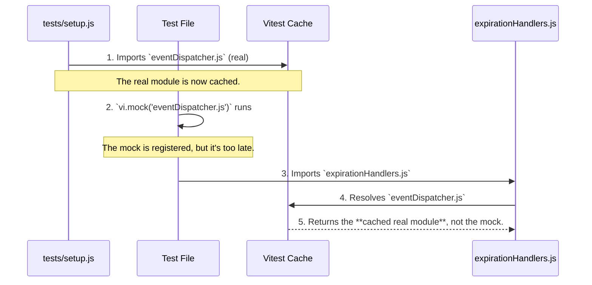

# Bug Analysis: Test Failures Due to Module Import Order

## 1. Executive Summary

Two tests in `expirationHandlers.test.js` are failing due to a classic module caching issue. The mock for `eventDispatcher.js` is applied **after** the module has already been imported and cached during test setup. Consequently, the tests interact with the original, unmocked module, leading to incorrect assertions.

The fix is to ensure that Vitest mocks are declared **before** any application code that depends on them is imported.

**Status**: Root cause identified; fix requires refactoring the test setup sequence.

---

## 2. The Failing Tests

- **File**: `tests/helpers/classicBattle/nextRound/expirationHandlers.test.js`
- **Specs**:
    1. `dispatchReadyViaBus > falls back to global dispatcher when override missing`
    2. `dispatchReadyDirectly > prefers the shared battle dispatcher when available`

---

## 3. Root Cause: Incorrect Mock and Import Order

The problem is a race condition between the test setup process and the test-specific mocks.



### Detailed Breakdown

1. **Setup First**: The global test setup file (`tests/setup.js`) runs first and imports helper functions that, in turn, import the **real** `src/helpers/classicBattle/eventDispatcher.js`.
2. **Module Cached**: Vitest caches this real module instance.
3. **Mock Too Late**: The test file (`expirationHandlers.test.js`) then executes its `vi.mock(...)` call for the *same* event dispatcher.
4. **Wrong Instance**: When the test runs and `expirationHandlers.js` is imported, it resolves its dependency on the event dispatcher. Vitest provides the **cached real instance** from step 2, not the mock from step 3.
5. **Test Fails**: The test's spies and mocks are never hit, and the assertions fail because they are running against the original module's logic.

This issue is a textbook example of the timing problem documented in `ROOT_CAUSE_ANALYSIS.md`.

---

## 4. Actionable Fix Plan

The solution is to enforce a strict "mocks before imports" policy in the test environment.

### Step 1: Defer Setup Imports

Modify the test setup to prevent it from pre-emptively importing modules that tests might need to mock. This can be done by moving imports inside `beforeEach` or using dynamic `await import()`.

**Example Fix in `tests/setup.js` or related test hooks:**

```javascript
// BEFORE: Top-level import causes caching
import { initializeTestBindingsLight } from './testHooks.js';
initializeTestBindingsLight();

// AFTER: Defer import until mocks can be applied
beforeAll(async () => {
  // This ensures test-specific mocks are registered before this code runs
  const { initializeTestBindingsLight } = await import('./testHooks.js');
  initializeTestBindingsLight();
});
```

### Step 2: Enforce Mock Order in Failing Test

While the primary fix is in the setup, the test file should also be structured defensively.

```javascript
// In: tests/helpers/classicBattle/nextRound/expirationHandlers.test.js

// 1. Mocks are declared at the top, before any other imports.
import { vi } from 'vitest';
vi.mock('@/helpers/classicBattle/eventDispatcher.js');

// 2. All other imports follow.
import { dispatchReadyDirectly } from '@/helpers/classicBattle/nextRound/expirationHandlers.js';
// ...

describe('expirationHandlers', () => {
  beforeEach(() => {
    // 3. Reset mocks and spies before each test.
    vi.resetAllMocks();
  });

  // ... tests
});
```

---

## 5. Long-Term Prevention

### Option A: Codebase Linting Rule

- **Audit the codebase** for other tests where `vi.mock` appears after imports of application code.
- **Enforce a guideline** or create a custom ESLint rule that requires `vi.mock` declarations to appear at the top of the file, before any other statements (except other `import` statements).

### Option B: Dependency Injection

- **Refactor core helpers** like the event dispatcher to be passed via dependency injection in tests. This eliminates the reliance on global mocks and the fragile import order.

**Example (Dependency Injection):**

```javascript
// Instead of importing globally, the function receives the dispatcher.
function dispatchReadyDirectly({ dispatcher }) {
  dispatcher.dispatchBattleEvent('ready');
}

// Test can now pass a mock directly.
test('should dispatch ready event', () => {
  const mockDispatcher = { dispatchBattleEvent: vi.fn() };
  dispatchReadyDirectly({ dispatcher: mockDispatcher });
  expect(mockDispatcher.dispatchBattleEvent).toHaveBeenCalledWith('ready');
});
```

This approach makes tests more robust and easier to reason about.
